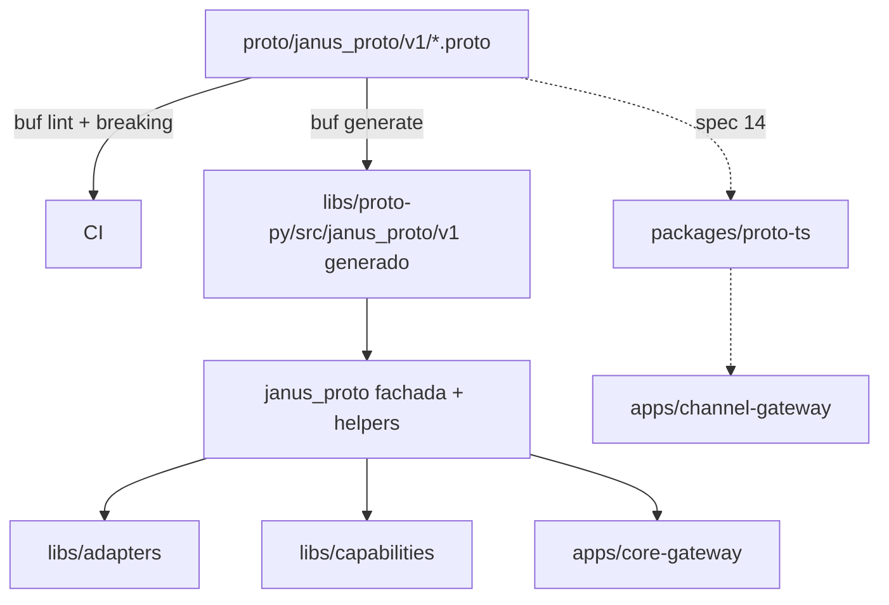

# Feature Spec: proto/ y libs/proto-py/ (modelo semántico compartido)

> **Status**: Ready for implementation
> **Last updated**: 2026-09-20
> **Orden de implementación**: 1 de 15. Todas las demás specs dependen de esta.

---

## Objective

Definir la fuente de verdad del modelo semántico de Janus en Protocol Buffers y generar el paquete Python que el resto del monorepo importa (`stack/04`).

Una vez implementada:
* `libs/adapters`, `libs/capabilities`, `apps/core-gateway` y `apps/channel-gateway` comparten los mismos tipos sin escribirlos a mano por lenguaje.
* Los contratos de red (gRPC) entre core, spokes nativos y channel-gateway están fijados y versionados.
* Cualquier cambio incompatible falla en CI antes de mergear.

Alcance: mensajes, enums, servicios y tooling de generación. No incluye lógica de negocio.

---

## Functional Requirements

### Layout y tooling
1. Existe `proto/buf.yaml` (versión v2) con módulo único, lint `STANDARD` y breaking `FILE`.
2. Existe `proto/buf.gen.yaml` que genera hacia `libs/proto-py/src/`. TypeScript se agrega cuando la spec 14 lo requiera (`packages/proto-ts/`).
3. Los `.proto` viven en `proto/janus_proto/v1/` con estos archivos: `common.proto`, `semantic.proto`, `capability.proto`, `task.proto`, `session.proto`, `channel.proto`, `spoke.proto`, `gateway.proto`. (`stack/02` nombraba tres; los otros cinco son una extensión documentada aquí.)
4. El paquete proto es `janus_proto.v1`. Un cambio incompatible exige un paquete `janus_proto.v2`, nunca editar `v1` en sitio.
5. Reglas de esquema: todo enum inicia en `*_UNSPECIFIED = 0` con valores prefijados por el nombre del enum (exigencia de lint); campos eliminados se marcan `reserved`; nunca se reutiliza un número de campo.
6. `buf lint` y `buf breaking --against '.git#branch=main,subdir=proto'` corren en CI y bloquean el merge.

### Generación Python
7. `libs/proto-py/` es un paquete instalable (`pyproject.toml`) que contiene el código generado y una fachada `janus_proto`.
8. Los plugins de generación son los de la BSR con versión fijada explícitamente: `buf.build/protocolbuffers/python`, `buf.build/protocolbuffers/pyi` y `buf.build/grpc/python`. Las versiones se anclan en `buf.gen.yaml` y deben ser compatibles con el rango de `protobuf` y `grpcio` declarado en `pyproject.toml` (el código generado exige un runtime igual o más nuevo que el generador).
9. El código generado se commitea al repositorio. Motivo: las remote plugins de buf se ejecutan en servidores de la BSR y exigen red; el build en el Raspberry Pi y los checkouts sin red no pueden depender de ello. CI regenera y falla si hay diff (`buf generate && git diff --exit-code`).
10. Fallback offline documentado en `proto/README.md`: `python -m grpc_tools.protoc` (paquete `grpcio-tools`) con `--python_out`, `--pyi_out` y `--grpc_python_out`, apuntando al mismo árbol de salida.
11. El código generado queda bajo `libs/proto-py/src/janus_proto/v1/`, dentro del mismo paquete `janus_proto` que la fachada, porque los imports generados son absolutos y siguen la ruta del `.proto` (`from janus_proto.v1 import ...`). Solo `v1/` es generado; `__init__.py`, `helpers.py` y `capability_ids.py` se escriben a mano y `buf generate` no debe borrarlos (la salida no usa `clean: true`). No existe ningún paquete de nivel superior llamado `janus`: ese nombre lo ocupa otra librería de PyPI y un namespace propio colisionaría con ella (ver Technical Decisions).
12. `janus_proto` re-exporta los tipos más usados (`SemanticRequest`, `SemanticEvent`, `SemanticResponse`, `CapabilityDescriptor`, `InboundEvent`, enums) y añade `janus_proto.helpers` y `janus_proto.capability_ids`.
13. `janus_proto.helpers` provee: `progress_event`, `partial_event`, `terminal_event(request, response)` (copian `request_id`, `session_id`, `task_id`, `role` del request), `is_terminal(event)` y `new_request_id()` (UUID v4 hex).
14. `janus_proto.capability_ids` define constantes de los namespaces reservados: `reasoning.complete`, `execution.run_task`, `channel.deliver`, `gui.window.control`, `gui.elements.map`, `voice.tts.synthesize`, `voice.stt.transcribe`, `memory.recall`. Los namespaces de primer nivel `reasoning`, `execution`, `channel`, `gui`, `voice`, `memory`, `janus` están reservados al núcleo. Un tercero usa cualquier otro namespace, siempre abstracto: un id de capacidad nunca incluye el nombre de un spoke (Principio #1).

### Modelo de datos
15. Los mensajes de la sección "Data Models" existen con esos campos y números.
16. `SemanticRequest.requester_id` y `SemanticRequest.route_trace` los escribe únicamente el núcleo. Un adaptador que los altere provoca `SpokeProtocolError` en `libs/adapters` (spec 04).
17. `CapabilityDescriptor` incluye `cache_policy` (default `NONE`) e `idempotent` (default `false`). `libs/capabilities` (spec 09) usa `idempotent` para decidir si reintenta tras un fallo con efectos posibles.
18. `UntrustedSender` documenta en el propio `.proto` que su contenido es dato no confiable y nunca autoriza nada.

### Servicios gRPC
19. Se definen cuatro servicios en `gateway.proto` y uno en `spoke.proto`, con las firmas de la sección "API Contracts". Su comportamiento se especifica en la spec 11 (core) y la spec 14 (channel-gateway).

---

## Non-Functional Requirements

* **Performance**: serializar y parsear un `SemanticEvent` con `Payload` de 4 KiB debe tardar menos de 50 microsegundos p95 en hardware clase Raspberry Pi 4 con el backend upb de protobuf. Objetivo propuesto, se ajusta tras medir.
* **Security**: ningún campo del esquema transporta credenciales en claro. Los tokens viajan en metadatos gRPC (`authorization`), nunca en mensajes.
* **Reliability**: la regeneración es determinista. Dos ejecuciones con las mismas versiones de plugin producen bytes idénticos.
* **Portability**: Python 3.11 o superior; sin extensiones nativas propias (el runtime `protobuf` publica wheels aarch64). El esquema es agnóstico de lenguaje.

---

## Technical Decisions

### buf con remote plugins, salida commiteada
* **Chosen**: buf + remote plugins fijados por versión + código generado en git.
* **Reason**: `stack/04` ya fija buf. Las remote plugins evitan instalar toolchains de plugins, pero requieren la BSR. Commitear la salida elimina esa dependencia en tiempo de build.
* **Rejected alternatives**: generar en cada build (rompe builds sin red y en el Pi); solo `grpcio-tools` (no cubre TypeScript ni Rust con el mismo flujo, aunque queda como fallback).

### Paquete proto `janus_proto.v1`, sin namespace de nivel superior `janus`
* **Chosen**: el paquete proto y su directorio se llaman `janus_proto.v1` (`proto/janus_proto/v1/`). El código generado vive en `libs/proto-py/src/janus_proto/v1/`, junto a la fachada `janus_proto`, en un solo paquete Python normal.
* **Reason**: PyPI tiene un paquete `janus` (cola mixta sync/async de aio-libs, mantenido y muy usado) que instala el módulo `janus`. Un namespace `janus` propio se pisaría con él si alguna dependencia lo trae al mismo entorno. Con `janus_proto` el nombre coincide con la regla de prefijos de `stack/02` sección 4, no hay trucos de namespace y el código generado y la fachada conviven en un solo lugar. Como no hay código ni versiones publicadas, renombrar ahora no cuesta nada; después sería un cambio incompatible. Costo aceptado: los nombres de servicio en el cable pasan a ser `/janus_proto.v1.<Servicio>/<Método>`.
* **Rejected alternatives**: mantener `janus.v1` como namespace package (colisiona con el paquete de PyPI); reescribir imports con post proceso (frágil); dejar `package janus.v1` en los `.proto` y solo mover la carpeta (viola `PACKAGE_DIRECTORY_MATCH` de `buf lint` y deja dos nombres para lo mismo); excluir el paquete de PyPI con overrides de `uv` (protege solo a este workspace, no a quien instale Janus junto a otras librerías).

### Un servicio `SpokeEndpoint` implementado por el spoke, no un stream inverso
* **Chosen**: el spoke nativo que habla gRPC expone `SpokeEndpoint.Invoke` y se registra con su dirección.
* **Reason**: todo corre en un solo host; un endpoint por spoke es más simple de razonar y de probar que un stream inverso con multiplexado.
* **Rejected alternatives**: stream bidireccional único con multiplexado por `request_id` (más complejo sin beneficio en un host).

### Enums de eventos sin sufijo de spoke
* **Chosen**: `EVENT_KIND_PROGRESS`, `EVENT_KIND_PARTIAL`, `EVENT_KIND_TERMINAL`; `RESPONSE_STATUS_SUCCEEDED`, `RESPONSE_STATUS_FAILED`.
* **Reason**: lint STANDARD. `janus_proto` expone alias Python (`EventKind.TERMINAL`) para que el código de adaptadores sea legible.

---

## Proposed Architecture

### Component Diagram


### Directory Structure
```
proto/
  buf.yaml
  buf.gen.yaml
  README.md                  # regeneración, fallback offline, política de versionado
  janus_proto/v1/
    common.proto  semantic.proto  capability.proto  task.proto
    session.proto channel.proto   spoke.proto       gateway.proto
libs/proto-py/
  pyproject.toml
  src/
    janus_proto/
      __init__.py            # re-exports y alias de enums (escrito a mano)
      helpers.py             # escrito a mano
      capability_ids.py      # escrito a mano
      py.typed
      v1/                    # generado por buf, sin tocar a mano
  tests/
```

---

## Data Models

Definición canónica (los números de campo son parte del contrato).

```proto
// common.proto
message Payload {
  oneof kind { string text = 1; google.protobuf.Struct json = 2; bytes binary = 3; }
  string content_type = 4;                 // MIME; por defecto text/plain o application/json
}
message Artifact {
  string artifact_id = 1; string kind = 2; string uri = 3; string content_type = 4;
  uint64 size_bytes = 5; string sha256 = 6; map<string,string> labels = 7;
}
message ErrorInfo {
  string code = 1; string message = 2; bool retryable = 3;
  bool side_effects_possible = 4; map<string,string> details = 5;
}

// semantic.proto
enum EventKind { EVENT_KIND_UNSPECIFIED = 0; EVENT_KIND_PROGRESS = 1;
                 EVENT_KIND_PARTIAL = 2; EVENT_KIND_TERMINAL = 3; }
enum ResponseStatus { RESPONSE_STATUS_UNSPECIFIED = 0; RESPONSE_STATUS_SUCCEEDED = 1;
                      RESPONSE_STATUS_FAILED = 2; }
message SemanticRequest {
  string request_id = 1; string capability_id = 2; string session_id = 3;
  optional string task_id = 4; optional string role = 5; Payload input = 6;
  map<string,string> metadata = 7; google.protobuf.Duration deadline = 8;
  repeated string route_trace = 9;         // spoke_ids ya visitados; lo escribe solo el núcleo
  string requester_id = 10;                // spoke_id, "user" o "core"; lo escribe solo el núcleo
}
message SemanticResponse {
  ResponseStatus status = 1; Payload output = 2; repeated Artifact artifacts = 3;
  optional string suggested_next_step = 4; optional ErrorInfo error = 5;  // error = fallo lógico
}
message SemanticEvent {
  string request_id = 1; uint64 seq = 2; EventKind kind = 3;
  string session_id = 4; optional string task_id = 5; optional string role = 6;
  Payload delta = 7;                       // PROGRESS y PARTIAL
  optional SemanticResponse response = 8;  // solo TERMINAL
  google.protobuf.Timestamp at = 9;
}

// capability.proto
enum CachePolicyKind { CACHE_POLICY_KIND_UNSPECIFIED = 0; CACHE_POLICY_KIND_NONE = 1;
                       CACHE_POLICY_KIND_TTL = 2; }
message CachePolicy { CachePolicyKind kind = 1; google.protobuf.Duration ttl = 2; }
message CapabilityDescriptor {
  string capability_id = 1;                // ^[a-z][a-z0-9_]*(\.[a-z][a-z0-9_]*)+$
  string version = 2; string description = 3;
  repeated string input_content_types = 4; repeated string output_content_types = 5;
  google.protobuf.Struct input_schema = 6; google.protobuf.Struct output_schema = 7;  // JSON Schema opcional
  CachePolicy cache_policy = 8; bool idempotent = 9; map<string,string> labels = 10;
}

// task.proto
enum TaskStatus { TASK_STATUS_UNSPECIFIED = 0; TASK_STATUS_PENDING = 1; TASK_STATUS_RUNNING = 2;
                  TASK_STATUS_BLOCKED = 3; TASK_STATUS_COMPLETED = 4; TASK_STATUS_FAILED = 5;
                  TASK_STATUS_CANCELLED = 6; }
message TaskSpec {   // la cascada ante una dependencia fallida no es un campo: la decide Janus en runtime (spec 11, requisito 20)
  string title = 1; string role = 2; string session_id = 3; repeated string depends_on = 4;
  Payload input = 5; map<string,string> labels = 6;
}
message Task {
  string task_id = 1; TaskSpec spec = 2; TaskStatus status = 3; optional string assigned_spoke_id = 4;
  google.protobuf.Timestamp created_at = 5; optional google.protobuf.Timestamp started_at = 6;
  optional google.protobuf.Timestamp finished_at = 7; optional SemanticResponse result = 8;
  optional string status_reason = 9; uint32 attempts = 10;
}

// session.proto
enum SessionKind { SESSION_KIND_UNSPECIFIED = 0; SESSION_KIND_JANUS_MAIN = 1; SESSION_KIND_AGENT_TASK = 2; }
enum SessionStatus { SESSION_STATUS_UNSPECIFIED = 0; SESSION_STATUS_OPEN = 1; SESSION_STATUS_CLOSED = 2; }
enum ParticipantKind { PARTICIPANT_KIND_UNSPECIFIED = 0; PARTICIPANT_KIND_JANUS = 1;
                       PARTICIPANT_KIND_AGENT = 2; PARTICIPANT_KIND_USER_LISTENER = 3; }
message Participant { string participant_id = 1; ParticipantKind kind = 2; string channel_ref = 3;
  google.protobuf.Timestamp joined_at = 4; optional google.protobuf.Timestamp left_at = 5; }
message Session { string session_id = 1; SessionKind kind = 2; string agent_name = 3;
  optional string task_id = 4; SessionStatus status = 5; uint32 external_listener_count = 6;
  google.protobuf.Timestamp created_at = 7; optional google.protobuf.Timestamp closed_at = 8; }

// channel.proto
message UntrustedSender {                  // DATO NO CONFIABLE. Nunca autoriza nada.
  string platform_user_id = 1; string display_name = 2; map<string,string> attributes = 3; }
message InboundEvent {
  string event_id = 1; string platform = 2; string channel_id = 3; string account_id = 4;
  UntrustedSender sender = 5; Payload content = 6; google.protobuf.Timestamp received_at = 7;
  map<string,string> metadata = 8; }
enum IdentityMode { IDENTITY_MODE_UNSPECIFIED = 0; IDENTITY_MODE_JANUS = 1;
                    IDENTITY_MODE_OWN_BOT = 2; IDENTITY_MODE_SHARED_WITH_PREFIX = 3; }
message SpeakerIdentity { IdentityMode mode = 1; string agent_name = 2; string display_prefix = 3; string bot_account_id = 4; }
message OutboundMessage {
  string message_id = 1; string platform = 2; string channel_id = 3; string account_id = 4;
  Payload content = 5; SpeakerIdentity speaker = 6; optional string reply_to_event_id = 7; }
message DeliveryReceipt { string message_id = 1; bool delivered = 2; optional ErrorInfo error = 3; }

// spoke.proto
enum SpokeKind { SPOKE_KIND_UNSPECIFIED = 0; SPOKE_KIND_REASONING = 1; SPOKE_KIND_EXECUTION = 2; SPOKE_KIND_CHANNEL = 3; }
enum HealthState { HEALTH_STATE_UNSPECIFIED = 0; HEALTH_STATE_HEALTHY = 1;
                   HEALTH_STATE_DEGRADED = 2; HEALTH_STATE_UNAVAILABLE = 3; }
message HealthReport { HealthState state = 1; google.protobuf.Timestamp checked_at = 2;
  optional string reason = 3; optional google.protobuf.Timestamp retry_after = 4;
  bool requires_user_action = 5; map<string,string> details = 6; }
message SpokeRegistration { string spoke_id = 1; string display_name = 2; repeated SpokeKind kinds = 3;
  repeated CapabilityDescriptor capabilities = 4; string endpoint = 5;   // host:puerto del SpokeEndpoint
  map<string,string> labels = 6; }
```

---

## API Contracts

```proto
// spoke.proto: lo implementa el spoke nativo que habla gRPC
service SpokeEndpoint {
  rpc Invoke(SemanticRequest) returns (stream SemanticEvent);
  rpc Health(google.protobuf.Empty) returns (HealthReport);
}

// gateway.proto: lo implementa apps/core-gateway
service SpokeGateway {                       // Auth: token con scope registry:register o capability:invoke
  rpc Register(SpokeRegistration) returns (RegisterAck);
  rpc Heartbeat(HeartbeatRequest) returns (HealthAck);        // HeartbeatRequest {spoke_id, HealthReport}
  rpc Unregister(UnregisterRequest) returns (google.protobuf.Empty);
  rpc RequestCapability(SemanticRequest) returns (stream SemanticEvent);  // spoke hacia núcleo
}
service ChannelBridge {                      // Auth: token interno de channel-gateway
  rpc Stream(stream ChannelUp) returns (stream ChannelDown);
  // ChannelUp   = oneof { ChannelHello hello; InboundEvent inbound; DeliveryReceipt receipt; }
  // ChannelDown = oneof { OutboundMessage outbound; ChannelAck ack; }
}
service Control {                            // Auth: scope control:write
  rpc CreateTask(TaskSpec) returns (Task);
  rpc CancelTask(TaskRef) returns (Task);   rpc PauseTask(TaskRef) returns (Task);
  rpc ResumeTask(TaskRef) returns (Task);
  rpc AssignRole(AssignRoleRequest) returns (google.protobuf.Empty);   // {role, spoke_id}
  rpc CreateSession(CreateSessionRequest) returns (Session);
  rpc SubscribeSession(SubscribeRequest) returns (Session);    rpc UnsubscribeSession(SubscribeRequest) returns (Session);
  rpc SetPreference(SetPreferenceRequest) returns (google.protobuf.Empty);
  rpc RegisterSpoke(SpokeRegistration) returns (RegisterAck);  rpc RetireSpoke(UnregisterRequest) returns (google.protobuf.Empty);
}
service Observe {                            // Auth: scope observe:read
  rpc GetRegistry(google.protobuf.Empty) returns (RegistrySnapshot);
  rpc ListSessions(ListRequest) returns (SessionList);   rpc ListTasks(ListRequest) returns (TaskList);
  rpc ListAgents(google.protobuf.Empty) returns (AgentList);   rpc GetPreferences(google.protobuf.Empty) returns (PreferenceSet);
  rpc Watch(WatchRequest) returns (stream StateEvent);   // eventos push de architecture/07 sección 3
}
```

Reglas para los mensajes auxiliares no listados (`RegisterAck`, `TaskRef`, `ListRequest`, `StateEvent`, etc.): un mensaje por RPC con sufijo `Request` y `Response` salvo los reutilizados arriba; `ListRequest` lleva `page_size` y `page_token`; `StateEvent` lleva `oneof` de `Task`, `Session`, `SpokeRegistration`, `HealthReport` y `CapabilityChange`. El implementador los completa siguiendo estas reglas y las reglas de lint.

Errores gRPC: `UNAUTHENTICATED` (token ausente o inválido), `PERMISSION_DENIED` (scope insuficiente), `NOT_FOUND`, `FAILED_PRECONDITION` (estado inválido), `RESOURCE_EXHAUSTED` (cola o cuota), `UNAVAILABLE` (proveedor no disponible), `INVALID_ARGUMENT`.

---

## Edge Cases

| Case | How to Handle |
|---|---|
| Campo nuevo opcional en `v1` | Permitido (compatible). Se agrega con número nuevo y sin reutilizar. |
| Renombrar o borrar un campo | `buf breaking` falla. Se marca `reserved` y se introduce el campo nuevo, o se abre `v2`. |
| Runtime `protobuf` más viejo que el generador | El import falla al arrancar. El test de humo de `libs/proto-py` lo detecta en CI. |
| `Payload` sin `oneof` poblado | Válido y significa payload vacío. Los consumidores deben tratarlo, no asumir texto. |
| `SemanticEvent` terminal sin `response` | Inválido. `libs/adapters` lo convierte en `SpokeProtocolError`. |
| Build en un host sin red | Usa el código commiteado. Solo regenerar exige red o el fallback `grpcio-tools`. |
| Un `capability_id` con nombre de spoke | Rechazado por el validador de `libs/capabilities` (spec 09) al registrar. |

---

## Testing Requirements

**Unit Tests** (`libs/proto-py/tests`): ida y vuelta de serialización por cada mensaje con valores límite; helpers (`terminal_event` copia trazabilidad, `is_terminal`); constantes de `capability_ids` cumplen la regex; import de todos los módulos generados.

**Integration Tests**: `buf lint`, `buf breaking` y regeneración sin diff en CI; un servidor gRPC de juguete que implemente `SpokeEndpoint` y un cliente que consuma un stream de `SemanticEvent` con la versión de `grpcio` fijada.

---

## Security Checklist
- [ ] Ningún campo de credenciales en mensajes; tokens solo en metadatos gRPC
- [ ] `UntrustedSender` documentado como no confiable en el `.proto`
- [ ] Versiones de plugin y de `protobuf`/`grpcio` fijadas y auditadas (`pip-audit` en CI)
- [ ] Los servicios documentan el scope requerido por RPC (lo aplica la spec 05 y la spec 11)
- [ ] `requester_id` y `route_trace` solo escribibles por el núcleo (validado en spec 04 y spec 11)

---

## Open Questions
- [ ] Versiones exactas de los plugins de la BSR y de `protobuf`/`grpcio`: fijarlas al implementar, verificando compatibilidad de gencode con el runtime.
- [x] Colisión de namespace con PyPI: resuelta. El paquete proto pasa a ser `janus_proto.v1` y no existe ningún módulo de nivel superior `janus` (ver Technical Decisions). Al implementar, verificar de todos modos que ninguna dependencia del workspace instale el paquete `janus` de PyPI, aunque ya no colisione.
- [ ] Confirmar `Connect` (`@connectrpc/connect-node`, transporte gRPC) o `@grpc/grpc-js` para TypeScript en la spec 14.
- [x] `DependencyFailurePolicy` eliminado del esquema: la pregunta 10 de `architecture/09` lo reemplazó por `DependencyFailureTriage`, un juicio de Janus en runtime (spec 11, requisito 20). `TaskSpec` ya no tiene `on_dependency_failure`.

---

## Handoff Note
Revisar esta spec antes de empezar. Crear un checklist desde los requisitos funcionales y marcarlo al avanzar. Levantar dudas antes de codificar, no durante. Implementar primero `common.proto` y `semantic.proto`, porque la spec 04 los necesita de inmediato.
