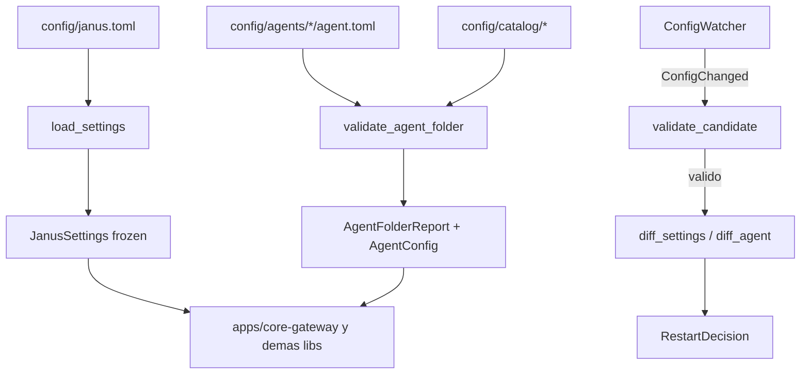

# Feature Spec: libs/config/ (esquema Pydantic, parser TOML y topología de agentes)

> **Status**: Ready for implementation
> **Last updated**: 2026-09-20
> **Orden de implementación**: 2 de 15. Depende de: nada (solo `pydantic` y `tomllib`).

---

## Objective

Construir la librería que carga, valida y expone la configuración de Janus sin que el consumidor sepa cómo está guardada (`stack/06`). Cubre tres cosas:

1. `config/janus.toml`: configuración raíz declarada por el usuario.
2. La configuración por agente (`agent.toml`) con la marca `requires_restart` por campo (`agents/03` sección 4).
3. La topología obligatoria de carpetas de agente y su validación como barrera antes de aplicar cambios (`agents/03` secciones 2.1 y 3).

Resuelve el punto 1.6 de `TODO.md` sobre la ubicación exacta de los folders de agente.

---

## Functional Requirements

### Carga de `janus.toml`
1. `load_settings(path=None) -> JanusSettings` lee el TOML con `tomllib`, valida con Pydantic v2 y devuelve un modelo inmutable (`frozen=True`). La ruta por defecto es `config/janus.toml`; se puede sobrescribir con la variable `JANUS_CONFIG`.
2. Todos los modelos usan `extra="forbid"`: una clave desconocida es error, no se ignora en silencio.
3. Un fallo lanza `ConfigError` con la lista completa de errores, cada uno con ruta de campo (`harnesses.channel-gateway.port`), mensaje y valor (los secretos se enmascaran).
4. Los secretos nunca son texto plano por defecto. El tipo `SecretRef` acepta `{ env = "NOMBRE" }` o `{ file = "/ruta" }` y se resuelve a `SecretStr` al cargar. Un secreto literal en el TOML se acepta solo con `allow_plaintext_secrets = true` y emite advertencia.

### Secciones del esquema raíz (`JanusSettings`)
5. `core`: `bind_host` (default `127.0.0.1`), `grpc_port`, `mcp_port`. Escuchar fuera de loopback exige `allow_non_loopback = true` explícito.
6. `paths`: `state_dir` (default `~/.local/state/janus`), `db_file` (default `janus.db`), `log_dir`. Se expanden `~` y variables.
7. `redis`: `enabled`, `url`. Redis es opcional; con `enabled = false` el sistema degrada (spec 06).
8. `harnesses.reasoning-engine` y `harnesses.channel-gateway`: `port`, `timeout_ms`, `retry_policy`, `max_retries`, `backoff_base_ms`, `circuit_breaker_threshold`, `circuit_breaker_cooldown_s` (`stack/07` sección 1.1 y `stack/09`).
9. `harnesses.owners`: tabla `capability_id -> harness`. Validación: un único dueño por capacidad de harness base (`stack/07` sección 1.3).
10. `spokes`: lista de spokes externos estáticos con `spoke_id` (slug `^[a-z0-9][a-z0-9-]{0,62}$`, único), `adapter` (`paquete.modulo:Clase`), `enabled`, `settings` (tabla libre validada luego por `cls.config_model`) y override de política de fallo. Cada entrada se convierte en un `AdapterSpec` (spec 04).
11. `providers`: tabla `nombre -> ProviderConfig` con `kind` (`openai_compatible`, `anthropic`, `ollama`, `openrouter`), `base_url`, `api_key` (`SecretRef`), `models`. Es la base del routing multi proveedor de `libs/reasoning-engine` (spec 10).
12. `selection`: política por patrón de capacidad (glob) con `policy` (`priority`, `pinned`) y `spokes` ordenados, más `on_preferred_unavailable` (`fallback` por defecto, `block`, `ask`), `role_hints` (tabla `rol -> lista de tipos de spoke preferidos`, por ejemplo `implementer = ["execution"]`), `max_route_depth` (default 4), `heartbeat_ttl_s` (default 30) y `specialties` (tabla `categoría -> tipo de agente`). Ver spec 09.
13. `failure`: valores por defecto de la política de fallo, con override por harness o spoke.
14. `agents`: `root` (default `config/agents`), `catalog_root` (default `config/catalog`), y `types.<tipo>.max_concurrent` (`agents/07`). El tipo `janus` no admite `max_concurrent` (exento).
15. `approval`: política de aprobación de cambio de proveedor con cuatro valores
    confirmados, `ask_everytime`, `ask_once_per_session`, `allow_always` y
    `deny_always`; global y con override por agente (`agents/06`).
16. `memory`: `embedding_model` (default `intfloat/multilingual-e5-large`), `embedding_device` (`cpu` por defecto, `cuda` o `auto`), `embedding_dim` (opcional: la dimensión se deriva del modelo y solo se exige para modelos registrados con `add_custom_model` que `fastembed` no conoce) y `top_k_default` (spec 07). Un perfil para hardware chico (Raspberry Pi) cambia solo `embedding_model` a `intfloat/multilingual-e5-small`. Un cambio de `embedding_model` o `embedding_device` exige reinicio de `core-gateway` y dispara `reindex()` al arrancar. No existe `auto_capture`: la captura de memoria es siempre explícita (spec 07, requisito 18).
17. `voice`: proveedores por defecto de TTS y STT (spec 13).
18. `observability`: `log_level`, `ring_buffer_size` (default 5000), rotación y canales Redis (spec 06).
19. `identity.owner`: lista de identidades de canal autorizadas para comandos de control, cada una `{ platform, account_id, user_id }` (spec 11 y spec 14). Es la señal base de la verificación en capas: el identificador por plataforma, con comparación mecánica.
19a. `channels`: tabla `plataforma -> lista de cuentas` con `account_id`, `role` (`main` o `agent_bot`), `credentials` (`SecretRef`), `allowlist` y límites (`max_attachment_bytes`, tamaño de colas). El núcleo resuelve los secretos y genera el archivo de runtime del `channel-gateway` (spec 14). Por cuenta, además, `owner_reverify` (`never`, `per_session` o `always`) y `owner_challenge_file` (ruta opcional a un `.md` libre con el secreto compartido que el usuario decide, incrustado en el contexto del agente hasta que este lo da por validado con la tool `mark_sender_verified`, spec 11 requisito 26). `owner_reverify` solo tiene efecto si hay `owner_challenge_file`. Los flags de biometría por canal se agregan cuando exista la spec de esa capacidad (pregunta 14 de `architecture/09`).
19b. `roles`: tabla `rol -> { capability }` con la capacidad que requiere cada rol (spec 11, requisito 18) y `task.max_attempts` (default 2). `harnesses.channel-gateway.command` define el comando que arranca el proceso supervisado y `approval.timeout_s` (default 600) el tiempo de espera de aprobaciones.
19c. `voice.rtf_warn`, `voice.slow_policy`, `voice.keep_audio`, `voice.max_text_chars`, `voice.max_audio_s` y `voice.concurrency` (spec 13).

### Recarga
20. `ConfigWatcher(paths, interval_s=2.0, debounce_ms=300)` detecta cambios por mtime y hash de contenido, con reintento si el archivo está a medio escribir. Emite `ConfigChanged(path)`. No aplica nada por sí mismo.
21. `validate_candidate(path) -> ValidationResult` valida un archivo modificado sin instanciar nada. Si es inválido, el cambio no se aplica y el error vuelve a quien lo originó (humano o IA vía filesystem MCP), tal como exige `agents/03` sección 3.
22. `diff_settings(old, new) -> list[FieldChange]` devuelve cada campo cambiado con `requires_restart`. Para `janus.toml`, solo `selection`, `failure`, `approval`, `agents.types.*.max_concurrent` y `observability.log_level` son de recarga en caliente; el resto exige reinicio de `core-gateway`.

### Configuración de agente
23. Cada agente es una carpeta bajo `agents.root`: `config/agents/<Nombre>/`. El nombre cumple `^[A-Za-z][A-Za-z0-9_]{0,62}$` y es único sin distinguir mayúsculas.
24. `AgentConfig` (`agent.toml`) tiene dos bloques, `core` y `persona`, alineados con `AgentCore` y `AgentPersona` de `agents/01`. Campos y marca de reinicio:

| Bloque | Campo | requires_restart |
|---|---|---|
| raíz | `type` (slug en minúsculas, default = nombre en minúsculas) | true |
| raíz | `is_leader` (solo `Janus`) | true |
| core | `model_provider` (referencia a `providers`) | true |
| core | `fallback_providers` (lista ordenada de proveedores alternativos, spec 09) | true |
| core | `approval_provider_change` (override de `approval`) | false |
| core | `system_prompt_file`, `rules` | true |
| core | `enabled_skills`, `enabled_commands`, `extra_tools` | true |
| core | `filesystem_roots` (directorios que el agente puede tocar con `filesystem-mcp`, spec 08) | true |
| persona | `voice_provider`, `tone` | false |
| persona | `personality_prompt` | false |
| persona | `channel_identity` (`own_bot` o `shared_with_prefix`) | false |

25. Toda clave de `AgentConfig` declara `requires_restart` de forma explícita mediante `Field(json_schema_extra={"requires_restart": bool})`. Un test recorre el esquema y falla si algún campo carece de la marca (`agents/03` sección 4: la marca es contrato del schema, no inferencia).
26. `diff_agent(old, new) -> RestartDecision` devuelve `HOT_RELOAD`, `RESTART_REQUIRED` o `NO_CHANGE`, con los campos responsables.

### Topología de carpetas
27. `validate_agent_folder(path) -> AgentFolderReport` exige exactamente estas entradas: `Skills/`, `Instructions/`, `Rules/`, `Tools/`, `agent.md`, `agent.toml` (`agents/03` sección 2.1). Sin excepciones para agentes nuevos.
28. Catálogo compartido de skills y comandos: `config/catalog/skills/*.md` y `config/catalog/commands/*.md`. Cada id de `enabled_skills` y `enabled_commands` debe resolver a un archivo del catálogo o a un `.md` dentro de `Skills/` del propio agente. El catálogo es único y compartido (`agents/03` sección 1); `Skills/` del agente admite enlaces simbólicos al catálogo.
29. Validación de contenido: los `.md` deben ser UTF-8; `agent.md` máximo 64 KiB, cada `.md` máximo 256 KiB, total de la carpeta máximo 5 MiB (configurables).
30. Seguridad de rutas: cada ruta resuelta (siguiendo enlaces simbólicos) debe quedar dentro de `agents.root` o `agents.catalog_root`. Un enlace que escape falla la validación.
31. `discover_agents(settings) -> list[AgentFolderReport]` recorre `agents.root`, valida cada carpeta y aísla los fallos: un agente inválido no impide cargar los demás.

---

## Non-Functional Requirements

* **Performance**: `load_settings` menor a 150 ms y `validate_agent_folder` menor a 50 ms p95 por agente típico en hardware clase Raspberry Pi 4. Objetivos propuestos, se ajustan tras medir.
* **Security**: sin secretos en texto plano por defecto; valores enmascarados en errores y logs; validación de escape de rutas; sin `eval` ni ejecución de contenido de configuración.
* **Reliability**: una edición inválida jamás derriba un agente en ejecución (el cambio no se aplica). El watcher tolera escrituras parciales con debounce y relectura.
* **Portability**: Python 3.11 o superior. Dependencias permitidas: `pydantic>=2` y stdlib. Prohibido importar `libs/adapters`, `libs/persistence`, `libs/capabilities`, `libs/proto-py` y `apps/*`. Los valores como `on_dependency_failure` se manejan como cadenas y los mapea el consumidor.

---

## Technical Decisions

### Ubicación de los agentes: `config/agents/<Nombre>/`
* **Chosen**: colección de carpetas bajo `config/agents/`, y catálogo compartido en `config/catalog/`.
* **Reason**: `config/` ya es el territorio editable por el usuario y por IA (`config/janus.toml`); reúne lo declarado por el usuario y mantiene `docs/` como documentación. Resuelve el punto 1.6 de `TODO.md`.
* **Rejected alternatives**: `agents/` en la raíz (compite con la carpeta de roles de desarrollo y mezcla config con código); `apps/core-gateway/agents/` (acopla config a un proceso).

### Catálogo compartido más `Skills/` por agente
* **Chosen**: catálogo global único; cada agente lo referencia por id y puede añadir skills propios en su `Skills/`.
* **Reason**: `agents/03` sección 1 pide catálogo único compartido y sección 2.1 exige `Skills/` en cada agente; esta combinación respeta ambas.
* **Rejected alternatives**: copiar skills a cada agente (duplicación y deriva); prohibir skills propios (rigidez sin beneficio).

### Pydantic `json_schema_extra` para `requires_restart`
* **Chosen**: metadato en el propio campo, recorrido por reflexión del modelo.
* **Reason**: la marca vive junto al campo y un test garantiza cobertura total.
* **Rejected alternatives**: tabla paralela de campos (se desincroniza); inferencia en runtime (`agents/03` la descarta).

### Watcher por sondeo de mtime y hash
* **Chosen**: sondeo cada 2 s con hash de contenido.
* **Reason**: cero dependencias nativas, funciona igual en aarch64 y en cualquier sistema de archivos.
* **Rejected alternatives**: `watchfiles` o inotify directo (dependencia y comportamiento distinto entre plataformas); pueden añadirse después detrás de la misma interfaz.

### Secretos por referencia
* **Chosen**: `SecretRef` a variable de entorno o archivo.
* **Reason**: el TOML puede versionarse o pasar por una IA sin exponer credenciales.
* **Rejected alternatives**: secretos en el TOML (riesgo de fuga); keyring del SO (no disponible de forma uniforme en el Pi sin sesión gráfica).

---

## Proposed Architecture

### Component Diagram


### Directory Structure
```
libs/config/
  pyproject.toml
  src/janus_config/
    __init__.py
    errors.py          # ConfigError, ValidationResult
    secrets.py         # SecretRef
    settings.py        # JanusSettings y submodelos
    agent.py           # AgentConfig, AgentCoreConfig, AgentPersonaConfig, RestartDecision
    topology.py        # validate_agent_folder, discover_agents
    diff.py            # diff_settings, diff_agent, FieldChange
    watcher.py         # ConfigWatcher
    loader.py          # load_settings, validate_candidate
  tests/
config/
  janus.toml
  agents/Janus/  agents/Implementer/  ...
  catalog/skills/  catalog/commands/
```

---

## Data Models

```
Entity JanusSettings { core, paths, redis, harnesses, spokes[], providers{}, selection, failure,
                       agents, approval, memory, voice, observability, identity }
Entity SpokeConfig   { spoke_id: slug, adapter: "pkg.mod:Class", enabled: bool, settings: dict,
                       failure_policy?: FailureOverride }
Entity ProviderConfig{ kind: enum, base_url: url, api_key: SecretRef, models: list[str] }
Entity AgentConfig   { type: slug, is_leader: bool, core: AgentCoreConfig, persona: AgentPersonaConfig }
Entity FieldChange   { path: str, old: Any, new: Any, requires_restart: bool }
Entity AgentFolderReport { name, path, ok: bool, errors: list[str], config?: AgentConfig }
Enum   RestartDecision { NO_CHANGE, HOT_RELOAD, RESTART_REQUIRED }
```

Ejemplo mínimo de `config/janus.toml`:

```toml
[core]
bind_host = "127.0.0.1"
grpc_port = 8080
mcp_port = 8081

[harnesses.channel-gateway]
port = 8090
retry_policy = "exponential-backoff"
max_retries = 5

[harnesses.owners]
"channel.deliver" = "channel-gateway"
"reasoning.complete" = "reasoning-engine"

[agents.types.implementer]
max_concurrent = 2

[approval]
provider_change = "ask_everytime"
```

---

## API Contracts

Librería, sin API de red. Superficie pública:

```
load_settings(path: Path | None = None) -> JanusSettings                 # ConfigError
validate_candidate(path: Path) -> ValidationResult
diff_settings(old: JanusSettings, new: JanusSettings) -> list[FieldChange]
validate_agent_folder(path: Path, settings: JanusSettings) -> AgentFolderReport
discover_agents(settings: JanusSettings) -> list[AgentFolderReport]
diff_agent(old: AgentConfig, new: AgentConfig) -> RestartDecision
ConfigWatcher(paths: Sequence[Path], interval_s: float = 2.0, debounce_ms: int = 300)
    .events() -> AsyncIterator[ConfigChanged]
```

---

## Edge Cases

| Case | How to Handle |
|---|---|
| TOML a medio escribir (editor o IA) | Debounce de 300 ms y relectura; si sigue inválido, `validate_candidate` devuelve error y no se aplica. |
| Clave desconocida | `ConfigError` (`extra="forbid"`). Evita que una alucinación de IA pase inadvertida. |
| Dos agentes con nombre igual salvo mayúsculas | La validación rechaza el segundo. |
| Enlace simbólico que apunta fuera de `agents.root` | Falla la validación de ruta; el agente no se carga. |
| `enabled_skills` referencia un id inexistente | Error de validación con el id y las rutas buscadas. |
| Cambio mixto (voz y prompt a la vez) | `RESTART_REQUIRED` (gana el campo más estricto), listando ambos. |
| Puerto duplicado entre harnesses | Error de validación cruzada. |
| Carpeta de agente inválida entre varias válidas | Se reporta y se omite solo esa; las demás cargan. |
| `Janus` sin `is_leader = true` | Error: el líder es único y obligatorio. |

---

## Testing Requirements

**Unit Tests**: parseo válido e inválido de cada sección; `extra="forbid"`; enmascarado de secretos; `SecretRef` de env y de archivo; unicidad de `spoke_id` y de dueño de capacidad; test de cobertura de `requires_restart` sobre todo `AgentConfig`; `diff_agent` con combinaciones; topología con entradas faltantes, catálogo roto, tamaños excedidos y enlace que escapa; `discover_agents` con un agente roto.

**Integration Tests**: `ConfigWatcher` con escritura parcial y con archivo reemplazado de forma atómica; carga de un árbol `config/` de ejemplo completo bajo `tests/fixtures/`.

---

## Security Checklist
- [ ] `extra="forbid"` en todos los modelos
- [ ] Secretos por referencia y enmascarados en errores y logs
- [ ] Validación de escape de rutas con resolución de enlaces simbólicos
- [ ] `bind_host` fuera de loopback exige opt in explícito
- [ ] Ninguna ejecución de código desde configuración
- [ ] Límites de tamaño de archivos de agente

---

## Open Questions
- [ ] Confirmar `config/agents/` y `config/catalog/` como ubicación definitiva (propuesta de esta spec).
- [ ] `filesystem_roots` se agregó por la spec 08; validar que cada raíz exista y que no incluya `config/agents` de otros agentes salvo que el agente sea `Janus`.
- [x] Variantes intermedias de `approval` (`ask_once_per_session`, `deny_always`):
      confirmadas por el usuario, las cuatro forman el conjunto completo. `agents/06`
      actualizado.
- [ ] Nombre del paquete: se adopta `janus_config` (espacio plano `janus_*`), que además resuelve la duda de la spec 04.
- [ ] Puertos por defecto de `core.grpc_port` y `core.mcp_port`: los valores del ejemplo son placeholders.
- [ ] Valor por defecto de `owner_reverify` cuando hay `owner_challenge_file`: el usuario dio ejemplos por ámbito (desde la PC nunca, desde WhatsApp una vez por chat nuevo, desde un speaker de la casa siempre) pero no un default global.

---

## Handoff Note
Revisar esta spec antes de empezar. Crear un checklist desde los requisitos funcionales y marcarlo al avanzar. Levantar dudas antes de codificar, no durante. Implementar `settings.py` y `loader.py` primero; la topología y el watcher se pueden hacer en paralelo después.
