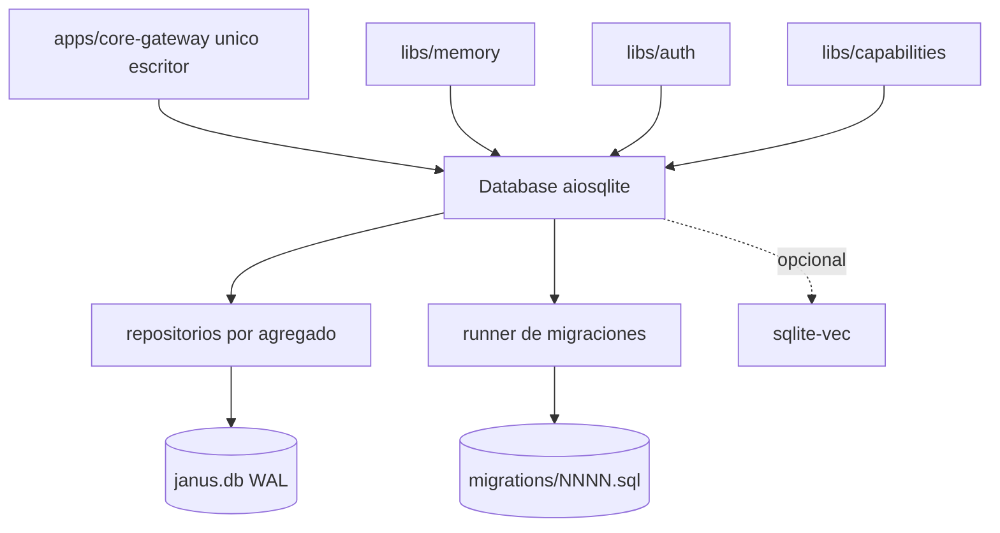

# Feature Spec: libs/persistence/ (SQLite con aiosqlite, migraciones y esquema)

> **Status**: Ready for implementation
> **Last updated**: 2026-09-20
> **Orden de implementación**: 3 de 15. Depende de: nada (solo `aiosqlite`; `sqlite-vec` opcional).

---

## Objective

Construir la capa de persistencia transversal (`architecture/06`, `stack/03`): acceso SQLite asíncrono con SQL explícito, un runner de migraciones propio y el esquema completo que necesitan sesiones, tareas, registro de capacidades, preferencias, cola de concurrencia, tokens y memoria.

Una vez implementada, `core-gateway` (único proceso escritor) persiste todo el estado de verdad del sistema, y ese estado sobrevive reinicios y cambios de spoke. Resuelve los puntos 1.6 de `TODO.md` sobre el esquema de la cola y de las sesiones multi participante.

---

## Functional Requirements

### Conexión
1. `Database.connect(db_path, load_vec=False) -> Database` abre una conexión `aiosqlite` y aplica: `journal_mode=WAL`, `synchronous=NORMAL`, `foreign_keys=ON`, `busy_timeout=5000`, `wal_autocheckpoint=1000`.
2. Existe una única conexión de escritura por proceso. `core-gateway` es el único escritor (`stack/03` sección 1); un segundo proceso escritor es un error de despliegue.
3. `Database.transaction()` es un context manager async que abre `BEGIN IMMEDIATE`, hace commit al salir y rollback ante excepción. Anidar transacciones lanza `PersistenceError`.
4. Con `load_vec=True` se habilita `enable_load_extension`, se carga `sqlite-vec` y se verifica con `vec_version()`. Si el intérprete no permite extensiones o el paquete falta, lanza `VectorExtensionUnavailable` (no bloquea el resto de la librería).

### Migraciones
5. Las migraciones son archivos `libs/persistence/migrations/NNNN_nombre.sql` numerados, empaquetados como datos del paquete y leídos con `importlib.resources`. Nunca hay DDL embebido en código Python (`stack/03` sección 3).
6. El runner propio aplica en orden las migraciones pendientes, cada una en su transacción, y registra en `schema_migrations(version, name, checksum, applied_at)`. Solo avanza; no hay migraciones hacia atrás.
7. Si el checksum de una migración ya aplicada difiere del archivo actual, el runner aborta con `MigrationTamperedError`. Una migración aplicada es inmutable.
8. Si faltan números en la secuencia o hay duplicados, aborta antes de aplicar nada.
9. Tras migrar, actualiza `PRAGMA user_version` con la última versión.

### Repositorios
10. Cada agregado tiene su módulo de repositorio con funciones async y SQL parametrizado visible en la propia función (`stack/03` sección 2). Nunca se construye SQL con f-strings ni concatenación.
11. Los repositorios devuelven dataclasses inmutables propias, no mensajes protobuf. La conversión a proto la hace `core-gateway`.
12. Repositorios: `spokes`, `capabilities`, `preferences`, `sessions`, `participants`, `tasks`, `task_deps`, `assignments`, `agent_queue`, `tokens`, `memory` (solo tablas regulares; la búsqueda vectorial la implementa `libs/memory`).
13. Marcas de tiempo: texto ISO 8601 UTC con milisegundos y sufijo `Z`. Identificadores: cadenas hexadecimales de UUID v4, salvo `agent_queue.seq` que es entero autoincremental.

### Esquema (resumen; el DDL exacto vive en los `.sql`)
14. `0001_init.sql`: `schema_migrations`, `preferences(key PK, value_json, updated_at)`.
15. `0002_registry.sql`: `spokes(spoke_id PK, display_name, kinds_json, source CHECK IN ('config','dynamic'), adapter_path, endpoint, enabled, health_state, health_reason, retry_after, last_seen)` y `capabilities(capability_id, spoke_id FK, descriptor_json, PRIMARY KEY(capability_id, spoke_id))`.
16. `0003_sessions.sql`: `sessions(session_id PK, kind, agent_name, task_id NULL, status CHECK IN ('open','closed'), engine_session_ref, created_at, closed_at)` y `session_participants(session_id FK, participant_id, kind CHECK IN ('janus','agent','user_listener'), channel_ref, joined_at, left_at, PRIMARY KEY(session_id, participant_id, joined_at))`. Índice parcial sobre `left_at IS NULL`.
17. `0004_tasks.sql`: `tasks(task_id PK, session_id FK, role, title, status CHECK IN ('pending','running','blocked','completed','failed','cancelled'), assigned_spoke_id, input_json, result_json, status_reason, attempts, checklist_json, required, created_at, started_at, finished_at)`; `task_deps(task_id FK, depends_on_id FK, PRIMARY KEY(task_id, depends_on_id))` con índice B tree sobre `depends_on_id`; `task_assignments(task_id FK, spoke_id, assigned_at, unassigned_at, reason)` para trazabilidad de reasignaciones (`architecture/05` sección 3). La decisión ante una dependencia fallida no se persiste como política de la tarea: la toma Janus en runtime (spec 11, requisito 20) y queda registrada en `status_reason`. `checklist_json` guarda el arreglo de `TaskChecklistItem` (spec 01, requisito 15); `required` es el flag booleano independiente de `task_deps` que sostiene el aviso selectivo a Janus (spec 11, requisito 22bis). Ninguno de los dos participa de la detección de ciclos ni del planificador de dependencias.
18. `0005_agent_queue.sql`: `agent_queue(seq INTEGER PRIMARY KEY AUTOINCREMENT, request_id UNIQUE, agent_type, agent_name, session_id, task_id, status CHECK IN ('queued','running','done','cancelled','failed'), enqueued_at, started_at, finished_at, status_reason)` con índice `(agent_type, status, seq)`. La cola es FIFO por carril: el orden lo define `seq`. Las solicitudes de Janus nunca se encolan (`agents/07` sección 3).
19. `0006_tokens.sql`: `tokens(token_id PK, name, kind CHECK IN ('internal','external'), secret_hash, scopes_json, created_at, expires_at, revoked_at, last_used_at)`. El contrato de hashing lo fija la spec 05.
20. `0007_memory.sql`: `memory_categories(level CHECK IN ('agent','global'), agent_name, category, description, created_at, PRIMARY KEY(level, agent_name, category))` y `memory_entries(entry_id PK, level, agent_name, category, content, embedding_model, embedding_dim, project_ref, source, created_at, updated_at)`. La categoría `profile` se siembra en la migración para el nivel global. La tabla virtual vectorial no vive en una migración numerada porque su dimensión depende del modelo de embeddings configurado (spec 07): se crea desde una plantilla con `Database.ensure_vec_table(dim)` (requisito 20bis).
20bis. `Database.ensure_vec_table(dim: int) -> str` crea, si no existe, la tabla `memory_vec_<dim>` con `vec0(embedding float[<dim>] distance_metric=cosine)` a partir de la plantilla `templates/memory_vec.sql.tmpl`, empaquetada como dato del paquete: el DDL sigue viviendo en un archivo `.sql` y nunca en un string de Python. `dim` es la única sustitución permitida y se valida como entero entre 1 y 4096 antes de renderizar; cualquier otro valor lanza `PersistenceError`. Devuelve el nombre de la tabla. `Database.drop_vec_table(dim)` la elimina con la misma validación. Ambas requieren `sqlite-vec`; sin él lanzan `VectorExtensionUnavailable`.

### Operaciones clave
21. `sessions.count_external_listeners(session_id)` cuenta participantes `user_listener` con `left_at IS NULL`. `sessions.close_if_idle(session_id)` cierra de forma atómica la sesión cuando la tarea es terminal y el conteo es cero (`agents/04` sección 3).
22. `agent_queue.enqueue`, `next_for_lane(agent_type)` (el más antiguo en `queued`), `mark_running`, `mark_done` y `count_running(agent_type)` permiten aplicar el tope por carril sin bloquear otros carriles.
23. `tasks.load_graph(scope) -> dict[str, set[str]]` carga el subconjunto de grafo (por sesión o de todas las tareas abiertas) como diccionario de adyacencia para que `core-gateway` corra los algoritmos en memoria. El cómputo del grafo no ocurre en SQL (`stack/03` sección 4).
24. `recover_after_crash()` marca como `failed` las filas de cola `running` y como `blocked` las tareas `running`, con motivo `interrupted_by_restart`, para que el núcleo decida reanudar o cancelar (ver spec 11).
25. `tasks.mark_checklist_item(task_id, item_id, done: bool) -> Task` actualiza un ítem dentro de `checklist_json` en una transacción (lectura, modificación del arreglo en memoria, escritura) y fija o limpia `done_at`. No cambia `status` ni `status_reason` de la tarea: esta operación es deliberadamente ajena a la máquina de estados de la tarea (spec 11, requisito 22bis) y no requiere que la sesión de Janus se entere. `core-gateway` es responsable de emitir `task.subitem_changed` (spec 06) después de la escritura; el repositorio solo persiste.

---

## Non-Functional Requirements

* **Performance**: una transacción de escritura típica (insertar tarea y dependencias) menor a 5 ms p95 en SD de Raspberry Pi 4 con WAL. `load_graph` de 10 000 aristas menor a 100 ms. Objetivos propuestos, se ajustan tras medir.
* **Security**: SQL solo parametrizado; el archivo `.db` se crea con permisos `0600`; `secret_hash` nunca se devuelve en listados.
* **Reliability**: migraciones transaccionales; checkpoint WAL periódico; arranque idempotente; fallo de migración deja la base sin cambios parciales.
* **Portability**: Python 3.11 o superior; solo `aiosqlite` como dependencia obligatoria. `sqlite-vec` es opcional detrás de `load_vec`. Prohibido importar `libs/config`, `libs/adapters`, `libs/capabilities` y `apps/*`.

---

## Technical Decisions

### SQL crudo con `aiosqlite`, sin ORM
* **Chosen**: funciones de repositorio con SQL visible.
* **Reason**: decisión explícita del usuario en `stack/03`; control total y sin capa de traducción.
* **Rejected alternatives**: SQLAlchemy o SQLModel (descartados por el usuario); query builder.

### Runner de migraciones propio con checksum
* **Chosen**: lector de archivos `.sql` con registro y verificación de checksum.
* **Reason**: requisito de control total (`stack/03` sección 3); el checksum evita que una migración aplicada se edite en silencio.
* **Rejected alternatives**: Alembic o yoyo (dependencia y modelo de ORM que el usuario descartó).

### Tabla vectorial por dimensión, desde una plantilla SQL
* **Chosen**: una tabla `memory_vec_<dim>` por dimensión de embedding, creada bajo demanda por `ensure_vec_table(dim)` a partir de `templates/memory_vec.sql.tmpl`. La dimensión sale del modelo configurado (`memory.embedding_model`, spec 02), cuyo default es de 1024 dimensiones. Cada entrada guarda `embedding_model` y `embedding_dim`; al cambiar de modelo, `libs/memory` crea la tabla de la nueva dimensión, re embebe y descarta la anterior solo si todo salió bien.
* **Reason**: el usuario decidió que el modelo se configura en el sistema, así que la dimensión no se conoce al escribir una migración. `vec0` exige la dimensión en el DDL, y el DDL no puede vivir como string en Python (`stack/03` sección 3). Una plantilla `.sql` con un único parámetro entero validado mantiene el DDL en un archivo y cubre cualquier modelo, sin una migración por cada cambio de modelo.
* **Rejected alternatives**: dimensión fija en una migración (`float[384]` o `float[1024]`; obliga a una migración nueva por cada cambio de modelo y contradice que el modelo sea configurable); crear la tabla en runtime con SQL interpolado libre (rompe la regla de no embeber DDL, a diferencia de la plantilla con un único entero validado); almacenar vectores como BLOB y buscar en Python (pierde la aceleración de `sqlite-vec`).

### Mensajes de sesión fuera del esquema de Janus
* **Chosen**: la persistencia guarda metadatos de sesión y participantes; el historial de mensajes lo persiste el motor extraído en `libs/reasoning-engine` y se referencia por `engine_session_ref`.
* **Reason**: `agents/04` sección 3 exige reutilizar tal cual la persistencia de sesión del motor, sin construir mensajería nueva.
* **Rejected alternatives**: duplicar el historial en tablas de Janus (dos fuentes de verdad).

### Cola persistida, ejecución en memoria
* **Chosen**: la cola vive en SQLite para sobrevivir reinicios y alimentar observabilidad; el despacho en caliente usa semáforos por carril en `libs/capabilities`.
* **Reason**: `agents/07` pide una vista unificada de la cola y no descartar solicitudes; SQLite da durabilidad sin Redis.
* **Rejected alternatives**: solo en memoria (pierde solicitudes al reiniciar); solo en Redis (`stack/03` reserva Redis para estado efímero).

---

## Proposed Architecture

### Component Diagram


### Directory Structure
```
libs/persistence/
  pyproject.toml
  migrations/
    0001_init.sql  0002_registry.sql  0003_sessions.sql  0004_tasks.sql
    0005_agent_queue.sql  0006_tokens.sql  0007_memory.sql
  templates/
    memory_vec.sql.tmpl   # DDL de la tabla vectorial; la dimension es el unico parametro
  src/janus_persistence/
    __init__.py
    database.py        # Database, transaction, PRAGMAs, carga de sqlite-vec
    migrate.py         # runner y verificación de checksum
    errors.py          # PersistenceError, MigrationTamperedError, VectorExtensionUnavailable
    models.py          # dataclasses inmutables
    repos/
      spokes.py  capabilities.py  preferences.py  sessions.py  participants.py
      tasks.py   task_deps.py     assignments.py  agent_queue.py  tokens.py  memory.py
  tests/
```

---

## Data Models

```
Entity Task        { task_id, session_id, role, title, status,
                     assigned_spoke_id?, input_json, result_json?, status_reason?, attempts,
                     checklist_json, required, created_at, started_at?, finished_at? }
Entity TaskDep     { task_id, depends_on_id }                # arista dirigida
Entity QueueEntry  { seq, request_id, agent_type, agent_name, session_id, task_id?, status,
                     enqueued_at, started_at?, finished_at?, status_reason? }
Entity SessionRow  { session_id, kind, agent_name, task_id?, status, engine_session_ref?,
                     created_at, closed_at? }
Entity Participant { session_id, participant_id, kind, channel_ref, joined_at, left_at? }
Entity TokenRow    { token_id, name, kind, secret_hash, scopes_json, created_at,
                     expires_at?, revoked_at?, last_used_at? }
Entity MemoryEntry { entry_id, level, agent_name?, category, content, embedding_model,
                     embedding_dim, project_ref?, source, created_at, updated_at }
```

---

## API Contracts

Librería, sin API de red. Superficie pública mínima:

```
Database.connect(db_path: Path, load_vec: bool = False) -> Database
Database.migrate() -> list[int]                      # versiones aplicadas
Database.transaction() -> AsyncContextManager[Connection]
tasks.create(db, spec) -> Task            tasks.load_graph(db, scope) -> dict[str, set[str]]
tasks.mark_checklist_item(db, task_id, item_id, done: bool) -> Task
agent_queue.enqueue(db, entry) -> int     agent_queue.next_for_lane(db, agent_type) -> QueueEntry | None
sessions.close_if_idle(db, session_id) -> bool
recover_after_crash(db) -> RecoveryReport
```

Errores: `PersistenceError` (base), `MigrationTamperedError`, `MigrationSequenceError`, `VectorExtensionUnavailable`, `IntegrityViolation` (envuelve `sqlite3.IntegrityError` con el nombre de la restricción).

---

## Edge Cases

| Case | How to Handle |
|---|---|
| Migración aplicada editada después | `MigrationTamperedError`; no se toca la base. |
| Migración falla a medias | Rollback de su transacción; la versión no se registra. |
| Dos procesos intentan escribir | Segundo intento espera `busy_timeout` y luego falla con `PersistenceError`; se documenta como error de despliegue. |
| Reinicio con tareas `running` | `recover_after_crash()` las deja `blocked` con `interrupted_by_restart` y la cola `running` como `failed`. |
| Dependencia que crea un ciclo | La repos.tasks no lo detecta; lo rechaza `core-gateway` con Kahn antes de insertar (spec 11). La integridad referencial evita aristas a tareas inexistentes. |
| `sqlite-vec` ausente o intérprete sin extensiones | `VectorExtensionUnavailable`; `libs/memory` degrada a búsqueda solo por categoría y texto. |
| Un token expirado o revocado | El repo lo devuelve marcado; la decisión es de `libs/auth`. |
| Disco lleno | El error de `sqlite3.OperationalError` se propaga como `PersistenceError` con causa; `core-gateway` entra en modo degradado de solo lectura. |
| Borrado de sesión con participantes | `ON DELETE CASCADE` sobre `session_participants`; las sesiones normalmente se cierran, no se borran. |

---

## Testing Requirements

**Unit Tests**: PRAGMAs aplicados; `transaction` con commit, rollback y anidamiento; runner con base vacía, base ya migrada, checksum alterado, secuencia con hueco; cada repositorio con un caso feliz y uno de restricción violada; `close_if_idle` con cero, uno y varios oyentes; FIFO de `next_for_lane` con carriles mezclados; `recover_after_crash`; `ensure_vec_table` con dimensión válida, repetida (idempotente) e inválida (cero, negativa, mayor a 4096, no entera) y `drop_vec_table`.

**Integration Tests**: ciclo completo crear sesión, tareas con dependencias, cola y recuperación tras cerrar y reabrir la base; carga y consulta de `sqlite-vec` en la plataforma de CI (x86_64) y en un aarch64 de verificación manual; prueba de migración desde una base creada con la primera versión del esquema.

---

## Security Checklist
- [ ] SQL siempre parametrizado, sin interpolación
- [ ] Archivo `.db` con permisos `0600`
- [ ] `secret_hash` excluido de listados y logs
- [ ] Migraciones inmutables por checksum
- [ ] Sin importar librerías de dominio (evita ciclos y fuga de responsabilidades)
- [ ] Extensiones de SQLite solo cargadas desde el paquete verificado
- [ ] `ensure_vec_table` y `drop_vec_table` aceptan solo un entero validado, sin otra interpolación

---

## Open Questions
- [x] Modelo de embeddings y dimensión: resuelto. El modelo es configurable y la dimensión sale del modelo (`ensure_vec_table`); el default de fábrica es de 1024 dimensiones (spec 07).
- [ ] `sqlite-vec` es pre v1 (0.1.x) y sus wheels aarch64 tuvieron problemas en versiones anteriores; verificar la wheel de la versión elegida en el Pi antes de fijar la dependencia.
- [ ] Política de retención (cuánto tiempo se conservan sesiones cerradas y tareas terminales). No decidida; por ahora se conservan sin límite.

---

## Handoff Note
Revisar esta spec antes de empezar. Crear un checklist desde los requisitos funcionales y marcarlo al avanzar. Levantar dudas antes de codificar, no durante. Implementar primero `database.py` y `migrate.py`, luego repositorios por orden de dependencia: registro, sesiones, tareas, cola, tokens, memoria.
