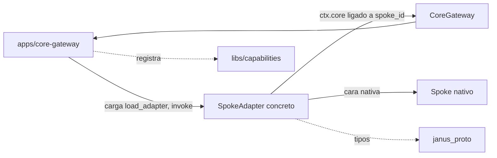

# Feature Spec: libs/adapters/ (contratos de adaptador de spoke)

> **Status**: Ready for implementation
> **Last updated**: 2026-09-19
> **Orden de implementación**: 4 de 15. Depende de: spec 01 (`janus_proto`). Los adaptadores concretos son la spec 15.

---

## Objective

Construir la librería Python que fija el contrato formal de todo adaptador dentro del Core de Traducción: clases base abstractas, ciclo de vida, errores, salud, carga desde config y un kit de pruebas de contrato.

Una vez implementada, `core-gateway` puede cargar, arrancar, invocar y detener cualquier adaptador de forma uniforme sin conocer spokes concretos (`architecture/02` sección 4.2). Un tercero agrega un spoke escribiendo una clase, sin tocar el núcleo.

Alcance: contratos, clase base, carga y kit de pruebas. Los adaptadores concretos se especifican en la spec 15. Esta spec ya no tiene pendiente el orden con `proto/`: los tipos vienen de `janus_proto` (spec 01), que se implementa antes.

---

## Functional Requirements

### Contrato base y tipos
1. `SpokeAdapter` es una `abc.ABC`. Instanciar una subclase que no implemente `_open_native_face`, `_close_native_face`, `_probe_health` y `describe_capabilities` lanza `TypeError`.
2. Existen tres interfaces de tipo, también ABC, que extienden `SpokeAdapter`: `ReasoningAdapter` (abstracto `reason`), `ExecutionAdapter` (abstracto `run_task`) y `ChannelAdapter` (abstracto `deliver`). Una clase puede heredar varias, porque un spoke real puede ser de más de un tipo (OpenClaude es ejecución y razonamiento).
3. `kinds` se deriva de las interfaces que la clase implementa y no es sobrescribible. Una clase sin interfaz de tipo es válida y sirve capacidades solo vía `handle_custom`.
4. `GuiDrivenMixin` marca los adaptadores tipo 2.4. Exige `mapping_strategy` (`REALTIME` o `ASSISTED`, según `architecture/10` sección 4) y fija `max_concurrency == 1`.

### Ciclo de vida
5. Estados: `CREATED`, `STARTING`, `RUNNING`, `STOPPING`, `STOPPED`, `FAILED`. `start()` y `stop()` son concretos y `@final`: gestionan transiciones y llaman a los hooks abstractos.
6. `start()` solo es válido desde `CREATED` o `STOPPED`; en otro estado lanza `AdapterStateError`. Si `_open_native_face` falla, el estado pasa a `FAILED`, se llama `_close_native_face` en modo mejor esfuerzo y el error se relanza como `AdapterError`.
7. `stop()` es idempotente y nunca falla si ya está `STOPPED`. Cancela las invocaciones en curso, espera `stop_grace_seconds` (default 5) y luego fuerza el cierre.
8. `describe_capabilities()` puede cambiar en runtime. El adaptador avisa con `ctx.core.notify_capabilities_changed()`. El adaptador nunca escribe en el Registro de Capacidades.

### Invocación
9. `invoke(request)` es concreto y `@final`. Exige ciclo de vida `RUNNING`, aplica el límite de concurrencia, despacha por `capability_id` al handler (`reason`, `run_task`, `deliver` o `handle_custom`) y valida los invariantes del stream. La salud es otro eje: el núcleo decide el ruteo según salud, la base no bloquea por salud.
10. Invariantes del stream: cada evento lleva el `request_id` de la solicitud, el stream termina con exactamente un evento terminal y no se emite nada después. Un evento terminal sin `response` también es violación. Cualquier violación se convierte en `SpokeProtocolError`.
11. Trazabilidad: `session_id`, `task_id` y `role` de la solicitud se preservan en los eventos y en el terminal. La base lo verifica (`architecture/03` sección 2.2).
12. Un fallo lógico (la tarea corrió y falló) es un evento terminal con `status=FAILED`, es decir un dato. Un fallo de infraestructura (no se pudo hablar con el spoke) es una excepción `AdapterError`. Nunca se mezclan.
13. `max_concurrency` (default `None`). La base aplica un `asyncio.Semaphore` con espera FIFO y expone `in_flight` y `waiting` en `HealthReport.details`.
14. `requester_id` y `route_trace` de `SemanticRequest` son de solo lectura para el adaptador (los escribe el núcleo, spec 01). La base descarta cualquier evento saliente que intente propagarlos alterados.

### Errores y salud
15. Jerarquía `AdapterError(spoke_id, retryable, side_effects_possible, cause)` según la tabla de contratos. La base publica `notify_health_changed` automáticamente al observar `QuotaExhaustedError` (`UNAVAILABLE` con `retry_after`) o `InterfaceInvalidatedError` (`UNAVAILABLE`, con `requires_user_action` si la estrategia es `ASSISTED`).
16. Traducción sin pérdida (`architecture/03` sección 3.2): si el adaptador no puede representar un campo o intención en el formato nativo, o al revés, lanza `TranslationError`. Nunca descarta en silencio `request_id`, `session_id`, `task_id`, `role` ni `capability_id`.
17. Los adaptadores no implementan reintentos con backoff ni circuit breaker sobre `invoke`; eso es `FailurePolicy` en `libs/capabilities/` (spec 09). Sí pueden reconectar el transporte dentro de una misma invocación, de forma acotada y reportada en salud.

### Puerto al núcleo
18. `CoreGateway` es una ABC con `request_capability`, `ingest`, `notify_capabilities_changed` y `notify_health_changed`. El núcleo entrega a cada adaptador una instancia ligada a su `spoke_id`: fija `requester_id` y extiende `route_trace` sin que el adaptador pueda suplantar a otro ni declarar su propio origen.
19. Ningún adaptador importa a otro ni referencia spokes por nombre (`architecture/03` sección 3.3). Se verifica en CI con un contrato de independencia (`import-linter`).

### Carga
20. `load_adapter(spec, core, log)` importa `paquete.modulo:Clase`, verifica que sea subclase no abstracta de `SpokeAdapter`, valida `spec.settings` con `cls.config_model` y devuelve la instancia en `CREATED`. Todo fallo lanza `AdapterLoadError` con causa y no arranca nada.
21. Se soportan varias instancias de una misma clase con distinto `spoke_id` y settings (una por perfil o cuenta).

### Kit de pruebas
22. `janus_adapters.testing` publica `AdapterContractSuite` (mixin de pytest), `FakeCoreGateway` y `EchoAdapter`. Todo adaptador concreto debe tener un test que herede la suite y pase.

---

## Non-Functional Requirements

* **Performance**: la sobrecarga de la base por evento (validación de invariantes y conteo) debe ser menor a 1 ms p95 en hardware clase Raspberry Pi 4, medida con `EchoAdapter`. Sin buffering ilimitado: cola de eventos acotada (default 100) con contrapresión. Objetivos propuestos, se ajustan tras medir.
* **Security**: los adaptadores no verifican tokens, lo hace el núcleo (`stack/08` sección 1). Las credenciales nativas llegan por config como `SecretStr` y no se loguean payloads completos ni secretos. El remitente de un evento de canal es dato no confiable. La salida de un spoke se trata como dato, nunca como instrucciones al núcleo.
* **Reliability**: el fallo o cuelgue de un adaptador no afecta a otros. Ninguna llamada bloqueante en el event loop (usar `asyncio.to_thread`). Toda espera respeta la cancelación.
* **Portability**: Python puro en el paquete base, sin extensiones nativas propias (target aarch64), versión mínima 3.11. Dependencias permitidas del paquete base (`janus_adapters` sin `spokes/`): `pydantic`, `structlog` (solo tipos) y `janus_proto`. Prohibido depender de `libs/capabilities`, `libs/persistence`, `libs/auth`, `libs/config` y `apps/*`. Los subpaquetes `janus_adapters.spokes.*` (spec 15) pueden añadir dependencias de su protocolo (gRPC, MCP, PyO3) declaradas como extras opcionales.

---

## Technical Decisions

### Herencia múltiple de interfaces ABC
* **Chosen**: `SpokeAdapter` más interfaces de tipo combinables por herencia.
* **Reason**: falla al instanciar si el contrato no se cumple (lo pedido en `stack/01`) y cubre spokes multi tipo. Las interfaces no tienen estado, así que no hay riesgo de herencia de implementación.
* **Rejected alternatives**: `Protocol` (no verifica al instanciar) y composición de subobjetos por tipo (indirección sin beneficio).

### Método plantilla en la base
* **Chosen**: `start`, `stop`, `health` e `invoke` son `@final`. Cada adaptador implementa solo hooks de traducción.
* **Reason**: los invariantes (estados, un solo terminal, eco de trazabilidad, semáforo) viven en un lugar y no dependen de la disciplina de cada autor.
* **Rejected alternatives**: que cada adaptador implemente `invoke` completo.

### Una instancia de adaptador por cuenta o perfil
* **Chosen**: los 9 perfiles de Claude Desktop son 9 instancias con `spoke_id` propio.
* **Reason**: cuota y salud son por instancia (`architecture/08` sección 5) y el Registro elige entre spokes por disponibilidad (`architecture/04` sección 3).
* **Rejected alternatives**: un adaptador con N perfiles y salud por capacidad.

### El adaptador declara, el núcleo registra
* **Chosen**: `describe_capabilities()` devuelve descriptores y `core-gateway` los registra.
* **Reason**: `libs/adapters` no depende de `libs/capabilities`.
* **Rejected alternatives**: que el adaptador escriba en el Registro.

### Infraestructura como excepción, fallo lógico como dato
* **Reason**: `FailurePolicy` debe reintentar solo fallos de infraestructura. Reintentar una tarea que falló lógicamente repite trabajo con efectos.
* **Extra**: `side_effects_possible` avisa a la política cuando el spoke pudo haber actuado antes de fallar; junto con `CapabilityDescriptor.idempotent` decide si se reintenta (spec 09).

### Config por adaptador y carga por ruta punteada
* **Chosen**: cada clase declara `config_model` (Pydantic) y el loader valida `settings`. La clase se referencia como `paquete.modulo:Clase` en `config/janus.toml` (spec 02, sección `spokes`).
* **Reason**: `libs/config` no importa `libs/adapters`, y la carga es explícita y auditable.
* **Rejected alternatives**: entry points de Python por ahora; se pueden añadir después sin tocar las ABC.

### Streaming como primitiva única
* **Chosen**: `invoke` devuelve `AsyncIterator[SemanticEvent]`. El caso unario es el helper `invoke_once`.
* **Reason**: OpenClaude ya hace streaming bidireccional y un solo camino evita duplicar código.

---

## Proposed Architecture

### Component Diagram


### Directory Structure
```
libs/adapters/
  pyproject.toml
  src/janus_adapters/
    __init__.py
    base.py          # SpokeAdapter, SpokeKind, AdapterState
    kinds.py         # ReasoningAdapter, ExecutionAdapter, ChannelAdapter
    gui.py           # GuiDrivenMixin, MappingStrategy
    context.py       # AdapterContext, AdapterSpec
    core_port.py     # CoreGateway
    errors.py        # jerarquía AdapterError
    health.py        # HealthReport, HealthState (to_proto, from_proto)
    loader.py        # load_adapter
    spokes/          # adaptadores concretos (spec 15), un subpaquete por spoke
    testing/
      contract.py    # AdapterContractSuite
      fakes.py       # FakeCoreGateway, EchoAdapter
  tests/
```

---

## Data Models

```python
class SpokeKind(StrEnum):       REASONING; EXECUTION; CHANNEL
class AdapterState(StrEnum):    CREATED; STARTING; RUNNING; STOPPING; STOPPED; FAILED
class HealthState(StrEnum):     HEALTHY; DEGRADED; UNAVAILABLE
class MappingStrategy(StrEnum): REALTIME; ASSISTED

@dataclass(frozen=True)
class HealthReport:
    state: HealthState
    checked_at: datetime
    reason: str | None = None            # obligatorio si state != HEALTHY
    retry_after: datetime | None = None  # cuota agotada, ventana de espera
    requires_user_action: bool = False   # p. ej. rehacer configuración asistida de GUI
    details: Mapping[str, Any] = field(default_factory=dict)  # in_flight, waiting
    def to_proto(self) -> "janus_proto.HealthReport": ...
    @classmethod
    def from_proto(cls, msg) -> "HealthReport": ...

@dataclass(frozen=True)
class AdapterContext(Generic[SettingsT]):
    spoke_id: str          # slug: ^[a-z0-9][a-z0-9-]{0,62}$
    settings: SettingsT    # instancia validada de cls.config_model
    core: CoreGateway
    log: BoundLogger

@dataclass(frozen=True)
class AdapterSpec:
    spoke_id: str
    adapter: str           # "paquete.modulo:Clase"
    settings: Mapping[str, Any]
```

Tipos que vienen de `janus_proto` (spec 01): `SemanticRequest`, `SemanticEvent`, `SemanticResponse`, `CapabilityDescriptor`, `InboundEvent`, `EventKind`, `ResponseStatus`.

---

## API Contracts

```python
class SpokeAdapter(ABC, Generic[SettingsT]):
    config_model: ClassVar[type[BaseModel]]
    stop_grace_seconds: ClassVar[float] = 5.0

    def __init__(self, ctx: AdapterContext[SettingsT]) -> None: ...

    # Cara nativa: hooks que implementa cada adaptador
    @abstractmethod
    async def _open_native_face(self) -> None: ...
    @abstractmethod
    async def _close_native_face(self) -> None: ...
    @abstractmethod
    async def _probe_health(self) -> HealthReport: ...

    # Cara semántica
    @abstractmethod
    async def describe_capabilities(self) -> Sequence[CapabilityDescriptor]: ...
    def handle_custom(self, request) -> AsyncIterator[SemanticEvent]: ...  # default: CapabilityNotSupportedError

    # API pública, la usa el núcleo, no se sobrescribe
    @final async def start(self) -> None
    @final async def stop(self) -> None
    @final async def health(self) -> HealthReport
    @final def invoke(self, request: SemanticRequest) -> AsyncIterator[SemanticEvent]
    @final async def invoke_once(self, request: SemanticRequest) -> SemanticResponse
    @property state -> AdapterState
    @property kinds -> frozenset[SpokeKind]
    @property max_concurrency -> int | None      # default None

class ReasoningAdapter(SpokeAdapter[S], ABC):   # capability "reasoning.complete"
    @abstractmethod
    def reason(self, request) -> AsyncIterator[SemanticEvent]: ...
class ExecutionAdapter(SpokeAdapter[S], ABC):   # "execution.run_task", terminal con resultado de tarea
    @abstractmethod
    def run_task(self, request) -> AsyncIterator[SemanticEvent]: ...
class ChannelAdapter(SpokeAdapter[S], ABC):     # "channel.deliver"; la entrada va por ctx.core.ingest()
    @abstractmethod
    def deliver(self, request) -> AsyncIterator[SemanticEvent]: ...

class GuiDrivenMixin(ABC):   # va PRIMERO en las bases para que max_concurrency == 1 gane el MRO
    @property
    @abstractmethod
    def mapping_strategy(self) -> MappingStrategy: ...

class CoreGateway(ABC):      # implementado por core-gateway, una instancia por spoke
    @abstractmethod
    def request_capability(self, request) -> AsyncIterator[SemanticEvent]: ...
    @abstractmethod
    async def ingest(self, event: InboundEvent) -> None: ...
    @abstractmethod
    async def notify_capabilities_changed(self) -> None: ...
    @abstractmethod
    async def notify_health_changed(self, report: HealthReport) -> None: ...

def load_adapter(spec: AdapterSpec, core: CoreGateway, log: BoundLogger) -> SpokeAdapter
```

Jerarquía de errores (todos extienden `AdapterError`):

| Error | retryable | Uso |
|---|---|---|
| `SpokeUnavailableError` | sí | No se pudo conectar o el spoke murió |
| `SpokeTimeoutError` | sí | El spoke no respondió a tiempo |
| `QuotaExhaustedError(retry_after)` | no | La política debe rutear a otro spoke (`architecture/04` sección 3) |
| `SpokeAuthError` | no | Credencial nativa inválida |
| `SpokeProtocolError` | no | Respuesta inválida o violación de invariantes |
| `CapabilityNotSupportedError` | no | `capability_id` que la instancia no sirve |
| `TranslationError` | no | No hay traducción sin pérdida de intención |
| `InterfaceInvalidatedError` | no | La GUI cambió y el mapeo ya no vale (`architecture/03` sección 2.4) |
| `AdapterStateError` | no | Operación inválida para el estado del ciclo de vida |
| `AdapterLoadError` | no | Falla al cargar o validar el adaptador |

---

## Edge Cases

| Case | How to Handle |
|---|---|
| El consumidor deja de iterar el stream | Se llama `aclose()`. La base cancela el handler y el adaptador libera recursos y cancela el trabajo remoto (p. ej. cancelar el stream gRPC) en un `finally`. |
| El spoke muere a mitad de stream | `SpokeUnavailableError` con `retryable=True` y `side_effects_possible=True` si ya había empezado a actuar. Los eventos parciales ya entregados no se retiran. |
| Llamada bloqueante (binding PyO3 de GUI) | Debe ir en `asyncio.to_thread`. Bloquear el loop congela todo el proceso único. Se valida con modo debug de asyncio en los tests de cada adaptador concreto. |
| Salida del spoke que no se puede traducir | `TranslationError`. Nunca se descarta en silencio. |
| Cambian las capacidades en runtime | El adaptador llama `notify_capabilities_changed`. Las invocaciones en curso de una capacidad retirada terminan normalmente. |
| Settings inválidos | `AdapterLoadError` al cargar. El adaptador no arranca y los demás no se ven afectados. |
| `start()` falla | Estado `FAILED`, limpieza mejor esfuerzo. Un start fallido cuenta como evento de fallo para `FailurePolicy`. |
| `stop()` con invocaciones en curso | Se cancelan, se espera `stop_grace_seconds` y luego se fuerza. |
| Un spoke pide una capacidad que el Registro resolvería con él mismo | Recursión infinita. El puerto ligado añade el spoke a `route_trace` y `libs/capabilities` lo excluye de los candidatos y limita la profundidad (spec 09). |
| Dos perfiles de la misma app | Dos instancias con distinto `spoke_id` y settings. |
| Varias instancias GUI pelean por la única pantalla y el foco | No lo resuelve el adaptador. Lo resuelve un lock global de input en `crates/gui-automation` (spec 12). |
| Consumidor lento en un stream largo | Cola acotada con contrapresión. Sin crecimiento ilimitado de memoria. |

---

## Testing Requirements

**Unit Tests**: cada hook abstracto faltante provoca `TypeError`. Derivación de `kinds` con herencia simple y múltiple. Transiciones de ciclo de vida y `stop()` idempotente. Invariantes de `invoke`: sin terminal, doble terminal, `request_id` ajeno, terminal sin `response` y emisión posterior al terminal, todos deben dar `SpokeProtocolError`. Semáforo FIFO y contadores. Flags de la jerarquía de errores. Loader: ruta inválida, clase que no es subclase, clase abstracta y settings inválidos. `GuiDrivenMixin` fuerza `max_concurrency == 1`. Alteración de `requester_id` o `route_trace` por el adaptador.

**Contract suite** (`AdapterContractSuite` corrida contra `EchoAdapter`): `invoke` antes de `start` falla. La cancelación propaga y llama la limpieza nativa. `stop()` cancela lo que está en curso. `reason` obligatorio en salud no sana. Los campos de trazabilidad hacen ida y vuelta. Una capacidad no soportada lanza `CapabilityNotSupportedError`.

**Integration Tests** (con `FakeCoreGateway`): dos instancias de `EchoAdapter` con distinto `spoke_id` operan de forma independiente y un fallo inyectado en una no afecta a la otra. El camino `request_capability` funciona. Un consumidor lento no hace crecer la memoria.

**Architecture Tests**: contrato de independencia con `import-linter` entre subpaquetes de `spokes/`, más la lista de imports prohibidos de la sección de portabilidad. Corre en CI.

---

## Security Checklist
- [ ] `settings` validados con Pydantic antes de construir el adaptador
- [ ] Credenciales nativas como `SecretStr`, nunca en logs
- [ ] Sin logging de payloads completos a nivel INFO
- [ ] `CoreGateway` ligado por `spoke_id`, sin posibilidad de suplantación
- [ ] El remitente de `InboundEvent` se trata como no confiable, el adaptador no autoriza nada
- [ ] Ninguna verificación de token dentro del adaptador (vive en el núcleo)
- [ ] La salida del spoke se trata como dato, nunca como instrucciones al núcleo

---

## Open Questions
- [ ] Versión mínima de Python: 3.11 es propuesta (el stack no la fija; el uso de `tomllib` en la spec 02 la justifica).
- [ ] Puerto de GUI (`GuiSurface`: localizar ventana, detectar elementos, activar) y su relación con `crates/gui-automation`: definido en la spec 12 y consumido en la spec 15.
- [ ] Dónde se guarda la configuración asistida de `ASSISTED`: propuesta en la spec 12 (tabla `preferences` de SQLite vía el núcleo, no en el adaptador).

---

## Handoff Note
Revisar esta spec antes de empezar. Crear un checklist desde los requisitos funcionales y marcarlo al avanzar. Levantar dudas antes de codificar, no durante. Implementar `errors.py`, `health.py` y `base.py` primero, y `EchoAdapter` con la suite de contrato antes de cualquier adaptador concreto.
