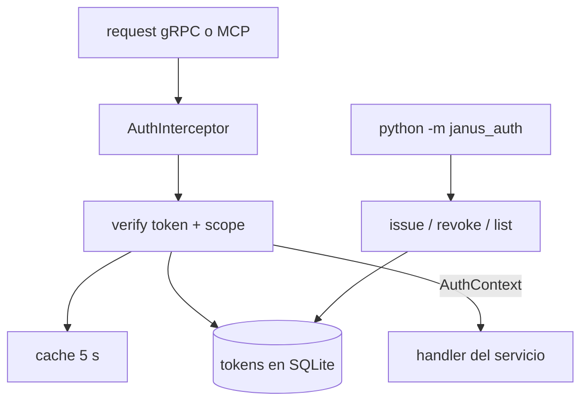

# Feature Spec: libs/auth/ (tokens scopeados)

> **Status**: Ready for implementation
> **Last updated**: 2026-09-19
> **Orden de implementación**: 5 de 15. Depende de: spec 03 (tabla `tokens`).

---

## Objective

Construir el sistema propio de tokens scopeados que protege el Core de Traducción (`stack/08` sección 1): generación, hash, verificación y revocación, más la comprobación de scopes.

MCP no define autenticación en su especificación base, y "es localhost" no es suficiente (decisión explícita de `stack/08`). Una vez implementada, cada request entrante al Core de Traducción se autentica y autoriza antes de tocar el Registro de Capacidades.

---

## Functional Requirements

### Formato y generación
1. Un token tiene el formato `jns_<token_id>.<secret>`. `token_id` son 12 caracteres base32 en minúsculas; `secret` son 32 bytes aleatorios de `secrets.token_bytes` codificados en base64 URL seguro sin relleno.
2. `issue_token(name, kind, scopes, ttl=None) -> IssuedToken` devuelve el token completo una sola vez. En almacenamiento solo queda `token_id`, `secret_hash`, `scopes`, `kind`, `created_at` y `expires_at`.
3. `kind` es `internal` (harnesses base, scope total, se emite al arrancar y vive en memoria o en un archivo `0600`) o `external` (spokes y clientes, generado por el usuario).
4. El hash del secreto es SHA 256 con sal por token (`sha256(salt || secret)`), y la sal se guarda junto al hash. La comparación usa `hmac.compare_digest`.

### Verificación
5. `verify(token_string, required_scope) -> AuthContext` parsea, busca por `token_id`, valida hash, expiración y revocación, y comprueba el scope. Devuelve `AuthContext(token_id, kind, name, scopes)`.
6. Fallos distinguibles: `TokenMalformed`, `TokenUnknown`, `TokenExpired`, `TokenRevoked`, `ScopeDenied`. Hacia afuera, el servidor los reduce a `UNAUTHENTICATED` (los cuatro primeros) o `PERMISSION_DENIED` (`ScopeDenied`) sin revelar cuál ocurrió.
7. La verificación de un `token_id` desconocido tarda lo mismo que la de uno conocido con secreto incorrecto (se compara contra un hash señuelo) para no filtrar existencia por tiempo.
8. Se actualiza `last_used_at` como máximo una vez por minuto por token para no escribir en cada request.

### Scopes
9. Formato `recurso:accion` con comodín opcional: `registry:register`, `capability:invoke:<glob de capability_id>`, `observe:read`, `control:write`, `channel:bridge`, `admin:*`. El token interno tiene `admin:*`.
10. `capability:invoke:reasoning.*` autoriza invocar cualquier capacidad que coincida con el glob. Sin un scope explícito de invocación, un spoke externo no puede pedir nada al núcleo.
11. El scope `control:write` no lo posee ningún token de canal por defecto. Los comandos de control que llegan por un canal de mensajería se autorizan por identidad del remitente (spec 11), no por token.

### Gestión
12. `revoke(token_id)` es inmediata; el verificador consulta el estado de revocación en cada llamada (hay caché de 5 s con invalidación al revocar en el mismo proceso).
13. `list_tokens()` devuelve metadatos sin `secret_hash`. `rotate(token_id)` emite un token nuevo con los mismos scopes y revoca el anterior tras un periodo de gracia configurable.
14. Helper para gRPC: `AuthInterceptor` (aio) que lee el metadato `authorization: Bearer <token>`, exige el scope por RPC según un mapa `metodo -> scope` y adjunta el `AuthContext` al contexto del handler. Helper equivalente para el servidor MCP HTTP.
15. CLI mínima: `python -m janus_auth issue|list|revoke` para que el usuario gestione tokens externos sin GUI.

---

## Non-Functional Requirements

* **Performance**: `verify` con caché caliente menor a 200 microsegundos p95; con acceso a SQLite menor a 3 ms p95 en Raspberry Pi 4. Objetivo propuesto, se ajusta tras medir.
* **Security**: el token completo no se persiste ni se loguea; los secretos nunca aparecen en excepciones; comparación en tiempo constante; sin tokens en URLs (solo cabecera o metadato).
* **Reliability**: si la base no responde, `verify` falla cerrado (deniega). El token interno sigue válido en memoria para que los harnesses base no se caigan durante un fallo de disco.
* **Portability**: Python 3.11 o superior; solo stdlib más `janus_persistence`. Prohibido importar `libs/adapters`, `libs/capabilities` y `apps/*`.

---

## Technical Decisions

### SHA 256 con sal en lugar de un KDF lento
* **Chosen**: SHA 256 con sal por token y comparación en tiempo constante.
* **Reason**: los secretos son de 256 bits generados por máquina, no contraseñas humanas; un KDF lento (argon2, bcrypt) no aporta resistencia real y encarecería cada request en un Raspberry Pi.
* **Rejected alternatives**: argon2 o bcrypt (costo por request sin beneficio con entropía alta); token opaco sin hash (un dump de la base expondría credenciales).

### Prefijo `jns_` e identificador visible
* **Chosen**: prefijo fijo y `token_id` legible.
* **Reason**: permite a escáneres de secretos detectar fugas, y al usuario identificar y revocar un token sin conocer el secreto.
* **Rejected alternatives**: token completamente opaco (sin trazabilidad).

### Autorización por scope de capacidad con glob
* **Chosen**: `capability:invoke:<glob>`.
* **Reason**: el modelo semántico es por capacidades (`architecture/04`), así que el permiso natural es por capacidad, no por endpoint.
* **Rejected alternatives**: roles fijos (no expresan qué capacidades puede pedir cada spoke).

### La identidad en canales no se resuelve con tokens
* **Chosen**: los tokens cubren el acceso de componentes y spokes; la identidad del remitente en un canal se verifica aparte (spec 11 y spec 14).
* **Reason**: la propia pregunta abierta 3 de `architecture/09` separa ambos problemas.

---

## Proposed Architecture

### Component Diagram


### Directory Structure
```
libs/auth/
  pyproject.toml
  src/janus_auth/
    __init__.py
    tokens.py        # issue_token, parse, hashing
    verify.py        # verify, AuthContext, errores
    scopes.py        # parseo, coincidencia con glob
    interceptor.py   # AuthInterceptor gRPC aio + helper MCP HTTP
    manager.py       # revoke, rotate, list
    __main__.py      # CLI
  tests/
```

---

## Data Models

```
Entity IssuedToken { token: str (solo al emitir), token_id, name, kind, scopes, expires_at? }
Entity AuthContext { token_id, kind, name, scopes: frozenset[str] }
Entity Scope       { resource: str, action: str, pattern?: str }
```

Almacenamiento: tabla `tokens` definida en la spec 03. La sal se guarda en `secret_hash` como `salt:hash` (ambos en hexadecimal).

---

## API Contracts

```
verify(token: str, required_scope: str) -> AuthContext
    raises TokenMalformed | TokenUnknown | TokenExpired | TokenRevoked | ScopeDenied
issue_token(name: str, kind: str, scopes: Sequence[str], ttl: timedelta | None) -> IssuedToken
revoke(token_id: str) -> None
rotate(token_id: str, grace: timedelta) -> IssuedToken

gRPC: metadato  authorization: Bearer jns_<id>.<secret>
Errores hacia afuera:
  UNAUTHENTICATED   - token ausente, malformado, desconocido, expirado o revocado
  PERMISSION_DENIED - scope insuficiente para el RPC
```

Mapa de scopes por RPC (fuente: spec 01): `SpokeGateway.Register` requiere `registry:register`; `SpokeGateway.RequestCapability` requiere `capability:invoke:<capability_id>`; `ChannelBridge.Stream` requiere `channel:bridge`; `Control.*` requiere `control:write`; `Observe.*` requiere `observe:read`.

---

## Edge Cases

| Case | How to Handle |
|---|---|
| Token de un spoke revocado con invocaciones en curso | Las invocaciones ya autorizadas terminan; las siguientes fallan `UNAUTHENTICATED`. Se notifica al Registro para retirar al spoke. |
| Reloj del sistema con salto | La expiración compara contra UTC; un salto hacia atrás no resucita tokens ya expirados porque se marca `revoked_at` al detectarlos. |
| Muchos requests con tokens inválidos | Límite de intentos por origen (10 fallos por minuto) con respuesta uniforme; se registra y se alerta. |
| Formato `jns_` inválido | `TokenMalformed` sin acceso a la base. |
| Token interno perdido tras reinicio | Se emite uno nuevo al arrancar; los harnesses lo reciben por variable de entorno del proceso o archivo `0600`. |
| Base de datos caída | `verify` deniega (falla cerrado); el token interno sigue válido en memoria. |
| Rotación con spoke aún usando el token viejo | Periodo de gracia configurable (default 10 minutos). |

---

## Testing Requirements

**Unit Tests**: formato y parseo; hash con sal y comparación; coincidencia de scopes con glob (aciertos y rechazos); expiración; revocación con y sin caché; respuesta uniforme para token desconocido; límite de intentos; rotación con gracia.

**Integration Tests**: interceptor gRPC con un servicio de juguete y tokens de distintos scopes; caída de la base y comportamiento cerrado; CLI de extremo a extremo (emitir, listar, revocar).

---

## Security Checklist
- [ ] Secretos con 256 bits de entropía generados con `secrets`
- [ ] Hash con sal y comparación en tiempo constante
- [ ] Token completo mostrado una sola vez y nunca logueado
- [ ] Falla cerrada ante error de almacenamiento
- [ ] Respuesta uniforme que no distingue token desconocido de secreto incorrecto
- [ ] Permisos `0600` del archivo del token interno
- [ ] Tokens solo por cabecera o metadato, jamás en URL

---

## Open Questions
- [ ] Almacenamiento del token interno: variable de entorno heredada por los procesos hijos frente a archivo `0600`. Se propone archivo `0600` bajo `state_dir` porque `channel-gateway` es un proceso separado.
- [ ] Duración por defecto de tokens externos (propuesta: sin expiración, con revocación manual).

---

## Handoff Note
Revisar esta spec antes de empezar. Crear un checklist desde los requisitos funcionales y marcarlo al avanzar. Levantar dudas antes de codificar, no durante. Implementar `tokens.py`, `scopes.py` y `verify.py` primero; el interceptor y la CLI después.
