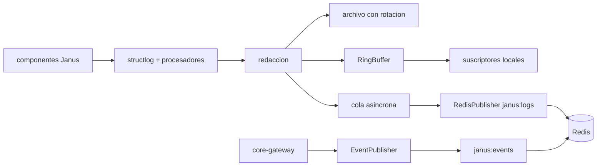

# Feature Spec: libs/observability/ (logging estructurado, ring buffer y Redis pub/sub)

> **Status**: Ready for implementation
> **Last updated**: 2026-09-19
> **Orden de implementación**: 6 de 15. Depende de: spec 02 (configuración, solo por parámetros, sin importarla).

---

## Objective

Construir la pieza de observabilidad transversal (`stack/08` sección 2): logs estructurados, rotación en disco, ring buffer en memoria y publicación por Redis pub/sub. Además, el publicador de eventos de estado que exige `architecture/07` sección 3 (eventos push, no solo consulta).

Una vez implementada, cualquier cliente (una GUI futura, una CLI) se suscribe al stream de logs y de estado sin acoplarse al proceso de `core-gateway`, y todos los componentes loguean con el mismo formato.

---

## Functional Requirements

### Logging
1. `configure_logging(cfg: LoggingConfig) -> None` configura `structlog` con salida JSON lines. Campos obligatorios por línea: `ts` (UTC ISO 8601), `level`, `event`, `component`, más el contexto ligado.
2. Contexto ligado por `contextvars`: `request_id`, `session_id`, `task_id`, `spoke_id`, `agent_name`, `role`. `bind_context(**kw)` funciona como context manager y se propaga a tareas asyncio hijas.
3. Rotación en disco con `RotatingFileHandler` (por tamaño, default 10 MiB y 5 copias) o `TimedRotatingFileHandler`, según `LoggingConfig.rotation`.
4. Redacción: un procesador enmascara valores de claves sensibles (`authorization`, `token`, `secret`, `api_key`, `password`) y trunca cualquier valor de texto mayor a 2000 caracteres. Los payloads completos no se loguean a nivel INFO.
5. Procesador de `SecretStr` y `SecretRef`: siempre se renderizan como `***`.

### Ring buffer
6. `RingBuffer(maxlen=5000)` (basado en `collections.deque(maxlen=N)`) guarda las últimas líneas ya redactadas. Expone `snapshot(filter=None)` y `subscribe()` (`AsyncIterator`) para consumidores locales.
7. Un suscriptor lento no bloquea el logging: cada suscriptor tiene una cola acotada de 1000 y, si se llena, se descartan los más antiguos y se cuenta en `dropped`.

### Redis pub/sub
8. `RedisPublisher(url, channels)` publica cada línea de log en el canal `janus:logs` y cada evento de estado en `janus:events`. Usa `redis.asyncio`.
9. Con Redis caído o deshabilitado, el sistema sigue funcionando: los logs van a disco y al ring buffer, los fallos de publicación se cuentan y se reintenta la conexión con backoff exponencial acotado (máximo 30 s). Nunca se bloquea el hilo de logging.
10. Los mensajes publicados son JSON con `schema_version`, para que los clientes toleren cambios.

### Eventos de estado (`architecture/07` sección 3)
11. `EventPublisher` (ABC) con `publish(event: StateEvent)`. Implementaciones: `RedisEventPublisher` y `InMemoryEventPublisher` (fallback y pruebas).
12. `StateEvent` tiene `kind` (`task.changed`, `session.changed`, `spoke.connected`, `spoke.disconnected`, `spoke.health`, `capability.changed`, `queue.changed`, `preference.changed`), `subject_id`, `payload` (dict serializable), `at`. La generación del evento es responsabilidad del núcleo; esta librería solo lo transporta.

### Métricas mínimas
13. Contadores en memoria consultables (`get_counters()`): líneas por nivel, líneas descartadas por suscriptor lento, fallos de publicación Redis, tamaño actual del ring buffer.

---

## Non-Functional Requirements

* **Performance**: el costo de una llamada de log (procesadores más encolado) menor a 100 microsegundos p95 en Raspberry Pi 4; la escritura a disco y a Redis es asíncrona y no bloquea al llamador. Objetivo propuesto, se ajusta tras medir.
* **Security**: redacción por defecto de credenciales; sin payloads completos a INFO; el ring buffer y el stream de Redis pasan por el mismo procesador de redacción que el archivo.
* **Reliability**: Redis es opcional y su caída es un estado esperado, no un error fatal; el logging a disco nunca depende de Redis; memoria acotada en todos los buffers.
* **Portability**: Python 3.11 o superior. Dependencias permitidas: `structlog` y `redis` (asyncio). Prohibido importar `libs/config`, `libs/persistence`, `libs/adapters` y `apps/*`; recibe una dataclass de configuración por parámetro.

---

## Technical Decisions

### `structlog` con JSON lines
* **Chosen**: `structlog` con renderizador JSON.
* **Reason**: decisión de `stack/08`; estándar de facto para logging estructurado en Python.

### Redis solo para transporte efímero
* **Chosen**: pub/sub sin persistencia y sin dependencia dura.
* **Reason**: `stack/03` sección 5 reserva Redis para estado efímero; el archivo de log en disco es la fuente de verdad de los logs.
* **Rejected alternatives**: Redis Streams (persistencia que el diseño no pide); publicar directamente desde cada componente (acopla a Redis).

### Cola por suscriptor con descarte del más antiguo
* **Chosen**: cola acotada por suscriptor con pérdida controlada y contada.
* **Reason**: un cliente lento nunca debe ralentizar el núcleo; la pérdida de líneas de log en un cliente es preferible a contrapresión sobre el proceso principal.
* **Rejected alternatives**: contrapresión hacia el productor (bloquea el núcleo).

### Canales fijos con esquema versionado
* **Chosen**: `janus:logs` y `janus:events` con `schema_version`.
* **Reason**: una GUI futura debe poder evolucionar sin romper suscriptores.

---

## Proposed Architecture

### Component Diagram


### Directory Structure
```
libs/observability/
  pyproject.toml
  src/janus_observability/
    __init__.py
    logging.py       # configure_logging, bind_context, procesadores
    redaction.py     # enmascarado y truncado
    ring_buffer.py
    redis_pub.py     # RedisPublisher, reconexión con backoff
    events.py        # StateEvent, EventPublisher, implementaciones
    counters.py
  tests/
```

---

## Data Models

```
Entity LoggingConfig { level, log_dir, file_name, rotation: {mode: size|time, max_bytes, backups, when},
                       ring_buffer_size, redis: {enabled, url, logs_channel, events_channel} }
Entity LogLine       { ts, level, event, component, request_id?, session_id?, task_id?, spoke_id?,
                       agent_name?, role?, extra: dict }
Entity StateEvent    { schema_version: int, kind: str, subject_id: str, payload: dict, at: datetime }
```

---

## API Contracts

Librería; el contrato externo es el formato de los mensajes de Redis.

```
Canal Redis: janus:logs     Mensaje: JSON { schema_version, ts, level, event, component, ...contexto }
Canal Redis: janus:events   Mensaje: JSON { schema_version, kind, subject_id, payload, at }
Sin autenticación propia: se apoya en la de Redis (requirepass o red loopback)
```

---

## Edge Cases

| Case | How to Handle |
|---|---|
| Redis caído al arrancar | El logging arranca sin Redis; reconexión en segundo plano con backoff; contador de fallos. |
| Redis se cae en ejecución | Se descartan publicaciones con contador; no se acumulan mensajes sin límite. |
| Suscriptor local lento | Cola acotada con descarte del más antiguo y contador `dropped`. |
| Valor gigante en un log | Truncado a 2000 caracteres con marca `[truncated N]`. |
| Objeto no serializable a JSON | Se renderiza con `repr` acotado; nunca lanza desde el logging. |
| Disco lleno | Se sigue al ring buffer y a Redis; se emite una advertencia única y se cuenta el fallo. |
| Log desde un hilo (por ejemplo `asyncio.to_thread`) | El procesador es seguro entre hilos; el contexto se propaga de forma explícita al hilo. |

---

## Testing Requirements

**Unit Tests**: formato JSON y campos obligatorios; redacción de claves sensibles y de `SecretStr`; truncado; propagación de contexto entre tareas; ring buffer con desbordamiento; cola de suscriptor con descarte; serialización de eventos con `schema_version`.

**Integration Tests**: rotación real de archivos; publicación a un Redis efímero con un suscriptor; caída y recuperación de Redis sin bloquear el logging; carga de 10 000 líneas por segundo con un suscriptor lento y verificación de memoria acotada.

---

## Security Checklist
- [ ] Redacción de credenciales en archivo, ring buffer y Redis por el mismo camino
- [ ] Sin payloads completos a nivel INFO
- [ ] Buffers y colas acotados en todo el flujo
- [ ] Redis con `requirepass` o solo loopback (documentado en la guía de despliegue)
- [ ] Sin dependencia dura de Redis para funcionar

---

## Open Questions
- [ ] Nivel de detalle de los eventos de estado que la GUI futura necesitará (se refinan con la spec 11).
- [ ] Política de retención de archivos de log (propuesta: 5 copias de 10 MiB, ajustable).

---

## Handoff Note
Revisar esta spec antes de empezar. Crear un checklist desde los requisitos funcionales y marcarlo al avanzar. Levantar dudas antes de codificar, no durante. Implementar `logging.py` y `redaction.py` antes que el publicador de Redis, para que el resto de las librerías puedan loguear desde temprano.
