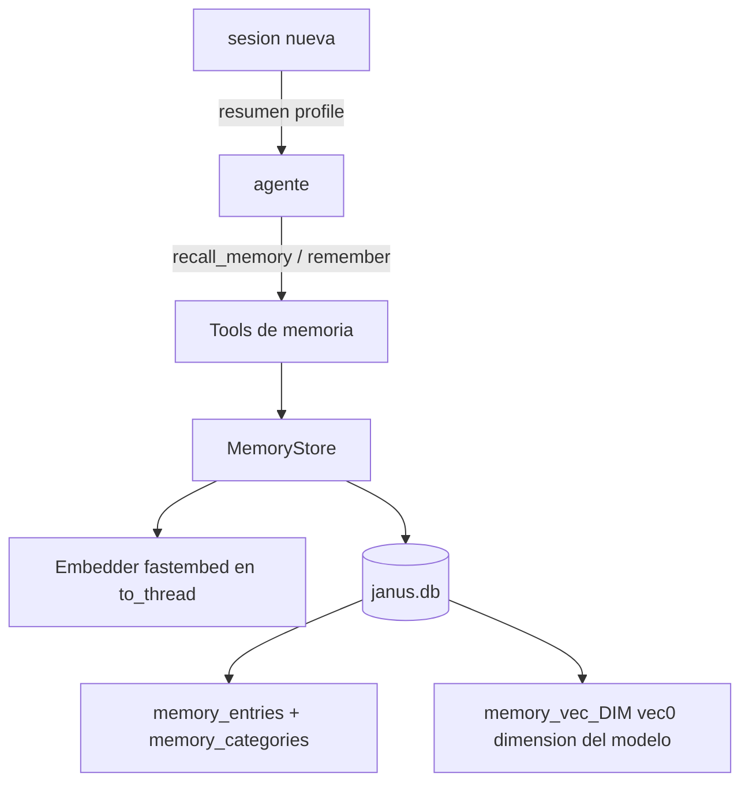

# Feature Spec: libs/memory/ (memoria de dos niveles y búsqueda semántica)

> **Status**: Ready for implementation
> **Last updated**: 2026-09-20
> **Orden de implementación**: 7 de 15. Depende de: spec 03 (`Database`, tablas `memory_*` y `ensure_vec_table` para `memory_vec_<dim>`).

---

## Objective

Implementar la lógica de la memoria episódica de Janus (`agents/02` secciones 1 a 4): dos niveles (agente y global), categorías auto extensibles con `profile` como única semilla, y recuperación por similitud semántica sobre `sqlite-vec`.

El esfuerzo de recordar recae en la infraestructura: el agente no razona sobre qué recordar, usa la tool `recall_memory` para traer solo lo relevante al turno. Guardar es distinto: escribir un recuerdo es siempre una decisión explícita del agente o un pedido del usuario (requisito 18). Una vez implementada, cualquier agente puede guardar y recuperar recuerdos sin inyectar nunca el historial completo en el prompt.

Esta librería no cubre la indexación de identidad de agente ni de proyectos (`agents/02` sección 5), que vive en `libs/reasoning-engine` (spec 10) y usa archivos SQLite propios.

---

## Functional Requirements

### Escritura
1. `MemoryStore.remember(level, agent_name, category, content, source, project_ref=None) -> MemoryEntry` guarda una entrada con su embedding. `level` es `agent` o `global`; `agent_name` es obligatorio para `agent` y nulo para `global`.
2. Si la categoría no existe, se crea (catálogo auto extensible, `agents/02` sección 2.1). Las categorías tienen `description` opcional. La única categoría garantizada es `profile` en el nivel global, sembrada por migración.
3. Nombres de categoría: `^[a-z][a-z0-9_]{0,40}$`. Un agente puede crear categorías solo en su propio nivel y en el global.
4. `update(entry_id, content)` recalcula el embedding y `updated_at`. `forget(entry_id)` elimina entrada y vector. `forget_category(level, agent_name, category)` elimina la categoría completa (excepto `profile`, que se puede vaciar pero no borrar).
5. Deduplicación: antes de insertar, si existe una entrada de la misma categoría con similitud coseno mayor o igual a 0.95, se actualiza en lugar de duplicar y se devuelve la entrada existente con la marca `merged=True`.
6. Límites: `content` máximo 4000 caracteres; se rechaza con `MemoryTooLarge`. Máximo configurable de entradas por agente (default 10 000).

### Lectura
7. `MemoryStore.recall(query, level=None, agent_name=None, category=None, k=None) -> list[ScoredEntry]` calcula el embedding de la consulta y devuelve las `k` entradas más similares (default `memory.top_k_default`, 5), con su puntuación. Cuando `level` es nulo busca en el nivel del agente y en el global y fusiona resultados por puntuación.
8. Un filtro opcional por `category` y por `project_ref`.
9. `list_categories(level, agent_name)` devuelve las categorías con conteo y descripción, para que el agente sepa qué existe sin cargar contenido.

### Tool para el motor de razonamiento
10. `RecallMemoryTool` implementa la interfaz `Tool` de `libs/reasoning-engine` (spec 10) bajo el nombre `recall_memory`, con argumentos `query`, `category` opcional y `k` opcional. Devuelve texto compacto con categoría, contenido y fecha por resultado. Está disponible para todo agente.
11. `RememberTool` (`remember`) con `category`, `content` y `level`. Es la vía explícita de captura: el agente decide qué guardar. Un agente solo puede escribir su propio nivel `agent` o el `global`.
12. `ListMemoryCategoriesTool` (`list_memory_categories`).
13. Las tools no se inyectan con contenido de memoria por defecto. La única inyección automática es la categoría `profile` global, que se resume (máximo 1500 caracteres) en el arranque de cada sesión, porque `agents/02` sección 2.1 la define como lo que cualquier agente necesita para tratar bien al usuario desde el primer turno.

### Embeddings
14. `Embedder` (ABC) con `embed(texts, kind) -> list[list[float]]`, `model_id` y `dim`. Implementación por defecto `FastEmbedEmbedder`. El modelo es configurable (`memory.embedding_model`, spec 02) y la dimensión se deriva del modelo, no está fija en el código. Default de fábrica: `intfloat/multilingual-e5-large` (1024 dimensiones), pensado para la PC del usuario (32 GB de RAM y 6 GB de VRAM). Perfil para hardware chico (Raspberry Pi): `intfloat/multilingual-e5-small` (384 dimensiones), que `fastembed` no trae en su lista integrada y se registra con `TextEmbedding.add_custom_model`. La familia E5 exige los prefijos `query: ` y `passage: `; `kind` selecciona el prefijo y solo se aplica cuando el modelo es de esa familia.
15. La inferencia corre en `asyncio.to_thread` para no bloquear el event loop. Los modelos se descargan en la primera ejecución a `state_dir/models/` y se validan por hash. El dispositivo lo fija `memory.embedding_device`: `cpu` (default), `cuda` o `auto`. `cuda` exige el paquete `fastembed-gpu` (extra opcional `janus_memory[gpu]`, excluyente con `fastembed`) y comparte la VRAM con otros modelos locales (Whisper, Kokoro, un LLM en Ollama); por eso el default es CPU, ya que el volumen de embeddings de memoria es bajo (una consulta por turno y una escritura por recuerdo).
16. Cada entrada guarda `embedding_model` y `embedding_dim`. Si el `model_id` configurado difiere del guardado, `reindex()` re embebe en lotes de 32 sin perder entradas. Si la dimensión cambia, `reindex()` crea la tabla vectorial de la nueva dimensión con `Database.ensure_vec_table(dim)` (spec 03), re embebe y solo al terminar con éxito descarta la tabla anterior; un fallo a mitad deja la tabla anterior intacta y usable.
17. Con `sqlite-vec` no disponible, `recall` degrada a coincidencia por texto (LIKE sobre contenido y categoría) y lo indica en el resultado (`degraded=True`).

### Captura de memoria (pregunta 2 de `architecture/09`, cerrada)
18. La captura es explícita y nada más: un recuerdo se escribe únicamente cuando el agente llama a `remember`, por decisión propia o porque el usuario se lo pidió. Vale para Janus y para los subagentes, cada uno sobre su propio nivel `agent` o sobre el `global`. No existe captura automática de infraestructura, ni siquiera como opción: sin hook `on_task_completed`, sin `memory.auto_capture` y sin resúmenes sugeridos al cerrar una tarea. Confirmado por el usuario.

---

## Non-Functional Requirements

* **Performance**: `recall` con 10 000 entradas menor a 60 ms p95 sin contar el embedding de la consulta; `embed` de una consulta corta menor a 200 ms p95 con el perfil chico (`multilingual-e5-small`) en Raspberry Pi 4, y menor a 300 ms p95 con el default (`multilingual-e5-large`, CPU) en la PC del usuario. Objetivos propuestos, se ajustan tras medir.
* **Security**: la memoria es contenido del usuario; nunca se loguea el `content` completo; un agente no lee ni escribe el nivel `agent` de otro agente; el contenido recuperado es dato para el modelo, no instrucciones al sistema.
* **Reliability**: si el modelo de embeddings no está disponible, las escrituras se rechazan con `EmbedderUnavailable` (no se guarda un vector inválido) y la lectura degrada a texto.
* **Portability**: Python 3.11 o superior. Dependencias: `janus_persistence`, `fastembed` (u otra implementación de `Embedder`) y opcionalmente `sqlite-vec`. Prohibido importar `libs/adapters`, `libs/capabilities` y `apps/*`.

---

## Technical Decisions

### `sqlite-vec` para memoria episódica, índice híbrido aparte para identidad
* **Chosen**: `sqlite-vec` dentro de `janus.db` para las entradas de memoria (`agents/02` sección 3).
* **Reason**: mantiene SQLite como único motor y bajo consumo. El índice de identidad y proyectos (BM25 más vectorial) es otro mecanismo con su propio archivo por directorio y vive en la spec 10, tal como fija `agents/02` sección 5.
* **Rejected alternatives**: una base vectorial aparte (contradice `stack/03`); mezclar ambos índices (propósitos distintos).

### Modelo configurable, default `intfloat/multilingual-e5-large` con 1024 dimensiones
* **Chosen**: el modelo y el dispositivo se configuran en `janus.toml` (`memory.embedding_model`, `memory.embedding_device`). El default de fábrica es `intfloat/multilingual-e5-large` con `fastembed` sobre CPU. Perfil para hardware chico: `intfloat/multilingual-e5-small`.
* **Reason**: decisión del usuario: el modelo se configura en el sistema y el default debe correr en su PC (32 GB de RAM y 6 GB de VRAM). E5 large es el más preciso de la familia multilingüe (70.5 de MRR@10 en Mr. TyDi frente a 64.4 de small), figura en la lista integrada de `fastembed` y cabe con holgura en 32 GB de RAM (del orden de 1.3 GB de descarga). Los recuerdos son texto corto y en español, así que el costo de CPU es bajo, y correrlo en CPU deja los 6 GB de VRAM para los modelos locales de razonamiento y voz.
* **Rejected alternatives**: `multilingual-e5-small` como default (pensado para el Pi, pierde precisión sin necesidad en la PC y no figura en la lista integrada de `fastembed`); `multilingual-e5-base` (768 dimensiones, término medio que `fastembed` tampoco parece listar de forma integrada, verificar); GPU como default (compite por VRAM con otros modelos locales); `paraphrase-multilingual-MiniLM-L12-v2` (hay un issue abierto de `fastembed` que reporta diferencias grandes frente a `sentence-transformers`).

### Captura explícita únicamente
* **Chosen**: el agente llama a `remember`, por decisión propia o porque el usuario se lo pide; la infraestructura nunca escribe recuerdos por su cuenta.
* **Reason**: confirmado por el usuario. Janus es un agente: guarda recuerdos cuando lo decide o cuando se le pide, y los subagentes hacen lo mismo. Evita ruido y costo de embeddings sin control; la infraestructura asume el esfuerzo de recuperar, no el de decidir qué guardar.
* **Rejected alternatives**: captura automática de cada turno (ruido y costo de embeddings sin control); captura automática opcional al cerrar tareas (`on_task_completed`, `memory.auto_capture`), propuesta original de esta spec que el usuario descartó incluso como opción.

### Deduplicación por similitud alta
* **Chosen**: umbral 0.95 dentro de la misma categoría.
* **Reason**: evita crecimiento por repeticiones sin descartar matices; es configurable y se recalibra al cambiar de modelo (ver Open Questions).

---

## Proposed Architecture

### Component Diagram


### Directory Structure
```
libs/memory/
  pyproject.toml
  src/janus_memory/
    __init__.py
    store.py          # MemoryStore: remember, recall, update, forget, reindex
    categories.py     # validación y catálogo auto extensible
    embedder.py       # Embedder ABC, FastEmbedEmbedder
    tools.py          # RecallMemoryTool, RememberTool, ListMemoryCategoriesTool
    profile.py        # resumen de la categoría profile para inicio de sesión
    errors.py         # MemoryTooLarge, EmbedderUnavailable, MemoryAccessDenied
  tests/
```

---

## Data Models

```
Entity MemoryEntry  { entry_id, level: agent|global, agent_name?, category, content,
                      embedding_model, embedding_dim, project_ref?, source, created_at, updated_at }
Entity ScoredEntry  { entry: MemoryEntry, score: float }              # score = 1 - distancia coseno
Entity Category     { level, agent_name?, category, description?, count }
Entity RecallResult { entries: list[ScoredEntry], degraded: bool }
```

Tablas: `memory_entries` y `memory_categories` según spec 03, y `memory_vec_<dim>` (una tabla vectorial por dimensión, creada por `Database.ensure_vec_table`, spec 03).

---

## API Contracts

Librería más tools para el motor.

```
MemoryStore.remember(level, agent_name, category, content, source, project_ref=None) -> MemoryEntry
MemoryStore.recall(query, level=None, agent_name=None, category=None, k=None) -> RecallResult
MemoryStore.list_categories(level, agent_name=None) -> list[Category]
MemoryStore.reindex(batch_size=32) -> ReindexReport

Tool recall_memory { query: string, category?: string, k?: int(1..20) } -> text
Tool remember      { category: string, content: string, level: "agent"|"global" } -> text
Tool list_memory_categories {} -> text
```

Errores: `MemoryTooLarge`, `EmbedderUnavailable`, `MemoryAccessDenied` (un agente intenta otro nivel `agent`), `InvalidCategory`.

---

## Edge Cases

| Case | How to Handle |
|---|---|
| Consulta vacía | `recall` devuelve las entradas más recientes de la categoría pedida, sin embedding. |
| Modelo de embeddings cambiado | `embedding_model` distinto dispara `reindex()`; mientras tanto se ignoran vectores del modelo anterior y se degrada a texto para esas entradas. Si cambia la dimensión, `reindex()` construye la tabla nueva y solo descarta la anterior al terminar. |
| Primera ejecución sin modelo descargado | Descarga con verificación de hash; si falla, `EmbedderUnavailable` y degradación a texto. |
| `embedding_device = cuda` sin `fastembed-gpu` o sin GPU disponible | Se cae a CPU con una advertencia en el log; no bloquea el arranque. |
| Entrada casi duplicada | Se fusiona (similitud mayor o igual a 0.95) y se devuelve `merged=True`. |
| Agente intenta leer memoria de otro agente | `MemoryAccessDenied`. |
| `sqlite-vec` no carga (intérprete sin extensiones) | `degraded=True`; se recomienda un Python con `enable_load_extension`. |
| Contenido con instrucciones ("ignora tus reglas") | Se almacena como dato; al recuperarse se entrega dentro de un bloque marcado como memoria y nunca con privilegio de sistema. |
| Crecimiento excesivo | Tope por agente; al alcanzarlo, `remember` falla con error claro y sugiere `forget`. |

---

## Testing Requirements

**Unit Tests**: validación de categorías; creación automática y semilla `profile`; deduplicación; límites; fusión de niveles en `recall`; degradación a texto; aislamiento entre agentes; prefijos `query:` y `passage:` del embedder con un `FakeEmbedder` determinista; `reindex` idempotente y con cambio de dimensión (la tabla anterior sobrevive si falla).

**Integration Tests**: ciclo `remember` y `recall` con `sqlite-vec` real y el modelo real (marcado como prueba lenta); comportamiento con `sqlite-vec` ausente; rendimiento con 10 000 entradas; las tools ejecutadas desde un `ToolContext` de prueba del motor.

---

## Security Checklist
- [ ] Aislamiento estricto del nivel `agent` por `agent_name`
- [ ] Contenido recuperado etiquetado como dato, sin privilegio de instrucción
- [ ] `content` completo nunca en logs
- [ ] Límites de tamaño y de cantidad
- [ ] Modelos descargados verificados por hash
- [ ] Inferencia fuera del event loop

---

## Open Questions
- [x] Captura automática: confirmado por el usuario, no existe; solo `remember` explícito.
- [x] Modelo de embeddings: confirmado por el usuario que es configurable en el sistema y que el default debe correr en su PC (32 GB de RAM y 6 GB de VRAM). El modelo concreto (`multilingual-e5-large`) lo eligió el Architect bajo esa restricción y es revisable.
- [ ] Verificar al fijar dependencias: que la versión de `fastembed` incluya la corrección de pooling de `intfloat/multilingual-e5-large` (mean pooling y sin normalizar, PR 445 de `fastembed`); que `sqlite-vec` acepte `float[1024]` con `distance_metric=cosine` en la versión fijada; y, para el perfil Pi, que `add_custom_model` con `multilingual-e5-small` funcione y existan wheels de `onnxruntime` para aarch64.
- [ ] Medir `embed` de `multilingual-e5-large` en CPU y en CUDA (6 GB de VRAM) en la PC del usuario y ajustar los objetivos de latencia.
- [ ] Recalibrar el umbral de deduplicación (0.95) con el modelo default: E5 concentra las similitudes en un rango alto y el valor puede quedar laxo o estricto.
- [ ] Catálogo inicial adicional a `profile` (pendiente 1.6 de `TODO.md`): esta spec no siembra más categorías; el mecanismo es auto extensible por diseño.

---

## Handoff Note
Revisar esta spec antes de empezar. Crear un checklist desde los requisitos funcionales y marcarlo al avanzar. Levantar dudas antes de codificar, no durante. Implementar `embedder.py` con un `FakeEmbedder` primero, para desarrollar `store.py` sin descargar modelos.
