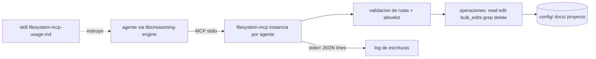

# Feature Spec: crates/filesystem-mcp/ (fork de un filesystem MCP en Rust) y skill de uso

> **Status**: Ready for implementation, con una condición previa bloqueante (ver requisito 1)
> **Last updated**: 2026-09-19
> **Orden de implementación**: 8 de 15. Independiente del resto; puede hacerse en paralelo a las specs 2 a 7.

---

## Objective

Entregar el servidor MCP de filesystem que usan los agentes de Janus para leer y editar archivos, incluida la configuración de otros agentes (`agents/03` sección 2), más el skill obligatorio que enseña a un modelo a usarlo bien.

Una vez implementado, un agente puede listar, leer, buscar con regex, editar en lote con vista previa, mover y borrar dentro de directorios permitidos, sin que un modelo se confunda con su propio sistema de edición (problema real observado con el MCP oficial).

Esta spec corrige un supuesto de la documentación: `stack/02` y `agents/03` dicen que el fork agrega `delete_path` recursivo. Verificado en septiembre de 2026, el upstream ya lo trae. El delta real del fork es menor y debe medirse contra el upstream fijado (requisito 2).

---

## Functional Requirements

### Preparación y procedencia
1. **Bloqueante, primera tarea**: confirmar la licencia de la base elegida. `ssoj13/filesystem-mcp-rs` es la base decidida en `stack/02`, pero la verificación de esta spec no encontró un archivo de licencia visible en el repositorio Rust (su hermano npm publica MIT). Sin licencia explícita, forkear y redistribuir no es legal. Si no hay licencia compatible con MIT, se contacta al autor para que la agregue o se cambia la base a `rust-mcp-stack/rust-mcp-filesystem`, cuya licencia MIT sí está verificada (Open Questions).
2. Se fija el commit exacto del upstream en `crates/filesystem-mcp/UPSTREAM.md`, con licencia, inventario de tools y auditoría del delta. La auditoría compara lo que ya existe contra la superficie requerida de abajo y solo se implementa lo que falta.
3. Se preserva el aviso de copyright del upstream y se añade el de Joanfer según `stack/10` sección 2.

### Superficie de tools requerida
4. Lectura: `read_text_file` (con `head` y `tail`), `read_media_file`, `read_multiple_files`, `list_directory`, `list_directory_with_sizes`, `get_file_info`, `directory_tree`, `list_allowed_directories`.
5. Escritura: `write_file`, `create_directory`, `move_file`, `copy_file` (archivos y directorios, con `overwrite`).
6. `edit_file`: ediciones por reemplazo exacto de texto, con salida en diff unificado y `dry_run`. Falla si el texto a reemplazar no aparece exactamente una vez, y devuelve el contexto que ayuda a corregir la llamada.
7. `bulk_edits`: lista de `{path, edits[]}` con `dry_run`. Es atómico entre archivos: se validan todas las ediciones antes de escribir; se escribe cada archivo en un temporal y se hace `rename`; si algo falla se revierte todo y se informa qué archivo falló y por qué.
8. `delete_path`: borrado de archivo o directorio. Un directorio no vacío exige `recursive = true`. Rechaza borrar una raíz permitida o un ancestro de una raíz. Admite `dry_run` que lista lo que se borraría.
9. `search_files`: búsqueda por nombre con glob y patrones de exclusión.
10. `grep_files`: búsqueda de contenido por regex con parámetros `pattern`, `path`, `include`, `exclude`, `context_lines`, `max_matches` (default 200) y `max_file_size`. Usa el crate `regex` de Rust (tiempo lineal, sin retroceso, sin riesgo de ReDoS). Omite archivos binarios y respeta la lista de directorios permitidos. Devuelve JSON estructurado con archivo, línea, texto y contexto.
11. Todas las respuestas de error son texto claro y accionable, con el argumento problemático y una sugerencia de corrección, pensadas para que un modelo reintente bien.

### Seguridad y modo de ejecución
12. Acceso solo dentro de directorios permitidos (`allowlist`). Toda ruta se canonicaliza antes de comprobar y se rechaza cualquier escape (`..`, enlaces simbólicos que salgan). El seguimiento de enlaces fuera de la lista es opt in (`--allow-symlink-escape`) y viene apagado.
13. Modo `--read-only` que desactiva todas las tools de escritura y de borrado.
14. Transporte `stdio` por defecto. Cada agente recibe su propia instancia con su propia lista de directorios (campo `filesystem_roots` en `agent.toml`, ver spec 02).
15. Límites: tamaño máximo de lectura por llamada (default 1 MiB, con paginación por `head`/`tail`/rango), máximo de resultados de `grep_files`, y profundidad máxima de `directory_tree`.
16. El servidor registra cada operación de escritura y de borrado (ruta, tipo, resultado) por stderr en JSON lines, sin contenido de archivos.

### Skill obligatorio
17. Se entrega `config/catalog/skills/filesystem-mcp-usage.md` junto con el crate. Es obligatorio en el `enabled_skills` de todo agente que reciba la tool (`agents/03` sección 2). Contenido mínimo:
    * Orden típico de llamadas: `list_allowed_directories`, `directory_tree` o `search_files`, `grep_files` para localizar, `read_text_file` antes de editar.
    * Cuándo usar `edit_file` (un archivo, pocos cambios) y cuándo `bulk_edits` (el mismo cambio en varios archivos).
    * Siempre `dry_run` antes de aplicar ediciones no triviales y revisar el diff.
    * Cómo corregir el error "texto no encontrado o ambiguo": ampliar el contexto hasta que sea único.
    * Reglas de rutas (absolutas, dentro de la lista permitida) y qué hacer ante un rechazo.
    * Reglas de borrado: `dry_run` primero, `recursive` solo si hace falta, nunca sobre raíces.
    * Tres ejemplos completos con llamadas y respuestas (editar un TOML de agente, renombrar un símbolo en varios archivos, limpiar un directorio).

---

## Non-Functional Requirements

* **Performance**: `grep_files` sobre 10 000 archivos pequeños menor a 2 s en Raspberry Pi 4; arranque del proceso menor a 100 ms; binario `release` menor a 15 MiB. Objetivos propuestos, se ajustan tras medir.
* **Security**: acceso confinado a la lista permitida, sin escape por enlaces por defecto, sin ejecución de comandos, sin red; escrituras atómicas; el modo solo lectura no puede saltarse. La entrada del modelo es no confiable: toda ruta y todo patrón se valida.
* **Reliability**: `bulk_edits` no deja archivos a medio editar; un fallo en una llamada no afecta al proceso; las lecturas de archivos grandes se acotan.
* **Portability**: Rust estable, sin dependencias de sistema en el binario, target aarch64 y x86_64 Linux. Sin indexación propia: la indexación vive en `libs/reasoning-engine` (`agents/02` sección 5).

---

## Technical Decisions

### Fork de un port Rust existente, con delta medido
* **Chosen**: fork del port en Rust ya decidido en `stack/02`, previa verificación de licencia y auditoría de delta.
* **Reason**: no reinventar (`Principio #2`); el upstream ya cubre `delete_path`, `copy_file`, `edit_file` con diff y `dry_run`, búsqueda glob y protección de rutas.
* **Rejected alternatives**: escribir un servidor desde cero (duplica trabajo ya resuelto); usar el MCP oficial de Node (sin borrado, búsqueda limitada y un runtime Node extra en el Pi).

### `regex` de Rust para `grep_files`
* **Chosen**: crate `regex` (autómatas, tiempo lineal).
* **Reason**: garantiza que un patrón enviado por un modelo no cuelgue el servidor.
* **Rejected alternatives**: motores con retroceso (riesgo de ReDoS).

### `bulk_edits` atómico con temporales y `rename`
* **Chosen**: validar todo, escribir a temporales en el mismo directorio y renombrar al final.
* **Reason**: `rename` en el mismo sistema de archivos es atómico y evita estados intermedios.
* **Rejected alternatives**: editar en sitio secuencialmente (deja estados parciales ante fallos).

### Una instancia por agente con su propia lista
* **Chosen**: un proceso stdio por agente, con `filesystem_roots` propio.
* **Reason**: aísla lo que cada agente puede tocar y evita un servidor global con permisos amplios.
* **Rejected alternatives**: una instancia compartida con permisos por token (más superficie y estado compartido).

---

## Proposed Architecture

### Component Diagram


### Directory Structure
```
crates/filesystem-mcp/
  Cargo.toml
  UPSTREAM.md            # commit fijado, licencia, inventario y delta
  LICENSE                # aviso del upstream y de Joanfer
  src/
    main.rs              # CLI y transporte MCP
    tools/               # un módulo por tool
    path.rs              # canonicalización y allowlist
    edit.rs  diff.rs     # ediciones y diff unificado
    bulk.rs              # bulk_edits atómico
    grep.rs              # grep_files
    audit.rs             # log de escrituras
  tests/
config/catalog/skills/filesystem-mcp-usage.md
```

---

## Data Models

```
Entity Edit        { old_text: string, new_text: string }
Entity BulkItem    { path: string, edits: Edit[] }
Entity GrepMatch   { path: string, line: uint, text: string, before: string[], after: string[] }
Entity AuditRecord { ts, op: "write"|"edit"|"bulk_edit"|"move"|"copy"|"delete", paths: string[], ok: bool, error?: string }
```

---

## API Contracts

```
Tool edit_file    { path, edits: Edit[], dry_run?: bool } -> diff unificado
Tool bulk_edits   { items: BulkItem[], dry_run?: bool }   -> diff por archivo | error con archivo y motivo
Tool delete_path  { path, recursive?: bool, dry_run?: bool } -> lista de rutas borradas o a borrar
Tool grep_files   { pattern, path?, include?: string[], exclude?: string[], context_lines?: uint,
                    max_matches?: uint, max_file_size?: uint } -> GrepMatch[]
Errores (texto): "PATH_NOT_ALLOWED", "TEXT_NOT_FOUND", "TEXT_AMBIGUOUS", "IS_ALLOWED_ROOT",
                 "NOT_EMPTY_NEEDS_RECURSIVE", "READ_ONLY", "TOO_LARGE" (cada uno con sugerencia)
```

Los nombres de las demás tools coinciden con los del MCP oficial de filesystem para preservar compatibilidad de protocolo.

---

## Edge Cases

| Case | How to Handle |
|---|---|
| Texto a reemplazar aparece más de una vez | `TEXT_AMBIGUOUS` con las líneas candidatas; el modelo amplía contexto. |
| Texto no aparece | `TEXT_NOT_FOUND` con las líneas más parecidas. |
| Un archivo de `bulk_edits` falla al final | Rollback total; se informa el archivo y el motivo. |
| `delete_path` sobre una raíz permitida o su ancestro | `IS_ALLOWED_ROOT`, sin borrar nada. |
| Enlace simbólico dentro de la lista que apunta afuera | Se rechaza por defecto (`--allow-symlink-escape` apagado). |
| Carrera entre comprobación y uso (TOCTOU) | Se abre por descriptor y se verifica la ruta canónica tras abrir; los escapes se detectan también en `rename`. |
| Archivo binario en `grep_files` | Se omite y se cuenta en un resumen final. |
| Archivo enorme | `TOO_LARGE` con sugerencia de leer por `head`, `tail` o rango. |
| Patrón regex inválido | Error con la posición del fallo. |
| Codificación no UTF 8 en `read_text_file` | Error claro y sugerencia de `read_media_file` para binarios. |

---

## Testing Requirements

**Unit Tests**: canonicalización y escape por `..` y enlaces; cada tool con caso feliz y de error; unicidad de reemplazo; diff correcto; `bulk_edits` con fallo intermedio y verificación de rollback; `delete_path` con raíces; `grep_files` con binarios, límites y contexto; modo `--read-only`.

**Integration Tests**: sesión MCP por stdio de extremo a extremo con un cliente de prueba; el skill `filesystem-mcp-usage.md` ejecutado paso a paso como script de aceptación (los tres ejemplos deben reproducirse); pruebas de propiedades sobre rutas hostiles; `cargo clippy -D warnings` y `cargo audit` en CI.

---

## Security Checklist
- [ ] Licencia del upstream verificada antes de forkear
- [ ] Confinamiento a la lista permitida con canonicalización
- [ ] Sin seguimiento de enlaces fuera de la lista por defecto
- [ ] Modo solo lectura efectivo
- [ ] Escrituras atómicas y auditadas
- [ ] Sin ejecución de comandos ni acceso a red
- [ ] Regex de tiempo lineal
- [ ] `cargo audit` limpio

---

## Open Questions
- [ ] **Licencia de `ssoj13/filesystem-mcp-rs`**: no verificada. Alternativa con MIT verificado: `rust-mcp-stack/rust-mcp-filesystem` (lectura por defecto, roots dinámicos, deshabilitar tools). Decidir tras la comprobación del requisito 1.
- [ ] Alcance real del delta: descripciones públicas del upstream mencionan también búsqueda por regex de contenido. Puede que `grep_files` ya exista; la auditoría lo confirma.
- [ ] Añadir `filesystem_roots` a `AgentCoreConfig` (spec 02, campo con `requires_restart = true`).
- [ ] Política de seguimiento del upstream: se propone revisar solo advisories de seguridad y cambios de protocolo cada trimestre, dado que el fork diverge libremente.

---

## Handoff Note
Revisar esta spec antes de empezar. Crear un checklist desde los requisitos funcionales y marcarlo al avanzar. Levantar dudas antes de codificar, no durante. Empezar por el requisito 1 y la auditoría del requisito 2; no escribir código hasta tener la licencia confirmada y el delta medido.
