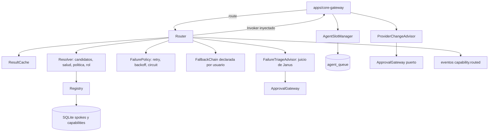

# Feature Spec: libs/capabilities/ (Registro, selección, políticas de fallo, cola y cambio de proveedor)

> **Status**: Ready for implementation
> **Last updated**: 2026-09-19
> **Orden de implementación**: 9 de 15. Depende de: spec 01 (`janus_proto`) y spec 03 (`janus_persistence`).

---

## Objective

Construir el Registro de Capacidades extendido y el motor de enrutamiento (`architecture/04`, `stack/07`), junto con las responsabilidades que le asignan `stack/09` y `agents/06` y `agents/07`:

* Registro de capacidades y spokes, persistido y con salud.
* Resolución por delegación con política de selección determinística y consultable.
* `FailurePolicy` (ABC) con las políticas `on-failure`, `exponential-backoff` y `circuit-breaker`.
* Caché opcional por capacidad.
* Delegación por especialidad.
* Cola FIFO por carril con tope por tipo de agente, Janus exento.
* Cambio dinámico de proveedor de modelo con política de aprobación.

Una vez implementada, `core-gateway` resuelve cualquier solicitud de capacidad sin conocer spokes concretos, y el usuario puede auditar por qué se eligió cada spoke.

---

## Functional Requirements

### Registro
1. `Registry.register_spoke(reg: SpokeRegistration, source)` valida y registra un spoke y sus capacidades. Persiste en las tablas `spokes` y `capabilities` (spec 03). El estado de conexión es efímero: se mantiene en memoria y se marca `UNAVAILABLE` si no hay latido en `heartbeat_ttl_s` (default 30).
2. Validación de `capability_id`: regex de la spec 01; el namespace `janus` está reservado al núcleo; el id no puede contener el `spoke_id` de ningún spoke registrado (Principio #1: las capacidades son abstractas).
3. `Registry.unregister_spoke`, `update_health(spoke_id, HealthReport)` y `update_capabilities(spoke_id, descriptors)`. Una capacidad sin proveedor deja de resolverse sin romper al resto (`architecture/04` sección 5).
4. `Registry.candidates(capability_id) -> list[Candidate]` devuelve los spokes que la sirven con su salud. `Registry.snapshot()` devuelve el estado completo para la superficie observable.
5. Los harnesses base (`libs/reasoning-engine`, `channel-gateway`) no compiten: `harnesses.owners` de la config da un único dueño por capacidad y el resolver lo usa directamente, sin arbitraje (`stack/07` sección 1.3). La política de selección aplica solo a spokes externos (`stack/07` sección 2).
6. Cada cambio del registro emite un evento hacia el publicador de estado (`capability.changed`, `spoke.connected`, `spoke.disconnected`, `spoke.health`).

### Selección (política determinística y consultable)
7. Orden de resolución, fijo y documentado:
   1. Conjunto de candidatos: spokes que sirven la capacidad, menos el solicitante y menos cualquiera presente en `route_trace`.
   2. Filtro de salud: se excluyen `UNAVAILABLE` y spokes con circuito abierto; los `DEGRADED` pasan al final de su grupo.
   3. Política nombrada declarada en `config/janus.toml` (`priority` con orden explícito, o `pinned` a un spoke).
   4. Sugerencia de rol o tarea (`role_hints`: por ejemplo, Implementer prefiere spokes de tipo ejecución) solo para desempatar dentro del mismo nivel de prioridad.
8. Fallback declarativo por cadena, no por enum cerrado: el usuario declara, por
   agente o capacidad, una secuencia ordenada de `FallbackStep` en `config/janus.toml`
   (ejemplo: Gemini, luego Claude, luego lo que OpenRouter tenga disponible, luego
   esperar). `FallbackChain.next(after: spoke_id | None) -> FallbackStep | None`
   recorre esa secuencia. Reemplaza al enum cerrado `on_preferred_unavailable` de la
   propuesta original (`fallback` | `block` | `ask`), que no alcanza para cadenas de
   N pasos (residual de la pregunta 1 de `architecture/09`, precisión del usuario).
8bis. Separado de la cadena: `FailureTriageAdvisor.triage(failure: FailureEvent, chain_state) -> TriageVerdict`
   es el juicio de Janus, no una regla precodificada, sobre si este fallo es del tipo
   que amerita seguir la cadena (`CONTINUE_CHAIN`) o si hay que cortar y avisar al
   usuario (`ESCALATE`) aunque la cadena todavía tenga pasos sin probar. El triage usa
   la clasificación de `FailureEvent.kind` (infra, timeout, quota, auth) y el
   historial reciente como insumo, pero la decisión final es una llamada de Janus
   (expuesta como capacidad interna invocable, no una tabla estática de mapeo
   kind→verdict). `ESCALATE` usa el mismo `ApprovalGateway` que `provider.py`.
9. Cada decisión produce un `RoutingDecision` con los candidatos considerados, el motivo de cada exclusión, la política aplicada y el elegido. Se guardan las últimas 200 en memoria, se emiten como evento `capability.routed` y `Router.explain(request_id)` las devuelve. Nunca hay selección silenciosa (`architecture/04` sección 3).
10. Anti recursión: si un spoke pide una capacidad cuyo único proveedor es él mismo, falla con `NoCandidate`. La profundidad máxima de `route_trace` es `selection.max_route_depth` (default 4); al superarla falla con `RouteDepthExceeded`.

### Router
11. `Router.route(request, invoker) -> AsyncIterator[SemanticEvent]` ejecuta: caché, resolución, invocación mediante el `Invoker` inyectado por el núcleo, aplicación de `FailurePolicy` y trazabilidad. `Invoker` es un `Protocol`: `invoke(spoke_id, request) -> AsyncIterator[SemanticEvent]`. Esta librería nunca importa `libs/adapters`.
12. El router añade el spoke elegido a `route_trace` antes de invocar y no altera `requester_id`, que fija el núcleo.
13. Reintento transparente solo antes de que el consumidor haya recibido el primer evento. Si el fallo ocurre a mitad de stream, se entrega un terminal `FAILED` con `ErrorInfo.retryable` y el solicitante decide; así no se duplica salida ya emitida.
14. Un fallo lógico (terminal `FAILED`) nunca se reintenta. Solo los errores de infraestructura entran a `FailurePolicy` (spec 04, requisito 12).
15. Regla de efectos: si el fallo trae `side_effects_possible = true` y `CapabilityDescriptor.idempotent = false`, no se reintenta ni en el mismo spoke ni en otro, salvo `failure.allow_unsafe_retry` explícito para esa capacidad.

### FailurePolicy
16. `FailurePolicy` (ABC) con `should_retry(history: Sequence[FailureEvent]) -> RetryDecision`. `RetryDecision(retry: bool, delay_s: float, switch_candidate: bool, reason: str)`.
17. Implementaciones de v1 (catálogo cerrado, `stack/09` sección 2): `OnFailurePolicy(max_retries)`, `ExponentialBackoffPolicy(base_ms, max_retries, jitter=0.2, cap_s=60)` y `CircuitBreakerPolicy(threshold, cooldown_s)` con estados `CLOSED`, `OPEN`, `HALF_OPEN`. Se combinan con `CompositePolicy`: reintento más circuito.
18. Resolución de la política: override por spoke, luego por harness, luego el valor global de `failure` en la config. El nombre en TOML (`"exponential-backoff"`) se mapea con `PolicyFactory.from_config(...)`.
19. Circuito abierto: el spoke sale de los candidatos hasta el fin del enfriamiento; la primera solicitud tras el enfriamiento es de prueba (`HALF_OPEN`). Un `start()` fallido de un adaptador cuenta como fallo (spec 04).
20. Los eventos de fallo se guardan en una ventana en memoria (últimos 50 o 10 minutos por spoke). No se persisten.

### Caché
21. `ResultCache` en memoria (LRU con tope de 500 entradas y TTL) aplica solo si `CapabilityDescriptor.cache_policy` es `TTL`. La clave es `capability_id` más SHA 256 del payload canónico de entrada. Solo se cachean respuestas terminales `SUCCEEDED`; un acierto se sirve como un único evento terminal. Una capacidad sin política declarada nunca se cachea (default `NONE`).

### Delegación por especialidad
22. `SpecialtyRouter.resolve(category) -> agent_type` usa la tabla `specialties` de la config (categoría del skill o comando, por ejemplo `code`, a tipo de agente, por ejemplo `implementer`). Extiende la resolución por capacidad a skills y comandos (`agents/03` sección 1). Una categoría sin especialista devuelve `None` y el orquestador decide (normalmente lo resuelve Janus).

### Cola y concurrencia (`agents/07`)
23. `AgentSlotManager.acquire(agent_type, request_id, session_id, task_id) -> Slot` es un context manager async. El tope viene de `agents.types.<tipo>.max_concurrent`. Cuando el carril está lleno la solicitud espera en orden FIFO y ninguna se descarta ni se sobrescribe.
24. Carriles independientes: un tipo saturado no bloquea a otro. Janus (tipo `janus`) esquiva por completo el gestor: nunca cuenta contra un tope ni espera.
25. La cola se persiste en `agent_queue` (spec 03), con el orden dado por `seq`. Al arrancar, `recover_after_crash` ya dejó las filas `running` como `failed`; las `queued` se reincorporan en orden.
26. `queue_snapshot()` devuelve la vista general (todas las solicitudes pendientes con su tipo) para observabilidad. Emite `queue.changed` en cada cambio.
27. Cancelar una solicitud en espera la marca `cancelled` y libera el lugar sin afectar el orden del resto.
28. El tope se puede cambiar en caliente (`max_concurrent` es de recarga en caliente en la spec 02): subirlo despierta a los siguientes; bajarlo no expulsa a nadie en ejecución.

### Cambio dinámico de proveedor (`agents/06`)
29. `ProviderChangeAdvisor.on_provider_failure(agent, provider, failure)` observa fallos repetidos de un proveedor (reportados por el motor, spec 10) y, superado `provider_failure_threshold` (default 3 en 5 minutos), produce un `ProviderChangeSuggestion(agent, from, to, reason)` con el siguiente proveedor sano de una lista declarada en la config del agente.
30. La sugerencia se expone como tool call `suggest_provider_change(agent, to_provider, reason)` dentro del toolset de Janus, y también la puede generar el asesor de forma automática para que Janus la vea como evento.
31. `ApprovalPolicy` (config `approval.provider_change`, con override por agente),
    cuatro valores confirmados: `ASK_EVERYTIME`, `ASK_ONCE_PER_SESSION`,
    `ALLOW_ALWAYS` y `DENY_ALWAYS`. Con `ASK_*` se usa `ApprovalGateway` (puerto
    implementado por el núcleo, que pregunta al usuario por su canal y devuelve la
    respuesta); `ASK_ONCE_PER_SESSION` cachea la respuesta aprobatoria mientras dure la
    sesión del agente y vuelve a preguntar en la siguiente.
32. Aplicar el cambio significa fijar un override `agent_provider_override.<agente>` en `preferences` y pedir al runtime el reinicio del agente (el proveedor es un campo `requires_restart`, spec 02). No se reescribe `agent.toml`, para no pelear con ediciones del usuario. Retirar el override devuelve el proveedor declarado.

---

## Non-Functional Requirements

* **Performance**: `Router.route` añade menos de 2 ms p95 de sobrecarga por solicitud sin contar la invocación, con 50 spokes y 500 capacidades, en Raspberry Pi 4. `acquire` sin espera menor a 1 ms. Objetivos propuestos, se ajustan tras medir.
* **Security**: valida ids de capacidad y payloads de configuración; el solicitante nunca puede declarar su propia identidad; una capacidad de un spoke nunca se sirve a un solicitante sin el scope `capability:invoke` correspondiente (lo verifica el núcleo antes de llegar aquí); las decisiones de enrutamiento no exponen credenciales.
* **Reliability**: el fallo de un spoke no afecta a otros; la cola sobrevive reinicios; sin colas ni ventanas sin límite; toda espera respeta la cancelación.
* **Portability**: Python 3.11 o superior. Dependencias permitidas: `janus_proto` y `janus_persistence`. La configuración llega como dataclasses por parámetro (`CapabilitySettings`), sin importar `libs/config`. Prohibido importar `libs/adapters` y `apps/*`.

---

## Technical Decisions

### El router recibe un `Invoker` inyectado
* **Chosen**: `Protocol Invoker` implementado por el núcleo (adaptador local o proxy gRPC).
* **Reason**: mantiene esta librería independiente de `libs/adapters` y permite probar el routing con fakes.
* **Rejected alternatives**: importar `SpokeAdapter` aquí (crea dependencia circular conceptual con el contrato de adaptador).

### Reintento solo antes del primer evento
* **Chosen**: transparente hasta el primer evento entregado; después, terminal `FAILED` con `retryable`.
* **Reason**: reintentar tras haber emitido parciales duplicaría salida y efectos.
* **Rejected alternatives**: reiniciar el stream con un marcador de reinicio (complejidad que ningún consumidor pide todavía).

### Fallo con efectos posibles no se reintenta por defecto
* **Chosen**: `side_effects_possible` más `idempotent = false` bloquea el reintento.
* **Reason**: repetir una tarea que pudo haber actuado duplica cambios reales (`spec 04`, decisión sobre infraestructura y fallo lógico).
* **Rejected alternatives**: reintento ciego (riesgo de acciones duplicadas).

### Override de proveedor en `preferences`, no en `agent.toml`
* **Chosen**: estado dinámico en SQLite.
* **Reason**: `stack/06` separa lo declarado por el usuario de lo que el sistema genera; evita conflictos con ediciones concurrentes.
* **Rejected alternatives**: reescribir el TOML (mezcla configuración declarada y estado).

### Estados de circuito en memoria
* **Chosen**: ventana de fallos y estado del circuito en memoria.
* **Reason**: son datos efímeros; tras un reinicio empiezan limpios, lo cual es aceptable para un solo host.
* **Rejected alternatives**: persistirlos (complejidad sin beneficio claro).

### Orden de resolución fijo, más cadena de fallback declarativa separada del triage de Janus
* **Chosen**: para desempatar entre candidatos con salud equivalente, el orden es salud,
  luego política de usuario, luego sugerencia de rol. Para qué hacer cuando el
  candidato elegido falla, dos piezas separadas: (a) una cadena de fallback declarada
  por el usuario (`FallbackChain`, N pasos, editable), y (b) un triage de Janus en
  runtime (`FailureTriageAdvisor`) que decide si seguir la cadena o escalar al usuario,
  sin ser una tabla estática.
* **Reason**: cubre el residual de la pregunta 1 de `architecture/09` según la
  precisión del usuario: el usuario quiere declarar órdenes de preferencia
  arbitrariamente largos, y quiere que sea Janus, no una regla fija, quien decida si
  vale la pena seguir intentando o hay que avisar. Un enum cerrado (`fallback` | `block`
  | `ask`) no expresa ni lo uno ni lo otro.
* **Rejected alternatives**: enum cerrado `on_preferred_unavailable` (primera
  propuesta de esta spec, insuficiente); bloquear siempre (detiene trabajo del
  usuario); prioridad global fija sin configuración; codificar el triage como tabla
  fija `kind → verdict` (le quita a Janus el juicio que el usuario pidió
  explícitamente que tuviera).

---

## Proposed Architecture

### Component Diagram


### Directory Structure
```
libs/capabilities/
  pyproject.toml
  src/janus_capabilities/
    __init__.py
    registry.py       # Registry, Candidate, validación de ids
    resolver.py       # orden de resolución, RoutingDecision, explain
    router.py         # Router, Invoker (Protocol)
    policies.py       # FailurePolicy, On/Backoff/Circuit, CompositePolicy, PolicyFactory
    fallback.py       # FallbackChain, FallbackStep, FailureTriageAdvisor, TriageVerdict
    cache.py          # ResultCache
    specialty.py      # SpecialtyRouter
    slots.py          # AgentSlotManager
    provider.py       # ProviderChangeAdvisor, ApprovalPolicy, ApprovalGateway (Protocol)
    settings.py       # CapabilitySettings (dataclasses)
    errors.py         # NoCandidate, PreferredUnavailable, RouteDepthExceeded, ...
  tests/
```

---

## Data Models

```
Entity Candidate        { spoke_id, kinds, health: HealthState, circuit: CLOSED|OPEN|HALF_OPEN, source }
Entity RoutingDecision  { request_id, capability_id, considered: [{spoke_id, excluded_reason?}],
                          policy: str, chosen?: str, at }
Entity FailureEvent     { spoke_id, at, kind: infra|timeout|quota|auth, retryable, side_effects_possible }
Entity RetryDecision    { retry: bool, delay_s: float, switch_candidate: bool, reason: str }
Entity FallbackStep     { target: spoke_id | provider_ref | "wait", order: int }
Entity FallbackChain    { owner: agent | capability_id, steps: [FallbackStep, ...] }
Enum   TriageVerdict    { CONTINUE_CHAIN, ESCALATE }
Entity Slot             { request_id, agent_type, acquired_at }
Entity QueueView        { lanes: {agent_type: {running: int, max: int, waiting: [request_id...]}} }
Entity ProviderChangeSuggestion { agent, from_provider, to_provider, reason }
Enum   ApprovalPolicy   { ASK_EVERYTIME, ASK_ONCE_PER_SESSION, ALLOW_ALWAYS, DENY_ALWAYS }
```

---

## API Contracts

Librería, sin API de red.

```
Registry.register_spoke(reg, source) -> None                 Registry.candidates(capability_id) -> list[Candidate]
Router.route(request, invoker) -> AsyncIterator[SemanticEvent]   Router.explain(request_id) -> RoutingDecision | None
PolicyFactory.from_config(name, params) -> FailurePolicy
AgentSlotManager.acquire(agent_type, request_id, session_id, task_id, timeout=None) -> AsyncContextManager[Slot]
AgentSlotManager.queue_snapshot() -> QueueView
ProviderChangeAdvisor.suggest(agent) -> ProviderChangeSuggestion | None
ProviderChangeAdvisor.apply(suggestion, approval: ApprovalPolicy) -> ApplyResult

Errores: NoCandidate, PreferredUnavailable, RouteDepthExceeded, CapabilityIdInvalid,
         QueueTimeout, ApprovalDenied, FallbackChainExhausted
```

---

## Edge Cases

| Case | How to Handle |
|---|---|
| Único proveedor es el solicitante | `NoCandidate`; se registra el motivo. |
| Ciclo A pide a B que pide a A | `route_trace` lo detecta al excluir visitados; si la cadena crece, `RouteDepthExceeded`. |
| Preferido sin cuota, alternativo disponible | Según `on_preferred_unavailable`: `fallback` usa el alternativo y lo deja en `RoutingDecision`. |
| Todos los candidatos sin salud | `NoCandidate` con la lista de motivos; el orquestador puede reintentar cuando vuelva salud. |
| Fallo a mitad de stream | Terminal `FAILED` con `retryable`; no se reintenta en silencio. |
| Fallo con efectos y capacidad no idempotente | No se reintenta; se informa `side_effects_possible`. |
| Circuito abierto | El spoke queda fuera hasta el fin del enfriamiento; primer intento posterior es de prueba. |
| Spoke deja de latir | `UNAVAILABLE` tras el TTL; sus capacidades sin otro proveedor dejan de resolverse. |
| Carril lleno mientras otro tiene cupo | El otro carril se atiende de inmediato; el lleno espera en FIFO. |
| Reinicio con solicitudes `queued` | Se reincorporan en orden de `seq`; las `running` quedaron `failed`. |
| Bajar `max_concurrent` con instancias corriendo | No se expulsa a nadie; el nuevo tope rige para las próximas. |
| Proveedor sugerido también falla | El asesor avanza al siguiente de la lista; agotada la lista, informa a Janus sin cambiar. |
| Aprobación sin respuesta del usuario | Tiempo de espera configurable; al vencer se aplica `deny` y se informa. |

---

## Testing Requirements

**Unit Tests**: validación de ids (incluido nombre de spoke y namespace `janus`); orden de resolución con casos combinados de salud, prioridad y rol; cada valor de `on_preferred_unavailable`; `RoutingDecision` completo; anti recursión y profundidad; cada política de fallo con historiales, incluido el circuito con sus tres estados; regla de efectos e idempotencia; retry solo antes del primer evento; caché con TTL y exclusión de `NONE`; `SpecialtyRouter`; `AgentSlotManager` con carriles mezclados, FIFO, cancelación, Janus exento y cambio de tope; `ProviderChangeAdvisor` con cada `ApprovalPolicy`.

**Integration Tests**: `Router` con un `Invoker` falso que inyecta fallos, latencias y streams interrumpidos; cola con reinicio simulado sobre SQLite real; 50 spokes con 500 capacidades para verificar rendimiento; consumo del stream de eventos `capability.routed` y `queue.changed`.

---

## Security Checklist
- [ ] Validación de `capability_id` y de payloads de registro
- [ ] `requester_id` nunca lo escribe el solicitante
- [ ] Sin selección silenciosa: todo queda en `RoutingDecision`
- [ ] Sin reintento con efectos no idempotentes por defecto
- [ ] Colas y ventanas acotadas en memoria
- [ ] El override de proveedor requiere política de aprobación válida
- [ ] Sin importar `libs/adapters` ni `apps/*`

---

## Open Questions
- [x] Prioridad entre criterios (residual de la pregunta 1 de `architecture/09`): confirmado por el usuario que el orden salud → política → rol sirve solo para desempatar candidatos de salud equivalente, no para decidir qué pasa ante un fallo. Reemplazado por `FallbackChain` (declarativa, N pasos, del usuario) más `FailureTriageAdvisor` (juicio de Janus en runtime, no tabla estática).
- [ ] Forma exacta de declarar una `FallbackChain` en `config/janus.toml` (sintaxis TOML para una secuencia de N pasos heterogéneos: spoke, proveedor, "esperar"). Pendiente para la spec 02.
- [ ] Qué insumo concreto usa `FailureTriageAdvisor` para su juicio ademas de `FailureEvent.kind` e historial reciente (p. ej., si consulta al motor de razonamiento como una invocación más, o si es lógica propia de `libs/capabilities`). Pendiente de decidir antes de implementar `fallback.py`.
- [ ] `role_hints` y `max_route_depth` se agregan a la sección `selection` de la spec 02.
- [x] Variantes intermedias de `ApprovalPolicy` (`ask_once_per_session`, `deny_always`):
      confirmadas por el usuario, las cuatro (`ASK_EVERYTIME`, `ASK_ONCE_PER_SESSION`,
      `ALLOW_ALWAYS`, `DENY_ALWAYS`) forman el conjunto completo. `agents/06` actualizado.
- [ ] Persistencia de la ventana de fallos: se deja en memoria; reevaluar si el usuario quiere que un circuito abierto sobreviva a reinicios.

---

## Handoff Note
Revisar esta spec antes de empezar. Crear un checklist desde los requisitos funcionales y marcarlo al avanzar. Levantar dudas antes de codificar, no durante. Implementar `registry.py`, `resolver.py` y `policies.py` primero; `slots.py` y `provider.py` pueden ir en paralelo.
