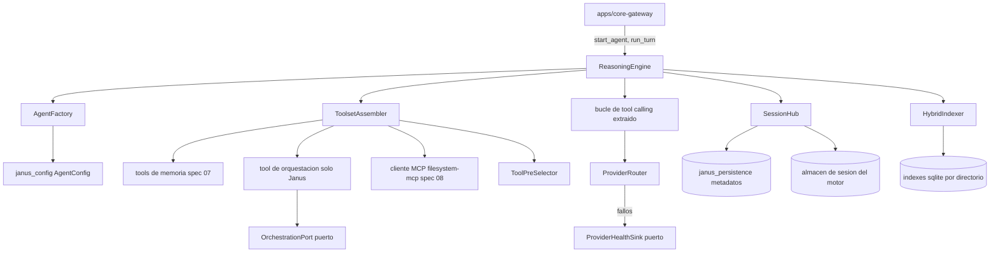

# Feature Spec: libs/reasoning-engine/ (extracción del motor de Hermes, agentes, toolset, sesiones e indexación)

> **Status**: Ready for implementation, por fases (la fase 0 es una auditoría obligatoria)
> **Last updated**: 2026-09-19
> **Orden de implementación**: 10 de 15. Depende de: specs 02 (config), 03 (persistencia), 07 (memoria). Se apoya en puertos (Protocol) implementados por `core-gateway`, no importa `libs/capabilities`.

---

## Objective

Construir `libs/reasoning-engine/` como librería interna de Python (`stack/05` sección 1): la extracción quirúrgica y el refactor del motor de `NousResearch/hermes-agent`, más las responsabilidades que le asigna el modelo de agentes (`agents/08` sección 1):

* Bucle de tool calling y parsing de function calls (extraído, lo más intacto posible).
* Routing multi proveedor de modelos (extraído).
* Composición `AgentCore` y `AgentPersona` (nuevo).
* Ensamblado de toolset por agente, con la tool de orquestación exclusiva de Janus (nuevo).
* Sesiones por tarea multi participante con suscripción dinámica (nuevo).
* Indexación híbrida BM25 más vectorial de la identidad de agente y de proyectos del usuario, y pre selección de tools (extraída de Hermes).

No incluye CLI, dashboard, mensajería ni voice mode de Hermes, ni ninguna noción de sesión por chat o identidad atada a plataforma (`stack/05` sección 1). Nunca habla con el usuario ni conoce canales o voces (`stack/05` sección 3).

Una vez implementada, `core-gateway` instancia agentes, les entrega un toolset correcto y ejecuta turnos por streaming; la spec 15 la envuelve como `ReasoningEngineAdapter`.

---

## Functional Requirements

### Fase 0: auditoría de extracción (obligatoria antes de codificar)
1. Fijar un commit de `NousResearch/hermes-agent` (licencia MIT confirmada en su README) y producir `libs/reasoning-engine/EXTRACTION.md` con una tabla `módulo o clase upstream -> conservar | refactorizar | descartar`, con motivo. Fuentes para el mapa: la sección Architecture de la documentación oficial de Hermes (estructura del proyecto, bucle del agente, clases clave) y el código.
2. Criterio de corte de `stack/05`: lo que Janus va a tocar de forma recurrente (identidad, config, forma de invocar el motor) se refactoriza a esquema propio; lo estable y probado por terceros (algoritmo de tool calling, parsing de function calls, routing a proveedores) se deja lo más intacto posible.
3. Se lista explícitamente lo descartado: CLI, dashboard, gateway de mensajería, voice mode, cron y webhooks propios, y el bucle de aprendizaje automático completo de skills en la medida en que diverja del diseño de Janus.
4. Se preservan los avisos de copyright y la licencia MIT de Hermes en el árbol y se añade el de Joanfer (`stack/10` sección 2). Las pruebas upstream que apliquen a lo conservado se portan como pruebas de regresión.

### Agentes (`agents/01`)
5. `AgentCore` (ABC): `model_provider`, `system_prompt`, `rules`, `skills`, `toolset`; método abstracto `run_turn(ctx, message) -> AsyncIterator[EngineEvent]`. `AgentPersona` (dataclass): `voice_provider`, `tone`, `personality_prompt`, `channel_identity`; es composición pura y no extiende `AgentCore`. `Agent` compone ambos con `name`, `type` e `is_leader`.
6. `AgentFactory.from_config(cfg: AgentConfig, settings) -> Agent` construye desde los modelos de `janus_config` (spec 02). Janus es el único agente con `is_leader = true`.
7. `ReasoningEngine.start_agent(agent, task_ctx) -> AgentRuntime` y `AgentRuntime.stop()` y `restart(new_agent)`. Un `AgentRuntime` es una instancia viva por (agente, tarea) y su ciclo de vida lo decide el núcleo tras adquirir un slot (spec 09). El motor no gestiona concurrencia entre agentes.
8. Cambio de configuración: `apply_config_change(runtime, RestartDecision)`: `HOT_RELOAD` actualiza `persona` sin tocar la sesión de razonamiento; `RESTART_REQUIRED` cierra el runtime y crea uno nuevo enlazado a la misma sesión persistente (`agents/03` sección 4). Al reiniciar se reindexa la identidad si cambiaron skills o reglas.

### Turnos y eventos
9. `AgentRuntime.run_turn(session_id, message) -> AsyncIterator[EngineEvent]` con eventos `TokenDelta`, `ToolCallStarted`, `ToolCallFinished`, `Progress`, `TurnCompleted(result)`, `TurnFailed(error)`. Exactamente un evento final por turno.
10. `TurnFailed` distingue error de proveedor (`ProviderError`, con `retryable`) de fallo lógico (el modelo decidió que no pudo). Es la fuente de la distinción de infraestructura frente a dato de la spec 04.
11. Cancelación: cancelar el iterador aborta la llamada al proveedor y las tools en curso y libera recursos. Un turno respeta el `deadline` de la solicitud.
12. Las llamadas bloqueantes del código extraído (`ThreadPoolExecutor` del bucle upstream, clientes síncronos) se ejecutan sin bloquear el event loop del proceso único.

### Routing de proveedores
13. `ProviderRouter` resuelve `ModelProviderRef -> cliente` usando `janus_config.providers` (tipos `openai_compatible`, `anthropic`, `ollama`, `openrouter`). Mantiene lo extraído de Hermes para normalizar respuestas y function calls entre proveedores.
14. Cada fallo de proveedor se reporta al `ProviderHealthSink` (Protocol implementado por el núcleo, que lo reenvía a `ProviderChangeAdvisor`, spec 09). El motor no decide cambiar de proveedor por sí mismo (`agents/06`).
15. El override `agent_provider_override.<agente>` de `preferences` lo aplica el núcleo al construir el `Agent`; el motor solo recibe el proveedor efectivo.

### Toolset (`agents/04` sección 2)
16. `Tool` (ABC) con `name`, `description`, `schema` (JSON Schema) y `run(ctx, args) -> ToolResult`. `ToolRef` es la referencia declarativa de la config.
17. `ToolsetAssembler.assemble(agent_cfg, ctx) -> Toolset` construye el toolset antes de instanciar el agente a partir de:
    * Skills y comandos habilitados del catálogo compartido (spec 02).
    * Tools de memoria: `recall_memory`, `remember`, `list_memory_categories` (spec 07), disponibles para todo agente.
    * Tool de orquestación `delegate_to_agent`, más `get_task_status`, `list_agents` y `suggest_provider_change`, únicamente para Janus.
    * Tools específicas de la especialidad (`extra_tools`), por ejemplo ejecución de comandos para Implementer, y tools MCP (el `filesystem-mcp` de la spec 08) descubiertas por un cliente MCP.
18. Un subagente no tiene la tool de orquestación en su lista: no está declarada, no se le niega en runtime (`agents/04` sección 1). Un test recorre todos los agentes no líderes y falla si algún nombre de tool de orquestación aparece.
19. Las tools que necesitan al núcleo (`delegate_to_agent`, `suggest_provider_change`) hablan con un `OrchestrationPort` (Protocol) implementado por `core-gateway`. El motor no importa `libs/capabilities`.
20. Toda tool que ejecuta comandos o toca el sistema respeta la política de aprobación (`ask` por defecto, allowlist opcional) y el directorio de trabajo del agente. Es la mitigación del riesgo central de `stack/05` sección 4: inyección de prompt que escala a ejecución arbitraria.
21. Pre selección híbrida de tools (`ToolPreSelector`): índice precomputado BM25 más vectorial de las tools disponibles; por turno inyecta solo las top K (default 12) relevantes al mensaje, en menos de 50 ms p95 (objetivo de Hermes, a verificar en el Pi).

### Sesiones multi participante (`agents/04` sección 3)
22. `SessionHub.open_task_session(agent_name, task_id) -> Session`: crea una sesión por tarea con Janus como participante por defecto y registra los metadatos en `janus_persistence` (`sessions`, `session_participants`). El historial de mensajes lo persiste el motor extraído y se referencia por `engine_session_ref` (spec 03).
23. `subscribe(session_id, listener)` agrega un oyente externo (`user_listener`) a una sesión en curso sin crear ni reiniciar nada; `unsubscribe` lo retira. El oyente recibe los mensajes nuevos por una cola acotada (default 200, contrapresión: descarta el más antiguo y avisa).
24. `post(session_id, participant, message)`: un oyente suscrito puede escribir directo al subagente sin pasar por Janus. Esto no le da al subagente la tool de orquestación.
25. Cierre por conteo de oyentes: la sesión se cierra cuando la tarea es terminal y el conteo de oyentes externos es cero (`sessions.close_if_idle`, spec 03). Janus no cuenta para el umbral. Una tarea terminada con oyentes suscritos no cierra hasta que el último se retire.
26. Janus puede tener N sesiones abiertas y el usuario N suscripciones a la vez. Los eventos de sesión (`session.changed`) los emite el núcleo a partir de callbacks del hub.
27. Reanudación: `SessionHub.resume(session_id)` reconstruye el contexto desde la sesión persistente del motor y permite que un agente distinto continúe (para el caso de rol reasignado, `architecture/06` sección 2.1).

### Indexación híbrida (`agents/02` sección 5)
28. `HybridIndexer.build(directory, kind) -> Index` produce un archivo SQLite por directorio indexado en `state_dir/indexes/<hash>.db`, con BM25 (FTS5), vectores y reranking, reutilizando el mecanismo de Hermes (`qmd`, búsqueda semántica de código con Tree-sitter y pre selección de tools). Separado de `sqlite-vec` de la memoria episódica y de la base principal.
29. Identidad de agente (activada por defecto): indexa la carpeta del agente (`Skills/`, `Instructions/`, `Rules/`, `Tools/`, `agent.md`) y se reconstruye cuando la config cambia. Proyectos del usuario (opt in por proyecto): mismo mecanismo apuntado a la carpeta del proyecto.
30. `Index.search(query, k, mode="hybrid") -> list[Hit]`. El agente consulta la identidad en cada turno para traer solo lo relevante, en lugar de cargarla completa.
31. Embeddings locales sin servidor por defecto, con el mismo `Embedder` de la spec 07 cuando sea posible, para no descargar dos modelos. Si el motor extraído trae su propio embedder, la auditoría de la fase 0 decide si se unifica.

---

## Non-Functional Requirements

* **Performance**: arranque de un `AgentRuntime` menor a 1.5 s p95 en Raspberry Pi 4 sin contar la descarga de modelos; reconstrucción del índice de identidad de un agente típico (menos de 200 archivos) menor a 15 s; `ToolPreSelector` menor a 50 ms p95. Objetivos propuestos, se ajustan tras medir.
* **Security**: la salida de tools, de proveedores y de memoria es dato no confiable (nunca instrucciones al sistema); la tool de orquestación no existe en subagentes; las tools de ejecución exigen aprobación; ninguna credencial se registra; los índices no contienen secretos (se excluyen archivos `.env`).
* **Reliability**: el fallo de un runtime no afecta a otros; sin colas ilimitadas; toda espera respeta la cancelación; una sesión persistente permite recuperar el contexto tras un reinicio.
* **Portability**: Python 3.11 o superior. Dependencias permitidas: `janus_config`, `janus_persistence`, `janus_memory`, `janus_proto` (tipos) y las que traiga lo extraído de Hermes, auditadas en la fase 0. Prohibido importar `libs/capabilities`, `libs/adapters` y `apps/*`.

---

## Technical Decisions

### Extracción quirúrgica con auditoría previa
* **Chosen**: fase 0 de inventario y tabla de decisiones antes de mover código.
* **Reason**: `stack/05` descartó usar Hermes como servicio y forkearlo completo; el repositorio es grande (más de 11 000 commits), así que sin inventario se arrastra código muerto.
* **Rejected alternatives**: fork completo (arrastra CLI, gateway y voz que compiten con el diseño de Janus); reescritura desde cero (repite trabajo estable ya probado).

### Puertos en lugar de dependencias hacia el núcleo
* **Chosen**: `OrchestrationPort`, `ProviderHealthSink` y `ApprovalGateway` como `Protocol` implementados por `core-gateway`.
* **Reason**: mantiene el grafo de dependencias sin ciclos y permite probar el motor con fakes.
* **Rejected alternatives**: importar `libs/capabilities` (acopla el motor al registro).

### Sesiones multi participante dentro del motor
* **Chosen**: `SessionHub` como módulo de `libs/reasoning-engine`.
* **Reason**: `agents/04` sección 3 lo describe como extensión de la sesión persistente que el motor ya resuelve, y decide su ubicación en `/spec`. Estar junto al almacén de sesión del motor evita duplicar el estado.
* **Rejected alternatives**: pieza separada en `core-gateway` (duplica el acceso al almacén de sesión del motor).

### Historial de mensajes en el almacén del motor
* **Chosen**: no duplicar mensajes en las tablas de Janus.
* **Reason**: `agents/04` exige reutilizar tal cual la persistencia de sesión del motor; la spec 03 guarda solo metadatos y la referencia.
* **Rejected alternatives**: dos fuentes de verdad del historial.

### Aprobación por defecto en tools de ejecución
* **Chosen**: `ask` por defecto, allowlist opcional por agente.
* **Reason**: la superficie de ataque real del bucle de tool calling es la inyección que escala a ejecución (`stack/05` sección 4).
* **Rejected alternatives**: ejecutar sin aprobación (riesgo alto).

---

## Proposed Architecture

### Component Diagram


### Directory Structure
```
libs/reasoning-engine/
  pyproject.toml
  EXTRACTION.md          # salida de la fase 0
  LICENSE-THIRD-PARTY    # MIT de Hermes
  src/janus_reasoning/
    __init__.py
    agents/     core.py persona.py agent.py factory.py
    engine.py            # ReasoningEngine, AgentRuntime
    events.py            # EngineEvent y variantes
    loop/                # bucle de tool calling extraído
    providers/           # ProviderRouter y clientes extraídos
    toolset/             # Tool, ToolsetAssembler, ToolPreSelector, mcp_client.py
    tools/               # orchestration.py, exec.py (con aprobación)
    sessions/            # SessionHub, Listener, store del motor extraído
    indexing/            # HybridIndexer, Index, identity.py, project.py
    ports.py             # OrchestrationPort, ProviderHealthSink, ApprovalGateway
  tests/
```

---

## Data Models

```
Entity Agent         { name, type, is_leader, core: AgentCore, persona: AgentPersona }
Entity EngineEvent   { kind: TokenDelta|ToolCallStarted|ToolCallFinished|Progress|TurnCompleted|TurnFailed,
                       session_id, task_id?, data }
Entity Toolset       { tools: dict[name, Tool], preselect_index_ref }
Entity SessionHandle { session_id, agent_name, task_id?, engine_session_ref, listeners: set[str] }
Entity Hit           { path, score, snippet, kind: identity|project }
Entity IndexMeta     { directory, kind, built_at, file_count, embedder_model }
```

---

## API Contracts

Librería, sin API de red.

```
ReasoningEngine.start_agent(agent: Agent, task_ctx) -> AgentRuntime
AgentRuntime.run_turn(session_id: str, message: UserMessage) -> AsyncIterator[EngineEvent]
AgentRuntime.stop() -> None        AgentRuntime.restart(new_agent: Agent) -> AgentRuntime
ToolsetAssembler.assemble(agent_cfg: AgentConfig, ctx) -> Toolset
SessionHub.open_task_session(agent_name: str, task_id: str) -> SessionHandle
SessionHub.subscribe(session_id, listener) -> None     SessionHub.unsubscribe(session_id, listener_id) -> None
SessionHub.post(session_id, participant, message) -> None
HybridIndexer.build(directory: Path, kind: str) -> Index      Index.search(query, k, mode) -> list[Hit]

Puertos (Protocol, los implementa core-gateway):
OrchestrationPort.delegate(agent_type_or_name, instruction, session_ctx) -> TaskRef
OrchestrationPort.task_status(task_id) -> TaskStatusView
ProviderHealthSink.report(agent, provider, failure) -> None
ApprovalGateway.request(kind, summary, ctx) -> ApprovalResult
```

Errores: `ProviderError(retryable)`, `ToolNotAvailable`, `AgentConfigInvalid`, `SessionClosed`, `IndexUnavailable`.

---

## Edge Cases

| Case | How to Handle |
|---|---|
| Subagente intenta invocar la tool de orquestación (prompt injection) | La tool no existe en su contexto; el modelo no puede llamarla. |
| Cambio de proveedor a mitad de turno | `RESTART_REQUIRED`: el turno actual termina o se cancela según política; el runtime nuevo retoma la sesión persistente. |
| Cambio de voz o tono durante un turno | `HOT_RELOAD`, sin reiniciar el razonamiento. |
| Proveedor devuelve errores repetidos | Se reporta al `ProviderHealthSink`; el motor no cambia de proveedor por su cuenta. |
| Oyente lento en una sesión | Cola acotada con descarte del más antiguo y aviso al oyente. |
| Tarea termina con oyente suscrito | La sesión no cierra hasta que el último oyente se retire. |
| Reinicio del proceso con sesiones abiertas | Se rehidratan desde el almacén del motor y los metadatos; los oyentes deben re suscribirse. |
| Índice de identidad desactualizado | Reconstrucción disparada por el cambio de config; mientras tanto, búsqueda sobre el índice previo con marca de antigüedad. |
| Tool de ejecución en un directorio fuera de su raíz | Se rechaza por la validación de directorio de trabajo. |
| Salida de tool con instrucciones ocultas | Se entrega al modelo como dato marcado; no altera reglas del sistema ni el toolset. |
| Modelo local (Ollama) sin recursos | La gestión de VRAM y RAM es del runtime local (`agents/07` sección 1); el motor solo informa el error del proveedor. |

---

## Testing Requirements

**Unit Tests**: `AgentFactory` desde configs válidas e inválidas; ensamblado de toolset para líder y para no líderes (ausencia de la tool de orquestación); `ProviderRouter` con un `FakeProvider` que simula errores y function calls; eventos con un único final; cancelación libera recursos; `SessionHub` con suscripción, desuscripción, oyente lento, escritura directa y cierre por conteo; índices de identidad y de proyecto sobre un árbol de ejemplo; `ToolPreSelector` devuelve las tools esperadas.

**Integration Tests**: ciclo completo con un proveedor falso: agente Janus delega a un subagente vía puerto falso; un usuario se suscribe y escribe directo; reinicio y reanudación de sesión; cambio `HOT_RELOAD` y `RESTART_REQUIRED`; pruebas de inyección (salida de tool que intenta reconfigurar al agente); regresión de lo extraído con las pruebas portadas de Hermes.

---

## Security Checklist
- [ ] La tool de orquestación se excluye del toolset de subagentes por construcción
- [ ] Tools de ejecución con aprobación y directorio de trabajo acotado
- [ ] Salida de tools, proveedores y memoria tratada como dato no confiable
- [ ] Credenciales de proveedores solo como `SecretStr`, nunca en logs
- [ ] Archivos con secretos excluidos de los índices
- [ ] Avisos de licencia MIT de Hermes preservados
- [ ] Puertos en lugar de dependencias hacia el núcleo

---

## Open Questions
- [ ] Resultado de la fase 0: qué módulos exactos se conservan; puede cambiar la lista de dependencias y el esfuerzo total. Revisar esta spec al terminar la auditoría.
- [ ] El bucle upstream usa `ThreadPoolExecutor` para tools; decidir en la auditoría si se conserva o se reescribe como asyncio nativo.
- [ ] Configuración de aprobación para tools de ejecución (`exec`): agregar a `extra_tools` de la spec 02 los campos `mode` (`ask`, `allowlist`) y `allowlist`.
- [ ] Unificar el embedder de la memoria con el del indexador, si el de Hermes (`fastembed`) admite el mismo modelo multilingüe. El modelo de memoria ahora es configurable, con default `intfloat/multilingual-e5-large` (1024 dimensiones, spec 07). Si se unifica, el índice híbrido hereda ese modelo, y los objetivos de latencia de reconstrucción del índice y de `ToolPreSelector` (calibrados para el Pi) se recalibran midiendo en la PC del usuario.

---

## Handoff Note
Revisar esta spec antes de empezar. Crear un checklist desde los requisitos funcionales y marcarlo al avanzar. Levantar dudas antes de codificar, no durante. No empezar a mover código hasta terminar la fase 0 y aprobar `EXTRACTION.md`; después implementar en este orden: agentes y eventos, routing de proveedores, toolset, sesiones, indexación.
