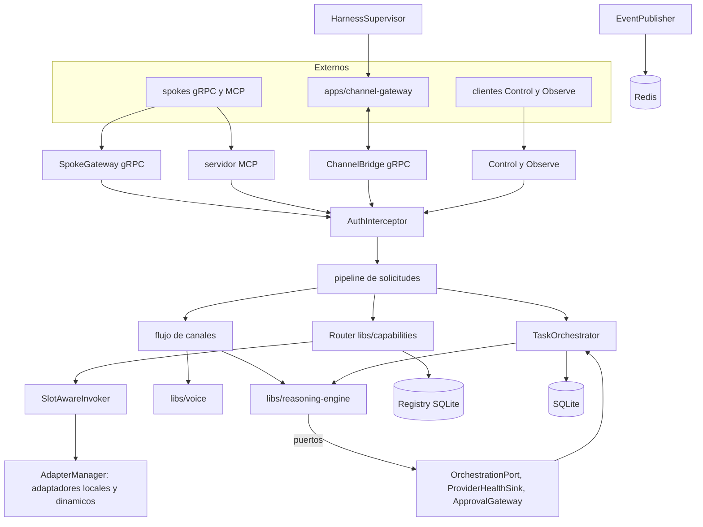

# Feature Spec: apps/core-gateway/ (Core de Traducción, orquestador central y superficie de control)

> **Status**: Ready for implementation
> **Last updated**: 2026-09-20
> **Orden de implementación**: 11 de 15. Depende de: specs 01 a 07, 09 y 10. Los adaptadores concretos (spec 15) y `channel-gateway` (spec 14) se conectan a este proceso.

---

## Objective

Construir el proceso único de Python (asyncio) que integra todo el núcleo (`stack/01`, `stack/02`): Core de Traducción, Registro de Capacidades, Persistencia Transversal y el motor de razonamiento como librería, más las superficies que exigen `architecture/07` y `architecture/02` (servidor MCP, servidores gRPC, observabilidad y control).

Responsabilidades propias de esta app, además de cablear las librerías:
* Ciclo de vida de adaptadores y puerto `CoreGateway` ligado por spoke.
* Autenticación y autorización de cada request entrante.
* Orquestación de tareas con dependencias, roles y reasignación.
* Flujo de canales (mensaje entrante, Janus, voz, mensaje saliente) con verificación de identidad.
* Implementación de los puertos del motor (`OrchestrationPort`, `ProviderHealthSink`, `ApprovalGateway`).
* Supervisión de `channel-gateway`.
* Aplicación de recarga de configuración.

Una vez implementada, el sistema completo arranca con un solo comando, un spoke nuevo se conecta sin tocar el núcleo, y cualquier cliente externo puede observar y controlar Janus.

---

## Functional Requirements

### Arranque y cierre
1. Orden de arranque: configuración, logging, base de datos y migraciones, `recover_after_crash`, autenticación (token interno), registro y router, motor de razonamiento y memoria, servidores gRPC y MCP, adaptadores de `spokes` estáticos, supervisión de `channel-gateway`. Un fallo en configuración, base de datos o migraciones aborta el arranque; un fallo de un adaptador o de `channel-gateway` no.
2. Cierre ordenado por señal (`SIGTERM`, `SIGINT`): dejar de aceptar requests, cancelar invocaciones, detener adaptadores respetando `stop_grace_seconds`, detener runtimes de agentes, cerrar `channel-gateway`, vaciar logs y cerrar la base. Tiempo máximo total configurable (default 20 s).
3. Salud del propio proceso con el protocolo estándar `grpc.health.v1` (servicio `janus.core`), con `SERVING` solo cuando base, registro y motor están listos.
4. Un único proceso escritor: un candado de instancia en `state_dir/core.lock` impide arrancar dos núcleos sobre la misma base.

### Servidores
5. gRPC (`grpc.aio`) con `SpokeGateway`, `ChannelBridge`, `Control` y `Observe` (spec 01), enlazados a `core.bind_host` y `core.grpc_port`. El `AuthInterceptor` (spec 05) protege todos los métodos con el mapa `metodo -> scope`.
6. Servidor MCP (SDK oficial de Python) en `core.mcp_port` para los spokes que son clientes MCP: publica como tools las capacidades del registro a las que el token del cliente tiene acceso y traduce cada `call_tool` a una solicitud semántica. El spoke cree que habla con un servidor MCP normal (`architecture/03` sección 2.1). El nombre de tool se deriva del `capability_id` con una función reversible y se verifica en la implementación contra las reglas de nombres del protocolo.
7. Ningún servidor escucha fuera de loopback salvo `allow_non_loopback = true` (spec 02).
7bis. `uvicorn` es el servidor ASGI de todas las superficies HTTP del núcleo (hoy, el transporte HTTP del servidor MCP del requisito 6). Se lanza de forma programática (`uvicorn.Server(...).serve()` como una tarea más del mismo event loop que `grpc.aio`), enlazado a `core.bind_host`, y el manejo de señales es del núcleo (requisito 2), no de uvicorn. Se instala con el extra `standard` (uvloop y httptools) donde existan wheels para la plataforma. gRPC no pasa por uvicorn.

### Adaptadores y puerto al núcleo
8. `AdapterManager` construye un `AdapterSpec` por cada entrada de `spokes`, llama `load_adapter` (spec 04), arranca los adaptadores en paralelo con aislamiento de fallos y registra sus capacidades en el `Registry` con `source = config`. Un `AdapterLoadError` deja ese spoke fuera y se informa; los demás siguen.
9. `BoundCoreGateway(spoke_id)` implementa el puerto `CoreGateway` para cada adaptador: `request_capability` fija `requester_id = spoke_id`, extiende `route_trace` y llama al `Router`; `ingest` valida el evento y lo entrega al flujo de canales; `notify_capabilities_changed` refresca el registro con `describe_capabilities()`; `notify_health_changed` actualiza el registro y publica `spoke.health`.
10. Spokes externos dinámicos: `SpokeGateway.Register` con un token de scope `registry:register` crea una instancia del adaptador genérico correspondiente (`grpc` o `mcp`, spec 15) con `source = dynamic`, persiste el registro y lo mantiene mientras haya latidos (`Heartbeat`). Sin latido en `heartbeat_ttl_s` pasa a `UNAVAILABLE`; el registro persiste para reconexión.
11. Salud activa: cada `health_interval_s` (default 30) se llama `health()` de cada adaptador y se actualiza el registro.
12. El `Invoker` que se entrega al `Router` resuelve `spoke_id` a un adaptador local o dinámico y devuelve el stream de `invoke`. Un decorador `SlotAwareInvoker` adquiere el slot del carril cuando el destino es el motor de razonamiento y la solicitud lleva un `role` que mapea a un tipo de agente, y lo libera al terminar (Janus exento, spec 09).

### Pipeline de solicitudes
13. Toda solicitud entrante (de un spoke, del MCP, del flujo de canales o del usuario por `Control`) pasa por: autenticación y scope, normalización (`request_id` si falta, `requester_id` y `route_trace` escritos por el núcleo, descartando lo que el cliente haya puesto en esos campos), `Router.route` y traducción de errores a códigos gRPC.
14. El resultado de una capacidad se entrega al solicitante como stream de `SemanticEvent`. Los adaptadores nativos reciben la traducción en su propia cara nativa (Principio #1; `architecture/01` sección 4).

### Roles y tareas (`architecture/05`)
15. `TaskOrchestrator.create_task(spec) -> Task` valida el `TaskSpec`, verifica que las dependencias existen y rechaza ciclos ejecutando el algoritmo de Kahn sobre el subgrafo en memoria antes de insertar (`stack/03` sección 4). Persiste con `tasks` y `task_deps`.
16. Estados y transiciones válidas: `PENDING -> RUNNING`, `RUNNING -> COMPLETED | FAILED | CANCELLED | BLOCKED`, `PENDING -> BLOCKED | CANCELLED`, `BLOCKED -> PENDING | CANCELLED`. Cualquier otra transición lanza `InvalidTransition`. Cada transición se persiste y emite `task.changed`.
17. Planificador: una tarea `PENDING` con todas sus dependencias `COMPLETED` pasa a ejecución. Varias tareas listas corren en paralelo, sujetas al tope por tipo de agente (spec 09). El progreso de una no bloquea a las demás salvo dependencia explícita.
18. Asignación rol a spoke: `RoleAssigner` mapea el rol a las capacidades que requiere (`roles.<rol>.capability`, por defecto `execution.run_task` para Implementer y Debugger, `reasoning.complete` para Architect, Documenter y DevOps según la config) y elige proveedor con el `Router`. Se guarda en `task_assignments` para trazabilidad. `Control.AssignRole` permite anular manualmente.
19. Reasignación: si el spoke que ejecuta un rol queda `UNAVAILABLE` o el circuito se abre, las tareas `PENDING` se reasignan a otro candidato. Las tareas `RUNNING` interrumpidas pasan a `BLOCKED` con motivo y solo se reasignan solas si la capacidad es idempotente; en otro caso decide el usuario o Janus (`architecture/05` sección 2 y spec 09, requisito 15).
20. Falla una dependencia (residual de la pregunta 10 de `architecture/09`): no es una
    política estática por tarea. El mismo patrón que `FailureTriageAdvisor` de la spec
    09 (juicio de Janus, no tabla fija): al fallar una dependencia, Janus puntúa si es
    mitigable reintentando (misma tarea u otro spoke, solo si la capacidad es
    idempotente) o si amerita discutirse con el usuario. `TaskOrchestrator` expone este
    juicio como `DependencyFailureTriage.decide(dependency: Task, dependents: list[Task])
    -> DependencyVerdict` con valores `RETRY`, `CANCEL_CASCADE`, `ASK_USER`;
    `ASK_USER` usa `ApprovalGateway` igual que el resto de los puntos de decisión de
    Janus. Mientras Janus delibera, la tarea dependiente queda `BLOCKED` con motivo.
    Reemplaza al enum estático `on_dependency_failure` (`BLOCK` | `CANCEL` |
    `RETRY_REASSIGN`) de la propuesta original de esta spec, que no dejaba lugar al
    juicio de Janus por tipo de fallo. Confirmado por el usuario.
21. `Control.PauseTask`, `ResumeTask` y `CancelTask`: cancelar aborta la invocación en curso con `aclose()` y marca `CANCELLED`; pausar una tarea `PENDING` la deja en `BLOCKED(paused)`; pausar una `RUNNING` cancela la invocación y la deja `BLOCKED(paused)` para reanudarla con una ejecución nueva sobre la misma sesión (no hay pausa a mitad de una llamada externa).

### Sesiones
22. Sesión principal de Janus: una `SESSION_KIND_JANUS_MAIN` por conversación de canal (`platform`, `channel_id`, `account_id`) o por cliente `Control`. Se reutiliza al llegar más mensajes del mismo canal. **Concurrencia interna de Janus (pregunta 9 de `architecture/09`, redefinida; residual cerrado 2026-09-20):** cuando el usuario tiene más de una sesión principal simultánea abierta por canales distintos (ejemplo: texto en curso y voz desde otro canal), Janus las procesa de forma concurrente, no serializada; el requisito de que Janus esté exento de colas (`agents/07`) no significa "una sola solicitud del usuario a la vez", sino "nunca espera turno frente a otros agentes". Diseño confirmado:
    * **Instanciación**: un `AgentRuntime` de Janus por sesión principal, igual que los subagentes (que ya son por `(agente, tarea)`). Cada `SESSION_KIND_JANUS_MAIN` corre en su propia task de asyncio, sin lock compartido entre sesiones salvo el que ya exige consistencia de memoria y persistencia (la deduplicación de `remember` se resuelve con una transacción en `libs/memory`, spec 07; el resto del núcleo — registro, router, tools — no tiene estado propio por sesión). Costo aceptado: un cambio de configuración en caliente recorre todos los runtimes de Janus activos.
    * **Visibilidad entre sesiones**: contextos aislados por defecto (una sesión de Janus no ve el contenido de otra). Janus se entera de lo que hacen sus subagentes por `get_task_status` (requisito 24, pull) y por la memoria compartida, nunca por un resumen inyectado automáticamente en cada turno (costaría tokens siempre para un caso que rara vez hace falta). Los subagentes entre sí no se ven ni se hablan directo (Principio de estrella, `architecture/01`): si un subagente necesita pedirle algo a otro agente, se lo pide a Janus con la tool `request_delegation(target_role, description)` (requisito 30bis), nunca a otro subagente en forma directa.
    * **Mensaje entrante mientras Janus responde en esa misma sesión**: configurable por modo de canal. Si el canal es de texto, cola FIFO estricta por sesión (el turno en curso termina antes de procesar el siguiente mensaje de esa sesión; sesiones distintas siguen corriendo en paralelo sin bloquearse entre sí). Si el canal es de voz en modo STT↔STT (voz a voz), un mensaje nuevo cancela la invocación en curso de esa sesión con `aclose()` (mismo mecanismo que `Control.CancelTask`, requisito 21) y arranca un turno nuevo que incluye ambos mensajes como contexto ("cancelar y refundir", no streaming merge: el motor de razonamiento no soporta inyectar contexto a mitad de generación). El modo del canal (`channel_interrupt_mode`: `queue` o `cancel_and_merge`) se configura por canal en `janus.toml` (spec 02).
22bis. **Aviso selectivo a Janus al completar una tarea, y cola de baja prioridad para pedidos internos** (parte del cierre de la pregunta 9). El flujo normal es que Janus delega tareas atómicas a subagentes sin que estos necesiten pedirle nada de vuelta salvo para cerrar o reportar; el diseño evita que cada paso intermedio de un subagente le cueste un turno a Janus:
    * `TaskSpec.checklist` (spec 01, requisito 15) es una lista de `TaskChecklistItem` que el propio subagente marca con una tool liviana (`tasks.mark_checklist_item`, spec 03 requisito 25) a medida que avanza. Marcar un ítem nunca dispara un turno de Janus: solo persiste y emite `task.subitem_changed` (spec 06, requisito 12) para que `Observe.Watch` lo refleje en tiempo real (por ejemplo, en una GUI futura). Es la única parte de este mecanismo que no pasa por decisión de código: es puramente informativa.
    * Al terminar la tarea completa (no un ítem), el subagente llama a la tool `task_finalize({status})`, con `status` en `done | failed | interrupted`, parseado en código, nunca interpretado por un prompt. El núcleo decide en código, según esta regla fija, si eso genera un turno de Janus:
        - `done`: genera turno de Janus solo si `TaskSpec.required = true`, o si tras aplicar esta transición la sesión de Janus que delegó la tarea quedó sin ninguna tarea `RUNNING` ni `PENDING` pendiente (para que Janus pueda cerrarle al usuario que el trabajo solicitado terminó). Si ninguna de las dos condiciones se cumple, no genera turno: la finalización solo se persiste (`TaskStatus.COMPLETED`) y queda disponible vía `get_task_status` si Janus pregunta después.
        - `failed` e `interrupted`: generan turno de Janus siempre, sin importar `required`, porque un fallo o una interrupción silenciosos no pueden quedar enterrados sin que nadie decida qué hacer (mismo espíritu que `DependencyFailureTriage`, requisito 20; de hecho, si la tarea fallida tenía dependientes, este aviso es lo que dispara esa evaluación).
      `required` (spec 01, requisito 15) es un flag independiente de `task_deps`, no derivado de él: una tarea puede no tener dependientes técnicos formales y aun así Janus quiere enterarse cuando termine. Lo fija Janus al delegar con `OrchestrationPort.delegate` (requisito 30).
    * Los turnos generados por esta regla, junto con `request_delegation` (requisito 30bis), entran a una **cola de baja prioridad** separada de las sesiones conversacionales del usuario: pedidos internos de subagentes nunca compiten por latencia con una sesión donde el usuario está esperando respuesta. Un subagente ocupado introduce, como mucho, latencia adicional en el aviso a Janus, nunca en la conversación activa del usuario.
23. Sesiones de tarea: al ejecutar una tarea de un subagente se abre con `SessionHub.open_task_session` (spec 10). `Control.SubscribeSession` y `UnsubscribeSession` invocan `subscribe` y `unsubscribe` del hub y reenvían los mensajes de la sesión al canal del oyente con la identidad visual correcta (requisito 27).
24. El usuario habla por defecto solo con la sesión de Janus. Janus resume hitos de los subagentes mediante `get_task_status` (tool de estado ligada a `Observe`), nunca cada paso (`agents/04` sección 3).

### Flujo de canales
25. `ChannelBridge.Stream` conecta con `channel-gateway` (spec 14). Por cada `InboundEvent`: verificación de identidad (requisito 26), ubicación de la sesión, envío a Janus, y respuesta como `OutboundMessage`.
26. Verificación de identidad en tres señales compuestas, configurables por canal,
    confirmadas por el usuario para el residual de la pregunta 3 de `architecture/09`:
    (a) `channel-gateway` aplica el emparejamiento y la lista de permitidos que trae
    OpenClaw; (b) el núcleo revalida contra `identity.owner` de la config (identificador
    por plataforma, default de menor fricción); (c) opcionalmente, un desafío
    redactable en `.md` que el usuario define libremente, incrustado en el contexto del
    agente para esa sesión, evaluado por el propio agente (no comparación exacta) y
    confirmado con la tool `mark_sender_verified`; (d) opcionalmente, una señal
    biométrica local de voz/cara (pregunta 14 de `architecture/09`). Las señales (b),
    (c) y (d) son composables por canal según `owner_reverify` (`never`, `per_message`, `per_session` o `ttl`, ver requisito 26bis) y los flags de biometría habilitados para ese canal; un remitente no
    reconocido en ninguna señal activa se descarta con un log de seguridad y no llega a
    Janus (por defecto). El campo `sender` es siempre dato no confiable y nunca autoriza
    nada por sí solo. Las órdenes de control emitidas por chat las ejecuta Janus como
    tool calls, solo para identidades verificadas según la configuración de ese canal.
26bis. Mecanismo del desafío `.md` y su vigencia (confirmado por el usuario). Para un canal con
    `owner_challenge_file`, el núcleo mantiene el estado de verificación del remitente
    (`SenderVerification`) y lo evalúa antes de cada llamada a Janus según `owner_reverify`:
    * `never`: no hay desafío; la identidad depende de las demás señales activas del canal.
    * `per_message`: cada mensaje reverifica; una verificación vale solo para el turno en curso.
    * `per_session`: la verificación dura lo que dure la sesión del canal (valor por defecto).
    * `ttl`: la verificación dura `owner_reverify_ttl` desde que se marcó.
    Si al llamar a Janus el remitente no está verificado o la verificación venció, el núcleo
    inyecta en el prompt de ese turno la información necesaria: el estado (no verificado o
    vencido), el contenido del `.md` y la instrucción de comprobar la identidad. Si está
    vigente, inyecta solo el estado. Cuando el agente decide que el remitente cumplió el
    desafío, llama a la tool `mark_sender_verified` y el núcleo registra `verified_at` y, según
    la política, `expires_at`. El estado vive en el núcleo y no en el texto de la conversación:
    un mensaje que afirme "ya estoy verificado" no cambia nada, y el vencimiento lo decide el
    reloj y la política del núcleo, no el agente. Mientras el estado sea no verificado o
    vencido, las órdenes de control y las aprobaciones de ese remitente se rechazan
    (requisitos 26 y 32). Que el estado se consulte con la misma tool o con otra es un detalle
    de implementación.
27. Identidad visual (`agents/04` sección 4): por defecto solo Janus habla en el canal. Los mensajes de un subagente solo se publican para sesiones a las que el usuario se suscribió, con `SpeakerIdentity` según `channel_identity` del agente (`own_bot` o `shared_with_prefix`, este último con prefijo de texto sobre el bot de Janus).
28. Voz: si el agente activo tiene `voice_provider` y el canal admite audio, el texto de la respuesta pasa por `libs/voice` (spec 13) antes de enviarse como audio, con fallback a texto si la síntesis falla. Un audio entrante se transcribe con STT antes de llegar a Janus. La invocación de voz es del núcleo, no una función activada dentro del motor (`stack/05` sección 3).
29. Entrega fallida: si `DeliveryReceipt.delivered = false`, se aplica la `FailurePolicy` de `harnesses.channel-gateway`; agotada, se registra y se notifica por `Observe`.

### Puertos del motor
30. `OrchestrationPort.delegate` crea una tarea (o una sesión de tarea) para el agente pedido y devuelve `TaskRef`; solo el toolset de Janus lo alcanza (spec 10). `task_status` consulta el orquestador.
30bis. `request_delegation(target_role, description)`: tool expuesta a los subagentes (no a Janus) para pedir trabajo a otro agente sin hablarle directo, preservando el Principio de estrella (`architecture/01`: ningún spoke, y por extensión ningún agente, le habla a otro; todo pasa por Janus). Un subagente que llama a esta tool no crea una tarea por sí mismo: encola el pedido (cola de baja prioridad, requisito 22bis) para que Janus lo procese en su próximo turno disponible y decida si lo convierte en una tarea nueva vía `OrchestrationPort.delegate` (requisito 30), lo descarta o lo reformula. Es azúcar sintáctica sobre `delegate`, no un mecanismo de orquestación nuevo ni un canal directo entre subagentes.
31. `ProviderHealthSink.report` reenvía a `ProviderChangeAdvisor`. Al aprobarse un cambio, el núcleo persiste el override y reinicia el runtime del agente.
32. `ApprovalGateway.request` envía la pregunta al usuario por la sesión de canal activa (o la cola de `Control` si no hay canal) y espera la respuesta con `approval.timeout_s` (default 600). Sin respuesta se deniega. Respuestas válidas: aprobar, denegar. Solo identidades verificadas pueden aprobar.

### Supervisión de harness
33. `HarnessSupervisor` arranca `channel-gateway` como subproceso (`harnesses.channel-gateway.command`), le pasa el token interno por un archivo `0600` y sus puertos por variables de entorno, y lo reinicia según su `FailurePolicy` (spec 09). Su salud se deduce del estado del stream `ChannelBridge` y de un latido.
34. El motor de razonamiento corre en proceso; su ciclo de vida es el de `core-gateway`.

### Observabilidad y control
35. `Observe` y `Control` implementan `architecture/07` secciones 3 y 4: consultas de registro, sesiones, tareas, agentes en ejecución (con su spoke asignado), preferencias, y `Watch` como stream de `StateEvent` alimentado por el `EventPublisher` (spec 06). Mismas reglas para cualquier cliente; ninguna vía privilegiada.
36. `Control.SetPreference` persiste en `preferences`. `RegisterSpoke` y `RetireSpoke` cubren el registro manual (`architecture/07` sección 4).

### Recarga de configuración
37. Al detectar un cambio (spec 02) se valida el candidato. Si es inválido, no se aplica y se informa. Si es válido: los campos de recarga en caliente se aplican de inmediato (selección, políticas de fallo, aprobación, topes de concurrencia, nivel de log); un cambio en `janus.toml` que exige reinicio genera una advertencia visible ("requiere reiniciar core-gateway"); un cambio en un agente aplica `HOT_RELOAD` o reinicia solo ese agente.

---

## Non-Functional Requirements

* **Performance**: latencia añadida por el núcleo a una solicitud (autenticación, enrutamiento, traducción de eventos) menor a 10 ms p95 en Raspberry Pi 4 sin contar la invocación; memoria en reposo con 5 adaptadores y 3 agentes menor a 400 MiB (objetivo). Propuestos, se ajustan tras medir.
* **Security**: todo request autenticado; token verificado antes de tocar el Registro; sin escucha fuera de loopback por defecto; el remitente de canal es no confiable; la salida de spokes es dato; los adaptadores no verifican tokens; secretos nunca en logs.
* **Reliability**: el fallo o cuelgue de un adaptador, de `channel-gateway` o de un agente no afecta al resto; ninguna llamada bloqueante en el event loop; recuperación tras reinicio con `recover_after_crash`; toda espera respeta la cancelación.
* **Portability**: Python 3.11 o superior, aarch64 y x86_64 Linux. Depende de todas las librerías del monorepo Python; es el único lugar donde se cablean juntas.

---

## Technical Decisions

### Un solo proceso asyncio
* **Chosen**: todo el núcleo en un proceso, con librerías importadas (`stack/01`, `stack/02`).
* **Reason**: uso personal en un solo host; evita latencia y complejidad de red entre partes lógicas del núcleo.
* **Rejected alternatives**: microservicios por parte lógica (fragmentación artificial que `stack/02` descartó).

### Adaptador genérico para spokes dinámicos
* **Chosen**: un spoke que se registra por gRPC o MCP obtiene un adaptador genérico, de modo que todo spoke es un adaptador.
* **Reason**: un único camino de invocación y de ciclo de vida; el Registro no distingue el origen.
* **Rejected alternatives**: dos rutas de invocación (una para adaptadores y otra para remotos).

### Slots adquiridos por el núcleo, no por el motor
* **Chosen**: `SlotAwareInvoker` en el núcleo.
* **Reason**: el motor no importa `libs/capabilities`; el núcleo ya conoce el rol de la solicitud.
* **Rejected alternatives**: que el adaptador del motor gestione la cola (acopla adaptador y capacidades).

### Verificación de identidad en múltiples señales por canal
* **Chosen**: emparejamiento en `channel-gateway`, más `identity.owner` revalidado en el
  núcleo, más dos señales adicionales opcionales por canal (desafío `.md`, biometría
  local).
* **Reason**: defensa en profundidad; los tokens no cubren la identidad del remitente
  (spec 05); el usuario pidió flexibilidad explícita por ámbito (PC nunca repregunta,
  WhatsApp una vez por chat, speaker de casa siempre).
* **Rejected alternatives**: confiar solo en el gateway (un fork con bug abriría acceso
  total); una única señal fija sin composición por canal (no cubre el caso del speaker).

### Falla de dependencia decidida por Janus, no por un enum estático
* **Chosen**: `DependencyFailureTriage.decide` como juicio de Janus en runtime (`RETRY`,
  `CANCEL_CASCADE`, `ASK_USER`), mismo patrón que `FailureTriageAdvisor` de la spec 09.
* **Reason**: el usuario confirmó el mismo criterio en ambos casos (fallback de
  capacidades y cascada de dependencias): Janus, como agente orquestador, es quién
  asigna las tareas y debe saber cuándo un fallo se soluciona reintentando o debe
  discutirse con el usuario, en lugar de una tabla fija codificada de antemano.
* **Rejected alternatives**: enum estático `on_dependency_failure` (`BLOCK` | `CANCEL` |
  `RETRY_REASSIGN`), propuesta original de esta spec, insuficiente por la misma razón
  que se descartó en spec 09.

### `uvicorn` como servidor ASGI
* **Chosen**: `uvicorn` sirve las superficies HTTP del núcleo, lanzado por el propio núcleo dentro de su event loop.
* **Reason**: decisión del usuario: runtimes y servidores robustos y rápidos por ecosistema (`stack/02` sección 3.1). uvicorn es el servidor ASGI de referencia y lo que usa el ecosistema de Starlette sobre el que corre el transporte HTTP del SDK de MCP.
* **Rejected alternatives**: dejar que el SDK de MCP elija y arranque su propio servidor (sin control de versión ni de señales); `hypercorn` o `granian` (sin ventaja que justifique salir del estándar de facto).

### Pausa como cancelación más reanudación
* **Chosen**: no hay pausa a mitad de una llamada externa.
* **Reason**: los spokes no exponen pausa; simular una es engañoso.
* **Rejected alternatives**: pausa "lógica" sin efecto real.

### Aviso a Janus decidido en código, no en prompt
* **Chosen**: `task_finalize` recibe un `status` estructurado (`done | failed | interrupted`) que el núcleo parsea con código determinista, no un mensaje libre interpretado por un LLM; la decisión de si eso genera un turno de Janus (`required`, última tarea pendiente, o siempre para `failed`/`interrupted`) también es código, no un juicio de Janus. El checklist de subtareas (`TaskChecklistItem`) se marca con una tool aparte que nunca se evalúa contra esta regla.
* **Reason**: el usuario pidió explícitamente ahorrar tokens de Janus sin perder el flujo de "asignar y despreocuparse": si cada paso de un subagente (marcar un checkbox) o cada cierre de tarea le costara un turno de Janus, el consumo de tokens escalaría con la granularidad del trabajo delegado, no con lo que Janus realmente necesita saber. Puesto en código la regla es barata, determinista y auditable.
* **Rejected alternatives**: que Janus puntúe cada finalización con su propio juicio, como `FailureTriageAdvisor`/`DependencyFailureTriage` (consistente en espíritu pero le costaría un turno completo a cada tarea terminada, justo lo que se quería evitar); que el subagente decida por sí mismo si avisar o no (mueve la responsabilidad de orquestación fuera del núcleo y la hace inconsistente entre agentes).

### Comunicación entre subagentes mediada por Janus, nunca directa
* **Chosen**: `request_delegation` (requisito 30bis) es la única vía para que un subagente pida algo a otro agente, y encola el pedido para que Janus lo procese y decida, en vez de crear una tarea por sí mismo o hablarle directo a otro subagente.
* **Reason**: mantiene el Principio de estrella (`architecture/01`: ningún spoke le habla a otro, todo pasa por Janus) también a nivel de agentes, no solo de spokes/harnesses. Si un subagente pudiera crear tareas para otro directamente, `OrchestrationPort.delegate` dejaría de ser el único punto de decisión de orquestación, rompiendo la garantía de que Janus es el único que decide `DependencyFailureTriage` y `ApprovalGateway` para todo el árbol de trabajo.
* **Rejected alternatives**: canal directo subagente a subagente (rompe el Principio de estrella y descentraliza la orquestación); exponer `OrchestrationPort.delegate` también al toolset de subagentes (mismo problema, sin la mediación explícita de `request_delegation`).

### Cola de baja prioridad separada de las sesiones conversacionales
* **Chosen**: los turnos de Janus generados por `task_finalize` y por `request_delegation` entran a una cola de baja prioridad, distinta de la cola FIFO por sesión de canal (requisito 22).
* **Reason**: sin esta separación, varios subagentes pidiéndole algo a Janus casi al mismo tiempo podrían introducir latencia perceptible en una conversación activa con el usuario, peor experiencia que un subagente esperando un poco más.
* **Rejected alternatives**: una única cola FIFO global sin distinguir origen (arriesga latencia de usuario por trabajo interno); prioridad dinámica calculada en runtime (complejidad no justificada para el volumen esperado de un solo usuario).

---

## Proposed Architecture

### Component Diagram


### Directory Structure
```
apps/core-gateway/
  pyproject.toml
  src/janus_core/
    __init__.py  main.py  bootstrap.py  shutdown.py  lock.py
    servers/     grpc_spoke.py grpc_channel.py grpc_control.py grpc_observe.py mcp_server.py health.py
    adapters_manager.py  bound_gateway.py  invoker.py  pipeline.py
    tasks/       orchestrator.py graph.py state.py roles.py
    sessions.py
    channels/    flow.py identity.py voice_flow.py
    ports.py     # implementaciones de OrchestrationPort, ProviderHealthSink, ApprovalGateway
    supervisor.py
    reload.py
    convert.py   # dataclasses de persistencia <-> mensajes proto
  tests/
```

---

## Data Models

```
Entity TaskState        { PENDING, RUNNING, BLOCKED, COMPLETED, FAILED, CANCELLED }
Transición válida       PENDING->RUNNING|BLOCKED|CANCELLED ; RUNNING->COMPLETED|FAILED|CANCELLED|BLOCKED ;
                        BLOCKED->PENDING|CANCELLED
Entity ChannelBinding   { platform, channel_id, account_id -> session_id }
Entity ApprovalRequest  { approval_id, kind, summary, requested_at, timeout_s, status }
Entity SenderVerification { session_id, sender_ref, verified_at?, expires_at?, policy: NEVER|PER_MESSAGE|PER_SESSION|TTL }
Entity HarnessState     { name, running: bool, restarts: int, last_error?, connected: bool }
Enum   DependencyVerdict { RETRY, CANCEL_CASCADE, ASK_USER }
Enum   TaskFinalizationStatus { DONE, FAILED, INTERRUPTED }   // status de task_finalize, parseado en codigo (requisito 22bis)
```

Configuración adicional en `janus.toml`: `roles.<rol>.capability` y `task.max_attempts` (se suman a la spec 02), `approval.timeout_s`, `harnesses.channel-gateway.command`, `channel_interrupt_mode` por canal (`queue` | `cancel_and_merge`, requisito 22).

---

## API Contracts

Definidos en la spec 01 (`SpokeGateway`, `ChannelBridge`, `Control`, `Observe`). Comportamiento de errores:

```
UNAUTHENTICATED     - token inválido o ausente
PERMISSION_DENIED   - scope insuficiente, o identidad de canal no verificada
NOT_FOUND           - spoke, tarea o sesión inexistentes
FAILED_PRECONDITION - transición de estado inválida, ciclo de dependencias, sesión cerrada
RESOURCE_EXHAUSTED  - cola llena con timeout de espera
UNAVAILABLE         - ningún candidato disponible o spoke caído
INVALID_ARGUMENT    - spec de tarea o capability_id inválidos
```

MCP: `list_tools` y `call_tool` sobre el subconjunto de capacidades permitidas por scope; errores de MCP con mensaje sin datos internos.

---

## Edge Cases

| Case | How to Handle |
|---|---|
| Un adaptador falla al cargar o arrancar | Se aísla, se registra, no detiene el arranque; cuenta como fallo para `FailurePolicy`. |
| Dos núcleos sobre la misma base | El candado de instancia impide el segundo arranque. |
| `channel-gateway` se cae | El supervisor lo reinicia según la política; mientras tanto, las respuestas salientes se encolan de forma acotada y se descartan las más antiguas con aviso. |
| Remitente desconocido en canal | Se descarta con log de seguridad; no llega a Janus. |
| Dependencia falla | Janus decide vía `DependencyFailureTriage`: `RETRY` reintenta la dependencia (mismo o distinto spoke, si es idempotente), `CANCEL_CASCADE` cancela en cascada, `ASK_USER` pregunta. La tarea dependiente queda `BLOCKED` mientras se decide. |
| Ciclo de dependencias al crear tarea | `FAILED_PRECONDITION`; no se inserta nada. |
| Spoke que ejecuta un rol se cae con tarea `RUNNING` | La tarea pasa a `BLOCKED`; se reasigna sola solo si es idempotente. |
| Usuario se suscribe a una sesión ya cerrada | `FAILED_PRECONDITION`. |
| Reinicio con tareas `RUNNING` | `recover_after_crash` las deja `BLOCKED(interrupted_by_restart)`; Janus las reporta al usuario. |
| Aprobación sin respuesta | Se deniega al vencer el tiempo y se informa. |
| Verificación vencida al llamar a Janus | El núcleo inyecta en el prompt del turno el estado vencido, el desafío y la instrucción de reverificar; mientras tanto se rechazan las órdenes de control y las aprobaciones de ese remitente. |
| Cambio de configuración inválido | No se aplica; el error vuelve a quien lo originó. |
| Consumidor externo lento en `Watch` | Cola acotada por cliente con descarte del más antiguo y contador. |
| Síntesis de voz falla | Se envía el texto; se registra el fallo. |
| Solicitud con `requester_id` o `route_trace` falsificados | Se sobrescriben con los valores del núcleo. |
| `task_finalize` con `status = done` y `required = false`, sin ser la última tarea pendiente | No genera turno de Janus; se persiste `COMPLETED` y queda disponible vía `get_task_status`. |
| `task_finalize` con `status = failed` o `interrupted` | Genera turno de Janus siempre, sin importar `required`; si la tarea tenía dependientes, dispara la evaluación de `DependencyFailureTriage`. |
| Dos sesiones de Janus escriben `remember` casi simultáneo con contenido casi idéntico | Se resuelve con la transacción de deduplicación de `libs/memory` (spec 07); es el único recurso compartido entre runtimes de Janus que exige lock propio. |
| Mensaje nuevo en un canal de voz mientras Janus responde, con `channel_interrupt_mode = cancel_and_merge` | La invocación en curso se cancela con `aclose()` y arranca un turno nuevo con ambos mensajes como contexto; no hay streaming merge a mitad de generación. |
| Varios subagentes llaman `request_delegation` casi al mismo tiempo | Entran a la cola de baja prioridad (requisito 22bis); Janus los procesa en su próximo turno disponible sin afectar la latencia de sesiones conversacionales activas. |

---

## Testing Requirements

**Unit Tests**: máquina de estados de tareas (todas las transiciones válidas e inválidas); Kahn y detección de ciclos; planificador con dependencias y paralelismo; `DependencyFailureTriage` con cada verdict; `BoundCoreGateway` (suplantación imposible); verificación de identidad con cada combinación de señales activas por canal; `ApprovalGateway` con éxito, denegación y timeout; recarga de configuración con cambio válido, inválido y que exige reinicio; regla de aviso de `task_finalize` con cada combinación de `status` (`done`, `failed`, `interrupted`) y `required` (`true`, `false`), incluyendo el caso de última tarea pendiente de la sesión; `tasks.mark_checklist_item` sin generar turno de Janus bajo ninguna combinación.

**Integration Tests**: arranque completo con `EchoAdapter`, un `FakeChannelBridge` y una base temporal; cliente gRPC de prueba que registra un spoke dinámico con token y lo invoca; caída y reconexión de un spoke; caída y reinicio de `channel-gateway` simulado; ciclo de canal completo (entrante, Janus con proveedor falso, saliente); suscripción a una sesión de tarea con escritura directa; reinicio del proceso con recuperación; pruebas de carga con 20 solicitudes concurrentes; dos sesiones `SESSION_KIND_JANUS_MAIN` de canales distintos procesando en paralelo sin bloquearse entre sí; `channel_interrupt_mode = cancel_and_merge` con un mensaje nuevo llegando a mitad de generación; `request_delegation` de un subagente encolado y procesado por Janus en su cola de baja prioridad sin afectar la latencia de una sesión conversacional activa en paralelo.

---

## Security Checklist
- [ ] Autenticación y scope en cada método gRPC y MCP
- [ ] Escucha solo en loopback por defecto
- [ ] `requester_id` y `route_trace` escritos únicamente por el núcleo
- [ ] Identidad de canal validada en el núcleo aunque el gateway ya la valide
- [ ] Salida de spokes y contenido de canales tratados como dato
- [ ] Token interno entregado por archivo `0600`, nunca por línea de comandos
- [ ] Sin secretos en logs ni en eventos publicados
- [ ] Aprobaciones solo por identidades verificadas

---

## Open Questions
- [x] Cascada de dependencia fallida (residual de la pregunta 10 de `architecture/09`):
      confirmado por el usuario que no es un enum estático. Reemplazado por
      `DependencyFailureTriage`, el mismo patrón de juicio de Janus en runtime que
      `FailureTriageAdvisor` de la spec 09.
- [x] Identidad de remitente por múltiples capas: confirmado por el usuario como cuatro
      señales composables por canal (pairing del gateway, `identity.owner` por
      plataforma, desafío `.md` evaluado por el agente, biometría local). Forma de
      `identity.owner` reconfirmada (2026-09-20): por defecto el identificador por
      plataforma, más un secreto compartido opcional que el usuario redacta libremente en
      un `.md`, se incrusta en el contexto del agente y se da por validado cuando el
      agente llama a `mark_sender_verified` (mecanismo en el requisito 26bis). Los campos
      de configuración por canal (`owner_reverify`, `owner_challenge_file`) ya están en la
      spec 02. Vigencia configurable por canal (`never`, `per_message`, `per_session`, `ttl`) con
      default `per_session`, elección del Architect y revisable. Queda la integración con la capacidad de
      biometría de la pregunta 14 de `architecture/09` (sin spec propia aún).
- [x] Concurrencia interna de Janus (pregunta 9 de `architecture/09`, residual cerrado 2026-09-20): resuelto en el requisito 22 (instanciación por sesión, visibilidad entre sesiones, interrupción configurable por modo de canal) y el requisito 22bis (aviso selectivo vía `task_finalize`, checklist de subtareas sin costo de turno, cola de baja prioridad para pedidos internos, `request_delegation` como única vía de comunicación mediada entre subagentes). Impacto en otras specs ya aplicado: `TaskChecklistItem` y `required` en spec 01 (requisito 15), `checklist_json`/`required`/`tasks.mark_checklist_item` en spec 03 (requisitos 17 y 25), evento `task.subitem_changed` en spec 06 (requisito 12), y aprobación por tipo de acción para GUI automation en spec 12 (requisito 22bis), residual relacionado que salió a la luz en la misma discusión.
- [ ] Nombre de tool MCP derivado de `capability_id`: verificar caracteres admitidos por el SDK de MCP al implementar.
- [x] Servidor ASGI del transporte HTTP del servidor MCP: decidido, `uvicorn` (requisito 7bis). Por verificar al implementar: que el SDK de MCP exponga su aplicación ASGI para montarla en un `uvicorn.Server` propio, que uvicorn no instale sus manejadores de señales (requisito 2) y que existan wheels aarch64 de `uvloop` y `httptools`.
- [ ] Mapa `roles.<rol>.capability`: valores iniciales propuestos; ajustar con el uso real.
- [ ] Alcance de `Watch` y de los eventos de estado: refinar cuando exista la GUI.

---

## Handoff Note
Revisar esta spec antes de empezar. Crear un checklist desde los requisitos funcionales y marcarlo al avanzar. Levantar dudas antes de codificar, no durante. Orden sugerido: arranque, cierre, base y registro; luego `AdapterManager` y `BoundCoreGateway`; luego servidores con autenticación; luego tareas y planificador; luego sesiones y canales; por último recarga y supervisor.
