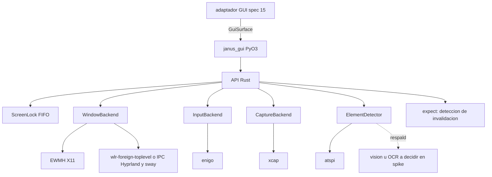

# Feature Spec: crates/gui-automation/ (automatización de GUI en Rust con binding PyO3)

> **Status**: Ready for implementation, con una fase 0 de validación técnica obligatoria (spike)
> **Last updated**: 2026-09-19
> **Orden de implementación**: 12 de 15. Independiente del resto hasta la spec 15, que lo consume desde los adaptadores GUI.

---

## Objective

Construir el mecanismo de plataforma para spokes tipo 2.4 (`architecture/03` sección 2.4, `architecture/10`): control de ventanas, mapa de elementos interactuables y síntesis de input, en Rust, expuesto a Python mediante PyO3 y maturin (`stack/10` sección 1).

Una vez implementado, un adaptador liviano por aplicación (spec 15) puede abrir y enfocar Claude Desktop o Gemini Desktop, ubicar el campo de entrada, enviar una pregunta, esperar a que termine de generar y leer la respuesta, sin que la aplicación coopere. Cuando la interfaz cambia, el mecanismo lo detecta y lo informa en lugar de fallar en silencio.

Esta spec resuelve el residual de la pregunta 11 de `architecture/09` (tecnología concreta) con una decisión propuesta y un spike que la valida.

---

## Hechos verificados (septiembre de 2026)

Estos hechos condicionan el diseño; se revisan en la fase 0.

* **Claude Desktop tiene beta oficial en Linux** desde el 30 de junio de 2026 (Ubuntu 22.04 o superior y Debian 12 o superior, x86_64 y arm64, por repositorio apt). La beta no incluye Computer Use ni dictado por voz, y no tiene soporte completo de atajos globales en Wayland. Anthropic dice que Computer Use llegará a Linux. Para otras distribuciones existen repaquetados de la comunidad.
* **Raspberry Pi OS usa Wayland por defecto** con `labwc` (compositor basado en wlroots) desde octubre de 2024, y Trixie mantiene esa dirección.
* **`enigo`** (simulación de input): en Linux funciona por defecto con X11. Wayland (protocolos de teclado virtual e input method) y libei están tras feature flags con errores conocidos; existe también un protocolo vía portal `xdg_desktop` con `restore_token` para evitar repetir el permiso. Windows y macOS están soportados.
* **`xcap`** (captura): soporta X11 y Wayland para captura de monitor o región; en el código inspeccionado la captura de ventana en Linux sigue la ruta de X11. Licencia Apache 2.0. Las versiones recientes usan `pipewire` y `zbus`.
* **`atspi`** (árbol de accesibilidad de Linux): implementación pura en Rust, asíncrona, sobre `zbus`, versión 0.29 en el momento de la verificación, licencia Apache 2.0 o MIT. Requiere un ejecutor async.

Consecuencia: no existe una solución única y estable para todos los compositores de Wayland. El diseño usa backends intercambiables y declara qué combinaciones soporta.

---

## Functional Requirements

### Fase 0: spike de validación (obligatoria antes de la API final)
1. Construir un prototipo mínimo que, en cada entorno objetivo, haga: listar ventanas, enfocar la de Claude Desktop, capturar la ventana, leer el árbol de accesibilidad, escribir texto y pulsar una tecla. Entornos mínimos: X11 (o XWayland), un compositor wlroots (por ejemplo `labwc` en el Raspberry Pi o el compositor del equipo de desarrollo) y uno de GNOME o KDE para dejar documentada la limitación.
2. Producir `crates/gui-automation/SPIKE.md` con una matriz `entorno x capacidad -> funciona | funciona con permiso | no funciona`, versiones de las bibliotecas usadas y los permisos necesarios (portal, uinput, protocolos).
3. Verificar si la aplicación Electron objetivo expone su árbol por AT-SPI sin flags especiales o requiere activar accesibilidad; documentar cómo (esto decide si `REALTIME` es viable).
4. La matriz decide el conjunto soportado de la primera versión; lo no soportado se documenta y falla con `PlatformUnsupported`.

### Traits de plataforma
5. Cuatro traits en Rust, cada uno con implementaciones seleccionables en runtime: `WindowBackend` (localizar, listar, abrir, cerrar, mover, enfocar), `InputBackend` (escribir texto, pulsar tecla y combinaciones, clic), `CaptureBackend` (captura de ventana o pantalla en memoria) y `ElementDetector` (detección de elementos).
6. Implementaciones candidatas, a confirmar con el spike: ventanas por X11 (EWMH) para X11 y XWayland, por el protocolo `wlr-foreign-toplevel-management` o la IPC del compositor (Hyprland, sway) para wlroots; input por `enigo` (X11 estable; Wayland y libei experimentales) con alternativa por `uinput` si el spike lo justifica; captura por `xcap`; detección por `atspi`.
7. `Backends::detect() -> BackendSet` elige la combinación según `XDG_SESSION_TYPE`, `WAYLAND_DISPLAY`, `DISPLAY` y `XDG_CURRENT_DESKTOP`, y permite forzarla por configuración.

### Capacidad de plataforma: control de ventana (`gui.window.control`)
8. `find_window(query) -> Vec<Window>` por `app_id` o clase, título (subcadena o regex) o `pid`. `open_app(command_or_desktop_id)` lanza la aplicación si no está abierta y espera a que aparezca la ventana (timeout configurable, default 20 s). `close_window`, `move_window` y `focus_window`.
9. Tras enfocar, `verify_focus(window)` confirma que la ventana activa es la esperada. **Toda escritura de input exige foco verificado**; si no se puede verificar, el input no se envía y se lanza `FocusNotVerified`. Es la barrera para no escribir texto en la ventana equivocada.

### Capacidad de plataforma: mapa de elementos (`gui.elements.map`)
10. `map_elements(window, options) -> ElementMap` produce la lista de elementos interactuables visibles (campos de texto, botones, enlaces, cualquier control accionable) con `id`, `role`, `name`, `text` opcional, `bbox`, `actions` y una etiqueta corta (`hint`).
11. Estrategia `REALTIME` (preferida): recorrido del árbol de accesibilidad de la ventana enfocada en el momento de necesitarlo (`architecture/10` sección 4.1), con límites de profundidad (default 40) y de nodos (default 5000) y un timeout global (default 3 s).
12. Detección de respaldo por visión (captura más análisis de imagen u OCR) solo si el spike demuestra que el árbol de accesibilidad no basta para una aplicación. La biblioteca de OCR o visión se elige en el spike, no se fija aquí.
13. Etiquetas (hints) estilo Vimium: alfabeto configurable (default `asdfghjklqwertyuiopzxcvbnm`), etiquetas de longitud mínima y libres de prefijos (ninguna etiqueta es prefijo de otra), asignadas en orden de lectura (arriba a abajo, izquierda a derecha). Son efímeras: se recalculan en cada mapeo (`architecture/10` sección 3).
14. Detección y activación son pasos separables: `activate(element_or_hint)` puede usar la acción de accesibilidad del elemento, la pulsación de su etiqueta o un clic en el centro de su `bbox`, según lo que el backend soporte y la configuración.

### Estrategias de vigencia y detección de invalidación (`architecture/10` sección 4)
15. `MappingStrategy` es `REALTIME` o `ASSISTED` y se declara por spoke (lo expone el adaptador con `GuiDrivenMixin`).
16. `ASSISTED`: `record_assisted_profile(window) -> AssistedProfile` muestra los hints detectados para que el usuario confirme o corrija cuáles son entrada, envío y salida; devuelve un perfil serializable (JSON) con anclas robustas: `role`, `name`, texto cercano y posición relativa a la ventana. La crate no persiste nada; el núcleo guarda el perfil en `preferences` con la clave `gui.assisted.<app_id>` y lo pasa de vuelta en cada llamada.
17. `expect(window, expectation) -> Result<(), InterfaceInvalidated>` verifica que los elementos esperados (por rol, nombre y región) existen. Si faltan o no responden como se esperaba, lanza `InterfaceInvalidated` con un informe (qué se esperaba, qué se vio). Se llama tras cada mapeo y antes de cada acción crítica. Con `ASSISTED`, este error es la señal para repetir la configuración asistida.

### Input y lectura
18. `type_text(text, options)`: escribe con retardo configurable entre teclas; para textos largos, prefiere pegar desde el portapapeles si el backend lo permite y restaura el contenido previo. `press_key(chord)` y `click(element_or_point)`.
19. `read_text(element) -> String`: lee el contenido de un elemento mediante la interfaz de texto de accesibilidad; como respaldo, activa la acción de copiar y lee el portapapeles. `wait_until_stable(element, settle_ms, indicator?)`: espera hasta que el texto no cambie durante `settle_ms` (default 1500) y el indicador de "generando" (si se declara) desaparezca; devuelve `Timeout` al vencer el máximo (default 120 s).

### Exclusión de pantalla y seguridad operativa
20. `ScreenLock`: un lock global de input por pantalla, FIFO y con timeout, compartido por todo el proceso (y entre procesos con un archivo de lock en `state_dir/gui.lock`). Toda operación que enfoca o teclea lo adquiere. Resuelve el caso de varias instancias GUI que pelean por la única pantalla y el foco (spec 04, casos límite).
21. Abortar: `AbortToken` cancela cualquier operación en curso en menos de 500 ms y libera el lock. Toda operación larga acepta un token. Límite de acciones por operación (default 200) y de duración total.
22. Modo `dry_run`: registra lo que haría sin enviar input.
23. Privacidad: las capturas viven solo en memoria y no se escriben a disco salvo `debug_dump_dir` explícito; el texto leído y el OCR no se registran en logs completos.

### Binding Python
24. Módulo `janus_gui` construido con maturin y PyO3, con wheels para x86_64 y aarch64 Linux. Cada función pesada libera el GIL. Errores de Rust se mapean a excepciones Python tipadas: `PlatformUnsupported`, `WindowNotFound`, `FocusNotVerified`, `InterfaceInvalidated`, `ScreenLockTimeout`, `Aborted`, `Timeout`, `PermissionRequired`.
25. La API de Python es síncrona; `libs/adapters` la envuelve con `asyncio.to_thread` (spec 04, casos límite). Se define un protocolo `GuiSurface` en `janus_gui.surface` (localizar ventana, mapear elementos, activar, escribir, leer) que los adaptadores usan y que un fake implementa en pruebas.
26. `janus_gui.probe()` devuelve el `BackendSet` detectado y la lista de capacidades disponibles para el diagnóstico del usuario.

---

## Non-Functional Requirements

* **Performance**: `map_elements` de una ventana típica menor a 500 ms p95 con árbol de accesibilidad; `find_window` menor a 100 ms; latencia de abortar menor a 500 ms. Objetivos propuestos, se ajustan con el spike.
* **Security**: foco verificado antes de teclear; sin capturas persistentes; sin registrar texto leído; permisos de portal o `uinput` documentados y mínimos; nunca ejecuta comandos arbitrarios (solo `open_app` con el identificador configurado por el usuario, no con texto del modelo).
* **Reliability**: degrada de forma explícita (`InterfaceInvalidated`) en lugar de operar a ciegas; un backend fallido no tumba el proceso de Python; timeouts en toda operación; lock con liberación garantizada.
* **Portability**: Linux x86_64 y aarch64 como prioridad real (`stack/10`). Los traits permiten añadir Windows y macOS después; no forman parte de esta versión. Licencias de dependencias compatibles con MIT (Apache 2.0 y MIT).

---

## Technical Decisions

### Detección por árbol de accesibilidad como estrategia principal
* **Chosen**: `atspi` para `REALTIME`; visión u OCR solo como respaldo.
* **Reason**: es estructural, rápida y exacta cuando la aplicación expone su árbol; encaja con el requisito de mapeo en tiempo real de `architecture/10` sección 4.1. `atspi` es pura Rust y tiene licencia compatible.
* **Rejected alternatives**: visión como primaria (más lenta, menos exacta, más frágil ante cambios de tema); coordenadas fijas (violan el requisito central de vigencia).

### Backends intercambiables, soporte declarado
* **Chosen**: traits con selección en runtime y una matriz de soporte medida en el spike.
* **Reason**: Wayland no ofrece una API única para enfocar ventanas ni inyectar input, y las opciones de `enigo` para Wayland son experimentales.
* **Rejected alternatives**: asumir X11 (el Raspberry Pi y muchos escritorios modernos usan Wayland); una sola biblioteca para todo (no existe).

### Foco verificado como precondición del input
* **Chosen**: `verify_focus` obligatorio antes de teclear.
* **Reason**: escribir en la ventana equivocada filtra datos y ejecuta acciones no deseadas; es el riesgo más serio de esta pieza.
* **Rejected alternatives**: confiar en que `focus_window` funcionó.

### Lock global de pantalla en la crate
* **Chosen**: `ScreenLock` FIFO en la propia crate.
* **Reason**: la pantalla es un recurso único; el lock pertenece a la plataforma de GUI, no a cada adaptador (spec 04). `GuiDrivenMixin` fija concurrencia 1 por adaptador y el lock serializa entre adaptadores.
* **Rejected alternatives**: un lock en `core-gateway` (acopla el núcleo a un detalle de plataforma).

### Perfil asistido guardado por el núcleo
* **Chosen**: la crate devuelve el perfil y el núcleo lo persiste en `preferences`.
* **Reason**: la persistencia transversal pertenece al núcleo (`architecture/06`); la crate queda sin estado y probable.
* **Rejected alternatives**: que la crate escriba archivos propios (segunda fuente de verdad).

---

## Proposed Architecture

### Component Diagram


### Directory Structure
```
crates/gui-automation/
  Cargo.toml
  pyproject.toml            # maturin
  SPIKE.md                  # matriz de soporte medida en la fase 0
  src/
    lib.rs
    backends/  mod.rs detect.rs window_x11.rs window_wlr.rs input_enigo.rs capture_xcap.rs detector_atspi.rs
    elements.rs             # ElementMap, Element, hints libres de prefijo
    invalidation.rs         # expect, InterfaceInvalidated
    lock.rs                 # ScreenLock
    abort.rs                # AbortToken
    errors.rs
    py/                     # binding PyO3
  python/janus_gui/
    __init__.py  surface.py  fake.py  probe.py
  tests/
```

---

## Data Models

```
Entity Window      { id, app_id, title, pid, geometry: Rect, focused: bool, backend: string }
Entity Element     { id, role, name, text?, bbox: Rect, actions: [string], hint: string }
Entity ElementMap  { window_id, elements: [Element], taken_at, strategy: REALTIME|ASSISTED }
Entity Expectation { role, name_pattern?, region?: Rect, required: bool }
Entity AssistedProfile { app_id, version, input: Anchor, submit: Anchor, output: Anchor, indicator?: Anchor }
Entity Anchor      { role, name, nearby_text?, relative_position: {x: f32, y: f32} }
Entity BackendSet  { window, input, capture, detector, session_type, compositor }
```

---

## API Contracts

Superficie de Python (`janus_gui`, síncrona):

```
probe() -> BackendSet
find_window(query: WindowQuery) -> list[Window]      open_app(target: str, timeout_s: float = 20) -> Window
focus_window(window: Window) -> None                 verify_focus(window: Window) -> bool
map_elements(window: Window, strategy: str = "realtime", profile: AssistedProfile | None = None) -> ElementMap
expect(window: Window, expectations: list[Expectation]) -> None       # InterfaceInvalidated
activate(target: Element | str, mode: str = "auto") -> None
type_text(text: str, delay_ms: int = 8) -> None      press_key(chord: str) -> None
read_text(element: Element) -> str
wait_until_stable(element: Element, settle_ms: int = 1500, indicator: Element | None = None, timeout_s: float = 120) -> str
record_assisted_profile(window: Window) -> AssistedProfile
screen_lock(timeout_s: float = 60) -> ContextManager      new_abort_token() -> AbortToken
```

Excepciones: `PlatformUnsupported`, `WindowNotFound`, `FocusNotVerified`, `InterfaceInvalidated`, `ScreenLockTimeout`, `Aborted`, `Timeout`, `PermissionRequired`.

---

## Edge Cases

| Case | How to Handle |
|---|---|
| Wayland en GNOME o KDE sin backend soportado | `PlatformUnsupported` con instrucciones; la matriz del spike lo documenta. |
| El árbol de accesibilidad de una app Electron está vacío | Se documenta cómo activar accesibilidad para esa app; si no basta, respaldo por visión o `ASSISTED`. |
| Foco robado por otra ventana entre enfocar y teclear | `verify_focus` inmediato antes de cada escritura; `FocusNotVerified` y nada se envía. |
| Varias ventanas de la misma app (varios perfiles) | `find_window` devuelve todas; el adaptador elige por título o `pid`; el lock serializa el uso. |
| La app cambia de tema o de layout | El mapeo en tiempo real ya refleja el cambio; si faltan elementos esperados, `InterfaceInvalidated`. |
| Actualización de la app rompe el perfil asistido | `expect` falla; el adaptador informa `requires_user_action` y pide repetir la configuración. |
| Respuesta aún generándose | `wait_until_stable` espera a que el texto se estabilice y desaparezca el indicador. |
| Una respuesta enorme | `read_text` pagina y limita; el adaptador decide el límite. |
| Dos adaptadores piden pantalla a la vez | `ScreenLock` FIFO; el segundo espera o vence por timeout. |
| Usuario usa el equipo mientras Janus opera | El foco puede cambiar; `verify_focus` lo detecta y `Aborted` o `FocusNotVerified` protege; se recomienda operar en un espacio de trabajo dedicado. |
| Portal o `uinput` sin permiso | `PermissionRequired` con el paso exacto para concederlo. |
| Texto con caracteres especiales | Se prefiere pegar desde el portapapeles; si no, `type_text` reporta caracteres no soportados. |
| Sesión sin pantalla (servidor sin GUI) | `probe()` lo detecta y todo lo GUI falla con `PlatformUnsupported`. |

---

## Testing Requirements

**Unit Tests** (Rust): generación de hints libres de prefijo para N elementos con distintos alfabetos; orden de lectura; `expect` con elementos presentes, ausentes y desplazados; `ScreenLock` FIFO y timeout; `AbortToken`; mapeo de errores a Python; detección de backends con variables de entorno simuladas; todo contra `FakeWindowBackend`, `FakeInputBackend` y `FakeDetector`.

**Integration Tests**: una aplicación de prueba propia (GTK, Qt o egui) con campo de texto, botón y área de salida, ejecutada bajo Xvfb y bajo un compositor wlroots sin cabeza (por ejemplo `sway` o `labwc` con backend headless); ciclo completo: abrir, enfocar, mapear, escribir, activar, leer, invalidar cambiando el layout y verificar `InterfaceInvalidated`; dos hilos compitiendo por `ScreenLock`; abortar en medio de una escritura larga; los wheels de maturin se instalan y `probe()` corre en aarch64 (prueba manual en el Raspberry Pi).

**Pruebas manuales documentadas**: matriz del spike sobre Claude Desktop (beta de Linux) y Gemini Desktop si existe en la plataforma.

---

## Security Checklist
- [ ] Foco verificado antes de todo envío de input
- [ ] Capturas solo en memoria; volcado a disco solo con opción explícita de depuración
- [ ] Texto leído y OCR no se registran completos
- [ ] `open_app` solo con objetivos definidos por el usuario en la config
- [ ] Permisos de portal y `uinput` mínimos y documentados
- [ ] Abortar y límites de acciones y de duración en toda operación
- [ ] Dependencias con licencia compatible y auditadas (`cargo audit`, `cargo deny`)

---

## Open Questions
- [ ] Resultado del spike: qué entornos quedan soportados en la primera versión. Actualizar esta spec y `stack/10` al terminarlo.
- [ ] Confirmar el compositor y el escritorio del equipo de desarrollo y del Raspberry Pi para elegir el primer backend de ventanas Wayland.
- [ ] Biblioteca de respaldo por visión u OCR: se decide en el spike solo si el árbol de accesibilidad de la app objetivo no basta.
- [ ] Claude Desktop en Linux promete Computer Use a futuro: si llega y expone una interfaz programática, ese spoke migra a tipo 2.1 y este mecanismo deja de usarse para él (`architecture/10` sección 6).
- [ ] Soporte de Windows y macOS: fuera de alcance de esta versión; los traits lo permiten.

---

## Handoff Note
Revisar esta spec antes de empezar. Crear un checklist desde los requisitos funcionales y marcarlo al avanzar. Levantar dudas antes de codificar, no durante. Empezar por la fase 0 (spike) y no fijar la API final hasta tener `SPIKE.md`; después implementar traits y fakes, `elements.rs` y `invalidation.rs`, luego los backends, y al final el binding.
