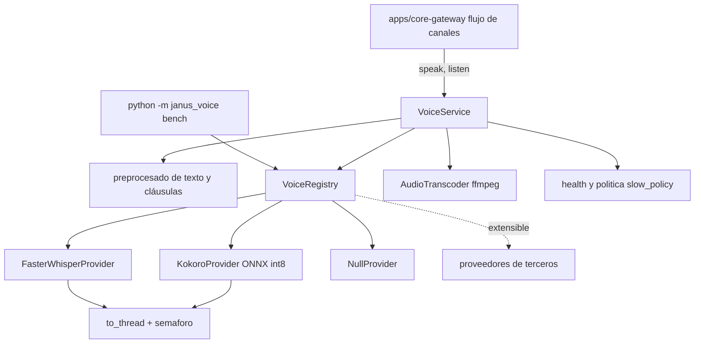

# Feature Spec: libs/voice/ (TTS y STT propios de Janus)

> **Status**: Ready for implementation, con una compuerta de rendimiento en el Raspberry Pi
> **Last updated**: 2026-09-19
> **Orden de implementación**: 13 de 15. Depende de: spec 02 (proveedores por agente). Lo consume `apps/core-gateway` (spec 11).

---

## Objective

Construir la librería de voz propia de Janus (`stack/05` sección 3, `agents/05`): síntesis (TTS) y reconocimiento (STT) con proveedores intercambiables por agente y defaults gratuitos y ligeros.

Resuelve el residual de la pregunta 8 de `architecture/09`: dónde vive el código propio de voz. Vive aquí, en `libs/voice/`, y la invoca el núcleo, no el motor de razonamiento (el voice mode de Hermes no se extrae).

Una vez implementada, `core-gateway` puede convertir la respuesta de texto de un agente en audio con la voz de ese agente, y transcribir el audio entrante de un canal antes de dárselo a Janus, con fallback a texto cuando la síntesis falla.

Alcance de la primera versión: conversación por turnos (notas de voz y clips), que es lo que entregan los canales. La conversación dúplex en tiempo real (detección de actividad de voz, interrupción del usuario) queda fuera y se registra como pregunta abierta.

---

## Functional Requirements

### Contratos
1. `TTSProvider` (ABC): `id`, `voices() -> list[VoiceInfo]`, `synthesize(text, voice, params) -> AsyncIterator[AudioChunk]` (streaming por cláusulas) y `close()`. `STTProvider` (ABC): `id`, `transcribe(audio, language=None) -> Transcript` y `close()`.
2. Referencias de proveedor con formato `nombre` o `nombre:variante`, por ejemplo `kokoro:af_heart` o `whisper:small`. Es el valor de `voice_provider` en `AgentPersona` y de `voice.tts.default` y `voice.stt.default` en `janus.toml` (spec 02).
3. `VoiceRegistry` resuelve referencias a instancias, con caché de proveedores cargados y descarga perezosa de modelos. Un proveedor desconocido lanza `VoiceProviderNotFound` con la lista de disponibles.
4. `VoiceService` es la fachada para el núcleo: `speak(persona, text) -> AudioClip` y `listen(audio, language=None) -> Transcript`. Aplica la voz del agente, el preprocesado de texto y la codificación de salida.

### Proveedores de fábrica
5. `KokoroProvider`: TTS local con Kokoro (82M parámetros, licencia Apache 2.0) ejecutado por ONNX en CPU, con el modelo cuantizado int8 por defecto. Selección de voz e idioma por `params`. No soporta control de emoción, tono ni ritmo; los campos `tone` de la persona se ignoran para este proveedor y se registra un aviso una vez.
6. `FasterWhisperProvider`: STT local con `faster-whisper` (implementación de Whisper sobre CTranslate2, con wheels para aarch64). Modelo configurable (`tiny`, `base`, `small`), con `small` como punto de partida para español. Detección de idioma automática o forzada.
7. `NullProvider` para TTS y STT: devuelve error controlado y permite desactivar la voz de un agente sin condicionales en el núcleo.
8. Los proveedores externos (ElevenLabs, Fish Speech u otro) no se implementan en v1, pero la ABC y el registro los admiten sin cambios: un tercero agrega un proveedor registrándolo por ruta punteada `paquete.modulo:Clase` en `janus.toml`, con `settings` validados por un `config_model` Pydantic, igual que los adaptadores (spec 04).

### Audio y texto
9. Formato interno: PCM de 16 bits, mono, con la frecuencia del proveedor (Kokoro emite 24 kHz). `AudioClip` lleva `pcm`, `sample_rate` y `duration_s`.
10. `AudioTranscoder` convierte entre PCM y los formatos de los canales (Ogg Opus para notas de voz, WAV, MP3) usando el binario `ffmpeg` por subproceso asíncrono. `ffmpeg` es una dependencia de sistema opcional; sin ella solo se soporta WAV y `VoiceService` lo informa.
11. Preprocesado de texto para TTS: elimina bloques de código, enlaces largos y formato Markdown; expande abreviaturas y números si el proveedor lo pide; divide en cláusulas de máximo 250 caracteres para reproducción incremental y para acotar la latencia del primer audio. Un texto vacío tras limpiar no genera audio.
12. Límites: texto máximo por llamada (default 2000 caracteres tras limpieza) y duración de audio entrante máxima (default 120 s). Excederlos lanza `VoiceInputTooLarge`.

### Ejecución
13. La inferencia es CPU intensiva: corre fuera del event loop (`asyncio.to_thread`) y con un semáforo (default 1 en CPU pequeña, configurable) para no saturar el host mientras el motor razona.
14. Los modelos se descargan a `state_dir/models/voice/` con verificación de hash y reintento. Sin modelo disponible y sin red, el proveedor lanza `VoiceModelUnavailable` y el núcleo envía texto.
15. `VoiceService.health()` informa por proveedor: cargado o no, RTF medido reciente, último error. Se expone por `Observe`.

### Compuerta de rendimiento
16. `python -m janus_voice bench` mide, para cada proveedor configurado, el tiempo hasta el primer audio (TTFB), el factor de tiempo real (RTF, tiempo de síntesis dividido por duración del audio) y el consumo de memoria pico, sobre un texto de referencia en español e inglés.
17. Si el RTF medido supera `voice.rtf_warn` (default 1.0), `VoiceService` marca el proveedor `DEGRADED` y aplica la política `voice.slow_policy`: `stream` (reproducción incremental por cláusulas, valor por defecto), `text_only` (envía solo texto) o `remote` (usa un proveedor alternativo configurado). No se decide en silencio: el cambio se informa por logs y `Observe`.

### Integración con el núcleo
18. Los ids de capacidad de voz son `voice.tts.synthesize` y `voice.stt.transcribe` (spec 01). El núcleo los publica en el Registro como capacidades propias (dueño `janus-voice` en `harnesses.owners`), de modo que cualquier spoke pueda pedirlas por delegación. Esto respeta el Principio #1: nadie llama a `libs/voice` de forma directa fuera del núcleo.
19. La activación de voz por agente es un campo de recarga en caliente (`voice_provider`, spec 02): cambiar la voz no reinicia la sesión de razonamiento.

---

## Non-Functional Requirements

* **Performance**: objetivos propuestos, a confirmar con `bench`: en el Raspberry Pi 4 o 5, primer audio de una frase corta menor a 4 s y RTF menor a 1.0 con modelo int8; en un PC de escritorio, primer audio menor a 1 s. Se registran cifras de terceros como riesgo: se reportó RTF cercano a 1.5 con Kokoro por ONNX en Pi (más lento que el habla), y una variante optimizada para Pi lo llevó a cerca de 0.45. Si no se cumple, aplica la política de la sección 17.
* **Security**: el audio y las transcripciones son datos personales; no se guardan salvo `voice.keep_audio = true`; no se registran transcripciones completas en logs; una transcripción es entrada no confiable y solo llega a Janus si el remitente fue verificado (spec 11); sin envío de audio a terceros salvo un proveedor remoto configurado explícitamente.
* **Reliability**: un fallo de voz nunca impide la respuesta: se degrada a texto. Modelos verificados por hash; semáforo para no saturar CPU; toda espera respeta la cancelación.
* **Portability**: Python 3.11 o superior; wheels aarch64 para las dependencias de inferencia (a verificar en la instalación). Dependencias: `pydantic`, `onnxruntime` y el paquete de Kokoro, `faster-whisper`; `ffmpeg` y `espeak-ng` como dependencias de sistema documentadas (el fonemizador de Kokoro suele requerir `espeak-ng`). Prohibido importar `libs/adapters`, `libs/capabilities` y `apps/*`.

---

## Technical Decisions

### Kokoro por ONNX int8 como TTS por defecto
* **Chosen**: Kokoro-82M cuantizado, ejecutado con ONNX Runtime en CPU.
* **Reason**: decisión de `agents/05`: gratuito, ligero, Apache 2.0, sin GPU. La variante ONNX evita arrastrar PyTorch en el Pi.
* **Rejected alternatives**: Kokoro con PyTorch (peso excesivo en el Pi); TTS remoto por defecto (rompe el criterio de uso local y gratuito); modelos más expresivos (mayor peso, para agentes que lo justifiquen vía proveedor externo).

### Reproducción incremental por cláusulas como mitigación
* **Chosen**: dividir en cláusulas y emitir audio a medida que se sintetiza.
* **Reason**: baja la latencia percibida aunque el RTF sea cercano a 1; es la técnica que las variantes optimizadas para Pi usan y no exige cambiar de modelo.
* **Rejected alternatives**: sintetizar el texto completo antes de enviar (latencia alta en el Pi).

### `faster-whisper` como STT por defecto
* **Chosen**: `faster-whisper` con CTranslate2.
* **Reason**: decisión de `agents/05` y ya usado en el ecosistema de Hermes; hay wheels de CTranslate2 para aarch64 (en instalaciones de 64 bits).
* **Rejected alternatives**: Whisper original con PyTorch (más pesado); STT remoto por defecto.

### Voz como capacidad del núcleo, no del motor
* **Chosen**: `voice.*` registrado como capacidad del núcleo y llamado por `core-gateway`.
* **Reason**: `stack/05` sección 3: la invocación de voz es de Janus, incluso si el proveedor es uno que Hermes también soporta.
* **Rejected alternatives**: activar la voz dentro del motor (acopla voz a razonamiento y a la limitación de control expresivo de Hermes).

### Turnos, no dúplex, en v1
* **Chosen**: notas de voz y clips.
* **Reason**: es lo que entregan los canales de mensajería; el dúplex en tiempo real exige detección de actividad de voz, cancelación de eco y una pila de audio local que hoy no tiene dueño.
* **Rejected alternatives**: dúplex desde el inicio (alcance grande sin necesidad inmediata).

---

## Proposed Architecture

### Component Diagram


### Directory Structure
```
libs/voice/
  pyproject.toml
  src/janus_voice/
    __init__.py
    service.py        # VoiceService
    registry.py       # VoiceRegistry, referencias de proveedor
    base.py           # TTSProvider, STTProvider, AudioChunk, AudioClip, Transcript
    text.py           # limpieza y división en cláusulas
    transcode.py      # AudioTranscoder (ffmpeg)
    models.py         # descarga y verificación de modelos
    providers/        kokoro.py  whisper.py  null.py
    bench.py  __main__.py
    errors.py
  tests/
```

---

## Data Models

```
Entity VoiceInfo   { id, language, gender?, description }
Entity AudioClip   { pcm: bytes, sample_rate: int, duration_s: float }
Entity AudioChunk  { pcm: bytes, sample_rate: int, index: int, is_last: bool }
Entity Transcript  { text: str, language: str, confidence?: float, duration_s: float }
Entity VoiceHealth { provider_id, loaded: bool, state: HEALTHY|DEGRADED|UNAVAILABLE, rtf?: float, last_error?: str }
Config voice       { tts.default, stt.default, rtf_warn=1.0, slow_policy: stream|text_only|remote,
                     keep_audio=false, max_text_chars=2000, max_audio_s=120, concurrency=1 }
```

---

## API Contracts

Librería, sin API de red. Superficie:

```
VoiceService.speak(persona: AgentPersona, text: str, out_format: str = "ogg_opus") -> AudioClip
VoiceService.speak_stream(persona, text) -> AsyncIterator[AudioChunk]
VoiceService.listen(audio: bytes, mime: str, language: str | None = None) -> Transcript
VoiceService.health() -> list[VoiceHealth]
VoiceRegistry.get_tts(ref: str) -> TTSProvider        VoiceRegistry.get_stt(ref: str) -> STTProvider
CLI: python -m janus_voice bench [--tts ref] [--stt ref] [--lang es|en]
Errores: VoiceProviderNotFound, VoiceModelUnavailable, VoiceInputTooLarge, TranscodeUnavailable, VoiceProviderError
```

Capacidades registradas por el núcleo (`CapabilityDescriptor`): `voice.tts.synthesize` (entrada `text/plain`, salida `audio/ogg`) y `voice.stt.transcribe` (entrada `audio/*`, salida `text/plain`).

---

## Edge Cases

| Case | How to Handle |
|---|---|
| Modelo no descargado y sin red | `VoiceModelUnavailable`; el núcleo responde solo con texto. |
| RTF mayor a 1 en el Pi | Marca `DEGRADED` y aplica `slow_policy` (por defecto reproducción incremental), avisando por logs. |
| Texto que es solo código o formato | Tras limpiar queda vacío: no se genera audio y se responde con texto. |
| Audio entrante largo | `VoiceInputTooLarge`; el núcleo informa al usuario del límite. |
| Idioma no detectado o no soportado por la voz | Se usa la voz por defecto del idioma o se degrada a texto; se registra. |
| `ffmpeg` ausente | Solo WAV; `TranscodeUnavailable` para otros formatos, con la causa clara. |
| Persona con `tone` y proveedor sin control de tono | Se ignora y se avisa una sola vez. |
| Dos síntesis simultáneas en CPU pequeña | Semáforo: la segunda espera; no se satura el host. |
| Proveedor de terceros que falla al cargar | `VoiceProviderError`; se marca `UNAVAILABLE` y el agente usa `NullProvider`. |
| Transcripción con contenido tipo instrucción | Se trata como entrada de usuario no confiable, sin privilegios de sistema. |

---

## Testing Requirements

**Unit Tests**: limpieza de texto y división en cláusulas (Markdown, código, enlaces, números); resolución de referencias de proveedor; `NullProvider`; límites; política `slow_policy`; degradación a texto; carga de un proveedor de terceros por ruta punteada; todo con proveedores falsos deterministas.

**Integration Tests**: síntesis real con Kokoro y transcripción real con `faster-whisper` en una prueba lenta marcada (ciclo texto, audio, texto con una tolerancia en la coincidencia); transcodificación a Ogg Opus con `ffmpeg`; `bench` con salida verificable; concurrencia con semáforo; ejecución del `bench` en el Raspberry Pi como prueba manual documentada, cuyo resultado se registra en `libs/voice/BENCH.md`.

---

## Security Checklist
- [ ] Audio y transcripciones no se guardan por defecto
- [ ] Sin transcripciones completas en logs
- [ ] Transcripción tratada como entrada no confiable
- [ ] Modelos descargados verificados por hash
- [ ] Proveedores remotos solo si el usuario los configura explícitamente
- [ ] Inferencia acotada por semáforo y fuera del event loop

---

## Open Questions
- [ ] Calidad de Kokoro en español y elección de voz por defecto para un usuario hispanohablante: validar con `bench` y escucha. Si no alcanza, evaluar otro proveedor local para español.
- [ ] Si el RTF en el Pi es inaceptable con ONNX, evaluar una variante optimizada para Pi (existe un proyecto de terceros con kernels int8 para ARM) o un proveedor remoto local en otro host. Decidir con datos del `bench`.
- [ ] Conversación dúplex en tiempo real (VAD, interrupción, eco): sin dueño hoy; si se quiere, requiere spec propia.
- [ ] Nombre de la variante de modelo de `faster-whisper` por defecto en el Pi (`base` o `small`), según memoria y latencia medidas.

---

## Handoff Note
Revisar esta spec antes de empezar. Crear un checklist desde los requisitos funcionales y marcarlo al avanzar. Levantar dudas antes de codificar, no durante. Implementar primero contratos, registro y `text.py` con proveedores falsos; luego `bench`, para tener cifras reales antes de invertir en pulir los proveedores.
