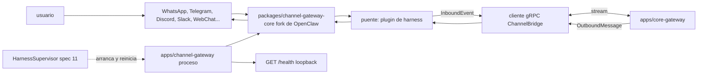

# Feature Spec: packages/channel-gateway-core/ y apps/channel-gateway/ (fork de OpenClaw como transporte de canales)

> **Status**: Ready for implementation, con una fase 0 de auditoría del fork
> **Last updated**: 2026-09-19
> **Orden de implementación**: 14 de 15. Depende de: spec 01 (proto, generación TypeScript) y del contrato `ChannelBridge` que implementa la spec 11. Se puede desarrollar contra un `FakeCore`.

---

## Objective

Convertir el fork completo de OpenClaw (`stack/05` sección 2) en el harness de canales de Janus: puro transporte multi canal, sin razonamiento, sin identidad de agente propia y sin voz.

Una vez implementado:
* Un mensaje que llega por WhatsApp, Telegram, Discord, Slack u otro canal soportado llega a `core-gateway` como `InboundEvent`.
* Lo que Janus produce sale al canal como `OutboundMessage`, con la identidad visual correcta.
* `channel-gateway` corre como proceso propio (Node), supervisado por el núcleo, y su caída o error no afecta al resto.

Esta spec cubre el fork y su puente. La verificación de identidad de segunda capa, la orquestación y la voz son del núcleo (spec 11 y spec 13).

---

## Hechos verificados (septiembre de 2026)

* OpenClaw es un asistente personal de código abierto con licencia MIT según su README, mantenido por la OpenClaw Foundation. Es un espacio de trabajo `pnpm` que exige Node 22 o superior y publica versiones fechadas (`vAAAA.M.D`).
* Su Gateway es un proceso de larga vida que actúa como plano de control de sesiones, canales, tools y eventos. Soporta más de 20 canales (WhatsApp, Telegram, Slack, Discord, Google Chat, Signal, iMessage y otros, más WebChat).
* Por defecto, los mensajes directos de remitentes desconocidos requieren emparejamiento (`pairing`): reciben un código y el bot no procesa su mensaje hasta que el usuario lo aprueba, tras lo cual el remitente entra en una lista local de permitidos. Los mensajes entrantes se tratan como entrada no confiable.
* Los modelos y los harnesses de agente (Claude, Codex, modelos locales) son plugins intercambiables, lo que ofrece un punto de integración limpio para reemplazar la ejecución de agentes por un puente hacia Janus.
* La documentación del propio proyecto y de Janus (`agents/04` sección 4) reportan errores activos con multi token (confusión de identidad entre bots por enrutamiento incorrecto y filtrado que impide que los bots se vean entre sí).

Todo esto se revalida en la fase 0.

---

## Functional Requirements

### Fase 0: auditoría del fork (obligatoria antes de codificar)
1. Fijar un tag o commit de `openclaw/openclaw`, confirmar el archivo `LICENSE` (el README indica MIT) y conservar el aviso de copyright junto con el de Joanfer (`stack/10` sección 2).
2. Producir `packages/channel-gateway-core/UPSTREAM.md` con: versión fijada, inventario de canales y de subsistemas (agentes, memoria, skills, cron, canvas, voz, apps nativas, interfaz de control), y para cada subsistema `mantener | desactivar por configuración | eliminar`, con motivo.
3. Elegir el punto de integración con el menor diff posible respecto a upstream. Orden de preferencia: (a) un plugin de harness de agente propio que sustituya la ejecución de agentes por el puente hacia Janus; (b) una extensión en el enrutamiento de entrada; (c) parche en el código de enrutamiento. La elección y su justificación quedan en `UPSTREAM.md`.
4. Refactor limitado a lo necesario (`stack/05` sección 2): configuración, forma de recibir instrucciones de `core-gateway` y desactivación de lo que compite con Janus. El resto del comportamiento de gateway multi canal se preserva.

### Estructura de procesos
5. `packages/channel-gateway-core/` contiene el fork. `apps/channel-gateway/` es el proceso ejecutable que lo importa: carga la configuración de runtime, arranca el gateway, levanta el puente y expone `/health`.
6. `channel-gateway` es cliente gRPC del núcleo, no servidor: abre `ChannelBridge.Stream` hacia `core-gateway`. Su única escucha es un endpoint HTTP de salud en loopback en `harnesses.channel-gateway.port`. Esto aclara el ejemplo de `stack/07` sección 1.1, donde `port` es ese endpoint.
7. Ningún componente del gateway llama a un modelo de lenguaje ni ejecuta tools de agente. Se desactiva por configuración y se verifica con una prueba (requisito 22).

### Puente hacia el núcleo (`ChannelBridge`)
8. Al arrancar, el proceso lee el token interno de un archivo `0600` cuyo camino recibe por variable de entorno (nunca por argumento de línea de comandos), abre el stream y envía `ChannelHello` con la versión del gateway y la lista de canales y cuentas configuradas.
9. Cada mensaje entrante de un canal se normaliza a `InboundEvent`: `event_id`, `platform`, `channel_id`, `account_id`, `sender` (`UntrustedSender` con los campos crudos de la plataforma, sin ninguna marca de confianza), `content` (`Payload` de texto o binario con `content_type`), `received_at` y `metadata` (hilo, mensaje respondido, menciones).
10. Cada `OutboundMessage` del núcleo se entrega por el canal y cuenta indicados y se responde con un `DeliveryReceipt`. Un fallo de entrega devuelve `delivered = false` con `ErrorInfo` (`retryable`); la política de reintentos es del núcleo (spec 09), no del gateway.
11. Reconexión: si el stream se cae, el proceso reintenta con backoff exponencial (base 500 ms, tope 30 s). Los eventos entrantes durante la desconexión se guardan en una cola acotada (100 eventos, vida máxima 5 minutos); al desbordar se descarta el más antiguo con un aviso. Los mensajes salientes no se generan mientras no hay puente.
12. Idempotencia: cada `OutboundMessage.message_id` se entrega como máximo una vez aunque el núcleo lo reenvíe tras una reconexión (tabla de ids recientes acotada).

### Identidad de remitente y seguridad de entrada
13. Se conserva tal cual el emparejamiento y la lista de permitidos de OpenClaw como primera capa (`spec 11`, requisito 26). El gateway nunca añade una marca que el núcleo pueda interpretar como "confiable"; el núcleo siempre revalida contra `identity.owner`.
14. Un remitente sin emparejar no genera `InboundEvent`. El evento de emparejamiento pendiente se publica al núcleo como metadato de estado (`pairing_pending`) para que Janus pueda avisar al usuario.
15. Prevención de bucles: el gateway ignora los mensajes cuyo autor es una de sus propias cuentas de bot (incluidas las cuentas `own_bot` de subagentes) para que dos bots no se respondan entre sí.

### Identidad visual (`agents/04` sección 4)
16. `SpeakerIdentity.mode` gobierna cómo sale cada mensaje: `JANUS` (por defecto, bot principal), `SHARED_WITH_PREFIX` (el mensaje sale por el bot de Janus con el texto prefijado `[Agente]: ` usando `display_prefix`) y `OWN_BOT` (sale por la cuenta indicada en `bot_account_id`, configurada en la sección `channels`).
17. El enrutamiento saliente es explícito por `(platform, account_id)`; nunca se infiere. Es la mitigación de los errores conocidos de confusión de identidad entre bots.
18. Modo `OWN_BOT` con una cuenta no configurada: el gateway devuelve un `DeliveryReceipt` con error `ACCOUNT_NOT_CONFIGURED` en lugar de caer a otra cuenta.

### Medios y voz
19. Los adjuntos entrantes (imagen, audio, archivo) se entregan como `Payload.binary` con `content_type` y límite de tamaño (default 25 MiB, configurable). El audio se entrega crudo; el gateway no transcribe nada (la voz es del núcleo, spec 13).
20. Los audios salientes (Ogg Opus u otro) se entregan como nota de voz en los canales que lo soportan y como archivo adjunto en los demás. Las funciones de voz propias de OpenClaw (activación por voz, modo conversación, TTS) se desactivan.

### Configuración y salud
21. La configuración de runtime la genera el núcleo a partir de `janus.toml` (sección `channels`, spec 02): cuentas por plataforma, credenciales por referencia (`SecretRef` resuelto por el núcleo y escrito en un archivo de runtime `0600` bajo `state_dir`), listas de permitidos y límites. El gateway no lee `janus.toml` ni guarda credenciales fuera de ese archivo.
22. Prueba de contención obligatoria: con la configuración de Janus el gateway no abre conexiones hacia proveedores de modelos, no ejecuta tools y no persiste memoria de conversación. Se verifica con una prueba que observa las conexiones salientes del proceso.
23. `GET /health` en loopback devuelve `{ bridge_connected, gateway_version, channels: { plataforma: { account_id, state } } }`. El supervisor del núcleo lo usa junto con el estado del stream.
24. Cierre ordenado por `SIGTERM`: deja de aceptar mensajes, entrega o descarta lo pendiente de forma acotada (máximo 10 s) y cierra el stream.
25. Se desactivan las actualizaciones automáticas y cualquier telemetría del fork; la política de versiones es la del apartado de mantenimiento.

### Mantenimiento frente a upstream
26. `stack/05` sección 4 fija una política solo para Hermes. Para OpenClaw el usuario
    confirmó **sin cadencia fija**: no hay revisión mensual programada. El upstream se
    revisa solo ante un disparador concreto: un aviso de seguridad público contra
    OpenClaw, o un canal que deja de funcionar por un cambio de protocolo/API del lado
    de la plataforma de mensajería. Los cambios relevantes se portan al fork con
    criterio cuando el disparador ocurre, no se hace merge automático ni por calendario.

---

## Non-Functional Requirements

* **Performance**: latencia añadida por el puente (normalizar y reenviar un mensaje) menor a 20 ms p95; memoria en reposo del proceso menor a 350 MiB con 3 canales activos (objetivo, depende de lo que el fork mantenga); arranque menor a 10 s. Propuestos, se ajustan tras medir.
* **Security**: token por archivo `0600`, nunca por línea de comandos; credenciales de canal solo en el archivo de runtime; escucha únicamente en loopback; entrada de canal tratada como no confiable; el gateway no puede autorizar nada; sin acceso a modelos ni ejecución de tools.
* **Reliability**: reconexión con backoff; cola de entrada y de salida acotadas; entrega idempotente; caída del gateway no afecta al núcleo (el supervisor lo reinicia según la política, spec 11); errores de una plataforma no tumban las demás.
* **Portability**: Node 22 o superior, `pnpm`, Linux x86_64 y aarch64. Sin extensiones nativas propias más allá de las que traiga el fork (auditar en la fase 0 las de arquitectura ARM).

---

## Technical Decisions

### Fork completo con integración por el punto de menor diff
* **Chosen**: fork completo (decisión de `stack/05`) con puente por plugin de harness cuando la auditoría lo permita.
* **Reason**: el rol del gateway ya coincide con lo que Janus necesita; un plugin mantiene el diff pequeño y hace viable portar seguridad y cambios de canales desde upstream.
* **Rejected alternatives**: reescribir un gateway multi canal (repite años de trabajo con las APIs de cada plataforma); usar el gateway como spoke externo con su propio agente (viola la división de responsabilidades de `stack/05` sección 3).

### El gateway es cliente gRPC, no servidor
* **Chosen**: `channel-gateway` abre el stream hacia `core-gateway`.
* **Reason**: solo el núcleo escucha; simplifica la red en un solo host y evita un segundo servidor con autenticación propia.
* **Rejected alternatives**: que el núcleo se conecte al gateway (dos servidores y direcciones que gestionar).

### Enrutamiento saliente explícito por cuenta
* **Chosen**: `(platform, account_id)` obligatorio, sin inferencia.
* **Reason**: mitiga los errores conocidos de confusión entre bots en modos multi cuenta.
* **Rejected alternatives**: elegir la cuenta por contexto de conversación (fuente del bug reportado).

### Sin transcripción ni voz en el gateway
* **Chosen**: el gateway entrega y recibe bytes de audio.
* **Reason**: la voz es territorio exclusivo de Janus (`stack/05` sección 3) y las funciones de voz de OpenClaw tienen limitaciones de control expresivo.
* **Rejected alternatives**: usar la voz de OpenClaw (duplica capacidad y rompe la división de responsabilidades).

### Credenciales en un archivo de runtime generado por el núcleo
* **Chosen**: el núcleo resuelve `SecretRef` y escribe un archivo `0600`.
* **Reason**: una sola fuente de configuración (`janus.toml`, spec 02) sin duplicar secretos en dos formatos editados a mano.
* **Rejected alternatives**: que el usuario configure OpenClaw por separado (dos fuentes de verdad; contradice `stack/06` sección 5).

---

## Proposed Architecture

### Component Diagram


### Directory Structure
```
packages/
  channel-gateway-core/
    UPSTREAM.md            # versión fijada, licencia, inventario, decisiones
    LICENSE                # aviso de OpenClaw y de Joanfer
    ...                    # fork de OpenClaw (pnpm workspace)
    src/janus-bridge/      # plugin de harness: puente hacia core-gateway
  proto-ts/                # código TypeScript generado desde proto/ (spec 01)
apps/
  channel-gateway/
    package.json
    src/
      main.ts              # arranque, carga de runtime config, health
      bridge-client.ts     # ChannelBridge.Stream, reconexión, colas
      normalize.ts         # mensaje de canal <-> InboundEvent / OutboundMessage
      identity.ts          # SpeakerIdentity, enrutamiento por cuenta
      dedupe.ts            # idempotencia de salida
      health.ts
    test/
```

---

## Data Models

Los mensajes son los de `janus.v1` (spec 01). Modelos propios del proceso:

```
Entity RuntimeConfig   { core_address, token_file, health_port, channels: {platform: [ChannelAccount]},
                         limits: {max_attachment_bytes, inbound_queue, inbound_ttl_s, outbound_queue} }
Entity ChannelAccount  { account_id, platform, credentials_ref (resuelta en el archivo), allowlist, role: "main"|"agent_bot" }
Entity PendingInbound  { event: InboundEvent, queued_at }
Entity SentRecord      { message_id, at }        # ventana acotada para idempotencia
```

---

## API Contracts

```
gRPC cliente:  ChannelBridge.Stream(stream ChannelUp) returns (stream ChannelDown)   [spec 01]
  Up:   ChannelHello | InboundEvent | DeliveryReceipt
  Down: OutboundMessage | ChannelAck
Auth: metadato authorization: Bearer <token interno de channel-gateway> (scope channel:bridge)

HTTP loopback (salud):
GET /health -> 200 { bridge_connected: bool, gateway_version: string,
                     channels: { <platform>: { account_id: string, state: "connected"|"degraded"|"down" } } }
```

Códigos de error de entrega (`ErrorInfo.code`): `ACCOUNT_NOT_CONFIGURED`, `CHANNEL_DOWN`, `RATE_LIMITED`, `ATTACHMENT_TOO_LARGE`, `PLATFORM_ERROR`.

---

## Edge Cases

| Case | How to Handle |
|---|---|
| Puente caído y llegan mensajes | Cola acotada (100, 5 min); al desbordar se descarta el más antiguo con aviso. |
| El núcleo reenvía un `OutboundMessage` tras reconexión | Idempotencia por `message_id`: no se duplica el envío. |
| Dos bots del mismo servidor se ven entre sí | Se ignoran los mensajes de cuentas propias; sin bucles. |
| `OWN_BOT` con cuenta no configurada | `ACCOUNT_NOT_CONFIGURED`; no cae a otra cuenta. |
| Remitente sin emparejar | No se genera `InboundEvent`; se publica `pairing_pending` para Janus. |
| Adjunto mayor al límite | Se rechaza con `ATTACHMENT_TOO_LARGE` y se avisa al canal si corresponde. |
| Plataforma con límite de tasa | Se respeta el límite del fork; se devuelve `RATE_LIMITED` con `retryable = true`. |
| Un canal se cae y los demás siguen | Estado `down` solo para ese canal; las demás cuentas operan. |
| Token interno inválido o rotado | El stream falla con `UNAUTHENTICATED`; el proceso relee el archivo y reintenta con backoff. |
| El fork intenta iniciar un agente o llamar a un modelo | Bloqueado por configuración; la prueba de contención lo detectaría. |
| Cierre con mensajes pendientes | Se entrega o descarta lo pendiente en hasta 10 s y se cierra. |
| Actualización upstream con cambio incompatible | Se porta a mano; la versión fijada no cambia hasta pasar la suite de integración. |

---

## Testing Requirements

**Unit Tests**: normalización de mensajes entrantes por plataforma (texto, respuesta, mención, adjunto) a `InboundEvent`; mapeo de `OutboundMessage` con cada `SpeakerIdentity`; prefijo compartido; enrutamiento por cuenta; idempotencia de salida; colas acotadas y descarte; backoff de reconexión; prevención de bucles.

**Integration Tests**: un `FakeCore` gRPC que implementa `ChannelBridge` (registrar `ChannelHello`, enviar `OutboundMessage`, recibir eventos); canal WebChat del propio fork para un ciclo completo sin cuentas externas; caída y reconexión del puente con verificación de que no hay pérdida ni duplicados dentro de los límites; prueba de contención (sin conexiones a proveedores de modelos, sin tools); prueba de arranque con el archivo de token `0600` y rechazo cuando los permisos son más abiertos; una prueba manual documentada con una cuenta real por plataforma antes de cada actualización de la versión fijada.

---

## Security Checklist
- [ ] Token interno por archivo `0600`, nunca por línea de comandos
- [ ] Credenciales de canal solo en el archivo de runtime `0600`
- [ ] Escucha solo en loopback
- [ ] Emparejamiento y lista de permitidos de OpenClaw preservados
- [ ] Ninguna marca de confianza en `UntrustedSender`
- [ ] Sin acceso a modelos ni ejecución de tools (prueba de contención)
- [ ] Enrutamiento saliente explícito por cuenta
- [ ] Actualizaciones automáticas y telemetría desactivadas
- [ ] Licencia y avisos de copyright preservados

---

## Open Questions
- [ ] Resultado de la fase 0: punto de integración elegido (plugin de harness u otro) y qué subsistemas se eliminan. Puede ajustar el alcance de esta spec.
- [ ] Biblioteca de gRPC y generador de código TypeScript (candidato: `@grpc/grpc-js` con stubs generados); confirmar que soporta streaming bidireccional con la versión de Node fijada y actualizar la spec 01 con el plugin de `buf`.
- [x] Política de seguimiento de OpenClaw: confirmada. Sin cadencia fija; solo ante un
      disparador concreto (CVE público o canal roto). Reemplaza la propuesta mensual.
- [ ] Sección `channels` de `janus.toml` (cuentas, permitidos, límites): se agrega a la spec 02.
- [ ] Alcance inicial de canales: se sugiere empezar con uno o dos (por ejemplo el que el usuario ya usa) y WebChat para pruebas, y activar el resto por configuración.

---

## Handoff Note
Revisar esta spec antes de empezar. Crear un checklist desde los requisitos funcionales y marcarlo al avanzar. Levantar dudas antes de codificar, no durante. Empezar por la fase 0 y fijar la versión del fork; después implementar el puente contra un `FakeCore` y dejar la prueba de contención como criterio de aceptación de la primera versión.
