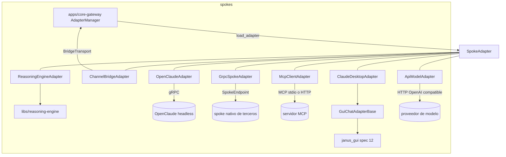

# Feature Spec: adaptadores concretos de spoke (libs/adapters/src/janus_adapters/spokes/)

> **Status**: Ready for implementation, por adaptador (cada uno puede entregarse por separado)
> **Last updated**: 2026-09-19
> **Orden de implementación**: 15 de 15. Depende de: spec 04 (contratos), spec 10 (motor), spec 11 (núcleo), spec 12 (GUI) y spec 14 (channel-gateway).

---

## Objective

Especificar los adaptadores concretos que la spec 04 dejó fuera y que ninguna otra spec era dueña. Resuelve el hallazgo de que quedaban sin dueño el adaptador de OpenClaude, los de Claude Desktop y Gemini Desktop, el adaptador en proceso del motor de razonamiento, el del puente de canales y los genéricos MCP y gRPC del piso de integración (`architecture/02` sección 4.1).

Adaptadores cubiertos:

| Adaptador | Tipo | Dónde corre | Spec de apoyo |
|---|---|---|---|
| `ReasoningEngineAdapter` | razonamiento y ejecución | en proceso | 10 |
| `ChannelBridgeAdapter` | canal | en proceso (puente gRPC) | 14 |
| `OpenClaudeAdapter` | ejecución y razonamiento | cliente gRPC a proceso externo | este documento |
| `GrpcSpokeAdapter` | según lo que declare el spoke | cliente gRPC a spoke nativo de Janus | 01 |
| `McpClientAdapter` | según mapeo | cliente MCP a un servidor MCP | este documento |
| `GuiChatAdapterBase` y `ClaudeDesktopAdapter` | razonamiento, tipo 2.4 | vía `janus_gui` | 12 |
| `ApiModelAdapter` | razonamiento | cliente HTTP compatible con OpenAI | este documento |
| `GeminiDesktopAdapter` | razonamiento, tipo 2.4 | diferido (ver requisito 24) | 12 |

Una vez implementados, el sistema cubre su motivación de origen (`architecture/00` sección 3): un pool de capacidades de razonamiento con fallback por disponibilidad, sea por cuentas de una aplicación de escritorio o por modelos accesibles por API.

No cubre a Relay: su futuro (pregunta 13 de `architecture/09`) sigue abierto.

---

## Functional Requirements

### Organización común
1. Cada adaptador vive en un subpaquete `janus_adapters.spokes.<nombre>` con `adapter.py`, `config.py` (modelo Pydantic `config_model`) y `translate.py` (traducción entre formato nativo y `SemanticRequest`/`SemanticEvent`, sin efectos secundarios y con pruebas propias).
2. Dependencias por extras opcionales del paquete: `janus-adapters[engine]` (motor), `[grpc]` (`grpcio`), `[mcp]` (SDK oficial de MCP), `[http]` (`httpx`), `[gui]` (`janus_gui`). El paquete base sigue sin dependencias nativas (spec 04).
3. Todos heredan la suite de contrato (`AdapterContractSuite`) y la pasan con su spoke simulado. Ningún subpaquete importa a otro (contrato de independencia de `import-linter`).
4. Un adaptador nunca contiene lógica del tipo "si el spoke es X". Toda variación específica vive en su propia clase.

### `ReasoningEngineAdapter` (en proceso)
5. Clase `ReasoningAdapter` y `ExecutionAdapter`. Capacidades: `reasoning.complete` y `execution.run_task`. Convierte cada solicitud en un turno de un `AgentRuntime` (spec 10) del agente que corresponde a `request.role`; sin rol usa Janus.
6. Traducción de eventos del motor: `TokenDelta` a `EVENT_KIND_PARTIAL`, `ToolCallStarted` y `ToolCallFinished` y `Progress` a `PROGRESS`, `TurnCompleted` a terminal `SUCCEEDED`. Un fallo lógico del agente es terminal `FAILED`. Un `ProviderError` es excepción de infraestructura (`SpokeUnavailableError`, `SpokeTimeoutError` o `QuotaExhaustedError`, según corresponda) y no un evento.
7. Los slots de concurrencia los adquiere el núcleo (`SlotAwareInvoker`, spec 11), no el adaptador. El adaptador no importa `libs/capabilities`.
8. `max_concurrency = None`. `_probe_health` informa el estado del motor y de los proveedores (los fallos de proveedor recientes ya llegan al `ProviderHealthSink`).
9. Cancelar el stream cancela el turno y las tools en curso.

### `ChannelBridgeAdapter` (en proceso)
10. Clase `ChannelAdapter`. Capacidad `channel.deliver`. Recibe del núcleo un `BridgeTransport` (`Protocol` con `send(OutboundMessage) -> DeliveryReceipt` y `set_inbound_handler`), implementado por el servidor `ChannelBridge` de la spec 11. El adaptador no conoce gRPC.
11. `deliver` valida el `OutboundMessage`, lo envía y traduce el `DeliveryReceipt`: entrega exitosa a terminal `SUCCEEDED`; `delivered = false` a excepción `SpokeUnavailableError` si el error es de infraestructura (`CHANNEL_DOWN`, `RATE_LIMITED`) y a terminal `FAILED` si es lógico (`ACCOUNT_NOT_CONFIGURED`, `ATTACHMENT_TOO_LARGE`).
12. Los eventos entrantes llegan por el manejador y se reenvían con `ctx.core.ingest(InboundEvent)`. El adaptador no verifica identidad (`sender` es no confiable, spec 11).
13. Su salud refleja el estado del stream y el `/health` del proceso `channel-gateway`.

### `OpenClaudeAdapter`
14. Clase `ExecutionAdapter` y `ReasoningAdapter`. Capacidades: `execution.run_task` y `reasoning.complete`. Es cliente del servidor gRPC headless de OpenClaude con streaming bidireccional (`architecture/08` sección 2).
15. **Fase 0**: obtener el esquema `.proto` del servidor de OpenClaude en una versión fijada, guardar la versión y el commit en `spokes/openclaude/UPSTREAM.md` y generar los stubs en `spokes/openclaude/_gen/` con `buf` o `grpcio-tools`. Se vendoriza solo la definición de interfaz y su aviso de licencia, nunca código de OpenClaude, de acuerdo con la nota de procedencia de `architecture/08` sección 2 y la pregunta 5 de `architecture/09` (consumo únicamente como spoke externo vía protocolo).
16. Config (`OpenClaudeSettings`): `address`, `workspace_root` (directorio permitido para las tareas), `session_mode` (`per_task` por defecto o `persistent`), `default_model_profile`, `request_timeout_s`, `max_concurrency`, `tls` (opcional) y credenciales como `SecretStr` si el servidor las exige.
17. `run_task`: abre una sesión o reutiliza la existente según `session_mode`, envía la instrucción con `workspace_root` como directorio de trabajo, reenvía eventos de progreso y de salida como `PROGRESS` y `PARTIAL`, y termina con un resultado de tarea (éxito o fallo, artefactos producidos como `Artifact`, siguiente paso sugerido) según `architecture/03` sección 2.2. Preserva `role` y `task_id` de la solicitud para trazabilidad.
18. Cancelar el stream llama al método de cancelación del servidor si existe y cierra la sesión de la tarea. La muerte del servidor a mitad de tarea produce `SpokeUnavailableError(retryable=True, side_effects_possible=True)`.
19. El enrutamiento de modelos por agente (`agentModels`, `agentRouting`) es configuración interna de OpenClaude y no se duplica en Janus (`architecture/08` sección 2). El adaptador expone solo `default_model_profile`.
20. Salud: estado de conectividad del canal gRPC más una llamada ligera de verificación si el servidor la ofrece. No tiene servidor MCP propio ni canal: cualquier petición desde un mensaje de chat entra por `channel-gateway` y el núcleo la traduce hasta este adaptador; nunca se conectan directamente.

### `GrpcSpokeAdapter` (spoke nativo de Janus)
21. Clase genérica que implementa la ruta de excepción de `architecture/03` sección 1: un spoke escrito por un tercero con Janus en mente expone `SpokeEndpoint` (spec 01) y se registra con `SpokeGateway.Register`. El núcleo instancia este adaptador con `endpoint` y las capacidades declaradas. Invoca con `SpokeEndpoint.Invoke` (stream de `SemanticEvent`) y verifica salud con `Health`. Valida los invariantes del stream igual que cualquier adaptador.
22. Config: `endpoint`, `tls` opcional, `call_timeout_s`. Las capacidades y tipos vienen de la solicitud de registro; los tipos (`kinds`) se derivan de lo declarado y se validan contra los ids permitidos (spec 09).

### `McpClientAdapter`
23. Se conecta como cliente MCP a un servidor MCP (transporte `stdio` con `command` y `args` definidos en la config, o HTTP con `url` y cabeceras secretas). Lista las tools del servidor y las expone como capacidades **solo si están mapeadas** en `tool_map` (`capability_id abstracto -> nombre de tool`, con `input_schema` opcional). Una tool sin mapear no se expone; así el id de capacidad sigue siendo abstracto y nunca lleva el nombre del spoke (Principio #1). Un cambio en la lista de tools del servidor dispara `notify_capabilities_changed`.
24. `invoke` traduce la solicitud a `call_tool` y el resultado de la tool a un terminal (contenido de texto y estructurado como `Payload`; un `isError` de MCP es fallo lógico `FAILED`, un error de transporte es excepción de infraestructura). Tiempo máximo por llamada configurable. Para `stdio`, el proceso hijo se lanza solo con el comando de la config (nunca con texto que venga de una solicitud) y se reinicia si muere, de forma acotada.

### `GuiChatAdapterBase` y `ClaudeDesktopAdapter`
25. `GuiChatAdapterBase` (`GuiDrivenMixin` más `ReasoningAdapter`, `max_concurrency == 1`) implementa el flujo genérico de las aplicaciones de chat: adquirir `screen_lock`, localizar o abrir la ventana, enfocar y `verify_focus`, mapear elementos, `expect` de los anclajes de entrada, envío y salida, opcionalmente iniciar una conversación nueva, escribir el texto de la solicitud, activar el envío, `wait_until_stable` y leer la respuesta. Devuelve un terminal `SUCCEEDED` con el texto (más `PROGRESS` "generando" opcionales). Usa el protocolo `GuiSurface` de `janus_gui.surface` (spec 12) y toda llamada va en `asyncio.to_thread`.
26. Config común (`GuiChatSettings`): `mapping_strategy` (`REALTIME` por defecto o `ASSISTED`), `window_query` (app id o título, más selección de instancia por título o pid), `launch_command` (opcional, para abrir una instancia o un perfil concreto), `conversation_mode` (`fresh`, que abre conversación nueva por solicitud para no mezclar contexto, o `continue`), `settle_ms`, `max_response_s`, `expectations` (anclajes de entrada, envío, salida e indicador), `quota_patterns` (expresiones que indican límite de mensajes) y `stream_partials` (false por defecto).
27. `ClaudeDesktopAdapter` fija los valores por defecto de esa aplicación (identificador de ventana, anclajes iniciales, patrones de cuota) sobre la base. Cada perfil o cuenta es una instancia con su `spoke_id` (spec 04). Cómo se abren varias cuentas simultáneas (por ejemplo, un directorio de datos de usuario distinto por instancia) se valida en el spike de la spec 12; no se asume.
28. Detección de cuota: si el texto de salida o la interfaz coincide con `quota_patterns`, lanza `QuotaExhaustedError(retry_after)`, con `retry_after` calculado si el mensaje de la aplicación trae la ventana de espera y una estimación configurable si no. La base publica salud `UNAVAILABLE` y el Registro elige otro spoke (`architecture/08` sección 5).
29. Un `InterfaceInvalidated` de `janus_gui` se propaga tal cual; con `ASSISTED` la base marca `requires_user_action = true` en la salud (spec 04, requisito 15).
30. Si la solicitud contiene texto que no se pueda escribir con fidelidad (caracteres no soportados por el backend de input), lanza `TranslationError`; nunca escribe una versión truncada en silencio.
31. `GeminiDesktopAdapter` queda **diferido**: Gemini Desktop está documentado para macOS y Windows (`architecture/08` sección 6) y la crate de GUI de la primera versión es Linux (spec 12). Se implementa como subclase de `GuiChatAdapterBase` cuando exista una plataforma soportada por la crate o una compilación oficial en Linux. Mientras tanto, la capacidad de Gemini se cubre con `ApiModelAdapter` sobre su API.

### `ApiModelAdapter`
32. Clase `ReasoningAdapter` para modelos accesibles por API compatible con OpenAI (incluye proveedores con cuota gratuita y endpoints locales como Ollama). Capacidad `reasoning.complete`. Es la forma en que el pool de modelos con fallback de la motivación de origen se registra como capacidades (`architecture/04` sección 5).
33. Config (`ApiModelSettings`): `base_url`, `api_key` (`SecretStr`, opcional para modelos locales), `model`, `timeout_s`, `max_concurrency`, `system_prompt` opcional, `extra_headers`.
34. `reason` traduce la solicitud a una petición de chat con streaming y emite `PARTIAL` por cada delta y un terminal con el texto completo. HTTP 429 o cuota agotada a `QuotaExhaustedError` (con `Retry-After` si viene); 401 o 403 a `SpokeAuthError`; 5xx, errores de conexión y tiempos vencidos a `SpokeUnavailableError` o `SpokeTimeoutError`; una respuesta con formato inválido a `SpokeProtocolError`.
35. Cada combinación proveedor y modelo es una instancia con su `spoke_id`, de modo que cuota y salud son por instancia y el Registro puede hacer fallback entre ellas (spec 09).
36. No se confunde con `providers` de `janus.toml`: esos son los proveedores internos que usa el motor para los agentes de Janus (spec 10). Este adaptador expone un modelo como capacidad para cualquier solicitante.

---

## Non-Functional Requirements

* **Performance**: sobrecarga de traducción por evento menor a 1 ms p95 en Raspberry Pi 4 para los adaptadores no GUI, medida con spokes simulados; los adaptadores GUI están dominados por la latencia de la aplicación (objetivo de mapeo de la spec 12). Propuestos, se ajustan tras medir.
* **Security**: credenciales como `SecretStr` y nunca en logs; los adaptadores no verifican tokens; las salidas de spokes son dato; los adaptadores GUI escriben solo el texto de la solicitud (sin macros ni comandos) y no abren aplicaciones que no estén en la config; los subprocesos de `McpClientAdapter` solo con comandos de la config; `OpenClaudeAdapter` restringe el trabajo a `workspace_root`.
* **Reliability**: el fallo de un adaptador no afecta a otros; reconexión acotada de transporte y reportada en salud; sin llamadas bloqueantes en el event loop; toda espera respeta la cancelación.
* **Portability**: Python 3.11 o superior, aarch64 y x86_64. Los extras aíslan las dependencias; el adaptador GUI solo se carga si `janus_gui` está instalado y `probe()` reporta soporte.

---

## Technical Decisions

### Adaptadores concretos dentro de `libs/adapters` con extras
* **Chosen**: subpaquetes `spokes/<nombre>` y dependencias opcionales.
* **Reason**: coincide con `stack/02` (contratos e implementaciones en `adapters/`), mantiene el paquete base limpio y permite instalar solo lo que se usa en un Raspberry Pi.
* **Rejected alternatives**: un paquete por adaptador (proliferación de paquetes sin beneficio inicial); todo en el paquete base (arrastra dependencias nativas).

### Capacidades de MCP solo si están mapeadas
* **Chosen**: `tool_map` explícito.
* **Reason**: los ids de capacidad son abstractos (Principio #1) y un servidor MCP arbitrario podría exponer decenas de tools que el sistema no debería ofrecer sin decisión del usuario.
* **Rejected alternatives**: exponer todas las tools con prefijo del servidor (el id llevaría el nombre del spoke).

### GUI: conversación nueva por solicitud como valor por defecto
* **Chosen**: `conversation_mode = "fresh"`.
* **Reason**: una solicitud de capacidad debe ser independiente; reutilizar la conversación mezclaría contexto entre tareas y usuarios de la capacidad.
* **Rejected alternatives**: continuar siempre (fuga de contexto entre solicitudes).

### `ApiModelAdapter` separado de los `providers` del motor
* **Chosen**: dos usos distintos del mismo tipo de endpoint.
* **Reason**: los `providers` sirven a los agentes de Janus; el adaptador expone modelos a cualquier solicitante y participa en el arbitraje del Registro.
* **Rejected alternatives**: unificarlos (mezcla identidad de agente con capacidad intercambiable).

### El puente de canales por `Protocol`
* **Chosen**: `BridgeTransport` implementado por el núcleo.
* **Reason**: el adaptador no depende de gRPC ni del servidor, y se prueba con un transporte falso.
* **Rejected alternatives**: que el adaptador importe el servidor del núcleo (dependencia circular).

### Solo la definición de interfaz de OpenClaude
* **Chosen**: vendorizar únicamente el `.proto` y consumir por gRPC.
* **Reason**: respeta la nota de procedencia (código derivado de Claude Code sin liberación oficial) y la pregunta 5 de `architecture/09`.
* **Rejected alternatives**: extender o incrustar el código de OpenClaude (implicaciones legales no resueltas).

---

## Proposed Architecture

### Component Diagram


### Directory Structure
```
libs/adapters/src/janus_adapters/spokes/
  __init__.py
  reasoning_engine/  adapter.py config.py translate.py
  channel_bridge/    adapter.py config.py translate.py transport.py
  openclaude/        adapter.py config.py translate.py UPSTREAM.md _gen/
  grpc_generic/      adapter.py config.py translate.py
  mcp_client/        adapter.py config.py translate.py
  gui_chat/          base.py config.py flow.py quota.py
  claude_desktop/    adapter.py config.py defaults.py
  api_model/         adapter.py config.py translate.py
  (gemini_desktop/   diferido)
libs/adapters/tests/spokes/  # un test por adaptador que hereda AdapterContractSuite
```

---

## Data Models

```
Config OpenClaudeSettings { address, workspace_root, session_mode, default_model_profile,
                            request_timeout_s, max_concurrency, tls?, credentials?: SecretStr }
Config McpClientSettings  { transport: stdio|http, command?, args?, url?, headers?: SecretStr,
                            tool_map: { capability_id: { tool: str, input_schema?: dict } }, call_timeout_s }
Config GuiChatSettings    { mapping_strategy, window_query, launch_command?, conversation_mode,
                            settle_ms, max_response_s, expectations, quota_patterns[], stream_partials }
Config ApiModelSettings   { base_url, api_key?: SecretStr, model, timeout_s, max_concurrency, system_prompt?, extra_headers }
Config GrpcSpokeSettings  { endpoint, tls?, call_timeout_s }
Interface BridgeTransport { send(OutboundMessage) -> DeliveryReceipt ; set_inbound_handler(cb) }
```

Ejemplo de instancias en `config/janus.toml` (varias instancias de la misma clase, `spec 04`):

```toml
[[spokes]]
spoke_id = "claude-desktop-a"
adapter = "janus_adapters.spokes.claude_desktop:ClaudeDesktopAdapter"
[spokes.settings]
window_query = { app_id = "claude-desktop", title = "cuenta A" }
mapping_strategy = "REALTIME"

[[spokes]]
spoke_id = "modelo-libre-1"
adapter = "janus_adapters.spokes.api_model:ApiModelAdapter"
[spokes.settings]
base_url = "https://ejemplo/v1"
model = "modelo-x"
api_key = { env = "MODELO_LIBRE_1_KEY" }
```

---

## API Contracts

Todos implementan la API pública de `SpokeAdapter` (spec 04). Contratos hacia sus spokes:

```
OpenClaude       gRPC cliente (esquema fijado en UPSTREAM.md; stream bidireccional)
GrpcSpokeAdapter gRPC cliente:  SpokeEndpoint.Invoke(SemanticRequest) -> stream SemanticEvent ; Health()
McpClientAdapter MCP cliente:   list_tools, call_tool (stdio o HTTP)
ApiModelAdapter  HTTP:          POST {base_url}/chat/completions (stream=true, formato compatible con OpenAI)
Gui*             janus_gui:     GuiSurface (spec 12)
ChannelBridge    BridgeTransport (Protocol)
```

Mapeo de errores (resumen):

| Origen | Error de adaptador |
|---|---|
| Conexión rechazada, proceso muerto | `SpokeUnavailableError` (retryable) |
| Tiempo vencido | `SpokeTimeoutError` (retryable) |
| Cuota o 429, patrón de cuota GUI | `QuotaExhaustedError(retry_after)` |
| 401 o 403, credencial inválida | `SpokeAuthError` |
| Respuesta mal formada, invariantes rotos | `SpokeProtocolError` |
| Capacidad no servida | `CapabilityNotSupportedError` |
| Interfaz GUI cambió | `InterfaceInvalidatedError` |
| No representable sin pérdida | `TranslationError` |

---

## Edge Cases

| Case | How to Handle |
|---|---|
| OpenClaude se cae a mitad de tarea | `SpokeUnavailableError(retryable, side_effects_possible)`; `libs/capabilities` decide según `idempotent`. |
| Servidor MCP cambia sus tools | `notify_capabilities_changed`; las tools retiradas dejan de resolverse, las mapeadas nuevas aparecen. |
| Tool de MCP devuelve `isError` | Terminal `FAILED` (fallo lógico), no excepción. |
| Aplicación GUI muestra "límite de mensajes" | `QuotaExhaustedError`; el Registro pasa a otro perfil o spoke. |
| Dos instancias de Claude Desktop y una sola pantalla | `janus_gui.screen_lock` FIFO; cada adaptador tiene concurrencia 1. |
| La aplicación se actualiza y cambia su layout | `InterfaceInvalidatedError`; con `ASSISTED` pide repetir la configuración. |
| Respuesta enorme en GUI | `max_response_s` y límite de lectura; si se corta, terminal con la marca de truncada y `suggested_next_step`. |
| Texto con caracteres que el backend de input no soporta | `TranslationError` explícito, sin truncar. |
| Modelo por API devuelve streaming cortado | `SpokeProtocolError` si falta el final; los parciales ya emitidos no se retiran. |
| Dos instancias de `ApiModelAdapter` con la misma clave | Cuota compartida: ambas quedan `UNAVAILABLE` al agotarse; documentado. |
| `ChannelBridgeAdapter` sin puente conectado | `SpokeUnavailableError`; el mensaje se reintenta según la política del núcleo. |
| Spoke nativo de terceros con `capability_id` que lleva su nombre | El Registro lo rechaza en el alta (spec 09). |
| Adaptador GUI cargado en un host sin pantalla | `AdapterLoadError` o salud `UNAVAILABLE` con la causa (`PlatformUnsupported`). |

---

## Testing Requirements

**Unit Tests** (por adaptador): traducción en ambos sentidos con casos de borde (`translate.py` sin efectos secundarios); validación de `config_model`; cada fila de la tabla de mapeo de errores; `tool_map` de MCP con tools mapeadas, sin mapear y con cambios; `quota_patterns` con textos reales de la aplicación; generación de `retry_after`.

**Contract Tests**: cada adaptador hereda `AdapterContractSuite` y la pasa contra su spoke simulado: servidor gRPC falso de OpenClaude y de spoke nativo, servidor MCP falso (proceso stdio de prueba), servidor HTTP falso compatible con OpenAI (con 429 y cortes de stream), `FakeGuiSurface`, motor de razonamiento con proveedor falso y `BridgeTransport` falso.

**Integration Tests**: `core-gateway` con varias instancias de `ApiModelAdapter` simulando cuota agotada en una y verificando el fallback del Registro; una instancia de `ClaudeDesktopAdapter` contra la aplicación de prueba de la spec 12; cadena canal a Janus a `OpenClaudeAdapter` a canal usando el puente falso; `import-linter` verificando la independencia entre subpaquetes; pruebas manuales documentadas con las aplicaciones reales antes de cada versión.

---

## Security Checklist
- [ ] `SecretStr` para toda credencial; nunca en logs
- [ ] Sin verificación de tokens en adaptadores
- [ ] Comandos de subprocesos (MCP, aplicaciones GUI) solo desde la configuración
- [ ] `OpenClaudeAdapter` restringido a `workspace_root`
- [ ] Solo la definición de interfaz de OpenClaude se vendoriza
- [ ] Salida de spokes tratada como dato, sin instrucciones al núcleo
- [ ] Adaptadores GUI escriben únicamente el texto de la solicitud
- [ ] Independencia entre adaptadores verificada con `import-linter`

---

## Open Questions
- [ ] Esquema `.proto` real del servidor de OpenClaude: se obtiene en la fase 0 (requisito 15); puede cambiar el contrato de `run_task`.
- [ ] Cómo se abren varias cuentas de Claude Desktop a la vez en Linux (una instancia por directorio de datos de usuario u otro método): validar en el spike de la spec 12.
- [ ] Futuro de Relay (pregunta 13 de `architecture/09`): fuera de esta spec; si se decide tratarlo como spoke, se agrega un adaptador propio.
- [ ] `GeminiDesktopAdapter`: diferido hasta que haya plataforma soportada (requisito 31).
- [ ] Orden de entrega recomendado: `ReasoningEngineAdapter`, `ChannelBridgeAdapter`, `ApiModelAdapter` (habilita el pool con fallback), `GrpcSpokeAdapter`, `McpClientAdapter`, `OpenClaudeAdapter` y, al final, `ClaudeDesktopAdapter`.

---

## Handoff Note
Revisar esta spec antes de empezar. Crear un checklist desde los requisitos funcionales y marcarlo al avanzar. Levantar dudas antes de codificar, no durante. Entregar un adaptador por vez con su test de contrato y su prueba de independencia; el orden recomendado está en las Open Questions.
