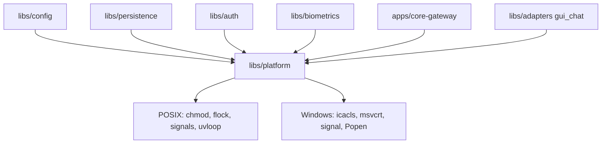

# Feature Spec: libs/platform/ (aislamiento de diferencias entre Linux y Windows)

> **Status**: Ready for implementation
> **Last updated**: 2026-09-20
> **Orden de implementación**: prerrequisito, se implementa junto a la spec 1. Lo consumen las specs 2, 3, 5, 11, 12, 14, 17 y 18. Depende de: nada (stdlib; `psutil` opcional).

---

## Objective

Concentrar en una sola librería mínima todo lo que cambia entre Linux y Windows, para que el resto del monorepo no tenga ramas por plataforma repetidas. Es la consecuencia directa de la decisión de absorber la función de Relay de forma multiplataforma (`architecture/09`, pregunta 13): las aplicaciones de escritorio que Janus opera existen en Windows, y el núcleo corre en el mismo host que ellas.

Plataformas soportadas de host: Linux (x86_64 y aarch64) y Windows 10 u 11 (x86_64). macOS y WSL quedan fuera (WSL no tiene pantalla utilizable para la automatización de GUI).

Una vez implementada, ninguna otra librería importa `fcntl`, `msvcrt`, `uvloop` ni llama a `os.chmod(0o600)` de forma directa.

---

## Functional Requirements

### Rutas y permisos
1. `default_state_dir() -> Path`: `~/.local/state/janus` en Linux y `%LOCALAPPDATA%\Janus\state` en Windows. Respeta `JANUS_STATE_DIR`.
2. `make_private(path, directory=False)`: en POSIX aplica `0600` (o `0700` para directorios); en Windows quita la herencia de la ACL y concede control total solo al usuario actual con `icacls`, sin `shell=True`.
3. `write_private(path, data: bytes)`: escritura atómica (archivo temporal en el mismo directorio y reemplazo) que nace privada: en POSIX se crea con `os.open(..., 0o600)`, en Windows se aplica `make_private` antes de escribir el contenido.
4. `privacy_status(path) -> PrivacyStatus` con `PRIVATE`, `OPEN` o `UNKNOWN`. En POSIX inspecciona el modo; en Windows inspecciona la ACL y devuelve `UNKNOWN` si no puede determinarlo. Los consumidores tratan `OPEN` como error y `UNKNOWN` como advertencia.
5. `path_is_within(child, root) -> bool`: resuelve enlaces simbólicos y, en Windows, compara sin distinguir mayúsculas y normaliza uniones (`junction`). Lo usan la validación de topología de agentes (spec 02, requisito 30) y `filesystem_roots`.

### Procesos y bloqueo
6. `InstanceLock(path)`: bloqueo exclusivo no bloqueante de un archivo (`fcntl.flock` en POSIX, `msvcrt.locking` en Windows), como context manager. Si ya está tomado lanza `LockHeld` con el pid del dueño si se puede leer. Lo usa el candado `core.lock` (spec 11, requisito 4) y `gui.lock` (spec 12, requisito 20).
7. `spawn(argv, env=None, cwd=None, new_session=True) -> ProcessHandle`: lanza con `subprocess.Popen(shell=False)`. POSIX: `start_new_session`. Windows: `CREATE_NEW_PROCESS_GROUP`. Nunca acepta una cadena de comando: solo lista de argumentos.
8. `ProcessHandle`: `pid`, `poll()`, `await wait()` (ejecuta la espera en un hilo, `asyncio.to_thread`) y `terminate(grace_s)`: intenta terminación suave, espera `grace_s` y fuerza el cierre de todo el árbol de procesos (con `psutil` si está instalado; sin él, `os.killpg` en POSIX y `taskkill /T /F` en Windows).
9. Motivo del diseño de 7 y 8: `asyncio.create_subprocess_exec` en Windows exige el bucle de eventos `Proactor`, y `grpc.aio` no está verificado con él (requisito 11). Al pasar todo por `Popen` en un hilo, el resto del sistema no depende del tipo de bucle.

### Señales y bucle de eventos
10. `install_shutdown_handlers(loop, on_signal)`: en POSIX registra `SIGTERM` y `SIGINT` con `loop.add_signal_handler`; en Windows registra `SIGINT` y `SIGBREAK` con `signal.signal` y reenvía al bucle con `call_soon_threadsafe`. Lo usa el cierre ordenado de `core-gateway` (spec 11, requisito 2).
11. `configure_event_loop()`: en POSIX instala `uvloop` si está disponible; en Windows no cambia la política por defecto. La compatibilidad de `grpc.aio` con el bucle de Windows se valida en CI (Open Questions).

### Diagnóstico
12. `platform_info() -> PlatformInfo` con `os` (`linux` o `windows`), `arch`, `is_wsl`, `session_type` (`x11`, `wayland`, `win32`, `headless`) y `python_version`. Lo consume `janus_gui.probe()` (spec 12, requisito 26) y el diagnóstico del núcleo. Un entorno WSL se reporta y la automatización de GUI falla allí con `PlatformUnsupported`.

---

## Non-Functional Requirements

* **Performance**: cada función menor a 5 ms p95 salvo `make_private` en Windows (subproceso `icacls`, menor a 200 ms) y `terminate` (acotada por `grace_s`).
* **Security**: `make_private` y `write_private` nunca dejan el archivo abierto a otros usuarios ni siquiera por un instante; ninguna función ejecuta texto proveniente de solicitudes o modelos.
* **Reliability**: `InstanceLock` se libera si el proceso muere; `terminate` nunca deja procesos huérfanos del árbol lanzado por `spawn`.
* **Portability**: Python 3.11 o superior. Solo stdlib; `psutil` es un extra opcional (`janus-platform[proc]`). Prohibido importar cualquier otra librería del monorepo.

---

## Technical Decisions

### Una librería de plataforma en lugar de ramas repetidas
* **Chosen**: `libs/platform/` con siete funciones.
* **Reason**: los archivos privados, los bloqueos y las señales aparecen en al menos cinco specs; repetir la rama por sistema en cada una duplica errores.
* **Rejected alternatives**: `sys.platform` disperso en cada librería; poner los helpers en `libs/config` (las specs 3 y 5 tienen prohibido importarla).

### Todo proceso hijo por `Popen` en un hilo
* **Chosen**: `spawn` y `ProcessHandle.wait` con `to_thread`.
* **Reason**: independiza al sistema del tipo de bucle de eventos de Windows.
* **Rejected alternatives**: `asyncio.create_subprocess_exec` (exige `Proactor` en Windows).

### Permisos por ACL en Windows, con estado `UNKNOWN`
* **Chosen**: `icacls` sin dependencias, con `UNKNOWN` cuando no se puede comprobar.
* **Reason**: `os.chmod` no expresa la misma restricción en Windows; una dependencia como `pywin32` no compensa el costo para este uso.
* **Rejected alternatives**: ignorar el problema en Windows; `pywin32`.

---

## Proposed Architecture

### Component Diagram


### Directory Structure
```
libs/platform/
  pyproject.toml
  src/janus_platform/
    __init__.py
    paths.py      # default_state_dir, path_is_within
    private.py    # make_private, write_private, privacy_status
    lock.py       # InstanceLock, LockHeld
    process.py    # spawn, ProcessHandle
    signals.py    # install_shutdown_handlers, configure_event_loop
    info.py       # platform_info, PlatformInfo
    errors.py
  tests/
```

---

## Data Models

```
Enum   PrivacyStatus { PRIVATE, OPEN, UNKNOWN }
Entity PlatformInfo  { os, arch, is_wsl, session_type, python_version }
Entity ProcessHandle { pid, poll(), wait(), terminate(grace_s) }
```

---

## API Contracts

Librería, sin API de red.

```
default_state_dir() -> Path              path_is_within(child: Path, root: Path) -> bool
make_private(path: Path, directory: bool = False) -> None
write_private(path: Path, data: bytes) -> None
privacy_status(path: Path) -> PrivacyStatus
InstanceLock(path: Path)  # context manager; LockHeld
spawn(argv: Sequence[str], env=None, cwd=None, new_session=True) -> ProcessHandle
install_shutdown_handlers(loop, on_signal: Callable[[], None]) -> None
configure_event_loop() -> None
platform_info() -> PlatformInfo
```

---

## Edge Cases

| Case | How to Handle |
|---|---|
| Archivo ya existe con permisos abiertos | `write_private` lo reemplaza de forma atómica con uno nuevo privado. |
| `icacls` no disponible en Windows | `make_private` lanza `PlatformError` con instrucciones; `privacy_status` devuelve `UNKNOWN`. |
| Dos núcleos sobre el mismo `state_dir` | El segundo `InstanceLock` lanza `LockHeld`. |
| `SIGTERM` en Windows | No existe; el cierre llega por `SIGINT` o `SIGBREAK`, o por el supervisor con `terminate`. |
| Proceso hijo que lanza nietos | `terminate` cierra el árbol completo; sin `psutil` se usa el mecanismo del sistema. |
| Entorno WSL | `platform_info` lo reporta; los módulos de GUI se niegan a cargar. |
| Ruta con mayúsculas distintas en Windows | `path_is_within` normaliza antes de comparar. |
| Enlace simbólico o unión que escapa de la raíz | `path_is_within` devuelve `False`. |

---

## Testing Requirements

**Unit Tests**: cada función con el backend de la plataforma actual y con un backend falso inyectado para la otra (probar las ramas sin cambiar de sistema); `write_private` atómica con fallo simulado a mitad; `InstanceLock` con dos contendientes; `spawn` rechaza cadenas; `path_is_within` con enlaces y mayúsculas.

**Integration Tests**: CI en Linux x86_64 y Windows x86_64 con las mismas pruebas reales (crear archivo privado y verificar `privacy_status`, bloquear y liberar, lanzar y terminar un árbol de dos procesos, recibir una señal simulada); prueba manual documentada en aarch64.

---

## Security Checklist
- [ ] Ningún archivo sensible existe con permisos abiertos, ni por un instante
- [ ] Ningún proceso se lanza con `shell=True` ni con una cadena de comando
- [ ] `terminate` no deja procesos huérfanos
- [ ] Sin dependencias fuera de stdlib salvo `psutil` opcional

---

## Open Questions
- [ ] `grpc.aio` con el bucle por defecto de Windows (`Proactor`): verificar en CI de Windows. Si falla, el núcleo usa `WindowsSelectorEventLoopPolicy` y el diseño ya lo tolera porque los procesos hijos pasan por `Popen` (requisito 9).
- [ ] Wheels de Windows para `sqlite-vec`, `onnxruntime`, `fastembed`, `opencv-python-headless` y `maturin`: verificar al fijar dependencias.
- [ ] `channel-gateway` en Windows (Bun o Node 22): se verifica en la fase 0 de la spec 14.

---

## Handoff Note
Revisar esta spec antes de empezar. Crear un checklist desde los requisitos funcionales y marcarlo al avanzar. Levantar dudas antes de codificar, no durante. Implementar `paths.py`, `private.py` y `lock.py` primero, con CI en ambos sistemas desde el primer commit, porque las demás specs dependen de que el comportamiento sea idéntico.
