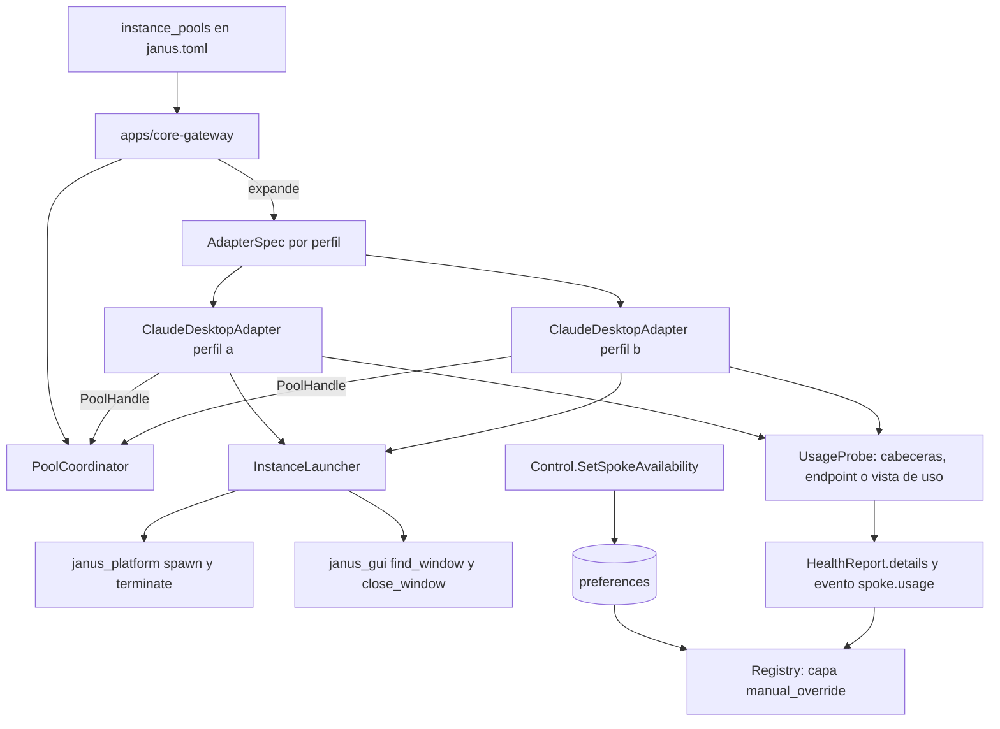

# Feature Spec: instancias, cuota y disponibilidad (absorción de Relay)

> **Status**: Ready for implementation, con una comprobación en el spike de la spec 12 sobre instancias múltiples
> **Last updated**: 2026-09-20
> **Orden de implementación**: después de la spec 15 (`GuiChatAdapterBase` y `ClaudeDesktopAdapter`) y de la 16. Depende de: specs 4, 9, 11, 12, 15 y 16.

---

## Objective

Absorber la función de Relay (`claude-toolkit`) dentro de Janus, sin portar nada de su código, generalizada y multiplataforma (Linux y Windows). La decisión del usuario (pregunta 13 de `architecture/09`) es que Relay no se conserva: lo que hacía se integra al modelo de Janus y se mejora.

| Función de Relay | Dónde vive ahora | Mejora |
|---|---|---|
| Despachar un prompt a un perfil (`ask_claude`) | `ClaudeDesktopAdapter.reason` sobre una instancia (spec 15) | El Registro elige la instancia por salud y política, no el usuario a mano |
| Listar perfiles y su disponibilidad (`list_profiles`) | `Observe.GetRegistry` (spec 11), con etiquetas de pool | Estado en vivo y consultable por cualquier cliente |
| Asignar o quitar rol a un perfil (`set_profile_role`, `clear_profile_role`) | `Control.AssignRole` (spec 11, requisito 18) más la etiqueta `preferred_roles` de la instancia | El rol es una preferencia de resolución, no un estado que se olvida |
| Marcar agotado o disponible (`mark_exhausted`, `mark_available`) | `Control.SetSpokeAvailability` (este documento) | Con vencimiento y con motivo, persistente entre reinicios |
| Ver el uso del plan (`get_usage`) | `UsageProbe` genérico (este documento) | Vale para cualquier proveedor que permita verlo, y actúa antes del agotamiento |
| Cerrar la ventana de un perfil (`close_profile`) | `close_window` de `janus_gui` (spec 12) más el ciclo de vida del pool | Política de ventanas abiertas y cierre por inactividad |
| Abrir perfiles (implícito, atado a Linux) | `InstanceLauncher` (este documento) | Portable a Linux y Windows |

Una vez implementada, el usuario declara N perfiles de una aplicación de escritorio en `config/janus.toml`, Janus abre y cierra las ventanas según hace falta, reparte el trabajo entre ellos, se adelanta al agotamiento cuando el proveedor permite ver el uso, y `claude-toolkit` se puede retirar.

---

## Functional Requirements

### Pools de instancias
1. `config/janus.toml` admite `[[instance_pools]]` (spec 02, requisito 19f) con `pool_id`, `adapter` (ruta punteada, por ejemplo `ClaudeDesktopAdapter`), `settings` (plantilla común), `max_alive`, `idle_close_s`, `autostart` y `profiles`. Cada perfil define `profile_id`, `label`, `user_data_dir` (opcional), `launch_args` (opcional), `preferred_roles` (opcional), `adopt` (default `false`) y `settings` que pisan a la plantilla.
2. El núcleo expande cada perfil en un `AdapterSpec` con `spoke_id = "<pool_id>-<profile_id>"` y las etiquetas `pool`, `profile` y `preferred_roles`. Son spokes normales (spec 04, requisito 21): el Registro no conoce el concepto de pool.
3. La política de selección acepta el alias `pool:<pool_id>` dentro de una lista de spokes (spec 02, requisito 12) y lo expande a los miembros en el orden de `profiles`. Así se escribe `spokes = ["gemini-api", "pool:claude-desktop"]` sin repetir cada perfil.
4. Validación al cargar: `profile_id` único dentro del pool; `user_data_dir` único entre perfiles de todos los pools; `max_alive >= 1`.

### Ciclo de vida de las ventanas
5. `PoolHandle` (ABC en `janus_adapters.pool`) lo implementa el núcleo (`PoolCoordinator`, spec 11) y llega al adaptador en `AdapterContext.pool`: `register(member)`, `await request_open(member)`, `mark_used(member)` y `await notify_idle(member)`.
6. `PoolMember` (Protocol) lo implementa `GuiChatAdapterBase`: `is_open`, `in_flight`, `last_used`, `await open_instance()` y `await close_instance()`.
7. Política del coordinador: apertura perezosa en la primera invocación (salvo `autostart`); si abrir superaría `max_alive`, cierra la instancia abierta ociosa menos usada recientemente; nunca cierra una con invocaciones en curso; si todas están ocupadas, espera en orden FIFO hasta `open_wait_s` (default 60) y luego falla con `SpokeUnavailableError`. Una instancia sin uso por `idle_close_s` (default 600) se cierra.
8. Si la comprobación del spike muestra que la aplicación no admite dos instancias a la vez, el modo secuencial es `max_alive = 1` con la misma política: el coordinador cierra la anterior antes de abrir la siguiente. No hace falta otro mecanismo.
9. `InstanceLauncher` (en `janus_adapters.spokes.gui_chat.launcher`) implementa `open_instance` y `close_instance`:
   * Abrir: `janus_platform.spawn` con `launch_command` más los argumentos del perfil, con las variables `{user_data_dir}` y `{profile_id}` sustituidas. Los argumentos son una lista; nunca se usa una cadena de shell. Para aplicaciones basadas en Electron o Chromium, el aislamiento entre perfiles es `--user-data-dir={user_data_dir}`. El directorio se crea privado (`make_private`).
   * Ubicar la ventana: por pid; si la aplicación reenvía a un proceso existente y el pid no coincide, se toma la primera ventana nueva de esa aplicación que no pertenezca a otro miembro del pool. Vence a los `launch_timeout_s` (default 30) con `InstanceLaunchError` reintentable.
   * Cerrar: `close_window` y, tras `close_grace_s` (default 10), `ProcessHandle.terminate` del árbol lanzado. Solo se termina lo que el lanzador inició.
10. `adopt = true`: el perfil se enlaza a una ventana ya abierta por el usuario (localizada con `window_query`) en lugar de lanzar una. Una instancia adoptada nunca se cierra desde Janus salvo `allow_close_adopted = true`. Evita matar la sesión personal del usuario.
11. Las operaciones de ciclo de vida de una instancia configurada son parte del flujo que el usuario autorizó al declarar el spoke: no pasan por `ApprovalGateway` (spec 15, requisito de aprobaciones).

### Uso de cuota (`get_usage` generalizado)
12. `UsageSnapshot { used_fraction?, remaining?, unit?, resets_at?, window?, source, measured_at }` con `source` en `provider_headers`, `provider_endpoint` o `gui_read`. `UsageAware` es una interfaz opcional de adaptador: `await probe_usage() -> UsageSnapshot | None`. Devolver `None` significa que el proveedor no permite verlo, y no es un error.
13. La base publica el último `UsageSnapshot` en `HealthReport.details` con las claves `usage_used_fraction`, `usage_remaining`, `usage_unit`, `usage_resets_at` y `usage_source`, y emite `spoke.usage` (spec 06) solo cuando cambia de forma apreciable (más de 2 puntos porcentuales o cambio de ventana).
14. Efecto en la salud, con umbrales de `config/janus.toml` (`usage.warn_fraction` default 0.85, `usage.block_fraction` default 0.98, con override por spoke): al superar `warn` la salud pasa a `DEGRADED` con motivo `usage_high` (el Registro lo pone al final de su grupo, spec 09); al superar `block` pasa a `UNAVAILABLE` con `retry_after = resets_at` si se conoce. Es la forma de no descubrir el agotamiento a mitad de una tarea.
15. `ApiModelAdapter`: extrae uso de las cabeceras de la respuesta según un mapa configurable `usage_headers` (`remaining`, `limit`, `reset`) y, opcionalmente, consulta un `usage_endpoint` con rutas punteadas (`used_path`, `limit_path`, `resets_path`) sobre el JSON devuelto. No trae parsers por proveedor nombrado; cada endpoint concreto se verifica y se documenta al configurarlo.
16. `GuiChatAdapterBase`: `usage_view` opcional en `GuiChatSettings`: secuencia mínima para abrir la vista de uso de la aplicación, ancla de lectura y `patterns` (expresiones con grupos con nombre `used`, `limit`, `percent`, `resets`). Reglas de seguridad de foco: solo se ejecuta si `screen_lock` está disponible de inmediato (`timeout 0`), sin invocaciones en curso, y a lo sumo cada `usage_probe_interval_s` (default 900). Los valores por defecto de `ClaudeDesktopAdapter` se validan en el spike; si la aplicación no muestra el uso, `probe_usage` devuelve `None`.

### Disponibilidad manual
17. `Control.SetSpokeAvailability(spoke_id, mode, until, reason)` (spec 01) con `mode` en `AUTO`, `UNAVAILABLE_UNTIL` y `UNAVAILABLE_INDEFINITE`. Persiste en `preferences` con la clave `spoke.availability.<spoke_id>`.
18. El Registro aplica la disponibilidad manual como capa por encima de la salud que informa el adaptador (spec 09, requisito 6bis): mientras no venza, el spoke queda fuera de los candidatos con el motivo `manual_override`. Al vencer `until` vuelve a `AUTO` solo. `Observe.GetRegistry` muestra la capa.
19. Janus dispone de la tool `set_spoke_availability(spoke_id, mode, until, reason)` en su toolset (los subagentes no). Equivale a `mark_exhausted` y `mark_available` de Relay.

### Retiro de `claude-toolkit`
20. Criterios para retirar Relay, todos verificables: (a) un pool de N instancias de `ClaudeDesktopAdapter` atiende solicitudes con fallback automático entre ellas; (b) la disponibilidad manual funciona y persiste; (c) `usage_view` o cabeceras informan uso donde el proveedor lo permite; (d) abrir y cerrar instancias funciona en Linux y en Windows. Cumplidos, `claude-toolkit` se archiva sin período de transición.

---

## Non-Functional Requirements

* **Performance**: abrir una instancia (proceso más ventana lista) menor a 15 s p95 en PC; el coordinador añade menos de 5 ms a una invocación con instancia ya abierta. Objetivos propuestos, se ajustan tras medir.
* **Security**: los comandos de lanzamiento salen únicamente de la configuración; el usuario no pasa texto de solicitudes a `launch_args`; `user_data_dir` privado; nunca se termina un proceso que el lanzador no inició (salvo `allow_close_adopted`); el sondeo de uso no persiste texto leído de la pantalla.
* **Reliability**: el fallo de abrir una instancia afecta solo a esa instancia (`InstanceLaunchError`, `retryable`); cierre ordenado de todas las instancias lanzadas al detener el núcleo; ninguna espera ignora la cancelación.
* **Portability**: Linux (X11 y wlroots) y Windows 10 u 11. Toda diferencia de plataforma pasa por `janus_platform` y `janus_gui`.

---

## Technical Decisions

### El pool es azúcar de configuración, no un concepto del Registro
* **Chosen**: N spokes independientes más un coordinador de ventanas en el núcleo.
* **Reason**: la salud y la cuota son por instancia (`architecture/08` sección 5) y el Registro ya arbitra entre spokes. Solo la política de ventanas abiertas necesita coordinación entre instancias.
* **Rejected alternatives**: un adaptador con N perfiles dentro (salud por capacidad, contra la spec 04); coordinación entre adaptadores (rompe la independencia).

### Aislamiento de perfiles por directorio de datos de usuario
* **Chosen**: `--user-data-dir` para aplicaciones Electron o Chromium, con modo secuencial como respaldo.
* **Reason**: es el mecanismo estándar y portable a Linux y Windows; que Claude Desktop lo respete es lo que verifica el spike, y el modo secuencial cubre el caso contrario sin nuevo diseño.
* **Rejected alternatives**: sesiones de usuario del sistema operativo separadas (inviable en un solo escritorio); contenedores (fuera de alcance).

### Uso proactivo por cuenta, no por adaptador
* **Chosen**: interfaz `UsageAware` opcional y umbrales globales con override.
* **Reason**: no todo proveedor permite ver su uso; la ausencia de dato debe ser normal.
* **Rejected alternatives**: exigir uso a todo adaptador (falso para muchos); parsers por proveedor nombrado en el código (contradice el principio de ids abstractos y envejece rápido).

### Disponibilidad manual como capa persistente
* **Chosen**: sobreescritura en `preferences` aplicada por el Registro.
* **Reason**: la salud que informa el adaptador es una señal automática; la decisión del usuario debe sobrevivir a reinicios y no ser pisada por el siguiente chequeo.
* **Rejected alternatives**: modificar la salud reportada (se pierde en el siguiente `health()`).

---

## Proposed Architecture

### Component Diagram


### Directory Structure
```
libs/adapters/src/janus_adapters/
  pool.py                        # PoolHandle, PoolMember, UsageSnapshot, UsageAware
  spokes/gui_chat/launcher.py    # InstanceLauncher
  spokes/gui_chat/usage.py       # lectura de la vista de uso
  spokes/api_model/usage.py      # cabeceras y usage_endpoint
apps/core-gateway/src/janus_core/pools.py   # PoolCoordinator, expansión de instance_pools
libs/capabilities/src/janus_capabilities/registry.py   # capa manual_override
```

---

## Data Models

```
Config InstancePool     { pool_id, adapter, settings, max_alive, idle_close_s, autostart, profiles[] }
Config Profile          { profile_id, label, user_data_dir?, launch_args?, preferred_roles?, adopt, allow_close_adopted, settings? }
Config usage            { warn_fraction=0.85, block_fraction=0.98, probe_interval_s=900 }
Entity UsageSnapshot    { used_fraction?, remaining?, unit?, resets_at?, window?, source, measured_at }
Entity AvailabilityOverride { spoke_id, mode: AUTO|UNAVAILABLE_UNTIL|UNAVAILABLE_INDEFINITE, until?, reason, set_at }
Entity PoolState        { pool_id, alive: [spoke_id], waiting: [spoke_id], max_alive }
```

Ejemplo:

```toml
[[instance_pools]]
pool_id = "claude-desktop"
adapter = "janus_adapters.spokes.claude_desktop:ClaudeDesktopAdapter"
max_alive = 3
idle_close_s = 600
profiles = [
  { profile_id = "a", label = "cuenta A", user_data_dir = "~/.janus/profiles/a", preferred_roles = ["architect"] },
  { profile_id = "b", label = "cuenta B", user_data_dir = "~/.janus/profiles/b" },
  { profile_id = "personal", label = "sesion abierta", adopt = true },
]
```

---

## API Contracts

```
Control.SetSpokeAvailability(SetSpokeAvailabilityRequest) -> Empty        scope control:write
Observe.GetRegistry -> RegistrySnapshot                                   incluye manual_override y pool
Tool de Janus: set_spoke_availability(spoke_id, mode, until?, reason?)
Evento de estado: spoke.usage { spoke_id, used_fraction?, resets_at?, source }

PoolHandle.register(member) / request_open(member) / mark_used(member) / notify_idle(member)
UsageAware.probe_usage() -> UsageSnapshot | None
Errores: InstanceLaunchError (retryable), PoolWaitTimeout -> SpokeUnavailableError
```

---

## Edge Cases

| Case | How to Handle |
|---|---|
| La aplicación reenvía el lanzamiento a un proceso ya abierto | Se toma la primera ventana nueva no asignada a otro miembro; si no aparece, `InstanceLaunchError`. |
| `max_alive` alcanzado y todas ocupadas | Espera FIFO hasta `open_wait_s`; luego `SpokeUnavailableError` y el Registro prueba otro candidato. |
| Instancia adoptada y `max_alive` exige cerrar | No se cierra; se cuenta como abierta y se cierra otra o se espera. |
| El usuario cierra a mano una ventana del pool | El siguiente `health()` la detecta; `is_open = false`; se reabre en la próxima invocación. |
| `usage_view` con la aplicación mostrando otro contenido | `probe_usage` devuelve `None` y se registra; nunca se persiste texto leído. |
| Uso alto pero sin `resets_at` | `DEGRADED` sin `retry_after`; al superar `block`, `UNAVAILABLE` con estimación configurable. |
| Disponibilidad manual con `until` ya vencido al arrancar | Se ignora y se limpia. |
| Dos perfiles con el mismo `user_data_dir` | Error de validación al cargar. |
| Windows: el ejecutable no está en el `PATH` | `launch_command` acepta ruta absoluta; el error indica el comando probado. |
| Cierre del núcleo con instancias lanzadas | Se cierran con `close_grace_s`; las adoptadas se dejan abiertas. |

---

## Testing Requirements

**Unit Tests**: expansión de pools (ids, etiquetas, `pool:` en listas de spokes); validación de duplicados; política del coordinador con `max_alive`, LRU, ocupadas, `idle_close_s` y `adopt`, con miembros falsos; cálculo de salud por umbrales de uso; extracción por cabeceras y por `usage_endpoint` con rutas punteadas; capa `manual_override` con vencimiento; `SetSpokeAvailability` persistente.

**Integration Tests**: `PoolCoordinator` con dos `EchoAdapter` que implementan `PoolMember` y un lanzador falso; aplicación de prueba propia (spec 12) lanzada con dos `--user-data-dir` distintos bajo Xvfb y en Windows; cierre y terminación de árbol de procesos; reinicio del núcleo con una anulación manual vigente; pruebas manuales documentadas con Claude Desktop en Linux y en Windows, cuyo resultado decide si se usa modo concurrente o secuencial.

---

## Security Checklist
- [ ] `launch_command` y `launch_args` solo desde configuración, como lista, sin shell
- [ ] `user_data_dir` privado
- [ ] Solo se termina lo que el lanzador inició (o lo adoptado con permiso explícito)
- [ ] Sin persistencia de texto leído en pantalla por el sondeo de uso
- [ ] `SetSpokeAvailability` exige el scope `control:write`
- [ ] Sondeo de uso por GUI sin robar el foco a una operación en curso

---

## Open Questions
- [ ] Comprobación en el spike de la spec 12: Claude Desktop admite dos instancias con `--user-data-dir` distintos en Linux y en Windows. El resultado fija el valor por defecto de `max_alive` de su plantilla.
- [ ] Si la vista de uso de Claude Desktop es legible por accesibilidad y con qué texto: se fija en el spike.
- [ ] Endpoints de uso reales de los proveedores por API que el usuario use: se verifican al configurarlos; ninguno queda fijado en el código.

---

## Handoff Note
Revisar esta spec antes de empezar. Crear un checklist desde los requisitos funcionales y marcarlo al avanzar. Levantar dudas antes de codificar, no durante. Implementar primero `pool.py`, la expansión de `instance_pools` y `PoolCoordinator` con miembros falsos; luego la disponibilidad manual y la capa del Registro; luego `InstanceLauncher`; el sondeo de uso va al final.
