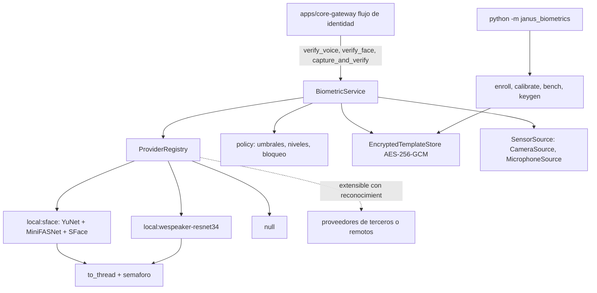

# Feature Spec: libs/biometrics/ (verificación local de voz y cara como señal de identidad)

> **Status**: Ready for implementation, con una compuerta de rendimiento y de calibración en el hardware objetivo
> **Last updated**: 2026-09-20
> **Orden de implementación**: después de las specs 11 y 13. Depende de: spec 02 (configuración por parámetros), spec 13 (convenciones de proveedor y compuerta de rendimiento) y spec 16 (`janus_platform`). Lo consume `apps/core-gateway` (spec 11, requisito 26ter).

---

## Objective

Construir la verificación biométrica de identidad que resuelve la pregunta 14 de `architecture/09`: voz (verificación de hablante) y cara como señales opcionales de la verificación en capas del remitente (spec 11, requisito 26). Es verificación uno a uno contra la plantilla del dueño, nunca identificación entre varias personas.

Decisiones del usuario que fija esta spec:
* Procesamiento local por defecto. Ningún dato biométrico sale del equipo salvo que el usuario configure y reconozca de forma explícita un proveedor remoto.
* Los modelos se eligen por ser livianos: sin LLM, con redes chicas de embeddings que corren en CPU (Raspberry Pi incluido).
* Sensores de voz y cámara, varios y de distintos medios, activables por canal.
* Convivencia configurable por canal con las demás señales de identidad (identificador de plataforma y desafío `.md`), o funcionamiento en solitario.

Una vez implementada, el núcleo puede preguntar "¿este audio o esta imagen corresponde al dueño?" y recibir un nivel de confianza, sin que el audio, la imagen ni los embeddings salgan de esta librería salvo el resultado.

---

## Hechos verificados (septiembre de 2026)

* **Detección de cara: YuNet** (OpenCV Zoo, licencia MIT, unos 232 KB, con 5 puntos de referencia por cara). El benchmark publicado por OpenCV Zoo da 6.22 ms por inferencia en la CPU de un Raspberry Pi a 160x120.
* **Reconocimiento de cara: SFace** (OpenCV Zoo, licencia Apache 2.0, unos 38.7 MB, embedding de 128 dimensiones sobre recortes de 112x112). El mismo benchmark da 99.20 ms por inferencia en la CPU de un Raspberry Pi.
* **Antifalsificación de cara (liveness): MiniFASNetV2 más MiniFASNetV1SE** del proyecto Silent-Face-Anti-Spoofing (unos 4 MB, licencia Apache 2.0 según su integración en LocalAI, entrada de 80x80, inferencia en CPU de menos de 10 ms según esa misma fuente). Es liveness pasivo de un solo fotograma: reduce fotos impresas y pantallas, no frena ataques de alta calidad.
* **Verificación de hablante: WeSpeaker ResNet34 en ONNX** (unos 6.3 millones de parámetros, embedding de 256 dimensiones, audio a 16 kHz). Los repositorios de WeSpeaker y 3D-Speaker reportan una tasa de error igual (EER) menor a 1.1% en VoxCeleb1-O para modelos de este tamaño. La licencia de los pesos sigue la de VoxCeleb (CC BY 4.0), que exige atribución. Alternativa: CAM++ (7.2 millones de parámetros).
* Los umbrales de similitud del coseno no se transfieren entre modelos: el mismo par de voces puntúa unos 0.9 con un modelo y unos 0.15 con otro. Cada modelo necesita su umbral, y se calibra con datos del propio dueño.

Todo esto se revalida al fijar dependencias. No se verificó en esta sesión ningún modelo remoto ni de voz antifalsificación ligero, y por eso v1 no incluye antifalsificación de voz (ver Technical Decisions).

---

## Functional Requirements

### Contratos y proveedores
1. `FaceVerifier` (ABC): `id`, `verify(image: bytes, enrollment: Enrollment) -> BiometricResult` y `close()`. `SpeakerVerifier` (ABC): `id`, `verify(audio: PcmAudio, enrollment: Enrollment) -> BiometricResult` y `close()`. `PcmAudio` es PCM de 16 bits, mono, a 16 kHz.
2. `BiometricResult { decision, score, liveness, quality_ok, reason, provider_id, model_id }`. `decision` es `HIGH`, `MEDIUM`, `LOW` o `INCONCLUSIVE`; `score` es la similitud del coseno y no sale de la librería (requisito 16); `liveness` es `PASS`, `FAIL` o `NOT_CHECKED`.
3. Referencias de proveedor `nombre` o `nombre:variante`, igual que en la spec 13. Proveedores de fábrica: `local:sface` (cara), `local:wespeaker-resnet34` (voz) y `null` (desactiva la señal sin condicionales en el núcleo).
4. Proveedores de terceros o remotos: se registran por ruta punteada `paquete.modulo:Clase` con `config_model` de Pydantic, igual que los adaptadores (spec 04). v1 no trae ningún proveedor remoto. Configurar uno exige `biometrics.allow_remote = true` y `biometrics.remote_ack = true`; sin ambas, el registro lo rechaza con `RemoteProviderNotAcknowledged`. El mensaje del rechazo explica que audio o imagen saldrán del equipo.
5. Las capacidades biométricas no se registran en el Registro de Capacidades (a diferencia de `voice.*`): son datos sensibles y ningún spoke tiene motivo legítimo para pedirlas. Solo el núcleo llama a `BiometricService`, lo que respeta el Principio #1.

### Cara
6. Cadena de `local:sface`: detectar (YuNet) y, si hay más de una cara, devolver `INCONCLUSIVE` con motivo `multiple_faces` sin comparar (privacidad y evita elegir a la persona equivocada); alinear con los cinco puntos de referencia; liveness (requisito 7); extraer embedding (SFace); comparar por coseno contra los embeddings de la plantilla.
7. Liveness: `face.liveness` en `required` (default), `optional` u `off`. Con `required`, un `FAIL` fuerza `LOW` sin importar la similitud. Con `optional`, un `FAIL` degrada un `HIGH` a `MEDIUM`. Por qué `required` es el default: una foto del dueño es el ataque más simple contra una cara.
8. Control de calidad antes de puntuar: tamaño mínimo de la cara, nitidez y luminancia dentro de rango. Fuera de rango, `quality_ok = false` y `INCONCLUSIVE` con motivo `low_quality`; no es un rechazo del dueño.

### Voz
9. Cadena de `local:wespeaker-resnet34`: normalizar a 16 kHz mono; recortar silencio; exigir duración mínima de habla (default 2.5 s; con menos, `INCONCLUSIVE` con motivo `too_short`); extraer características de espectro (`fbank` de 80 bandas); embedding; coseno contra la plantilla.
10. v1 no incluye antifalsificación de voz. Una voz clonada o una grabación puede pasar la verificación. Mitigación de diseño obligatoria: la señal de voz sola no autoriza órdenes de control ni aprobaciones cuando `control_mode` del canal es `all` (spec 11, requisito 26ter), y el default de `control_mode` es `all` en canales con más de una señal activa.

### Umbrales y decisión
11. Por proveedor y modelo, dos umbrales `t_high` y `t_low`: `score >= t_high` es `HIGH`; entre `t_low` y `t_high` es `MEDIUM`; por debajo de `t_low` es `LOW`. Los valores por defecto los trae cada proveedor con el aviso `calibration_recommended` hasta que el usuario calibra. Se sobrescriben en `biometrics.face.thresholds` y `biometrics.voice.thresholds`.
12. `MEDIUM` y `LOW` no son un "no eres tú": son insuficiente evidencia. El núcleo decide qué hacer con `on_low_confidence` del canal (spec 02, requisito 19e): `challenge` (default, cae al desafío `.md` con el mecanismo del requisito 26bis de la spec 11) o `deny`.
13. Límite de intentos por remitente (`biometrics.max_failed_attempts` default 5 en `lockout_window_s` default 600): al superarlo, la señal biométrica de ese remitente queda bloqueada `lockout_s` (default 900) y se emite un evento de seguridad. Frena tanto la fuerza bruta como el ajuste de un ataque a partir de las respuestas.
14. Toda decisión tiene un motivo (`reason`) legible para el log y la observabilidad.

### Plantilla, alta y calibración
15. `Enrollment`: por tipo y perfil, los embeddings de las muestras de alta, su centroide, `model_id`, `dim`, número de muestras y fecha. Cara: mínimo 5 imágenes con variación de ángulo e iluminación. Voz: mínimo 5 locuciones de al menos 3 s cada una, idealmente de sesiones distintas.
16. Privacidad de los datos: las muestras crudas (imágenes y audio) se procesan en memoria y se descartan al terminar; no existe opción para conservarlas. La puntuación numérica no sale de la librería hacia el remitente, los canales ni los eventos de estado (solo `decision`, y el motivo); se registra únicamente en el log local a nivel DEBUG.
17. Almacenamiento en `state_dir/biometrics/<tipo>/<perfil>.enc`, nunca en `janus.db`. Cifrado autenticado AES-256-GCM (`cryptography`). La clave sale de `biometrics.key` (`SecretRef`: variable de entorno o archivo privado); `python -m janus_biometrics keygen` genera una clave aleatoria de 256 bits en un archivo privado (`janus_platform.write_private`). Alternativa más fuerte: derivar la clave de una frase secreta con `hashlib.scrypt` (`key_source = "passphrase_env"`). Limitación documentada: con la clave guardada en el mismo equipo, el cifrado protege contra copias parciales, respaldos y volcados de la base, no contra un atacante con acceso completo a la cuenta del usuario.
18. Cambiar de modelo invalida las plantillas existentes (los embeddings de modelos distintos no son comparables): `ModelMismatch` y la señal queda desactivada hasta repetir el alta.
19. CLI: `python -m janus_biometrics enroll --kind face|voice --profile owner [--source device|dir]`, `list`, `delete --kind ... --profile ...`, `keygen`, `bench` y `calibrate [--impostors DIR]`. `calibrate` mide la distribución de puntuaciones genuinas del propio dueño (validación cruzada de dejar una muestra fuera) y, si se le da un directorio con muestras de otras personas, elige `t_high` y `t_low` para un objetivo de tasa de falsa aceptación (default 1%) y de falso rechazo (default 5%); sin muestras ajenas usa los umbrales por defecto y lo advierte. `delete` elimina la plantilla de forma segura (sobrescribe y borra).

### Sensores
20. `SensorSource` (ABC): `capture_frame()` para cámara y `capture_audio(max_s)` para micrófono, con `id`, `kind` y `device` (índice, ruta o nombre). Implementaciones de v1: `CameraSource` (captura de OpenCV, funciona en Linux y en Windows) y `MicrophoneSource` (extra opcional `[sensors]` con `sounddevice`, que necesita PortAudio; en Windows viene empaquetado).
21. Los sensores se declaran en `biometrics.sensors` y se asocian a canales en `channels.<...>.identity.sensor`. Fuentes de muestras por canal: el propio mensaje entrante (nota de voz o imagen adjunta, sin sensor local), o un sensor local. Un canal de mensajería que verifica cara con imagen adjunta exige `liveness = required`.
22. La captura de un sensor local es una operación de solo lectura del hardware del usuario: la dispara el núcleo cuando la política del canal la necesita, nunca un agente por su cuenta. No hay grabación continua: una captura acotada por evento. El canal de voz local del hogar (altavoz con activación por voz) queda fuera de v1 junto con la conversación dúplex (spec 13); esta spec ya le deja `MicrophoneSource` y la política por canal.

### Servicio
23. `BiometricService` es la fachada para el núcleo: `verify_voice(audio, profile) -> BiometricResult`, `verify_face(image, profile) -> BiometricResult`, `capture_and_verify(sensor_id, kind, profile)`, `status() -> BiometricStatus` (proveedores cargados, plantillas presentes, bloqueos activos) y `health()`. Sin plantilla, sin modelo o con la señal bloqueada devuelve `INCONCLUSIVE` con motivo, nunca lanza en el camino normal.
24. Los modelos se descargan a `state_dir/models/biometrics/` con verificación de hash y reintento (mismo esquema que la spec 13). Se cargan de forma perezosa y se descargan de memoria tras `model_idle_unload_s` (default 300) de inactividad para acotar el consumo en un Raspberry Pi. Sin modelo y sin red, `INCONCLUSIVE` con motivo `model_unavailable`.
25. La inferencia va en `asyncio.to_thread` con un semáforo (default 1) para no saturar el host mientras el motor razona.

### Compuerta de rendimiento
26. `python -m janus_biometrics bench` mide, por proveedor y sensor configurados: latencia de extremo a extremo (detección, liveness y embedding para cara; recorte, características y embedding para voz), memoria pico y, con datos de `calibrate`, la tasa de falso rechazo y de falsa aceptación resultantes. Si la latencia p95 supera `biometrics.latency_warn_ms` (default 1500 para cara y 3000 para voz), el servicio marca el proveedor `DEGRADED` y lo informa; no se cambia de comportamiento en silencio.

---

## Non-Functional Requirements

* **Performance**: verificación de cara menor a 500 ms p95 con SFace y YuNet en Raspberry Pi 4 o 5, y menor a 100 ms en un PC de escritorio; verificación de voz con 3 s de audio menor a 1.5 s p95 en Raspberry Pi 4 o 5 y menor a 300 ms en PC. Memoria de los tres modelos de cara menor a 100 MB cargados. Objetivos propuestos, se confirman con `bench`; las cifras de OpenCV Zoo citadas arriba son de terceros y no sustituyen la medición en el hardware del usuario.
* **Security**: datos biométricos cifrados en reposo; sin muestras crudas persistidas; sin puntuaciones fuera de la librería; límite de intentos; proveedores remotos solo con reconocimiento explícito; el audio y la imagen entrantes son datos no confiables (tamaño máximo, tipo verificado antes de decodificar).
* **Reliability**: un fallo de biometría nunca bloquea el servicio: la señal pasa a `INCONCLUSIVE` y el canal cae a lo que su política defina. Toda espera respeta la cancelación.
* **Portability**: Python 3.11 o superior; Linux x86_64 y aarch64 y Windows x86_64. Dependencias: `numpy`, `onnxruntime`, `cryptography`, `opencv-python-headless` (extra `[face]`, también trae la captura de cámara), `sounddevice` (extra `[sensors]`) y `janus_platform`. Prohibido importar `libs/adapters`, `libs/capabilities`, `libs/persistence` y `apps/*`.

---

## Technical Decisions

### Redes chicas de embeddings, sin modelo de lenguaje
* **Chosen**: YuNet, SFace y MiniFASNet para cara; ResNet34 de WeSpeaker para voz; todos por ONNX u OpenCV en CPU.
* **Reason**: pedido del usuario (local, liviano, sin LLM). Los tamaños y los benchmarks publicados de estos modelos caben en un Raspberry Pi, y las licencias (MIT, Apache 2.0, CC BY 4.0 con atribución) son compatibles con el proyecto MIT.
* **Rejected alternatives**: modelos de reconocimiento facial de proyectos con pesos de licencia no verificada (InsightFace, no verificado en esta sesión, queda fuera de v1); reconocimiento en la nube por defecto (rompe la política local); un LLM multimodal como verificador (peso y latencia sin beneficio).

### Verificación uno a uno del dueño, no identificación
* **Chosen**: comparar contra la plantilla del dueño.
* **Reason**: mínima exposición de datos: no se guardan ni se comparan rostros o voces de terceros, y una imagen con varias caras no se procesa.
* **Rejected alternatives**: identificación entre varias personas (multi tenencia descartada en la pregunta 9 de `architecture/09`).

### `MEDIUM` y `LOW` como falta de evidencia, con caída al desafío `.md`
* **Chosen**: `on_low_confidence = challenge` por defecto.
* **Reason**: reutiliza el mecanismo de la spec 11 (requisito 26bis) sin estado nuevo y evita bloquear al dueño legítimo por una mala captura.
* **Rejected alternatives**: bloquear siempre (fricción alta con falsos rechazos); preguntar al usuario por otro canal (depende de que haya otro canal verificado).

### Sin antifalsificación de voz en v1
* **Chosen**: no incluirla y compensar con política: la voz sola no autoriza control cuando hay más de una señal activa.
* **Reason**: no se verificó un modelo ligero, abierto y compatible de detección de suplantación de voz, y prometer una protección no verificada es peor que declarar la limitación.
* **Rejected alternatives**: incluir un modelo sin verificar; ocultar la limitación.

### Las capacidades biométricas no entran al Registro
* **Chosen**: solo el núcleo las llama.
* **Reason**: datos sensibles sin consumidor legítimo entre spokes; evita ampliar la superficie de ataque.
* **Rejected alternatives**: registrarlas como `voice.*` (útil para voz, pero no para verificación de identidad).

### Cifrado de plantillas con clave configurable
* **Chosen**: AES-256-GCM con clave por `SecretRef` o derivada de frase secreta.
* **Reason**: protege plantillas contra copias parciales y respaldos; `SecretRef` es el mecanismo ya usado en toda la configuración.
* **Rejected alternatives**: claves en el llavero del sistema (no uniforme en Pi sin sesión gráfica y en Windows sin dependencias); plantillas en texto plano.

---

## Proposed Architecture

### Component Diagram


### Directory Structure
```
libs/biometrics/
  pyproject.toml
  src/janus_biometrics/
    __init__.py
    service.py        # BiometricService
    base.py           # FaceVerifier, SpeakerVerifier, BiometricResult, PcmAudio, Enrollment
    registry.py       # referencias de proveedor y reconocimiento de remotos
    policy.py         # umbrales, decision, limite de intentos
    enrollment.py     # alta y calibracion
    store.py          # EncryptedTemplateStore
    sensors.py        # SensorSource, CameraSource, MicrophoneSource
    models.py         # descarga y verificacion por hash
    providers/        face_sface.py liveness_minifas.py speaker_wespeaker.py null.py
    bench.py  __main__.py  errors.py
  tests/
NOTICE                # atribucion de los pesos con licencia CC BY 4.0, MIT y Apache 2.0
```

---

## Data Models

```
Enum   Decision        { HIGH, MEDIUM, LOW, INCONCLUSIVE }
Enum   Liveness        { PASS, FAIL, NOT_CHECKED }
Entity BiometricResult { decision, liveness, quality_ok, reason, provider_id, model_id }   # score solo interno
Entity Enrollment      { kind: face|voice, profile, model_id, dim, embeddings[], centroid, samples, created_at }
Entity BiometricStatus { providers: [{kind, provider_id, loaded, state}], enrolled: [{kind, profile, model_id}], lockouts: [...] }
Entity SensorConfig    { id, kind: camera|microphone, device }
Config biometrics      { enabled=false, face: {provider, liveness=required, thresholds: {high, low}},
                         voice: {provider, thresholds: {high, low}, min_speech_s=2.5},
                         key: SecretRef | key_source, sensors: [SensorConfig],
                         max_failed_attempts=5, lockout_window_s=600, lockout_s=900,
                         allow_remote=false, remote_ack=false, model_idle_unload_s=300,
                         latency_warn_ms: {face=1500, voice=3000} }
Config channel.identity { signals: [platform_id, challenge, voice, face], mode: any|all,
                          control_mode?: any|all, on_low_confidence: challenge|deny, sensor? }
```

---

## API Contracts

Librería, sin API de red.

```
BiometricService.verify_voice(audio: PcmAudio, profile: str = "owner") -> BiometricResult
BiometricService.verify_face(image: bytes, profile: str = "owner") -> BiometricResult
BiometricService.capture_and_verify(sensor_id: str, kind: str, profile: str = "owner") -> BiometricResult
BiometricService.status() -> BiometricStatus       BiometricService.health() -> list[BiometricHealth]
CLI: python -m janus_biometrics enroll|list|delete|keygen|bench|calibrate
Errores (fuera del camino normal): RemoteProviderNotAcknowledged, ModelMismatch, EnrollmentError, KeyUnavailable, SensorUnavailable
```

---

## Edge Cases

| Case | How to Handle |
|---|---|
| Sin plantilla enrolada | `INCONCLUSIVE` con motivo `not_enrolled`; el canal cae a su política. |
| Imagen con varias caras | `INCONCLUSIVE` con motivo `multiple_faces`; nunca se elige una. |
| Foto impresa o pantalla frente a la cámara | Liveness `FAIL` y `LOW` con `liveness = required`. |
| Voz clonada o grabación | Puede pasar (sin antifalsificación de voz en v1); `control_mode = all` la contiene. |
| Audio demasiado corto | `INCONCLUSIVE` con motivo `too_short`. |
| Cambio de modelo | `ModelMismatch`; señal desactivada hasta repetir el alta. |
| Clave de cifrado ausente | `KeyUnavailable`; la señal queda `INCONCLUSIVE` y se informa en `health()`. |
| Cámara u micrófono ocupado o ausente | `SensorUnavailable`; `INCONCLUSIVE` con motivo. |
| Rachas de intentos fallidos | Bloqueo de la señal para ese remitente durante `lockout_s` y evento de seguridad. |
| Proveedor remoto configurado sin reconocimiento | El registro lo rechaza con `RemoteProviderNotAcknowledged`. |
| Raspberry Pi con poca memoria | Descarga perezosa de modelos por inactividad. |
| Ambiente ruidoso o poca luz | `quality_ok = false`; `INCONCLUSIVE`, no rechazo. |

---

## Testing Requirements

**Unit Tests**: política de umbrales con los cuatro niveles; límite de intentos y bloqueo con reloj falso; cifrado y descifrado de plantillas y rechazo con clave errónea o archivo alterado; `ModelMismatch`; control de calidad; `multiple_faces`; rechazo de proveedor remoto sin reconocimiento; resolución de referencias de proveedor y carga por ruta punteada; todo con proveedores y sensores falsos deterministas.

**Integration Tests**: alta y verificación reales con SFace, YuNet y MiniFASNet sobre imágenes de prueba con licencia libre (mismo sujeto, otro sujeto, foto de una pantalla); alta y verificación reales de voz con WeSpeaker sobre locuciones de prueba; `calibrate` con un directorio de impostores; `bench` con salida verificable; concurrencia con semáforo; ejecución del `bench` en el Raspberry Pi y en Windows como prueba manual documentada, cuyo resultado se registra en `libs/biometrics/BENCH.md`; flujo completo con `apps/core-gateway` y un `FakeChannelBridge` para los cuatro resultados y la caída al desafío `.md`.

---

## Security Checklist
- [ ] Plantillas cifradas con autenticación, fuera de `janus.db`
- [ ] Muestras crudas nunca persistidas
- [ ] La puntuación no sale de la librería ni llega al remitente
- [ ] Límite de intentos y bloqueo por remitente
- [ ] Proveedores remotos solo con `allow_remote` y `remote_ack`
- [ ] Verificación uno a uno; imágenes con varias caras rechazadas
- [ ] Liveness de cara `required` por defecto
- [ ] Voz sola no autoriza control con más de una señal activa
- [ ] Atribución de pesos con licencia CC BY 4.0, MIT y Apache 2.0 en `NOTICE`
- [ ] Entradas de audio e imagen validadas (tamaño y tipo) antes de decodificar

---

## Open Questions
- [ ] Frontend de características de voz sin PyTorch: evaluar `speakeronnx` (verificar su licencia) o `kaldi-native-fbank`, y confirmar wheels de aarch64 y de Windows.
- [ ] Umbrales por defecto de cada modelo: se fijan con `calibrate` y datos reales; hasta entonces son valores conservadores con aviso.
- [ ] Modelo de antifalsificación de voz ligero, abierto y de licencia compatible: sin candidato verificado; diferido hasta que exista. Mientras tanto rige el requisito 10.
- [ ] Licencia exacta de los pesos de MiniFASNet en su repositorio de origen (la integración de LocalAI la declara Apache 2.0): confirmar antes de redistribuir.
- [ ] Conteo de muestras de alta que da un falso rechazo aceptable: 5 es el mínimo, se ajusta con `calibrate`.
- [ ] Canal de voz local del hogar (altavoz con activación por voz): posterior a v1, junto con la conversación dúplex de la spec 13.

---

## Handoff Note
Revisar esta spec antes de empezar. Crear un checklist desde los requisitos funcionales y marcarlo al avanzar. Levantar dudas antes de codificar, no durante. Implementar primero `base.py`, `policy.py` y `store.py` con proveedores falsos; luego `bench` y `calibrate` para tener cifras reales en el hardware del usuario antes de pulir los proveedores.
