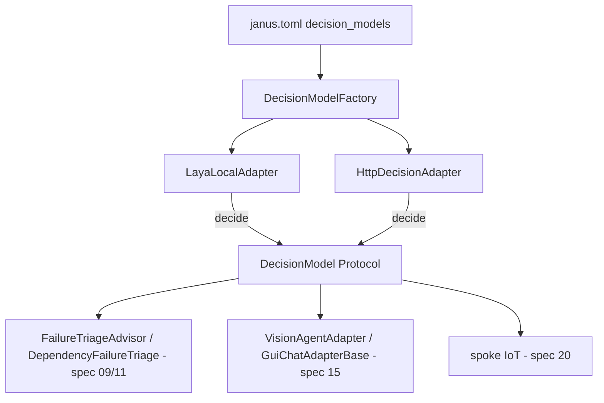

# Feature Spec: libs/decision/ (puerto de decision model, intercambiable como providers)

> **Status**: Ready for implementation
> **Last updated**: 2026-09-25
> **Orden de implementación**: 19 de 20. Depende de: spec 01 (proto), spec 02 (config), spec 04 (contratos de adaptador). Lo consumen la spec 09 (triage), spec 12/15 (GUI) y spec 20 (IoT).

---

## Objective

Dar a Janus un segundo tipo de modelo, distinto de los `providers` conversacionales (spec 02, spec 10): un **decision model** ("System 1") que no genera texto, sino que responde preguntas tipadas (`choice`, `score`, `noul`/booleano) sobre un estado dado, en un solo forward pass, con probabilidad calibrada por respuesta.

Motivación (decidida con el usuario, 2026-09-25): la mayoría de los pasos de un agente no son escritura, son decisiones acotadas — enrutar, clasificar, elegir el siguiente elemento de una lista, decidir si continuar o escalar. Pedirle esas decisiones a un LLM completo es más lento y más caro de lo necesario, y (en el caso de acciones sobre GUI o dispositivos) menos seguro, porque un LLM puede alucinar una opción que no existe; un decision model solo puede responder dentro del esquema que se le dio.

Este puerto es **intercambiable, igual que `providers`**: Laya (local, Apache 2.0) es el default, pero cualquier decision model compatible (por ejemplo un servicio remoto tipo Jev/TypeSafe) se declara con la misma forma y se selecciona por config, sin tocar el código que lo consume.

No cubre generación de texto, planificación, ni nada que requiera razonar en varios pasos: eso sigue siendo del motor de razonamiento (spec 10). Este puerto cubre exclusivamente decisiones de una sola pregunta (o un lote de preguntas independientes) sobre un estado ya dado.

---

## Functional Requirements

### El puerto (`DecisionModel`)

1. `DecisionModel` es un `Protocol`/ABC en `libs/decision/src/janus_decision/port.py`, con un único método `decide(state: DecisionState, questions: list[Question]) -> list[Answer]`. Todas las preguntas de una llamada se resuelven en un solo pase (batch), nunca una por una, porque el ahorro de latencia depende de eso.
2. `DecisionState` es texto libre, JSON serializado, o ambos concatenados con un separador declarado; el puerto no interpreta su contenido, solo lo pasa al backend. Tamaño máximo configurable (`decision.max_state_chars`, default 8000, alineado con el límite documentado de contexto largo de Laya).
3. `Question` es una de tres formas:
   - `ChoiceQuestion(id, prompt, options: list[str])`: la respuesta es una de `options`, nunca un valor fuera de la lista.
   - `ScoreQuestion(id, prompt, min=0.0, max=1.0)`: la respuesta es un número en el rango.
   - `NoulQuestion(id, prompt)`: la respuesta es un booleano con probabilidad (nombre tomado de la terminología del dominio: pregunta de sí/no calibrada).
4. `Answer(question_id, value, confidence: float)`. `confidence` es la probabilidad calibrada que el backend asigna a `value`, no una heurística inventada por Janus. Un backend que no calibre probabilidades (poco común, pero posible en una integración futura) debe decirlo explícitamente vía `DecisionModel.supports_confidence: bool`; con `False`, `confidence` siempre es `None` y ningún consumidor puede exigir un umbral de confianza sobre ese backend (se valida en `config` si el consumidor lo requiere).
5. **No puede alucinar por diseño**: el puerto exige que toda implementación valide server-side (o cliente-side si el backend no lo garantiza) que `value` está dentro del dominio de la pregunta; si el backend devuelve algo fuera de dominio, la implementación lo traduce a `DecisionSchemaError` (fallo lógico, nunca se propaga el valor inválido). Esto es lo que hace seguro delegarle una decisión de mutación (spec 12, GUI) o de control físico (spec 20, IoT): el espacio de respuestas posibles es exactamente el que Janus declaró.
6. Fallos de infraestructura (timeout, backend caído, error de proceso) son excepciones (`DecisionUnavailableError`, `DecisionTimeoutError`), nunca una `Answer`. Sigue la misma distinción infraestructura-vs-dato de la spec 04.

### Config: decision models intercambiables como `providers`

7. `janus.toml` gana la sección `decision_models`: tabla `nombre -> DecisionModelConfig` con `kind` (`laya_local`, `laya_server`, `http_generic`), `settings` (tabla libre validada por `cls.config_model` del backend), y opcionalmente `checkpoint` (para backends locales con varios checkpoints entrenables, ver requisito 13).
8. `decision.default_model` (referencia a una clave de `decision_models`) es el decision model usado cuando un consumidor no pide uno explícito. Default de fábrica: una entrada `laya_local` con el checkpoint base multilingüe.
9. Un consumidor (triage, GUI, IoT) puede pedir un decision model específico por nombre, o dejar que el `default_model` decida; esto es simétrico a cómo un agente puede fijar `model_provider` o dejarlo en el default (spec 02, requisito 24).
10. `LayaLocalAdapter` (`kind = "laya_local"`) corre el paquete `laya` en proceso (o en un subproceso dedicado si el modelo es pesado; se decide al implementar, midiendo en el hardware objetivo) y expone `decide()` sin salir a la red. Config: `checkpoint` (id de HuggingFace o ruta local), `device` (`cpu` por defecto, igual criterio que `memory.embedding_device`), `router_enabled` (si es `true`, deja que el router de Laya elija el checkpoint por request en vez de fijar uno).
11. `HttpDecisionAdapter` (`kind = "http_generic"`) es el adaptador para cualquier decision model expuesto por HTTP con un contrato de request/response configurable (`request_template`, `response_path` con rutas punteadas para extraer `value` y `confidence` de la respuesta) — esto es lo que permite usar un servicio como Jev/TypeSafe, o `laya-serve` en modo servidor, sin escribir una integración nueva por proveedor. Autenticación por `SecretRef`, igual que `ProviderConfig`.
12. Igual que con `providers`, **no hay lógica en el núcleo que asuma qué backend está detrás**: el núcleo solo ve `DecisionModel.decide()`.

### Fine-tuning y checkpoints (funcionalidad propia de Laya que el puerto expone)

13. `decision.checkpoints` (tabla opcional `nombre -> ruta o id`) permite registrar checkpoints ajustados por el usuario (Laya soporta fine-tuning sobre las propias decisiones del dominio, con mejoras de precisión documentadas). Un consumidor puede pedir un checkpoint concreto (por ejemplo, uno afinado sobre los patrones de cuota reales de Claude Desktop, ver requisito 20) en vez del checkpoint base zero-shot.
14. No se implementa un pipeline de fine-tuning dentro de Janus en esta spec: el ajuste se hace fuera (siguiendo la guía propia de Laya) y el resultado se registra como checkpoint en la config. Queda como *Open Question* si conviene automatizar la recolección de ejemplos etiquetados desde el propio uso de Janus (ver más abajo).

### Uso 1: triage de fallos y dependencias (integra con spec 09 y spec 11)

15. `FailureTriageAdvisor` (spec 09, #74) y `DependencyFailureTriage` (spec 11) ganan una etapa previa opcional: antes de escalar a Janus (invocación cara), se le hace al decision model una `ChoiceQuestion` con opciones exactamente `["continue_chain", "escalate"]` (o `["retry", "cancel_cascade", "ask_user"]` para dependencias), usando como `DecisionState` el mismo insumo que ya se le pasaría a Janus (tipo de fallo, historial, estado de la cadena, idempotencia — nunca el contenido de la solicitud del usuario, mismo límite que ya fija #74).
16. Umbral de confianza configurable (`decision.triage_confidence_threshold`, default 0.85): si `confidence >= umbral`, se actúa directo sobre la respuesta del decision model sin invocar a Janus. Si es menor, se escala a Janus exactamente como hoy (el decision model nunca reemplaza a Janus, solo evita la invocación cuando el caso es claro).
17. Esto es una optimización de costo/latencia, no un cambio de contrato: `judgment.failure_triage_mode` (spec 02, `janus` | `chain_only`) sigue rigiendo si existe la posibilidad de consultar un juicio en absoluto; esta spec añade `judgment.failure_triage_prefilter` (`decision_model` | `none`, **default `decision_model`**) como una tercera capa **antes** de esas dos, no un reemplazo. El default activo se decidió (2026-09-25) porque el costo real de tener el prefiltro encendido es marginal frente al de invocar a Janus (ver Non-Functional Requirements: el checkpoint más pesado de Laya pesa ~1.6 GB y responde en el orden de decenas de milisegundos, medido por el propio proyecto), así que no hay razón práctica para exigir que el usuario lo active a mano; sí puede desactivarlo (`none`) si un perfil de hardware muy acotado (ej. Raspberry Pi sin margen) lo justifica.

### Uso 2: interacción con GUI (integra con spec 12 y spec 15)

18. `VisionAgentAdapter` (spec 15, #25) y `GuiChatAdapterBase` (spec 15, #23) ganan un paso de decisión acotada: cuando el espacio de acciones posibles es enumerable (elementos del árbol de accesibilidad AT-SPI ya mapeados, o candidatos de una rejilla sobre la captura de pantalla), la elección de **cuál** elemento tocar se resuelve con una `ChoiceQuestion` sobre esos candidatos, en vez de pedirle al modelo de visión completo que razone la coordenada exacta en cada paso. Esto sigue el patrón documentado en agentes de navegador basados en decision models: un modelo más caro (LLM o modelo de visión) fija el objetivo o interpreta la pantalla una vez, y el decision model resuelve la elección puntual entre las opciones ya enumeradas, en el orden de milisegundos en vez de segundos.
19. División de responsabilidad explícita, para no romper el principio de aprobación de la spec 04: el decision model **solo elige entre candidatos que Janus ya enumeró y ya tiene permiso de ejecutar**. Nunca genera una acción nueva, nunca decide *si* mutar pantalla (eso lo sigue decidiendo `request_approval`, spec 04 #57, spec 11 #88) — solo decide *cuál* de las opciones ya aprobadas ejecutar. Esto es una restricción de diseño, no una casualidad: es lo que mantiene la garantía de "no puede alucinar" útil en este contexto.
20. Detección de cuota (spec 15, requisito 28: `quota_patterns`) puede migrar de coincidencia de texto fija a una `NoulQuestion` ("¿este texto de salida indica que se agotó la cuota?") sobre el decision model, más robusta que una lista de patrones fijos si el texto de la app cambia entre versiones. Config: `gui_automation.quota_detection` (`pattern_match` por defecto, o `decision_model`).
21. Nada de esto es obligatorio para que la spec 15 funcione: sigue funcionando con coincidencia de texto y con el modelo de visión decidiendo la coordenada directamente, como ya estaba especificado. El decision model es una optimización de velocidad/costo que se activa por config.

### Puerto de entidades enumerables (habilita spec 20, IoT, y cualquier dominio futuro del mismo tipo)

22. Esta spec no implementa IoT (eso es la spec 20), pero deja explícito el contrato genérico que cualquier dominio con un **conjunto de entidades listables y acciones acotadas** puede reutilizar: dado un `DecisionState` que enumera el estado actual de un conjunto de entidades (dispositivos, ventanas de GUI, filas de una tabla, lo que sea que un adaptador exponga como lista con identificador y atributos), y una `ChoiceQuestion` cuyas `options` son exactamente los identificadores disponibles (u `OFF`/ninguno), el decision model resuelve "cuál entidad" a partir de una intención ya interpretada por Janus (ej. una instrucción en lenguaje natural cuyo verbo y ámbito Janus ya identificó; el decision model solo resuelve la referencia ambigua dentro del ámbito ya acotado). Este contrato es intencionalmente abstracto: no asume qué tipo de entidad es, ni cuántos atributos tiene, ni de qué dominio viene — la spec 20 (IoT) es su primer consumidor concreto, pero cualquier spoke futuro que necesite "elegir uno de varios" sobre una lista ya enumerada puede usarlo igual.
23. Mismo principio del requisito 19: el decision model nunca decide *si* actuar sobre una entidad, solo *cuál*, entre las que Janus ya tiene permiso de tocar. La ejecución real de cualquier acción de mutación sigue pasando por `request_approval` según la política que cada dominio consumidor defina (la spec 20 define la suya para acciones físicas).

### Observabilidad y evaluación

24. Cada llamada a `decide()` se loguea (spec 06) con `question_ids`, `confidence` por respuesta y el `model` usado, pero **nunca el `DecisionState` completo si contiene datos del usuario** (mismo criterio de redacción que la spec 06, requisito 4). Esto es lo que permite, más adelante, evaluar si el umbral de confianza (requisito 16) está bien calibrado para el uso real, sin tener que guardar contenido sensible.
25. `decision.log_disagreements` (default `false`): si está activo y una decisión prefiltrada por el decision model luego se contradice por la decisión de Janus cuando este sí se invoca (por ejemplo, en modo `chain_only` alternante para muestreo), se registra como desacuerdo. Sirve como insumo para decidir si conviene fine-tunear un checkpoint (requisito 13) — pero la recolección y el uso de ese insumo quedan fuera de esta spec (ver Open Questions).

---

## Non-Functional Requirements

* **Performance**: cifras publicadas por el propio proyecto (medidas en GPU T4): 33 ms para una pregunta, 7.2 ms por pregunta en lote de 10, 103 a 332 preguntas/segundo por tarjeta. En CPU (perfil por defecto de esta spec) se espera más lento pero el objetivo operativo es igualmente laxo: `decide()` con el backend `laya_local`, lote de hasta 10 preguntas, menor a 300 ms p95 en la PC del usuario (objetivo, se ajusta al medir; el propio proyecto reporta variabilidad más allá de ~4000 tokens de estado). El checkpoint más pesado son 421M parámetros (~1.6 GB en fp32; hay build 8-bit de ~524 MB), y los tres checkpoints cargados a la vez caben en 16 GB de VRAM con margen; el `Router` de Laya carga cada checkpoint de forma perezosa con expulsión LRU, así que no hace falta tenerlos todos residentes. El backend `http_generic` depende de la red y no tiene objetivo propio más allá de respetar `decision.timeout_s` (default 5s).
* **Security**: `HttpDecisionAdapter` usa `SecretRef`, nunca credenciales en texto plano (mismo criterio que `ProviderConfig`, spec 02). El puerto nunca envía a un backend remoto el contenido de una solicitud de usuario sin que el consumidor lo declare explícitamente (mismo mecanismo `allow_remote`/`remote_ack` que voz y biometría, spec 13/18) — un decision model local no tiene esta restricción porque el dato no sale del equipo.
* **Reliability**: un `DecisionUnavailableError` nunca bloquea el flujo que lo consume — cada consumidor (triage, GUI) tiene un camino de fallback ya existente (invocar a Janus, usar coincidencia de texto) que se usa automáticamente si el decision model no responde a tiempo.
* **Portability**: Python 3.11 o superior. El paquete base (`janus_decision`, el puerto y `HttpDecisionAdapter`) no tiene dependencias nativas; `LayaLocalAdapter` es un extra opcional (`janus-decision[laya]`) porque trae el runtime de inferencia de Laya. Prohibido importar `libs/capabilities`, `libs/reasoning-engine` y `apps/*` desde el paquete base (el puerto es más bajo en la pila que quien lo consume).

---

## Technical Decisions

### Puerto propio (`libs/decision`) en vez de tratarlo como un `provider` más
* **Chosen**: librería nueva con su propio `Protocol`, separada de `libs/config` `providers` y de `libs/reasoning-engine`.
* **Reason**: un decision model no genera texto y su contrato (preguntas tipadas, batch, confianza calibrada) es fundamentalmente distinto al de un LLM conversacional; forzarlo dentro de `ProviderConfig` mezclaría dos formas de modelo con garantías distintas (uno puede alucinar fuera de esquema, el otro no puede por construcción).
* **Rejected alternatives**: extender `ProviderConfig` con un `kind = "decision"` (el resto de sus campos, como `models` como lista de strings para completado de texto, no aplican; el consumidor tendría que hacer casos especiales igual que si fueran tipos distintos, sin ganar nada).

### Laya como default, backend intercambiable como el resto de proveedores
* **Chosen**: `decision_models` como tabla de config igual a `providers`, con `laya_local` de fábrica.
* **Reason**: es la instrucción explícita del usuario — no atarse a un proveedor. Laya es local, sin costo por token y Apache 2.0, lo que lo hace el default razonable para una arquitectura que ya prioriza correr en el propio hardware (Raspberry Pi incluido); pero el mecanismo tiene que soportar un backend remoto (tipo Jev/TypeSafe) sin cambios de código, exactamente como el motor soporta cambiar de proveedor de LLM.
* **Rejected alternatives**: acoplar `LayaLocalAdapter` directo en los consumidores (spec 09, spec 15) sin un puerto intermedio (rompe la posibilidad de intercambiarlo, y viola el mismo principio de abstracción que ya rige `providers` y los adaptadores de spoke).

### El decision model solo elige entre opciones que Janus ya aprobó, nunca decide si actuar
* **Chosen**: restricción explícita en el contrato (requisitos 19 y 23), no solo una convención de uso.
* **Reason**: la propiedad "no puede alucinar fuera de esquema" solo es una garantía de seguridad real si el esquema mismo (las opciones ofrecidas) ya pasó por la capa de aprobación existente. Si se dejara que el decision model generara sus propias opciones a partir de la pantalla o del estado de un dispositivo, se reintroduciría exactamente el riesgo que la spec 04 y la spec 12 ya cerraron con `request_approval`.
* **Rejected alternatives**: dejar que el decision model proponga directamente la acción final sin pasar por la capa de aprobación existente (más rápido, pero convierte una optimización de velocidad en un bypass de seguridad).

### Prefiltro de triage activado por defecto, no un reemplazo de `FailureTriageAdvisor`
* **Chosen**: `judgment.failure_triage_prefilter`, en `decision_model` por defecto (revisado 2026-09-25; el borrador inicial lo dejaba en `none`).
* **Reason**: la decisión de diseño ya tomada en #74 (el triage es una invocación de Janus con timeout y veredicto por defecto) sigue siendo la garantía de correctitud; el decision model reduce cuántas veces se paga el costo de esa invocación, pero no debe cambiar el resultado final cuando hay ambigüedad real (de ahí el umbral de confianza). El cambio de default a activo se justifica con datos, no con optimismo: el footprint medido de Laya (~1.6 GB, decenas de milisegundos por decisión) hace que mantenerlo apagado por precaución cueste más en latencia evitable de lo que ahorra en riesgo.
* **Rejected alternatives**: dejarlo apagado por defecto exigiendo activación manual (correcto mientras no había datos de costo real; ya no se justifica); que el decision model resuelva el triage siempre, sin umbral (más rápido, pero pierde el respaldo de Janus para los casos genuinamente ambiguos, que son justamente los que más importan).

---

## Proposed Architecture

### Component Diagram


### Directory Structure
```
libs/decision/
  pyproject.toml
  src/janus_decision/
    __init__.py
    port.py          # DecisionModel Protocol, DecisionState, Question, Answer
    errors.py        # DecisionUnavailableError, DecisionTimeoutError, DecisionSchemaError
    factory.py        # DecisionModelFactory.from_config
    backends/
      laya_local.py   # LayaLocalAdapter (extra [laya])
      http_generic.py # HttpDecisionAdapter
  tests/
```

---

## Data Models

```
Protocol DecisionModel { supports_confidence: bool, decide(state, questions) -> list[Answer] }
Entity DecisionState  { text?: str, json?: dict }
Entity ChoiceQuestion { id: str, prompt: str, options: list[str] }
Entity ScoreQuestion  { id: str, prompt: str, min: float, max: float }
Entity NoulQuestion   { id: str, prompt: str }
Entity Answer         { question_id: str, value: str | float | bool, confidence: float | None }
Entity DecisionModelConfig { kind: enum(laya_local, laya_server, http_generic), settings: dict, checkpoint?: str }
```

---

## Open Questions

1. ¿Conviene automatizar la recolección de ejemplos etiquetados desde `decision.log_disagreements` (requisito 25) hacia un pipeline de fine-tuning propio, o queda como proceso manual del usuario siguiendo la guía de Laya? No se decide en esta spec; depende de cuánto desacuerdo se observe en producción.
2. Si Laya requiere GPU para checkpoints más grandes que el multilingüe base, ¿el perfil Raspberry Pi simplemente no usa prefiltro de decisión (cae siempre al camino existente) o vale la pena buscar un checkpoint más chico? Se decide al medir, mismo criterio que la spec 07 con los modelos de embeddings.
3. `laya_server` (modo `laya-serve`, mencionado en el requisito 10) se deja como valor de `kind` reservado pero sin especificar en detalle en esta versión: si se necesita antes de implementar, se resuelve como una variante de `HttpDecisionAdapter` con un `request_template` fijo, no como backend nuevo.
