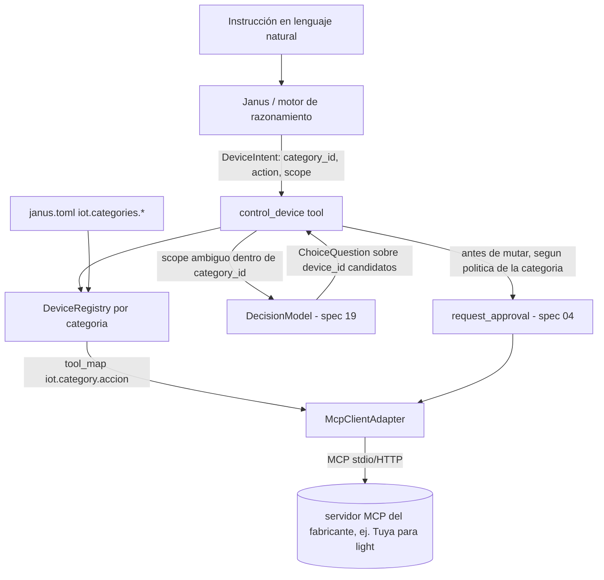

# Feature Spec: control de dispositivos IoT (spoke sobre MCP + decision model, abstracto por categoría)

> **Status**: Ready for implementation
> **Last updated**: 2026-09-25
> **Orden de implementación**: 20 de 20. Depende de: spec 01 (proto), spec 02 (config), spec 04 (contratos), spec 09 (aprobación/capacidades), spec 15 (`McpClientAdapter`), spec 19 (decision model).

---

## Objective

Dar a Janus control de dispositivos físicos del hogar — cualquier categoría expuesta por un servidor MCP compatible (luces, enchufes, termostatos, cerraduras, cortinas, lo que exista o se agregue después) — sin construir un adaptador nuevo por fabricante ni por categoría. Motivación del usuario (2026-09-25): tener los dispositivos listados y que, a partir de una instrucción en lenguaje natural, Janus decida cuál controlar.

**Diseño deliberadamente abstracto (revisión 2026-09-25):** la primera versión de esta spec usaba bombillos como ejemplo hasta en el modelo de datos, y eso era un error de alcance — la spec debe describir un contrato genérico de "categoría de dispositivo con esquema propio", del cual la iluminación es solo el primer caso concreto que se implementa (porque es el que el usuario ya tiene funcionando vía un MCP de Tuya). Nada en el diseño de abajo asume que un dispositivo es una luz.

Esta spec **no crea un protocolo IoT nuevo**: reutiliza dos piezas ya especificadas:
1. `McpClientAdapter` (spec 15, #27) para hablar con el servidor MCP del fabricante o del hub (Tuya, Zigbee2MQTT, Home Assistant, Matter, o cualquier otro que hable MCP).
2. El puerto de decision model (spec 19, requisitos 22-23) para resolver **cuál** dispositivo, cuando la instrucción del usuario no lo deja unívoco.

Un servidor MCP de dispositivos ya resuelve el protocolo del fabricante y ya expone tools tipadas; Janus no necesita saber nada de eso, solo necesita: (a) enterarse de qué dispositivos existen y de qué categoría es cada uno, (b) saber qué acciones son válidas para esa categoría, (c) mapear intención a acción, y (d) decidir de forma segura cuándo hay ambigüedad.

---

## Functional Requirements

### Modelo de categoría de dispositivo (abstracto — el núcleo de esta spec)

1. `DeviceCategory` es una entidad declarada por config, no fija en código: cada categoría define su propio `capability_schema` — la lista de acciones válidas para esa categoría y, para cada acción, sus parámetros tipados. Esto es lo que permite agregar una categoría nueva (cerraduras, cortinas, termostatos) sin tocar código, solo config y `tool_map` (requisito 6).
2. `DeviceCategory` mínimamente declara: `category_id` (slug, ej. `light`, `switch`, `thermostat`, `lock`), `actions` (tabla `nombre_accion -> ActionSchema`), y `readonly_actions` (subconjunto de solo lectura, ej. `get_status`, que nunca requieren aprobación).
3. `ActionSchema` declara `params` (tabla `nombre -> tipo`, tipos primitivos: `bool`, `int`, `float`, `str`, `enum(valores)`) y `mutates: bool`. Ejemplo (no exhaustivo, ilustrativo): la categoría `light` podría declarar `turn_on(): mutates=true`, `turn_off(): mutates=true`, `set_brightness(level: int 0-100): mutates=true`, `set_color(hue: int, saturation: int, value: int): mutates=true`, `get_status(): mutates=false`. Una categoría de cerradura podría declarar `lock()`, `unlock()`, `get_status()`, con `unlock` marcado para requerir la política de aprobación más estricta por defecto (requisito 15).
4. El sistema **no asume categorías de fábrica salvo la infraestructura de listado y estado**: `get_status`/`list` son universales a toda categoría (requisito 5); todo lo demás (qué acciones existen, qué parámetros toman) lo define quien configura la categoría, típicamente copiando el esquema de tools que ya expone el servidor MCP del fabricante.

### Descubrimiento de dispositivos (reutiliza `McpClientAdapter`)

5. Un servidor MCP de dispositivos se declara como cualquier otro spoke MCP (spec 02, requisito 10; spec 15, requisito 23): `spoke_id`, `adapter = "janus_adapters.spokes.mcp_client:McpClientAdapter"`, `settings` con el transporte (`stdio` o HTTP) hacia el servidor MCP del fabricante.
6. `tool_map` mapea las tools del servidor a capacidades con el `capability_id` reservado bajo el namespace `iot` (spec 01, requisito 14 amplía la lista de namespaces reservados con `iot`), con la forma `iot.<category_id>.<accion>` (ej. `iot.light.turn_on`, `iot.light.set_brightness`, `iot.lock.unlock`, `iot.thermostat.set_target`). Cada entrada de `tool_map` referencia el `category_id` y `accion` que declara en su `DeviceCategory` (requisitos 1-3). Una tool del servidor MCP que no tenga entrada en `tool_map` no se expone (mismo principio de la spec 15, requisito 23).
7. `iot.<category_id>.list` (una por categoría configurada) y `iot.<category_id>.get_status` son universales: todo servidor MCP de dispositivos debe exponer algo mapeable a estas dos, o la categoría no puede usarse con esta spec.
8. `DeviceRegistry` (`libs/iot/src/janus_iot/registry.py`) mantiene una vista cacheada y en memoria de los dispositivos descubiertos, por categoría, refrescada al invocar `iot.<category_id>.list` y en cada `notify_capabilities_changed` del adaptador MCP subyacente. Cada entrada: `device_id` (el id nativo del fabricante), `category_id`, `name` (como lo reporta el fabricante), `online: bool`, `labels` (ver requisito 10), y `attributes` (tabla libre con el estado reportado por `get_status`, cuya forma depende de la categoría — brillo y color para una luz, temperatura para un termostato, estado abierto/cerrado para una cerradura).
9. `DeviceRegistry.snapshot(category_id?) -> list[Device]` es lo que se serializa como `DecisionState` cuando hace falta desambiguar (requisito 13); filtrable por categoría porque una desambiguación casi siempre ocurre dentro de una sola categoría ("la luz de la sala" nunca compite con "el enchufe de la sala").

### Etiquetado (resuelve "la luz de la sala" sin depender del nombre exacto del fabricante)

10. `labels`: tabla de config `device_id -> list[str]` en `janus.toml`, sección `iot.labels` (aplica a cualquier categoría). El usuario la llena una vez, a mano o pidiéndole a Janus que la complete tras un primer `list` de cualquier categoría ("estos son los dispositivos que veo, decime cuál es cuál" — una conversación normal, no una feature especial).
11. Si un dispositivo no tiene `labels`, Janus solo puede referirse a él por su `name` reportado por el fabricante (que suele ser genérico) o pedir al usuario que lo etiquete; no se inventa una etiqueta.
12. Las `labels` no son exclusivas: un dispositivo puede tener varias y varios dispositivos (de la misma o distinta categoría) pueden compartir una etiqueta de ubicación (ej. "sala" en una luz y en un enchufe a la vez).

### Resolución de intención (dos niveles: Janus interpreta, decision model desambigua)

13. División de responsabilidad explícita (mismo principio que spec 19, requisitos 19 y 23): Janus (el motor de razonamiento, vía la tool `control_device` descrita en el requisito 17) interpreta la instrucción en lenguaje natural y produce una intención estructurada: `DeviceIntent { category_id, action, scope: <texto o etiqueta>, params?: {...} }`. El decision model **nunca interpreta lenguaje natural crudo**: solo recibe candidatos ya acotados por `category_id` y `scope`.
14. Resolución de `scope` a `device_id`(s), siempre dentro de la `category_id` ya identificada por Janus:
    - Si `scope` coincide con una única `label` o `name` entre los dispositivos `online` de esa categoría, se resuelve directo, sin decision model (caso sin ambigüedad, la mayoría de los casos reales).
    - Si `scope` coincide con varios dispositivos de la misma categoría que comparten etiqueta (ej. "sala" con tres luces) y la acción es de las que `iot.group_action_policy` permite agrupar (requisito 16), se aplica a todos los que comparten la etiqueta.
    - Si hay ambigüedad real, se arma una `ChoiceQuestion` (spec 19, requisito 3) con `options` igual a la lista de `device_id` candidatos (mostrados con su `name`/`labels` para que la pregunta sea legible en logs), y `DecisionState` igual al `DeviceRegistry.snapshot(category_id)` filtrado a los candidatos plausibles más el texto de la instrucción original acotada al `scope`.
15. El resultado de la `ChoiceQuestion` (requisito 14, tercer caso) solo se ejecuta si `confidence >= iot.decision_confidence_threshold` (default 0.9, deliberadamente más alto que el default de triage de la spec 19, porque aquí el efecto es físico e inmediato). Por debajo del umbral, Janus le pregunta al usuario directamente cuál dispositivo — nunca se ejecuta una acción física sobre un dispositivo elegido con baja confianza. Este umbral puede refinarse por categoría (`iot.categories.<category_id>.decision_confidence_threshold`) para que una categoría más sensible (ej. `lock`) exija más confianza que una de bajo riesgo (ej. `light`).
16. Cada `ActionSchema` (requisito 3) que agrupa por defecto o exige confirmación individual lo declara en su propia config, no en una regla genérica de la spec: `iot.categories.<category_id>.group_action_policy.<accion>` (`allow` o `confirm_each`). Sugerencia de default razonable, no una regla fija: acciones binarias de bajo riesgo (`turn_on`/`turn_off`) en `allow`; acciones de ajuste fino o alto riesgo (`set_color`, `unlock`) en `confirm_each`. Quien configura una categoría nueva decide esto explícitamente.

### Ejecución (reutiliza `request_approval`, spec 04)

17. `control_device` es la tool que el toolset de Janus expone (spec 10, `ToolsetAssembler.assemble`, spec 10 #77) para todo lo anterior: recibe la instrucción ya interpretada como `DeviceIntent` (requisito 13), resuelve el `scope` (requisito 14), y por cada `device_id` final invoca la capacidad `iot.<category_id>.<accion>` correspondiente a través del `Router` (spec 09), exactamente como cualquier otra capacidad.
18. Antes de ejecutar cualquier acción con `mutates = true` (requisito 3), se invoca `request_approval` (spec 04, requisito 23) con la política que corresponda de `iot.categories.<category_id>.approval.<accion>` (mismos cuatro valores de la spec 02, requisito 15: `ask_everytime`, `ask_once_per_session`, `allow_always`, `deny_always`). Default de fábrica genérico (aplica a toda categoría nueva salvo que se sobreescriba): `ask_once_per_session` para toda acción de mutación. Categorías de mayor riesgo físico (una cerradura, por ejemplo) deberían configurarse con `ask_everytime` o incluso `deny_always` salvo excepción explícita — esta spec no impone esa política, la deja como responsabilidad de quien da de alta la categoría, precisamente porque el riesgo varía enormemente entre "apagar una luz" y "abrir una puerta".
19. Un dispositivo `offline` (reportado así por `DeviceRegistry`) nunca es candidato de una acción de mutación: se excluye antes de armar la `ChoiceQuestion` (requisito 14) y, si es el único candidato, la tool devuelve un fallo lógico claro en vez de intentar la llamada.

### Primera categoría concreta: iluminación (implementación de referencia, no el límite del diseño)

20. La primera categoría que se implementa y se prueba de punta a punta es `light`, contra el servidor MCP de Tuya/Smart Life que el usuario ya tiene corriendo (tools observadas: listar dispositivos, consultar estado, ajustar brillo, ajustar color, apagar). Es la implementación de referencia para validar el contrato abstracto de los requisitos 1-19, no una categoría privilegiada en el diseño: agregar `switch` o `thermostat` después no debería requerir tocar `libs/iot`, solo declarar la categoría nueva y su `tool_map`.
21. Al implementar `light` contra el MCP de Tuya real, confirmar el `tool_map` exacto contra el esquema real de sus tools antes de fijar los nombres de acción de esa categoría (ver Open Questions).

### Escenas y automatizaciones (extensión natural, explícitamente fuera de v1)

22. Esta spec **no incluye** escenas ("modo noche": apagar todo menos el pasillo) ni automatizaciones basadas en eventos (encender a una hora, o al detectar algo). Ambas son extensiones directas de lo ya especificado (una escena es una lista de `control_device` con `scope` fijo, potencialmente cruzando categorías; una automatización es un disparador que invoca `control_device` sin que el usuario lo pida en el momento) y quedan para una spec o iteración posterior. Se documenta aquí para que el diseño de `control_device` (requisito 17) no cierre la puerta a que una automatización lo invoque igual que Janus.

---

## Non-Functional Requirements

* **Performance**: resolución de `scope` sin ambigüedad (caso común, requisito 14 primer punto), sin latencia añadida más allá de la llamada MCP misma. Con desambiguación por decision model, se suma la latencia de `decide()` ya acotada en la spec 19.
* **Security**: ninguna acción con `mutates = true` se ejecuta sin pasar por `request_approval` (requisito 18); esto es no negociable incluso para el default más permisivo (`allow_always` sigue pasando por la función, solo que la política resuelve `True` sin preguntar). El decision model nunca decide *si* actuar, solo *cuál* dispositivo entre los que Janus ya tiene permiso de tocar (mismo principio de spec 19, requisitos 19 y 23) — un fallo o manipulación del decision model, en el peor caso, elige mal el dispositivo, nunca ejecuta una acción no aprobada. Categorías de alto riesgo físico deben declarar su propia política de aprobación conservadora (requisito 18); esta spec no puede garantizarlo por sí sola porque depende de la config de cada categoría.
* **Reliability**: un servidor MCP de dispositivos caído se refleja como salud `UNAVAILABLE` del adaptador (spec 04); `control_device` falla con un mensaje claro en vez de colgarse. `DeviceRegistry` tolera un refresh fallido sin perder el último estado conocido por categoría (se marca `stale` en vez de vaciarse).
* **Portability**: sin dependencias nativas propias; todo el trabajo de protocolo de fabricante vive en el servidor MCP externo, fuera del alcance de esta spec.

---

## Technical Decisions

### Categorías declaradas por config, no un enum cerrado en código
* **Chosen**: `DeviceCategory` con `capability_schema` definido en `janus.toml`, sin lista fija de categorías en el código de `libs/iot`.
* **Reason**: el usuario pidió explícitamente que el diseño sea abstracto y no se limite a bombillos; un enum cerrado de categorías obligaría a tocar código cada vez que aparezca un dispositivo de un tipo nuevo, exactamente el problema que un enfoque basado en MCP + config ya evita para el resto del sistema (spec 15, `tool_map`).
* **Rejected alternatives**: una categoría `light` hardcodeada con su propio adaptador (repite el error de acoplarse a un fabricante o a un tipo de dispositivo, esta vez a nivel de categoría en vez de marca); un esquema JSON completamente libre sin el concepto de categoría (pierde la capacidad de aplicar políticas de aprobación y umbrales de confianza distintos por tipo de riesgo, requisito 15 y 18).

### Sin adaptador nuevo por fabricante ni por categoría: todo pasa por `McpClientAdapter`
* **Chosen**: cualquier integración de dispositivo entra como spoke MCP con `tool_map`, igual que `filesystem-mcp` (spec 08).
* **Reason**: coherente con el resto de la arquitectura (Principio #1, capacidades abstractas) y evita que Janus necesite un adaptador por marca o por tipo de dispositivo; el ecosistema MCP para IoT ya existe y crece fuera de Janus.
* **Rejected alternatives**: un adaptador nativo por fabricante que hable su API directo (acopla Janus a un fabricante concreto y duplica lo que un servidor MCP ya resuelve).

### Etiquetas de usuario en vez de intentar inferir habitaciones automáticamente
* **Chosen**: `iot.labels` como tabla explícita que el usuario llena, aplicable a cualquier categoría.
* **Reason**: el nombre que reporta el fabricante rara vez es útil; inferir la habitación a partir del nombre sería frágil y daría falsos positivos justo en el tipo de acción (física) donde una equivocación importa más.
* **Rejected alternatives**: inferencia automática por nombre o por posición en la app del fabricante (poco confiable).

### Umbral de confianza y política de aprobación configurables por categoría, no un valor único global
* **Chosen**: `iot.categories.<category_id>.decision_confidence_threshold` y `.approval.<accion>` como overrides por categoría sobre un default genérico.
* **Reason**: el riesgo de una desambiguación o de una mutación equivocada no es el mismo para todas las categorías — apagar la luz equivocada es una molestia menor, abrir la cerradura equivocada no lo es. Un único umbral o una única política global obligaría a ser tan estricto como la categoría más riesgosa (fricción innecesaria para lo trivial) o tan laxo como la más trivial (riesgo real para lo sensible).
* **Rejected alternatives**: un umbral y una política únicos para todo IoT (falla en cualquiera de las dos direcciones descritas arriba).

### Iluminación como implementación de referencia, no como límite del diseño
* **Chosen**: la spec especifica el contrato abstracto primero (requisitos 1-19) y solo después describe `light` como el primer caso concreto (requisito 20), explícitamente marcado como no privilegiado.
* **Reason**: es la corrección directa al error de la versión anterior de esta spec, que modelaba `Device`/`DeviceIntent` alrededor de bombillos. El usuario fue explícito: la abstracción es el punto, no una lista de dispositivos.
* **Rejected alternatives**: mantener `light` como el modelo de datos principal y tratar otras categorías como "extensión futura sin especificar" (es lo que ya se había hecho y se pidió corregir).

---

## Proposed Architecture

### Component Diagram


### Directory Structure
```
libs/iot/
  pyproject.toml
  src/janus_iot/
    __init__.py
    category.py       # DeviceCategory, ActionSchema, carga desde config
    registry.py        # DeviceRegistry, Device (generico por categoria)
    scope.py           # resolucion de scope -> device_id(s), labels, ChoiceQuestion
    tool.py             # control_device (Tool para el motor, spec 10)
  tests/
```

---

## Data Models

```
Entity DeviceCategory { category_id: str, actions: dict[str, ActionSchema], readonly_actions: list[str] }
Entity ActionSchema   { params: dict[str, tipo], mutates: bool }
Entity Device         { device_id: str, category_id: str, name: str, online: bool,
                        labels: list[str], attributes: dict }
Entity DeviceIntent   { category_id: str, action: str, scope: str, params?: dict }
Enum   GroupActionPolicy { ALLOW, CONFIRM_EACH }
```

Configuración en `janus.toml`, sección `iot`:

```toml
[iot.labels]
"tuya-device-id-1" = ["sala", "lampara-principal"]

[iot.categories.light]
decision_confidence_threshold = 0.9   # override opcional, si no hereda el default global

[iot.categories.light.approval]
turn_on = "allow_always"
turn_off = "allow_always"
set_color = "ask_everytime"

[iot.categories.light.group_action_policy]
turn_on = "allow"
turn_off = "allow"
set_color = "confirm_each"

# Ejemplo de una categoria nueva, sin tocar codigo:
[iot.categories.lock]
decision_confidence_threshold = 0.97

[iot.categories.lock.approval]
lock = "allow_always"
unlock = "ask_everytime"
```

---

## Open Questions

1. ¿Qué servidor MCP de dispositivos se usa como referencia de implementación y pruebas para la categoría `light`? El usuario ya tiene uno de Tuya/Smart Life corriendo; falta confirmar su `tool_map` exacto contra el esquema real de sus tools antes de fijar los nombres de acción de esa categoría (requisito 21).
2. ¿El esquema de `ActionSchema.params` (requisito 3) necesita validación más rica que tipos primitivos (rangos, patrones) antes de la primera categoría, o alcanza con lo mínimo y se refina cuando aparezca una categoría que lo necesite? Se decide al implementar `light` (que ya tiene un caso de rango: brillo 0-100).
3. Escenas y automatizaciones (requisito 22): si se implementan, ¿viven en esta misma librería (`libs/iot`) o como una capacidad más alta en el núcleo (spec 11) que orquesta varias llamadas a `control_device`, potencialmente cruzando categorías? Se decide cuando haya demanda real de esa funcionalidad.
