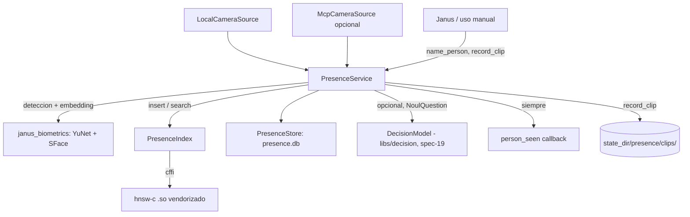

# Feature Spec: libs/presence/ (identificación ambiental 1:N, "quién entró a la casa")

> **Status**: Ready for implementation
> **Last updated**: 2026-09-24
> **Vive fuera de `docs/specs/`**: esta es una feature nueva, autocontenida, con su propia spec dentro de su propio directorio (`libs/presence/SPEC.md`), no un spec numerado del índice de Janus. No modifica `docs/specs/spec-18-biometrics.md`, que permanece cerrada tal cual. `libs/biometrics/` gana un consumidor externo (esta librería), nada más.
> **Orden de implementación relativo**: depende de que `libs/biometrics/` (spec-18) exista como paquete instalable (para reusar detección + embedding de cara), y del repositorio externo `hnsw-c` (ver `vendor/hnsw-c/`) compilado. No depende de nada del núcleo de Janus (`libs/persistence`, `libs/adapters`, `libs/capabilities`, `apps/*`): es un spoke, se integra a Janus por fuera, no al revés.

---

## Objective

Dar a Janus percepción ambiental de personas: identificar quién aparece frente a una cámara del hogar (dueño, familiar, visita conocida, o desconocido), distinguir a un desconocido nuevo de uno ya visto antes ("es el mismo del martes"), permitir nombrar a un desconocido para que pase a ser conocido, y grabar snapshot/clip cuando corresponde — todo expuesto como una librería/spoke propio, separado de `libs/biometrics`, sin autorizar ninguna acción por sí mismo.

Esto es identificación 1:N (¿quién de los que conozco es esta persona, o es alguien nuevo?), un problema explícitamente distinto y fuera del alcance de `libs/biometrics` (verificación 1:1 del dueño, spec-18, decisión técnica "Verificación uno a uno del dueño, no identificación"). `presence` no reemplaza ni extiende esa decisión: la respeta separándose de ella.

**`presence` no asigna rol.** Emite quién es (o que es un desconocido) con una confianza; qué significa ese quién para el sistema (dueño, familiar, visita autorizada a hacer tal cosa) es responsabilidad de quien consume el evento (Janus, o config). Esto es intencional: mezclar "reconocer" con "autorizar" reintroduciría exactamente el tipo de acoplamiento que `request_approval` (spec-04) ya resuelve en el resto de Janus.

---

## Relación con `libs/biometrics` y con `hnsw-c`

* **`libs/biometrics` (spec-18)**: paquete hermano, no modificado. `presence` lo declara como dependencia de librería (`janus-biometrics` en su `pyproject.toml`) y reusa únicamente sus piezas de detección y extracción de embedding de cara (YuNet + SFace, vía las funciones que `libs/biometrics` ya expone para su propia cadena `local:sface`). `presence` **no** reusa nada de `EncryptedTemplateStore`, `Enrollment` ni la política de umbrales 1:1 de biometrics — tiene su propio almacenamiento y su propia política, descritos abajo.
* **`hnsw-c`** (repositorio propio, ver `hnsw-c/SPEC.md`): git submodule en `libs/presence/vendor/hnsw-c/`. `presence` lo consume como binario compilado (`.a` + `include/hnsw.h`) vía `cffi`, tratándolo como el motor de índice vectorial 1:N. Elegido por valor académico y de reuso, no por necesidad de escala real (documentado explícitamente en `hnsw-c/SPEC.md`, sección Objective): con las decenas de personas típicas de una casa, una comparación lineal por distancia habría bastado; HNSW se usa porque es la pieza que el usuario quiere lucir académicamente y porque, una vez construida, no cuesta nada reusarla.
* Ninguno de los dos (`biometrics`, `hnsw-c`) depende de `presence`. La dependencia es unidireccional.

---

## Functional Requirements

### Identidad y estado de personas

1. `PersonRecord`: identidad interna que `presence` gestiona. Tiene `person_id` (UUID propio de `presence`, no relacionado con ningún id de `libs/biometrics`), `label` (nombre asignado por el usuario, o `NULL` si es un desconocido sin nombrar), `known: bool` (`true` una vez que tiene `label`; un desconocido reiteradamente visto sigue siendo `known = false` hasta que se le pone nombre, aunque `presence` ya lo reconozca como recurrente), `embedding_ids: list[int]` (uno o más embeddings asociados a esta persona en el índice HNSW; una persona puede tener varias muestras, igual que `Enrollment` de biometrics permite varias imágenes), `first_seen_at`, `last_seen_at`, `snapshot_ref: str | None` (referencia a un archivo de snapshot en disco, solo mientras la persona sigue sin nombre; ver requisito 12 sobre retención).
2. `PersonRecord` para el dueño y familiares se crea explícitamente (alta manual, análoga a `enroll` de biometrics pero con su propio flujo, ver requisito 8), nunca automáticamente. Un desconocido nuevo, en cambio, sí genera un `PersonRecord` automático (`known=false`, sin `label`) al momento de la primera detección sin match — es la única creación automática permitida.
3. Cambiar el `label` de un `PersonRecord` de `NULL` a un nombre (nombrar a un desconocido) es la única transición de `known=false` a `known=true`; a partir de ahí, según el requisito 12, se descarta el `snapshot_ref` retenido y solo queda el embedding.

### Índice vectorial (hnsw-c)

4. `PresenceIndex` envuelve `hnsw-c` vía `cffi`, configurado con `dim=128` (dimensión de embedding de SFace, tal como lo expone `libs/biometrics`). `insert(person_id_as_int, embedding) -> int` (el `id` que HNSW usa es un entero correlativo propio de `presence`, mapeado 1 a 1 con `person_id` en la base local, ver requisito 6); `search(embedding, k=5) -> list[(id, distance_squared)]`; `remove(id)` cuando se borra una persona o una muestra.
5. Umbral de decisión sobre la distancia devuelta por `search`: `presence.match_threshold` (config, default a calibrar empíricamente, sin valor de fábrica fijo hasta medir con datos reales — mismo criterio honesto que spec-18 aplica a sus propios umbrales). Por debajo del umbral, se considera la misma persona; por encima, desconocido nuevo. Una zona intermedia (`match_threshold_ambiguous`, mayor al umbral principal) es candidata a resolverse con el decision model (requisito 15) en vez de una regla fija.

### Persistencia (SQLite propio, no `janus.db`)

6. `PresenceStore`: SQLite propio en `state_dir/presence/presence.db` (mismo directorio raíz de estado que usa el resto de librerías locales de Janus, pero un archivo separado, nunca `janus.db` ni ninguna tabla de `libs/persistence`). Tablas: `persons(person_id PK, label, known, first_seen_at, last_seen_at, snapshot_ref)`, `person_embeddings(embedding_id PK, person_id FK, hnsw_id UNIQUE)` (el mapeo entre el entero que usa HNSW y el `person_id` real), `cameras(camera_id PK, label, source_kind)`, `sightings(sighting_id PK, person_id FK, camera_id FK, seen_at, confidence, clip_ref)`.
7. Igual que `libs/biometrics` (spec-18, requisito 17), el archivo `.db` no guarda embeddings crudos sin cifrar: `person_embeddings` guarda solo `hnsw_id` (el índice vive fuera, en la estructura HNSW en memoria/disco); los embeddings reales (los floats) se persisten únicamente si `hnsw-c` implementa su extensión de guardado en disco (ver `hnsw-c/SPEC.md`, Open Questions); mientras esa extensión no exista, el índice se reconstruye en el arranque leyendo las muestras crudas guardadas en `state_dir/presence/samples/<person_id>/` (cifradas con la misma librería `cryptography` AES-256-GCM que usa biometrics, clave propia de `presence`, nunca compartida con la clave de biometrics).
8. `PresenceService.enroll_known_person(label: str, samples: list[bytes]) -> PersonRecord`: alta manual de dueño/familiar, análoga a `enroll` de biometrics. Extrae embedding de cada muestra (reusando la detección de `libs/biometrics`), las inserta en el índice, crea el `PersonRecord` con `known=true` desde el inicio.

### Fuente de frames (interfaz abstracta)

9. `FrameSource` (ABC/Protocol): `capture_frame(camera_id: str) -> bytes`. Dos implementaciones:
   - `LocalCameraSource` (default): captura directa por OpenCV, análoga a `CameraSource` de biometrics, sin pasar por MCP ni por Janus.
   - `McpCameraSource` (opcional): consume una cámara expuesta como `category_id = camera` en spec-20 (IoT), vía el mismo patrón `tool_map` de esa spec. Se activa solo si el usuario configura `presence.cameras.<id>.source = mcp` y una referencia al spoke MCP correspondiente.
10. `presence` no depende de que exista un spoke IoT: `LocalCameraSource` es autosuficiente. `McpCameraSource` es un adaptador opcional que un consumidor de más alto nivel (Janus) puede inyectar si quiere usar cámaras IoT ya integradas por la spec-20, pero `presence` en sí mismo nunca importa código de `libs/iot` ni de `libs/adapters` — la integración vive del lado de quien construye la instancia de `PresenceService`, inyectando la implementación de `FrameSource` que corresponda (inversión de dependencia).

### Pipeline de detección (capa determinista, siempre activa)

11. `PresenceService.process_frame(camera_id: str, frame: bytes) -> Sighting | None`: detecta cara (YuNet vía `libs/biometrics`), si hay más de una cara procesa cada una por separado (a diferencia de biometrics, que rechaza multi-cara por ser 1:1; acá cada cara es una persona potencialmente distinta y todas importan), extrae embedding (SFace), busca en `PresenceIndex`.
    - Si hay match por debajo de `match_threshold`: es una persona ya vista (conocida o desconocida recurrente). Actualiza `last_seen_at`. `first_seen = false`.
    - Si no hay match (o la distancia supera el umbral): crea un `PersonRecord` nuevo, `known=false`, sin `label`. `first_seen = true`. Dispara automáticamente snapshot + inicio de clip (requisito 13).
    - Si la distancia cae en la zona ambigua (requisito 5): ver requisito 15.
12. Retención de snapshot: mientras un `PersonRecord` tiene `known=false`, su `snapshot_ref` se conserva según `presence.unknown_snapshot_retention_s` (config, sin default de fábrica fijo — a decidir con el usuario, ver Open Questions). Al nombrar a la persona (`label` pasa de `NULL` a un valor), el snapshot se borra de forma segura (sobrescribe y elimina, mismo patrón que `delete` de biometrics) y desde ese momento solo se conserva el embedding — nunca se vuelve a grabar snapshot para una persona ya nombrada.
13. Emisión de evento: cada llamada a `process_frame` que produce un resultado (match o no) emite `person_seen` (requisito 16), independientemente de si se disparó un clip. Ver a alguien y grabar son dos acciones separadas.

### Grabación de clips (dos capas: determinista + decision model opcional, más API manual)

14. **Capa determinista (siempre activa, sin decision model)**: el único trigger automático incondicional es "persona nunca vista" (`first_seen = true`, requisito 11). Dispara `PresenceService.record_clip(camera_id, duration_s)` inmediatamente, con `duration_s` tomado de `presence.clip_duration_s` (config, ajustable). El snapshot es un único frame tomado al momento de la detección; el clip es la grabación continua de `duration_s` segundos a partir de ese instante.
15. **Capa de decision model (opcional, `presence.decision_model_enabled`, default `false` hasta medir)**: para cada `person_seen` que **no** disparó ya un clip por el requisito 14 (es decir, personas ya vistas, conocidas o desconocidas recurrentes, y los casos de distancia ambigua del requisito 11), se le hace al decision model (puerto `libs/decision`, spec-19) una `NoulQuestion` ("¿vale la pena grabar un clip de este evento?"), con un `DecisionState` que incluye explícitamente si la persona ya había sido vista antes (`first_seen`) para que el decision model no duplique el trabajo de la capa determinista. Si la respuesta es `true` con `confidence >= presence.decision_model_confidence_threshold` (default 0.85, mismo orden que el default de triage de spec-19), dispara `record_clip` igual que si fuera manual. Este mecanismo nunca puede *evitar* el clip del caso `first_seen=true` (ya ocurrió antes de que la capa 2 se ejecute) — solo puede *agregar* clips en casos que la capa determinista no habría grabado.
16. **API manual**: `PresenceService.record_clip(camera_id: str, duration_s: int) -> ClipRecord` es pública y se puede invocar directamente (uso a mano, o desde Janus) en cualquier momento, sin pasar por ninguna de las dos capas anteriores. Es el mismo camino de ejecución que usan las dos capas automáticas — no hay tres implementaciones de grabación, hay una función y tres formas de dispararla.
17. Los clips se almacenan en `state_dir/presence/clips/<camera_id>/<timestamp>.mp4` (o el formato que defina la implementación), con una política de retención total del espacio en disco configurable (`presence.clips_max_total_mb`, borrado de los más viejos al superar el límite) — mismo espíritu de "no todo se guarda" que pediste, aplicado como un límite duro de espacio en vez de solo de tiempo.

### Evento de salida

18. `person_seen` es el evento único que `presence` emite hacia quien lo consuma (Janus, un bus de eventos simple, un callback registrado — el mecanismo de transporte no lo fija esta spec porque `presence` no depende del núcleo de Janus; se expone como lo que reciba un callback Python registrado por el consumidor, quien decide si lo traduce a su propio bus de eventos):
    ```
    PersonSeenEvent {
        person_id: str
        known: bool
        first_seen: bool
        confidence: float
        camera_id: str
        timestamp: str (ISO 8601 UTC)
        snapshot_ref: str | None
        clip_ref: str | None
    }
    ```
19. `clip_ref` solo está presente si en esa detección se disparó (o ya existía en curso) un clip; `snapshot_ref` solo está presente mientras la persona sigue sin nombrar (requisito 12).

### Nombrar a un desconocido

20. `PresenceService.name_person(person_id: str, label: str) -> PersonRecord`: aplica la transición del requisito 3, borra el snapshot retenido (requisito 12), y de ahí en más toda detección de ese `person_id` llega como `known=true`.

---

## Non-Functional Requirements

* **Performance**: sin objetivo numérico de fábrica (se mide igual que biometrics y hnsw-c, sobre el hardware real del usuario, antes de fijar cifras). El pipeline de detección reusa las cifras ya medidas por `libs/biometrics` para YuNet+SFace; el costo adicional de `presence` es la búsqueda en el índice HNSW (submilisegundo esperado a la escala de personas de una casa) y la escritura en SQLite.
* **Security**: mismo criterio que biometrics para datos sensibles de terceros — cifrado en reposo de las muestras crudas retenidas (requisito 7), snapshots borrados de forma segura al nombrar a alguien (requisito 12), sin envío de ningún dato biométrico fuera del equipo (no hay proveedor remoto contemplado en esta spec; si se agregara en el futuro, seguiría el mismo patrón `allow_remote`/`remote_ack` de spec-18). A diferencia de biometrics, esta librería **sí** almacena biometría de terceros por diseño (es su propósito) — esto se documenta explícitamente como una diferencia de postura de privacidad respecto de `libs/biometrics`, no un descuido.
* **Reliability**: un fallo de `PresenceIndex` (hnsw-c no cargó, `.so` ausente) o de `FrameSource` (cámara ocupada/ausente) nunca debe tumbar el proceso que usa `presence` — se propaga como excepción propia (`PresenceUnavailableError`), nunca un crash silencioso ni un resultado inventado.
* **Portability**: Python 3.11+ para el paquete `janus_presence`; el binario `hnsw-c` es C99 multiplataforma (Linux x86_64/aarch64, ver `hnsw-c/SPEC.md`). Dependencias del paquete Python: `janus-biometrics`, `cffi` (para hablar con `hnsw-c`), `cryptography` (cifrado de muestras retenidas), `numpy` (manipulación de embeddings antes de pasarlos a `cffi`). Prohibido importar `libs/adapters`, `libs/capabilities`, `libs/persistence` y `apps/*` — igual restricción que biometrics, por ser también una librería hoja / spoke propio.

---

## Technical Decisions

### `presence` separado de `biometrics`, dependiendo de él como librería
* **Chosen**: dos paquetes hermanos (`janus-biometrics`, `janus-presence`), el segundo dependiendo del primero.
* **Reason**: `libs/biometrics` tiene un Security Checklist que describe la garantía de todo el paquete (1:1, sin terceros, sin persistencia de muestras). `presence` hace exactamente lo contrario a propósito (1:N, sí guarda terceros, sí retiene snapshots temporalmente). Fusionarlos en un solo paquete instalable rompe la posibilidad de auditar cada garantía por separado y de instalar una sin la otra.
* **Rejected alternatives**: `presence` como subpaquete de `libs/biometrics` (mezclaría dos checklists de seguridad contradictorios bajo un mismo nombre instalable); `presence` totalmente independiente sin depender de `biometrics`, duplicando YuNet/SFace (reimplementación innecesaria de una pieza ya resuelta y medida).

### HNSW en C propio, vendorizado como submódulo, no `sqlite-vec` ni una librería de vectores existente
* **Chosen**: repo propio (`hnsw-c`), consumido como git submodule + binario compilado.
* **Reason**: valor académico explícito del usuario (defensa oral de una materia) más el hecho de que, una vez construida, es la pieza natural de índice 1:N de `presence`. Documentado honestamente en `hnsw-c/SPEC.md`: no es la opción de mejor rendimiento para la escala real de este caso de uso (`sqlite-vec` o incluso lineal habrían bastado), es una elección deliberada de reuso y de mérito académico.
* **Rejected alternatives**: `sqlite-vec` (obligaría a depender de `libs/persistence` o a duplicar su lógica de tabla vectorial, rompiendo la independencia del spoke); comparación lineal en Python puro (más simple, pero no aprovecha el trabajo académico que el usuario quiere hacer de cualquier forma).

### SQLite propio, no `libs/persistence`
* **Chosen**: `state_dir/presence/presence.db`, esquema y migración propios de `presence`, sin tocar `janus.db`.
* **Reason**: `presence` es un spoke — su spec exige explícitamente no depender de `libs/persistence` (igual que `libs/biometrics` no depende de él). Un archivo de base de datos propio mantiene esa independencia real, no solo de nombre.
* **Rejected alternatives**: extender el esquema de `janus.db` con tablas de presence (acopla el spoke al núcleo, viola la regla de dependencia que ya rige a biometrics).

### Snapshot se borra al nombrar, el embedding permanece
* **Chosen**: retención de snapshot solo mientras la persona no tiene `label`; al nombrarla, borrado seguro del snapshot, el embedding queda indefinidamente.
* **Reason**: decisión explícita del usuario en la sesión previa de diseño: minimizar cuánto tiempo se guarda una imagen real de alguien, aceptando guardar el embedding (que no es reversible a una imagen) de forma indefinida para poder reconocer a esa persona en el futuro.
* **Rejected alternatives**: conservar el snapshot también después de nombrar (mayor exposición de datos sin beneficio funcional adicional, ya que el embedding basta para reconocer).

### Grabación en dos capas convivientes, nunca el decision model reemplazando el trigger base
* **Chosen**: determinista primero (incondicional para `first_seen=true`), decision model después y solo sobre lo que la capa 1 no cubrió, API manual siempre disponible como tercer camino hacia la misma función.
* **Reason**: acordado explícitamente con el usuario. Mantiene la garantía de que nunca se pierde el registro de un desconocido nuevo por un juicio de relevancia que salió mal, mientras permite que el decision model reduzca ruido y agregue cobertura donde el determinista es demasiado conservador (personas ya conocidas que ameritarían un clip puntual, por ejemplo, una visita frecuente parada mucho tiempo frente a la puerta).
* **Rejected alternatives**: decision model con la última palabra sobre todo, incluido `first_seen` (más flexible pero reintroduce el riesgo de perder el evento más importante del sistema si el decision model juzga mal).

---

## Proposed Architecture

### Component Diagram


### Directory Structure
```
libs/presence/
  SPEC.md                # este documento
  pyproject.toml
  src/janus_presence/
    __init__.py
    service.py            # PresenceService
    models.py             # PersonRecord, Sighting, ClipRecord, PersonSeenEvent
    index.py              # PresenceIndex, binding cffi a hnsw-c
    store.py              # PresenceStore, esquema SQLite propio, migraciones propias
    frame_source.py       # FrameSource, LocalCameraSource, McpCameraSource
    decision_gate.py       # integracion opcional con libs/decision
    errors.py             # PresenceUnavailableError, PresenceError
    vendor/
      hnsw-c/             # git submodule, apunta al repo propio hnsw-c
  migrations/
    0001_init.sql
  tests/
```

---

## Data Models

```
Entity PersonRecord   { person_id, label?, known: bool, embedding_ids: list[int],
                        first_seen_at, last_seen_at, snapshot_ref? }
Entity Sighting       { sighting_id, person_id, camera_id, seen_at, confidence, clip_ref? }
Entity ClipRecord     { clip_ref, camera_id, started_at, duration_s }
Entity PersonSeenEvent { person_id, known, first_seen, confidence, camera_id, timestamp,
                        snapshot_ref?, clip_ref? }
Config presence       { match_threshold, match_threshold_ambiguous, clip_duration_s,
                        clips_max_total_mb, unknown_snapshot_retention_s,
                        decision_model_enabled=false, decision_model_confidence_threshold=0.85,
                        cameras: [{ id, label, source: local|mcp }] }
```

---

## API Contracts

Librería, sin API de red propia (el consumidor decide cómo exponerla, si acaso).

```python
PresenceService.process_frame(camera_id: str, frame: bytes) -> Sighting | None
PresenceService.record_clip(camera_id: str, duration_s: int) -> ClipRecord
PresenceService.enroll_known_person(label: str, samples: list[bytes]) -> PersonRecord
PresenceService.name_person(person_id: str, label: str) -> PersonRecord
PresenceService.on_person_seen(callback: Callable[[PersonSeenEvent], None]) -> None
PresenceService.status() -> PresenceStatus

FrameSource.capture_frame(camera_id: str) -> bytes
```

Errores: `PresenceError` (base), `PresenceUnavailableError` (índice o cámara no disponibles), `PersonNotFoundError`.

---

## Edge Cases

| Case | How to Handle |
|---|---|
| Varias caras en un mismo frame | Cada una se procesa por separado; a diferencia de biometrics, no se descarta el frame. |
| Cámara ocupada o ausente | `PresenceUnavailableError`, sin crashear el proceso consumidor. |
| `hnsw-c` (`.so`) ausente o no carga | `PresenceUnavailableError` al iniciar `PresenceIndex`; `presence` queda inutilizable hasta corregir, pero el fallo es explícito, no silencioso. |
| Distancia justo en el borde del umbral, repetidamente para la misma persona real | Zona ambigua (requisito 5); con decision model activo, se resuelve ahí; sin él, se trata como desconocido nuevo cada vez (documentar como limitación conocida hasta calibrar `match_threshold` con datos reales). |
| Nombrar una persona que ya tenía varias "identidades desconocidas" separadas (la misma persona real detectada como dos `person_id` distintos por mala luz un día) | Fuera de alcance de v1: fusionar dos `PersonRecord` en uno queda como *Open Question*; por ahora se nombra cada uno por separado y el usuario corrige a mano si nota la duplicación. |
| Disco lleno por clips | `clips_max_total_mb` fuerza borrado de los más viejos antes de escribir uno nuevo; si aun así no hay espacio, se registra el fallo y se omite el clip (nunca se bloquea `process_frame` por esto). |
| Snapshot de un desconocido nunca nombrado, venciendo su retención | Se borra de forma segura al vencer `unknown_snapshot_retention_s`, el `PersonRecord` permanece (con `snapshot_ref=NULL`) para seguir reconociendo a esa persona por su embedding. |

---

## Testing Requirements

**Unit Tests**: umbral de match con distancias sintéticas (match claro, no-match claro, zona ambigua); transición `known=false→true` al nombrar y borrado del snapshot; políticas de retención de snapshot y de espacio de clips con reloj/tamaño falsos; las tres vías de disparo de `record_clip` (determinista, decision model, manual) convergiendo a la misma función; `FrameSource` falso para pruebas deterministas sin cámara real.

**Integration Tests**: `PresenceIndex` real contra `hnsw-c` compilado (insert, search, remove, con el benchmark de `hnsw-c` como referencia de que el binario vendorizado funciona); flujo completo `process_frame` con imágenes de prueba de licencia libre (misma persona repetida, persona nueva, dos personas en un frame); `enroll_known_person` y verificación de que una persona dada de alta manualmente nunca dispara clip automático de "desconocido nuevo".

**Memory/Bridge Tests**: verificar que el binding `cffi` libera correctamente cada `HnswSearchResult` (sin fugas del lado Python-C), ejecutado junto con el `valgrind` de `hnsw-c` cuando sea posible desde el arnés de pruebas de Python.

---

## Security Checklist
- [ ] Muestras crudas retenidas (snapshots de desconocidos) cifradas en reposo, clave propia de `presence`
- [ ] Snapshot borrado de forma segura (sobrescritura) al nombrar a la persona
- [ ] Ningún dato biométrico sale del equipo (sin proveedor remoto en v1)
- [ ] `presence.db` con permisos restringidos, igual criterio que `janus.db` (0600)
- [ ] Retención de clips acotada por espacio total, nunca ilimitada
- [ ] Esta librería declara explícitamente, en su propio README, que almacena biometría de terceros — a diferencia de `libs/biometrics` — para que nadie la confunda con esa garantía

---

## Open Questions
- [ ] `presence.match_threshold` y `match_threshold_ambiguous`: sin valores de fábrica hasta calibrar con datos reales del dueño y de al menos un impostor, mismo criterio que spec-18 aplica a sus propios umbrales.
- [ ] `presence.unknown_snapshot_retention_s`: número de partida por decidir con el usuario (¿24 horas? ¿7 días? depende de cuánta fricción acepta para nombrar gente).
- [ ] Fusión de dos `PersonRecord` que en realidad son la misma persona (falsos negativos de match por mala captura): no resuelto en v1, ver Edge Cases.
- [ ] Persistencia del índice HNSW en disco depende de que `hnsw-c` implemente `hnsw_index_save`/`hnsw_index_load` (ver `hnsw-c/SPEC.md`, Open Questions); mientras no exista, `presence` reconstruye el índice completo en cada arranque desde las muestras cifradas guardadas — aceptable mientras el número de personas sea chico, a revisar si se vuelve lento.
- [ ] Formato exacto de `vendor/hnsw-c/` (submodule con build local en cada máquina, vs. copiar solo binarios precompilados por plataforma): a decidir al implementar, según qué tan cómodo sea compilar `hnsw-c` en el Raspberry Pi objetivo.

---

## Handoff Note
Revisar esta spec y `hnsw-c/SPEC.md` antes de empezar (este documento depende de decisiones tomadas ahí, en particular la firma de `hnsw_index_search`/`insert`/`remove`). Crear un checklist desde los requisitos funcionales y marcarlo al avanzar. Levantar dudas antes de codificar, no durante. Orden sugerido: `store.py` y `models.py` primero (sin dependencias externas, fáciles de testear con datos falsos), luego `index.py` contra `hnsw-c` ya compilado, luego `frame_source.py` con `LocalCameraSource`, y `service.py` al final integrando todo. `decision_gate.py` y `McpCameraSource` son extensiones opcionales, se implementan después de que el flujo determinista completo funcione de punta a punta.
